**STATISTICAL DATA AND METADATA EXCHANGE INITIATIVE**

**SDMX Standards: Section 2**

**Information Model:  UML Conceptual Design**

**Version 3.1, May 2025**
____________________

**Revision History**

| Revision | Date | Contents |
| --- | --- | --- |
| DRAFT 1.0 | December 2025 | Draft release updated for SDMX 3.1 for public consultation |
| 1.0 | May 2025 | Public Release for SDMX 3.1 |

**Contents**

- [1 Introduction](#1-introduction)
  - [1.1 Related Documents](#11-related-documents)
  - [1.2 Modelling Technique and Diagrammatic Notes](#12-modelling-technique-and-diagrammatic-notes)
  - [1.3 Overall Functionality](#13-overall-functionality)
    - [1.3.1 Information Model Packages](#131-information-model-packages)
    - [1.3.2 Version 1.0](#132-version-10)
    - [1.3.3 Version 2.0/2.1](#133-version-2021)
    - [1.3.4 Version 3.0](#134-version-30)
    - [1.3.5 Version 3.1](#135-version-31)
- [2 Actors and Use Cases](#2-actors-and-use-cases)
  - [2.1 Introduction](#21-introduction)
  - [2.2 Use Case Diagrams](#22-use-case-diagrams)
    - [2.2.1 Maintenance of Structural and Provisioning Definitions](#221-maintenance-of-structural-and-provisioning-definitions)
    - [2.2.2 Publishing and Using Data and Reference Metadata](#222-publishing-and-using-data-and-reference-metadata)
- [3 SDMX Base Package](#3-sdmx-base-package)
  - [3.1 Introduction](#31-introduction)
  - [3.2 Base Structures - Identification, Versioning, and Maintenance](#32-base-structures---identification-versioning-and-maintenance)
    - [3.2.1 Class Diagram](#321-class-diagram)
    - [3.2.2 Explanation of the Diagram](#322-explanation-of-the-diagram)
  - [3.3 Basic Inheritance](#33-basic-inheritance)
    - [3.3.1 Class Diagram – Basic Inheritance from the Base Inheritance Classes](#331-class-diagram-–-basic-inheritance-from-the-base-inheritance-classes)
    - [3.3.2 Explanation of the Diagram](#332-explanation-of-the-diagram)
  - [3.4 Data Types](#34-data-types)
    - [3.4.1 Class Diagram](#341-class-diagram)
    - [3.4.2 Explanation of the Diagram](#342-explanation-of-the-diagram)
  - [3.5 The Item Scheme Pattern](#35-the-item-scheme-pattern)
    - [3.5.1 Context](#351-context)
    - [3.5.2 Class Diagram](#352-class-diagram)
    - [3.5.3 Explanation of the Diagram](#353-explanation-of-the-diagram)
  - [3.6 The Structure Pattern](#36-the-structure-pattern)
    - [3.6.1 Context](#361-context)
    - [3.6.2 Class Diagrams](#362-class-diagrams)
    - [3.6.3 Explanation of the Diagrams](#363-explanation-of-the-diagrams)
- [4 Specific Item Schemes](#4-specific-item-schemes)
  - [4.1 Introduction](#41-introduction)
  - [4.2 Inheritance View](#42-inheritance-view)
  - [4.3 Codelist](#43-codelist)
    - [4.3.1 Class Diagram](#431-class-diagram)
    - [4.3.2 Explanation of the Diagram](#432-explanation-of-the-diagram)
    - [4.3.3 Class Diagram – Codelist Extension](#433-class-diagram-–-codelist-extension)
    - [4.3.4 Class Diagram – Geospatial Codelist](#434-class-diagram-–-geospatial-codelist)
  - [4.4 ValueList](#44-valueList)
    - [4.4.1 Class Diagram](#441-class-diagram)
    - [4.4.2 Explanation of the Diagram](#442-explanation-of-the-diagram)
  - [4.5 Concept Scheme and Concepts](#45-concept-scheme-and-concepts)
    - [4.5.1 Class Diagram - Inheritance](#451-class-diagram---inheritance)
    - [4.5.2 Explanation of the Diagram](#452-explanation-of-the-diagram)
    - [4.5.3 Class Diagram - Relationship](#453-class-diagram---relationship)
    - [4.5.4 Explanation of the diagram](#454-explanation-of-the-diagram)
  - [4.6 Category Scheme](#46-category-scheme)
    - [4.6.1 Context](#461-context)
    - [4.6.2 Class diagram - Inheritance](#462-class-diagram---inheritance)
    - [4.6.3 Explanation of the Diagram](#463-explanation-of-the-diagram)
    - [4.6.4 Class diagram - Relationship](#464-class-diagram---relationship)
  - [4.7 Organisation Scheme](#47-organisation-scheme)
    - [4.7.1 Class Diagram](#471-class-diagram)
    - [4.7.2 Explanation of the Diagram](#472-explanation-of-the-diagram)
  - [4.8 Reporting Taxonomy](#48-reporting-taxonomy)
    - [4.8.1 Class Diagram](#481-class-diagram)
    - [4.8.2 Explanation of the Diagram](#482-explanation-of-the-diagram)
- [5 Data Structure Definition and Dataset](#5-data-structure-definition-and-dataset)
  - [5.1 Introduction](#51-introduction)
  - [5.2 Inheritance View](#52-inheritance-view)
    - [5.2.1 Class Diagram](#521-class-diagram8)
    - [5.2.2 Explanation of the Diagram](#522-explanation-of-the-diagram)
  - [5.3 Data Structure Definition – Relationship View](#53-data-structure-definition-–-relationship-view)
    - [5.3.1 Class Diagram](#531-class-diagram)
    - [5.3.2 Explanation of the Diagrams](#532-explanation-of-the-diagrams)
  - [5.4 Data Set – Relationship View](#54-data-set-–-relationship-view)
    - [5.4.1 Context](#541-context)
    - [5.4.2 Class Diagram](#542-class-diagram)
    - [5.4.3 Explanation of the Diagram](#543-explanation-of-the-diagram)
- [6 Cube](#6-cube)
  - [6.1 Context](#61-context)
  - [6.2 Support for the Cube in the Information Model](#62-support-for-the-cube-in-the-information-model)
- [7 Metadata Structure Definition and Metadata Set](#7-metadata-structure-definition-and-metadata-set)
  - [7.1 Context](#71-context)
  - [7.2 Inheritance](#72-inheritance)
    - [7.2.1 Introduction](#721-introduction)
    - [7.2.2 Class Diagram - Inheritance](#722-class-diagram---inheritance)
    - [7.2.3 Explanation of the Diagram](#723-explanation-of-the-diagram)
  - [7.3 Metadata Structure Definition](#73-metadata-structure-definition)
    - [7.3.1 Introduction](#731-introduction)
    - [7.3.2 Structures Already Described](#732-structures-already-described)
    - [7.3.3 Class Diagram – Relationship](#733-class-diagram-–-relationship)
    - [7.3.4 Explanation of the Diagram](#734-explanation-of-the-diagram)
  - [7.4 Metadata Set](#74-metadata-set)
    - [7.4.1 Class Diagram](#741-class-diagram)
    - [7.4.2 Explanation of the Diagram](#742-explanation-of-the-diagram)
- [8 Hierarchy](#8-hierarchy)
  - [8.1 Scope](#81-scope)
  - [8.2 Inheritance](#82-inheritance)
    - [8.2.1 Class Diagram](#821-class-diagram)
    - [8.2.2 Explanation of the Diagram](#822-explanation-of-the-diagram)
  - [8.3 Relationship](#83-relationship)
    - [8.3.1 Class Diagram](#831-class-diagram)
    - [8.3.2 Explanation of the Diagram](#832-explanation-of-the-diagram)
- [9 Structure Map](#9-structure-map)
  - [9.1 Scope](#91-scope)
    - [9.1.1 Class Diagram – Relationship](#911-class-diagram-–-relationship)
    - [9.1.2 Explanation of the Diagram](#912-explanation-of-the-diagram)
    - [9.1.3 Class Diagram – Epoch Mapping and Date Pattern Mapping](#913-class-diagram-–-epoch-mapping-and-date-pattern-mapping)
    - [9.1.4 Explanation of the Diagram](#914-explanation-of-the-diagram)
- [10 Representation Map](#10-representation-map)
  - [10.1 Scope](#101-scope)
    - [10.1.1 Class Diagram – Relationship](#1011-class-diagram-–-relationship)
    - [10.1.2 Explanation of the Diagram](#1012-explanation-of-the-diagram)
- [11 Item Scheme Map](#11-item-scheme-map)
  - [11.1 Scope](#111-scope)
    - [11.1.1 Explanation of the Diagram](#1111-explanation-of-the-diagram)
- [12 Constraints](#12-constraints)
  - [12.1 Scope](#121-scope)
  - [12.2 Inheritance](#122-inheritance)
    - [12.2.1 Class Diagram of Constrainable Artefacts - Inheritance](#1221-class-diagram-of-constrainable-artefacts---inheritance)
    - [12.2.2 Explanation of the Diagram](#1222-explanation-of-the-diagram)
  - [12.3 Constraints](#123-constraints)
    - [12.3.1 Relationship Class Diagram – high level view](#1231-relationship-class-diagram-–-high-level-view)
    - [12.3.2 Explanation of the Diagram](#1232-explanation-of-the-diagram)
    - [12.3.3 Relationship Class Diagram – Detail](#1233-relationship-class-diagram-–-detail)
- [13 Data Provisioning](#13-data-provisioning)
  - [13.1 Class Diagram](#131-class-diagram)
  - [13.2 Explanation of the Diagram](#132-explanation-of-the-diagram)
    - [13.2.1 Narrative](#1321-narrative)
    - [13.2.2 Definitions](#1322-definitions)
- [14 Process](#14-process)
  - [14.1 Introduction](#141-introduction)
  - [14.2 Model – Inheritance and Relationship View](#142-model-–-inheritance-and-relationship-view)
    - [14.2.1 Class Diagram](#1421-class-diagram)
    - [14.2.2 Explanation of the Diagram](#1422-explanation-of-the-diagram)
- [15 Validation and Transformation Language](#15-validation-and-transformation-language)
  - [15.1 Introduction](#151-introduction)
  - [15.2 Model - Inheritance View](#152-model---inheritance-view)
    - [15.2.1 Class Diagram](#1521-class-diagram)
    - [15.2.2 Explanation of the Diagram](#1522-explanation-of-the-diagram)
  - [15.3 Model - Relationship View](#153-model---relationship-view)
    - [15.3.1 Class Diagram](#1531-class-diagram)
    - [15.3.2 Explanation of the Diagram](#1532-explanation-of-the-diagram)
- [16 Appendix 1: A Short Guide to UML in the SDMX Information Model](#16-appendix-1-a-short-guide-to-uml-in-the-sdmx-information-model)
  - [16.1 Scope](#161-scope)
  - [16.2 Use Cases](#162-use-cases)
  - [16.3 Classes and Attributes](#163-classes-and-attributes)
    - [16.3.1 General](#1631-general)
    - [16.3.2 Abstract Class](#1632-abstract-class)
  - [16.4 Associations](#164-associations)
    - [16.4.1 General](1641-general)
    - [16.4.2 Simple Association](#1642-simple-association)
    - [16.4.3 Aggregation](#1643-aggregation)
    - [16.4.4 Association Names and Association-end (role) Names](#1644-association-names-and-association-end-role-names)
    - [16.4.5 Navigability](#1645-navigability)
    - [16.4.6 Inheritance](#1646-inheritance)
    - [16.4.7 Derived association](#1647-derived-association)

**Change History**

<u>Version 1.0 – initial release September 2004.</u>

<u>Version 2.0 – release November 2005</u>

Major functional enhancements by addition of new packages:
<ul>

Metadata Structure Definition

Metadata Set

Hierarchical Code Scheme

Data and Metadata Provisioning

Structure Set and Mappings

Transformations and Expressions

Process and Transitions</ul>

Re-engineering of some SDMX Base structures to give more functionality:
<ul>

Item Scheme and Item can have properties – this gives support for complex hierarchical code schemes (where the property can be used to sequence codes in scheme), and Item Scheme mapping tables (where the property can give additional information about the map between the two schemes and the between two Items)

revised Organisation pattern to support maintained schemes of organisations, such as a data provider

modified Component Structure pattern to support identification of roles played by components and the attachment of attributes

change to inheritance to enable more artefacts to be identifiable and versionable</ul>

Introduction of new types of Item Scheme:

* Object Type Scheme to specify object types in support of the Metadata Structure Definition (principally the object types (classes) in this Information Model)
* Type Scheme to specify types other than object type
* A generic Item Scheme Association to specify the association between Items in two or more Item Schemes, where such associations cannot be described in the Structure Set and Transformation.

The Data Structure Definition is introduced as a synonym for Key Family though the term Key Family is retained and used in this specification.

Modification to Data Structure Definition (DSD) to
<ul>

align the cross sectional structures with the functionality of the schema

support Data Structure Definition extension (i.e. to derive and extend a Data Structure Definition from another Data Structure Definition), thus supporting the definition of a related “set” of key families

distinguish between data attributes (which are described in a Data Structure Definition) from metadata attributes (which are described in a metadata structure definition)

attach data attributes to specific identifiable artefacts (formally this was supported by attachable artefact)</ul>

Domain Category Scheme re-named Category Scheme to better reflect the multiple usage of this type of scheme (e.g. subject matter domain, reporting taxonomy).

Concept Scheme enhanced to allow specification of the representation of the Concept. This specification is the default (or core) representation and can be overridden by a construct that uses it (such as a Dimension in a Data Structure Definition).

Revision of cross sectional data set to reflect the functionality of the version 1.0 schema.

Revision of Actors and Use Cases to reflect better the functionality supported.

<u>Version 2.1 – release April 2011</u>

The purpose of this revision is threefold:

* To introduce requested changes to functionality
* To align the model and syntax implementations more closely (note, however, that the model remains syntax neutral)
* To correct errors in version 2.0

*SDMX Base*

*Basic inheritance and patterns*

1. The following attributes are added to Maintainable:
<ul>

i) isExternalReference  
ii) structure URL  
iii) serviceURL  </ul>

2. Added Nameable Artefact and moved the Name and Description associations from Identifiable Artefact to Nameable Artefact. This allows an artefact to be identified (with id and urn) without the need to specify a Name.

3. Removed any inheritance from Versionable Artefact with the exception of Maintainable Artefact – this means that only Maintainable objects can be versioned, and objects contained in a maintainable object cannot be independently versioned.
4. Renamed MaintenanceAgency to Agency 0 this is its name in the schema and the URN.
5. Removed abstract class Association as a subclass of Item (as these association types are not maintained in Item Schemes). Specific associations are modelled explicitly (e.g. Categorisation, ItemScheme, Item).
6. Added ActionType to data types.
7. Removed Coded Artefact and Uncoded Artefact and all subclasses (e.g. Coded Data Attribute and Uncoded Data Attribute) as the “Representation” is more complex than just a distinction between coded and uncoded.
8. Added Representation to the Component. Removed association to Type.
9. Removed concept role association (to Item) as roles are identified by a relationship to a Concept.
10. Removed abstract class Attribute as both Data Attribute and Metadata Attribute have different properties. Data Attribute and Metadata Attribute inherit directly from Component.
11. isPartial attribute added to Item Scheme to support partial Item Schemes (e.g. partial Code list).

*Representation*

1. Removed interval and enumeration from Facet.
2. added facetValueType to Facet.
3. Re-named DataType to facetValueType.
4. Added observationalTimePeriod, inclusiveValueRange and exclusiveValueRange to facetValueType.
5. Added ExtendedFacetType as a sub class of FacetType. This includes Xhtml as a facet type to support this as an allowed representation for a Metadata Attribute

*Organisations*

1. Organisation Role is removed and replaced with specific Organisation Schemes of Agency, Data Provider, Data Consumer, Organisation Unit.

*Mapping (Structure Maps)*

Updated Item Scheme Association as follows:

1. Renamed to Item Scheme Map to reflect better the sub classes and relate better to the naming in the schema.

2. Removed inheritance of Item Scheme Map from Item Scheme, and inherited directly from Nameable Artefact.
3. Item Association inherits from Identifiable Artefact.
1. Removed Property from the model as this is not supported in the schema.
2. Removed association type between Item Scheme Map and Item, and Association and Item.
3. Removed Association from the model.
4. Made Item Association a sub class of Identifiable, was a sub class Item.
5. Removed association to Property from both Item Scheme Map and Item.
6. Added attribute alias to both Item Scheme Association and Item Association.
7. Made Item Scheme Map and Item Association abstract.
8. Added sub-classes to Item Scheme Map – there is a subclass for each type of Item Scheme Association (e.g. Code list Map).
9. Added mapping between Reporting Taxonomy as this is an Item Scheme and can be mapped in the same way as other Item Schemes.
10. Added Hybrid Code list Map and Hybrid Code Map to support code mappings between a Code list and a Hierarchical Code list.

*<u>Mapping: Structure Map</u>*

1. This is a new diagram. Essentially removed inherited /hierarchy association between the various maps, as these no longer inherit from Item, and replaced the associations to the abstract Maintainable and Versionable Artefact classes with the actual concrete classes.

2. Removed associations between Code list Map, Category Scheme Map, and Concept Scheme Map and made this association to Item Scheme Map.
3. Removed hierarchy of Structure Map.

*<u>Concept</u>*

1. Added association to Representation.

*<u>Data Structure Definition</u>*

1. Added Measure Dimension to support structure-specific renderings of the DSD. The Measure Dimension is associated to a Concept Scheme that specifies the individual measures that are valid.

2. The three types of "Dimension", - Dimension, Measure Dimension, Time Dimension – have a super class – Dimension Component
3. Added association to a Concept that defines the role that the component (Dimension, Data Attribute, Measure Dimension) plays in the DSD. This replaces the Boolean attributes on the components.
4. Added Primary Measure and removed this as role of Measure.
5. Deleted the derived Data Structure Definition association from Data Structure Definition to itself as this is not supported directly in DSD.
6. Deleted attribute GroupKeyDescriptor.isAttachmentConstraint and replaced with an association to an Attachment Constraint.
7. Replaced association from Data Attribute to Attachable Artefact with association to Attribute Relationship.
8. Added a set of classes to support Attribute Relationship.
9. Renamed KeyDescriptor to DimensionDescriptor to better reflect its purpose.
10. Renamed GroupKeyDescriptor to GroupDimensionDescriptor to better reflect its purpose.

*<u>Code list</u>*

1. CodeList classname changed to Codelist.

2. Removed codevalueLength from Codelist as this is supported by Facet.
3. Removed hierarchyView association between Code and Hierarchy as this association is not implemented.

<u>Metadata Structure Definition(MSD)</u>

1. Full Target Identifier, Partial Target Identifier, and Identifier Component are replaced by Metadata Target and Target Object. Essentially this eliminates one level of specification and reference in the MSD, and so makes the MSD more intuitive and easier to specify and to understand.

2. Re-named Identifiable Object Type to Identifiable Object Target and moved to the MSD package.
3. Added sub classes to Target Object as these are the actual types of object to which metadata can be attached. These are Identifiable Object Target (allows reporting of metadata to any identifiable object), Key Descriptor Values Target (allows reporting of metadata for a data series key, Data Set Target (allows reporting of metadata to a data set), and Reporting Period Target (allows the metadata set to specify a reporting period).
4. Allowed Target Object can have any type of Representation, this was restricted in version 2.0 to an enumerated representation in the model (but not in the schemas).
5. Removed Object Type Scheme (as users cannot maintain their own list of object types), and replaced with an enumeration of Identifiable Objects.
6. Removed association between Metadata Attribute and Identifiable Artefact and replaced this with an association between Report Structure and Metadata Target, and allowed one Report Structure to reference more than on Metadata Target. This allowing a single Report Structure to be defined for many object types.
7. Added the ability to specify that a Metadata Attribute can be repeated in a Metadata Set and that a Metadata Attribute can be specified as “presentational” meaning that it is present for structural and presentational purposes, and will not have content in a Metadata Set.
8. The Representation of a Metadata Attribute uses Extended Facet (to support Xhtml).

*Metadata Set*

1. Added link to Data Provider - 0..1 but note that for metadata set registration this will be 1.

2. Removed Attribute Property as the underlying Property class has been removed.
3. One Metadata Set is restricted to reporting metadata for a single MSD.
4. The Metadata Report classes are re-structured and re-named to be consistent with the renaming and restructuring of the MSD.
5. Metadata Attribute Value is renamed Reported Attribute to be consistent with the schemas.
6. Deleted XML attribute and Contact Details from the inheritance diagram.

*Category Scheme*

1. Added Categorisation. Category no longer has a direct association to Dataflow and Metadataflow.

2. Changed Reporting Taxonomy inheritance from Category Scheme to Maintainable Artefact.
3. Added Reporting Category and associated this to Structure Usage.

*Data Set*

1. Removed the association to Provision Agreement from the diagram.

2. Added association to Data Structure Definition. This association was implied via the Dataflow but this is optional in the implementation whereas the association to the Data Structure Definition is mandatory.
3. Added attributes to Data Set.
4. There is a single, unified, model of the Data Set which supports four types of data set:
   * Generic Data Set – for reporting any type of data series, including time series and what is sometimes known as “cross sectional data”. In this data set, the value of any one dimension (including the Time Dimension) can be reported with the observation (this must be for the same dimension for the entire data set)
   * Structure-specific Data Set – for reporting a data series that is specific to a DSD
   * Generic Time Series Data Set – this is identical to the Generic Data Set except it must contain only time series, which means that a value for the Time Dimension is reported with the Observation
   * Structure-specific Time Series Data Set - this is identical to the Structure-specific Data Set except it must contain only time series, which means that a value for the Time Dimension is reported with the Observation.
5. Removed Data Set as a sub class of Identifiable – but note that Data Set has a "setId" attribute.
6. Added coded and uncoded variants of Key Value, Observation, and Attribute Value in order to show the relationship between the coded values in the data set and the Codelist in the Data Structure Definition.
7. Made Key Value abstract with sub classes for coded, uncoded, measure (MeasureKeyValue) ads time (TimeKeyValue) The Measure Key Value is associated to a Concept as it must take its identify from a Concept.

*XSDataSet*

1. This is removed and replaced with the single, unified data set model.

*Constraint*

1. Constraint is made Maintainable (was Identifiable).

2. Added artefacts that better support and distinguish (from data) the constraints for metadata.
3. Added Constraint Role to specify the purpose of the Constraint. The values are allowable content (for validation of sub set code code lists), and actual content (to specify the content of a data or metadata source).

*Process*

1. Removed inheritance from Item Scheme and Item: Process inherits directly from Maintainable and Process Step from Identifiable.

2. Removed specialisation association between Transition and Association.
3. Removed Transition Scheme - transitions are explicitly specified and not maintained as Items in a Item Scheme.
4. Removed Expression and replaced with Computation.
5. Transition is associated to Process Step and not Process itself. Therefore the source association to Process Step is removed.
6. Removed Expressions as these are not implemented in the schemas. But note that the Transformations and Expressions model is retained, though it is not implemented in the schemas.

*Hierarchical Codelist*

1. Renamed HierarchicalCodeList to HierarchicalCodelist.

2. This is re-modelled to reflect more accurately the way this is implemented: this is as an actual hierarchy rather than a set of relational associations from which the hierarchy can be derived.
3. Code Association is re-named Hierarchical Code and the association type association to Code is removed (as these association types are not maintained in an Item Scheme).
4. Hierarchical Code is made an aggregate of Hierarchy, and not of Hierarchical Codelist.
5. Removed root node in the Hierarchy – there can be many top-level codes in Hierarchical Code.
6. Added reference association between Hierarchical Code and Level to indicate the Level if the Hierarchy is a level-based hierarchy.

*Provisioning and Registration*

1. Data Provider and Provision Agreement have an association to Datasource (was Query Datasource), as the association is to any of Query Datasource and Simple Datasource.

2. Provision Agreement is made Maintainable and indexing attributes moved to Registration
3. Registration has a registry assigned Id and indexing attributes.

<u>Version 2.1 (Revision 2.0) – release June 2020</u>

The package 13, previously named “Expressions and Transformations” is completely reformulated, renamed as “Validation and Transformation Language” and implemented also in the other Sections of the SDMX standards for actual use.

<u>Version 3.0 – release September 2021</u>

New Maintainable Artefacts

* Structure Map
* Representation Map
* Organisation Scheme Map
* Concept Scheme Map
* Category Scheme Map
* Reporting Taxonomy Map
* Value List
* Hierarchy
* Hierarchy Association
* Metadata Constraint
* Data Constraint
* Metadata Provision Agreement
* Metadata Provider Scheme
* Metadata Set

New Identifiable Artefacts

* Geo-Feature-Set Code
* Geo-Grid Code
* Metadata Provider

Removed Maintainable Artefacts

* Structure Set – replaced by Structure Map and the four item scheme maps
* Hierarchical Code List – replaced by Hierarchy and Hierarchy Association
* Constraint – replaced by Data Constraint and Metadata Constraint

Changed Maintainable Artefacts

* Data Structure Definition – support for microdatasets and reference metadata linked to data
* Metadata Flow – simplifies exchange of reference metadata, in particular those linked to structures
* Metadata Structure Definition – simplified model for reference metadata
* Code List – support for codelist extension and geospatial specialised codelists (GeographicCodelist, GeoGridCodelist)
* VTL Mapping Scheme – VTL Concept Mapping Scheme removed to align the VTL / SDMX interface with the 3.0 model

New Component Representation Types

* Geospatial Information – a string type where the value is an expression defining a set of geographical features using a purpose-designed syntax

<u>Version 3.1 – release May 2025</u>

Changed Maintainable Artefacts

* Availability Constraint no longer a Maintainable, inherits from Annotatable
* Categorisation – added a fixed version of 1.0
* Data Constraint
  + Advanced Release Calendar: removed
  + Attachment: removed data source attachments
* Data Structure new property: Evolving Structure
* Dataflow new property: Dimension Constraint

# 1 Introduction

This document is not normative but provides a detailed view of the information model on which the normative SDMX specifications are based. Those new to the UML notation or to the concept of Data Structure Definitions may wish to read the appendixes in this document as an introductory exercise.

## 1.1 Related Documents

This document is one of two documents concerned with the SDMX Information Model. The complete set of documents is:

* SDMX SECTION 02 INFORMATION MODEL: UML CONCEPTUAL DESIGN (this document): This document comprises the complete definition of the information model, with the exception of the registry interfaces. It is intended for technicians wishing to understand the complete scope of the SDMX technical standards in a syntax neutral form.
* SDMX SECTION 05 REGISTRY SPECIFICATION: LOGICAL INTERFACES: This document provides the logical specification for the registry interfaces, including subscription/notification, registration/submission of data and metadata, and querying.

## 1.2 Modelling Technique and Diagrammatic Notes

The modelling technique used for the SDMX Information Model (SDMX-IM) is the Unified Modelling Language (UML). An overview of the constructs of UML that are used in the SDMX-IM can be found in the Appendix “A Short Guide to UML in the SDMX Information Model”

UML diagramming allows a class to be shown with or without the compartments for one or both of attributes and operations (sometimes called methods). In this document the operations compartment is not shown as there are no operations.

|  |
|:---:|
| 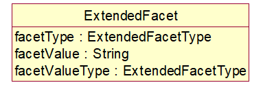 |
| Figure 1 Class with operations suppressed |

In some diagrams for some classes the attribute compartment is suppressed even though there may be some attributes. This is deliberate and is done to aid clarity of the diagram. The method used is:

* The attributes will always be present on the class diagram where the class is defined and its attributes and associations are defined.
* On other diagrams, such as inheritance diagrams, the attributes may be suppressed from the class for clarity.

|  |
|:---:|
| 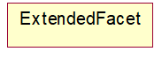 |
| Figure 2 Class with attributes also suppressed |

Note that, in any case, attributes inherited from a super class are not shown in the sub class.

The following table structure is used in the definition of the classes, attributes, and associations.

| Class | Feature | Description |
| --- | --- | --- |
| `ClassName` |  |  |
|  | `attributeName` |  |
|  | `associationName` |  |
|  | `+roleName` |  |

The content in the "Feature" column comprises or explains one of the following structural features of the class:

* Whether it is an abstract class. Abstract classes are shown in *`italic monospaced (fixed-width)`* font.
* The superclass this class inherits from, if any.
* The sub classes of this class, if any.
* Attribute – the `attributeName` is shown in `monospaced (fixed-width)` font.
* Association – the `associationName` is shown in `monospaced (fixed-width)` font. If the association is derived from the association between super classes, then the format is `/associationName`.
* Role – the `+roleName` is shown in `monospaced (fixed-width)` font.

The Description column provides a short definition or explanation of the Class or Feature. UML class names may be used in the description and if so, they are presented in normal font with spaces between words. For example, the class `ConceptScheme` will be written as Concept Scheme.

## 1.3 Overall Functionality

### 1.3.1 Information Model Packages

The SDMX Information Model (SDMX-IM) is a conceptual metamodel from which syntax specific implementations are developed. The model is constructed as a set of functional packages which assist in the understanding, re-use and maintenance of the model.

In addition to this, to aid understanding each package can be considered to be in one of three conceptual layers:
<ul>

the SDMX Base layer comprises fundamental building blocks which are used by the Structural Definitions layer and the Reporting and Dissemination layer

the Structural Definitions layer comprises the definition of the structural artefacts needed to support data and metadata reporting and dissemination

the Reporting and Dissemination layer comprises the definition of the data and metadata containers used for reporting and dissemination</ul>

In reality the layers have no implicit or explicit structural function as any package can make use of any construct in another package.

### 1.3.2 Version 1.0

In version 1.0 the metamodel supported the requirements for:
<ul>

Data Structure Definition including (domain) category scheme, (metadata) concept scheme, and code list

Data and related metadata reporting and dissemination</ul>

The SDMX-IM comprises a number of packages. These packages act as convenient compartments for the various sub models in the SDMX-IM. The diagram below shows the sub models of the SDMX-IM that were included in the version 1.0 specification.

|  |
|:---:|
| 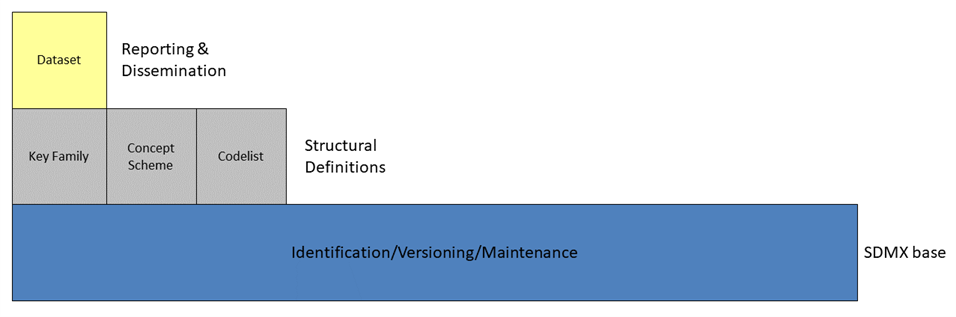 |
| Figure 3: SDMX Information Model Version 1.0 package structure |

### 1.3.3 Version 2.0/2.1

The version 2.0/2.1 model extends the functionality of version 1.0. principally in the area of metadata, but also in various ways to define structures to support data analysis by systems with knowledge of cube type structures such as OLAP[^1] systems. The following major constructs have been added at version 2.0/2.1
<ul>

Metadata structure definition

Metadata set

Hierarchical Codelist

Data and Metadata Provisioning

Process

Mapping

Constraints

Constructs supporting the Registry</ul>

Furthermore, the term Data Structure Definition replaces the term Key Family: as both of these terms are used in various communities, they are synonymous. The term Data Structure Definition is used in the model and this document.

|  |
|:---:|
| 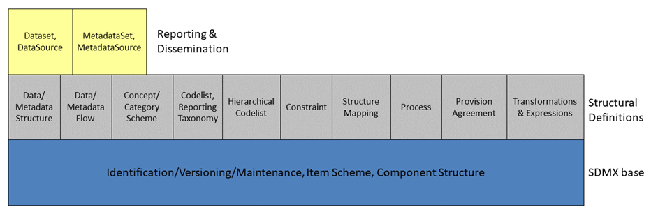 |
| Figure 4 SDMX Information Model Version 2.0/2.1 package structure |

Additional constructs that are specific to a registry-based scenario can be found in the Specification of Registry Interfaces. For information these are shown on the diagram below and comprise:

* Subscription and Notification
* Registration
* Discovery

Note that the data and metadata required for registry functions are not confined to the registry, and the registry also makes use of the other packages in the Information Model.

|  |
|:---:|
| 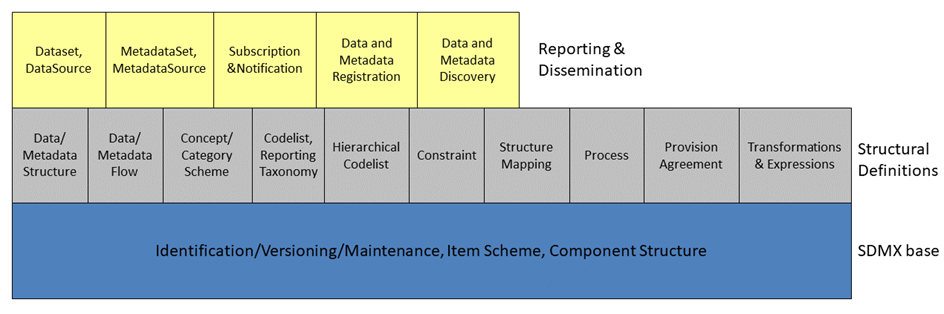 |
| Figure 5: SDMX Information Model Version 2.0/2.1 package structure including the registry |

### 1.3.4 Version 3.0

The version 3.0 model introduces changes in the way reference metadata are handled. In addition, it includes a few more artefacts. Finally, a few abstractions have been added, as shown in section ["Basic Inheritance"](#33-basic-inheritance) in "Figure 11: Basic Inheritance from the Base Structures".

The IM packages are largely the same.

|  |
|:---:|
| 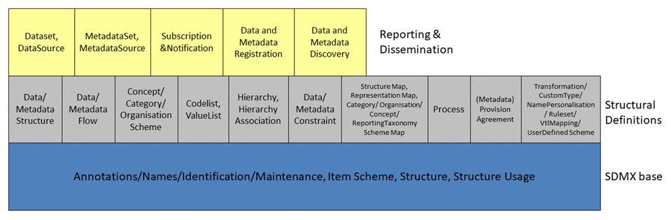 |
| Figure 6: SDMX Information Model version 3.0 package structure |

### 1.3.5 Version 3.1

Whilst some additional properties have been added to Dataflow, DSD, Data Constraint, SDMX v3.1 does not change the high level information model, it remains as it is in Figure 6.

# 2 Actors and Use Cases

## 2.1 Introduction

In order to develop the data models, it is necessary to understand the functions to be supported resulting from the requirements definition. These are defined in a use case model. The use case model comprises actors and use cases and these are defined below.

**Actor**

*“An actor defines a coherent set of roles that users of the system can play when interacting with it. An actor instance can be played by either an individual or an external system”*

**Use case**

*“A use case defines a set of use-case instances, where each instance is a sequence of actions a system performs that yields an observable result of value to a particular actor”*

The overall intent of the model is to support data and metadata reporting, dissemination, and exchange in the field of aggregated statistical data and related metadata. In order to achieve this, the model needs to support three fundamental aspects of this process:

* Maintenance of structural and provisioning definitions
* Data and reference metadata publishing (reporting), and consuming (using)
* Access to data, reference metadata, and structural and provisioning definitions

This document covers the first two aspects, whilst the document on the Registry logical model covers the last aspect.

## 2.2 Use Case Diagrams

### 2.2.1 Maintenance of Structural and Provisioning Definitions

#### 2.2.1.1 Use cases

|  |
|:---:|
| 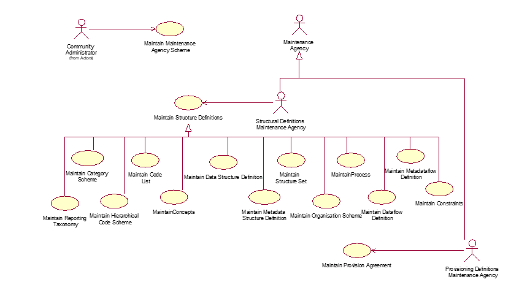 |
| Figure 7 Use cases for maintaining data and metadata structural and provisioning definitions |

#### 2.2.1.2 Explanation of the Diagram

In order for applications to publish and consume data and reference metadata it is necessary for the structure and permitted content of the data and reference metadata to be defined and made available to the applications, as well as definitions that support the actual process of publishing and consuming. This is the responsibility of a Maintenance Agency.

All maintained artefacts are maintained by a Maintenance Agency. For convenience the Maintenance Agency actor is sub divided into two actor roles:

* maintaining structural definitions
* maintaining provisioning definitions

Whilst both these functions may be carried out by the same person, or at least by the same maintaining organization, the purpose of the definitions is different and so the roles have been differentiated: structural definitions define the format and permitted content of data and reference metadata when reported or disseminated, whilst provisioning definitions support the process of reporting and dissemination (who reports what to whom, and when).

In a community-based scenario where at least the structural definitions may be shared, it is important that the scheme of maintenance agencies is maintained by a responsible organization (called here the Community Administrator), as it is important that the Id of the Maintenance Agency is unique.

#### 2.2.1.3 Definitions

| Actor | Use Case | Description | |
| --- | --- | --- | --- |
| 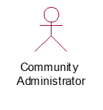 |  | Responsible organisation that administers structural definitions common to the community as a whole. | |
|  |  | Creation and maintenance of the top-level scheme of maintenance agencies for the Community. | |
| 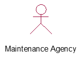 |  | Responsible agency for maintaining structural artefacts such as code lists, concept schemes, Data Structure Definition structural definitions, metadata structure definitions, data and metadata provisioning artefacts such as provision agreement, and sub-maintenance agencies.    sub roles are:  Structural Definitions Maintenance Agency  Provisioning Definitions Maintenance Agency | |
| 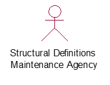 |  | Responsible for maintaining structural definitions. | |
|  |  | The maintenance of structural definitions. This use case has sub class use cases for each of the structural artefacts that are maintained. | |
|  |                      | Creation and maintenance of the Data Structure Definition, Metadata Structure Definition, and the supporting artefacts that they use, such as code list and concepts  This includes Agency, Data Provider, Data Consumer, and Organisation Unit Scheme | |
| 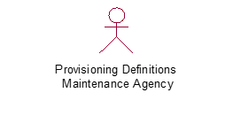 |  | Responsible for maintaining data and metadata provisioning definitions. |
|  |  | The maintenance of provisioning definitions. |

Figure 8: Table of Actors and Use Cases for Maintenance of Structural and Provisioning Definitions

### 2.2.2 Publishing and Using Data and Reference Metadata

#### 2.2.2.1 Use Cases

|  |
|:---:|
| 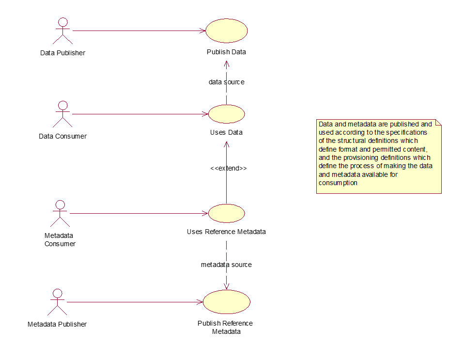 |
| Figure 9: Actors and use cases for data and metadata publishing and consuming |

#### 2.2.2.2 Explanation of the Diagram

Note that in this diagram “publishing” data and reference metadata is deemed to be the same as “reporting” data and reference metadata. In some cases the act of making the data available fulfils both functions. Aggregated data is published and in order for the Data Publisher to do this and in order for consuming applications to process the data and reference metadata its structure must be known. Furthermore, consuming applications may also require access to reference metadata in order to present this to the Data Consumer so that the data is better understood. As with the data, the reference metadata also needs to be formatted in accordance with a maintained structure. The Data Consumer and Metadata Consumer cannot use the data or reference metadata unless it is “published” and so there is a “data source” or “metadata source” dependency between the “uses” and “publish” use cases.

In any data and reference metadata publishing and consuming scenario both the publishing and the consuming applications will need access to maintained Provisioning Definitions. These definitions may be as simple as who provides what data and reference metadata to whom, and when, or it can be more complex with constraints on the data and metadata that can be provided by a particular publisher, and, in a data sharing scenario where data and metadata are “pulled” from data sources, details of the source.

#### 2.2.2.3 Definitions

| Actor | Use Case | Description |
| --- | --- | --- |
| 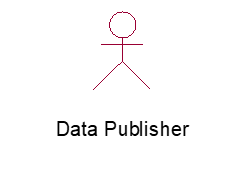 |  | Responsible for publishing data according to a specified Data Structure Definition (data structure) definition, and relevant provisioning definitions. |
|  |  | Publish a data set. This could mean a physical data set or it could mean to make the data available for access at a data source such as a database that can process a query. |
| 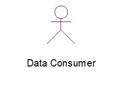 |  | The user of the data. It may be a human consumer accessing via a user interface, or it could be an application such as a statistical production system. |
|  |  | Use data that is formatted according to the structural definitions and made available according to the provisioning definitions.  Data are often linked to metadata that may reside in a different location and be published and maintained independently. |
| 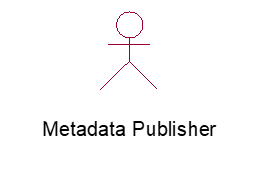 |  | Responsible for publishing reference metadata according to a specified metadata structure definition, and relevant provisioning definitions. |
|  |  | Publish a reference metadata set. This could mean a physical metadata set or it could mean to make the reference metadata available for access at a metadata source such as a metadata repository that can process a query. |
| 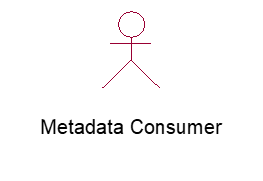 |  | The user of the reference metadata. It may be a human consumer accessing via a user interface, or it could be an application such as a statistical production or dissemination system. |
|  |  | Use reference metadata that is formatted according to the structural definitions and made available according to the provisioning definitions. |

# 3 SDMX Base Package

## 3.1 Introduction

The constructs in the SDMX Base package comprise the fundamental building blocks that support many of the other structures in the model. For this reason, many of the classes in this package are abstract (i.e., only derived sub-classes can exist in an implementation).

The motivation for establishing the SDMX Base package is as follows:
<ul>

it is accepted "Best Practise" to identify fundamental archetypes occurring in a model

identification of commonly found structures or "patterns" leads to easier understanding

identification of patterns encourages re-use</ul>

Each of the class diagrams in this section views classes from the SDMX Base package from a different perspective. There are detailed views of specific patterns, plus overviews showing inheritance between classes, and relationships amongst classes.

## 3.2 Base Structures - Identification, Versioning, and Maintenance

### 3.2.1 Class Diagram

|  |
|:---:|
| 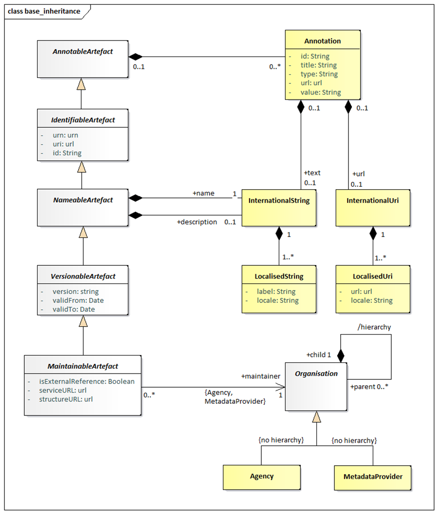 |
| Figure 10: SDMX Identification, Maintenance and Versioning |

### 3.2.2 Explanation of the Diagram

#### 3.2.2.1 Narrative

This group of classes forms the nucleus of the administration facets of SDMX objects. They provide features which are reusable by derived classes to support horizontal functionality such as identity, versioning etc.

All classes derived from the abstract class *`AnnotableArtefact`* may have Annotations (or notes): this supports the need to add notes to all SDMX-ML elements. The Annotation is used to convey extra information to describe any SDMX construct. This information may be in the form of a URL reference and/or a multilingual text (represented by the association to `InternationalString`).

The *`IdentifiableArtefact`* is an abstract class that comprises the basic attributes needed for identification. Concrete classes based on *`IdentifiableArtefact`* all inherit the ability to be uniquely identified.

The *`NamableArtefact`* is an abstract class that inherits from *`IdentifiableArtefact`* and in addition the `+description` and `+name` roles support multilingual descriptions and names for all objects based on *`NameableArtefact`*. The `InternationalString` supports the representation of a description in multiple locales (locale is similar to language but includes geographic variations such as Canadian French, US English etc.). The *`LocalisedString`* supports the representation of a description in one locale.

*`VersionableArtefact`* is an abstract class which inherits from *`NameableArtefact`* and adds versioning ability to all classes derived from it, as explained in the SDMX versioning rules in SDMX Standards Section 6 “Technical Notes”, paragraph “4.3 Versioning”.

*`MaintainableArtefact`* further adds the ability for derived classes to be maintained via its association to an *`Organisation`*, and adds locational information (i.e., from where the object can be retrieved).

The inheritance chain from *`AnnotableArtefact`* through to *`MaintainableArtefact`* allows SDMX classes to inherit the features they need, from simple annotation, through identity, naming, to versioning and maintenance.

#### 3.2.2.2 Definitions

| Class | Feature | Description |
| --- | --- | --- |
| *`AnnotableArtefact`* | Base inheritance sub classes are:  *`IdentifiableArtefact`* | Objects of classes derived from this can have attached annotations. |
| `Annotation` |  | Additional descriptive information attached to an object. |
|  | `id` | Identifier for the Annotation. It can be used to disambiguate one Annotation from another where there are several Annotations for the same annotated object. |
|  | `title` | A title used to identify an annotation. |
|  | `type` | Specifies how the annotation is to be processed. |
|  | `url` | A link to external descriptive text. |
|  | `value` | A non-localised version of the Annotation content. |
|  | `+url` | An International URI provides a set of links that are language specific, via this role. |
|  | `+text` | An International String provides the multilingual text content of the annotation via this role. |
| `InternationalUri` |  | The International Uri is a collection of Localised URIs and supports linking to external descriptions in multiple locales. |
| `LocalisedUri` |  | The Localised URI supports the link to an external description in one locale (locale is similar to language but includes geographic variations such as Canadian French, US English etc.). |
| *`IdentifiableArtefact`* | Superclass is  *`AnnotableArtefact`*    Base inheritance sub classes are:  *`NameableArtefact`* | Provides identity to all derived classes. It also provides annotations to derived classes because it is a subclass of Annotable Artefact. |
|  | `id` | The unique identifier of the object. |
|  | `uri` | Universal resource identifier that may or may not be resolvable. |
|  | `urn` | Universal resource name – this is for use in registries: all registered objects have a urn. |
| *`NameableArtefact`* | Superclass is  *`IdentifiableArtefact`*    Base inheritance sub classes are:  *`VersionableArtefact`* | Provides a Name and Description to all derived classes in addition to identification and annotations. |
|  | `+description` | A multi-lingual description is provided by this role via the International String class. |
|  | `+name` | A multi-lingual name is provided by this role via the International String class |
| `InternationalString` |  | The International String is a collection of Localised Strings and supports the representation of text in multiple locales. |
| `LocalisedString` |  | The Localised String supports the representation of text in one locale (locale is similar to language but includes geographic variations such as Canadian French, US English etc.). |
|  | `label` | Label of the string. |
|  | `locale` | The geographic locale of the string e.g French, Canadian French. |
| *`VersionableArtefact`* | Superclass is  *`NameableArtefact`*   Base inheritance sub classes are:  *`MaintainableArtefact`* | Provides versioning information for all derived objects. |
|  | `version` | A version string following SDMX versioning rules. |
|  | `validFrom` | Date from which the version is valid |
|  | `validTo` | Date from which version is superseded |
| *`MaintainableArtefact`* | Inherits from  *`VersionableArtefact`* | An abstract class to group together primary structural metadata artefacts that are maintained by an Agency. |
|  | `isExternalReference` | If set to “true” it indicates that the content of the object is held externally. |
|  | `structureURL` | The URL of an SDMX-ML document containing the external object. |
|  | `serviceURL` | The URL of an SDMX-compliant web service from which the external object can be retrieved. |
|  | `+maintainer` | Association to the Maintenance Agency responsible for maintaining the artefact. |
| `Agency` |  | See section on [“Organisations”](#47-organisation-scheme) |

## 3.3 Basic Inheritance

### 3.3.1 Class Diagram – Basic Inheritance from the Base Inheritance Classes

|  |
|:---:|
| 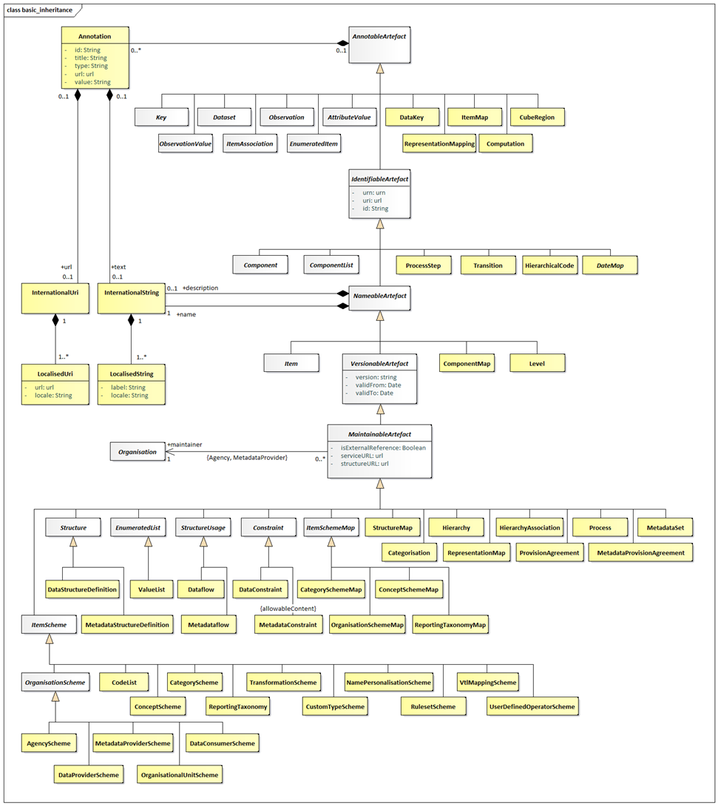 | 
| Figure 11: Basic Inheritance from the Base Structures | 

### 3.3.2 Explanation of the Diagram

#### 3.3.2.1 Narrative

The diagram above shows the inheritance within the base structures. The concrete classes are introduced and defined in the specific package to which they relate.

## 3.4 Data Types

### 3.4.1 Class Diagram

|  |
|:---:|
| 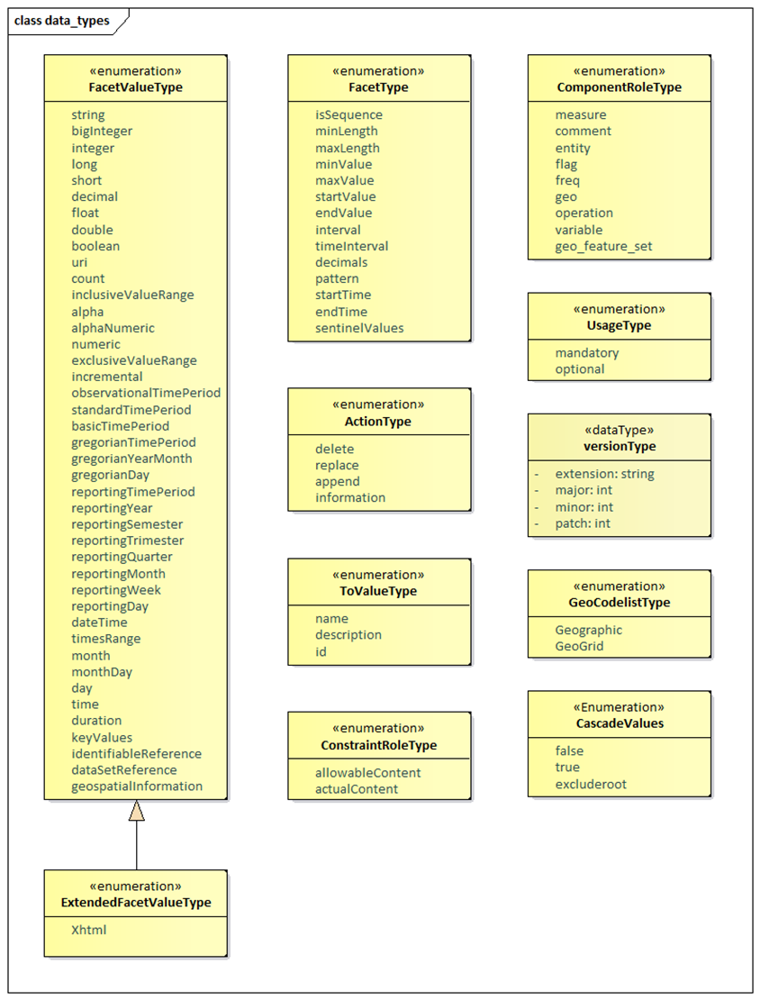 |
| Figure 12: Class Diagram of Basic Data Types |

### 3.4.2 Explanation of the Diagram

#### 3.4.2.1 Narrative

The `FacetType` and `FacetValueType` enumerations are used to specify the valid format of the content of a non-enumerated `Concept` or the usage of a Concept when specified for use on a *`Component`* on a *`Structure`* (such as a `Dimension` in a `DataStructureDefinition`). The description of the various types can be found in the chapter on `ConceptScheme` (section 4.5).

The `ActionType` enumeration is used to specify the action that a receiving system should take when processing the content that is the object of the action. It is enumerated as follows:

- `Merge`: Data or data-related reference metadata is to be merged, through either update or insertion depending on already existing information.  
  This operation does not allow deleting any component values. Updating individual values in multi-valued measure, attribute or data-related reference metadata values is not supported either. The complete multi-valued value is to be provided. Only non-dimensional components (measure, attribute or data-related reference metadata values) can be **omitted** as long as at least one of those components is present. Bulk merges are thus not supported. Only the provided values are merged. Dimension values for higher-level (data-related reference metadata) attributes can be **switched-off** (using `~`) when those are not attached to these dimensions. All observations as well as the sets of data-related reference metadata attributes at specific dimension combinations impacted by the `Merge` action change their time stamp when used to update an SDMX storage system.
- `Replace`: Data or data-related reference metadata is to be replaced, through either update, insert or delete depending on already existing information.  
  A full replacement is hereby assumed to take place at specific “replacement levels”: for entire observations and for any specific dimension combination for data-related reference metadata attributes. Within these “replacement levels” the provided values are inserted or updated, and omitted values are deleted. Values provided for the other attributes (those above the observation level) are merged (see `Merge` action). Only non-dimensional components (measure, attribute or data-related reference metadata values) can be **omitted**. Bulk replacing is thus not supported. Dimension values for higher-level (data-related reference metadata) attributes can be **switched-off** (using `~`) when those are not attached to these dimensions. Replacing non-existing elements is not resulting in an error. All observations as well as the sets of data-related reference metadata attributes at specific dimension combinations impacted by the replace action change their time stamp when used to update an SDMX storage system. Because the `Replace` action always takes place at specific levels, it cannot be used to replace a whole dataset or a whole series. However, a “replace all” effect can be achieved by combining a `Delete` dataset containing a completely wildcarded key (where all dimension values are omitted) with a `Merge` or `Replace` dataset within the same data message. Similarly, to replace a whole series, a message can combine a `Delete` dataset containing only the partial key of the series (where the not used dimension values are omitted) with a `Merge` or `Replace` dataset for that series.
- `Delete`: Data or data-related reference metadata is to be deleted. Deletion is hereby assumed to take place at the lowest level of detail provided in the message.  
  Any component (including dimensions) can be **omitted**. Omitting dimension values allows for bulk deletions. Partially omitting non-dimension component values allows restricting the deletion of measure, attribute or data-related reference metadata values to the ones being present. Instead of real values for non-dimensional components, it is sufficient to use any valid value. With this, whole datasets, any slices of observations for dimension groups such as time series, observations or individual measure, attribute and data-related reference metadata attributes values can be deleted. Dimension values for higher-level (data-related reference metadata) attributes can be **switched-off** (using `~`) when those are not attached to these dimensions. Deleting non-existing elements or values is not resulting in an error. All observations as well as the sets of attributes and data-related reference metadata at higher partial keys impacted by the `Delete` action change their time stamp when used to update an SDMX storage system.
- `Append`: Deprecated. When used to update an SDMX storage system, the `Merge` action is assumed.
- `Information`: Deprecated. When used to update an SDMX storage system, the `Merge` action is assumed.

The `ToValueType` data type contains the attributes to support transformations defined in the `StructureMap` (see Section 0).

The `ConstraintRoleType` data type contains the attributes that identify the purpose of a `Constraint` (`allowableContent`, `actualContent`).

The `ComponentRoleType` data type contains the predefined `Concept` roles that can be assigned to any `Component`.

The `CascadeValues` data type contains the possible values for a `MemberValue` within a `CubeRegion`, in order to enable cascading to all children `Code`s of a selected `Code`, while including/excluding the latter in the selection.

The `VersionType` data types provides the details for versioning according to SDMX versioning rules, as explained in SDMX Standards Section 6, paragraph “4.3 Versioning”.

## 3.5 The Item Scheme Pattern

### 3.5.1 Context

The Item Scheme is a basic architectural pattern that allows the creation of list schemes for use in simple taxonomies, for example.

The *`ItemScheme`* is the basis for `CategoryScheme`, `Codelist`, `ConceptScheme`, `ReportingTaxonomy`, *`OrganisationScheme`*, `TransformationScheme`, `CustomTypeScheme`, `NamePersonalisationScheme`, `RulesetScheme`, `VtlMappingScheme` and `UserDefinedOperatorScheme`.

### 3.5.2 Class Diagram

|  |
|:---:|
| 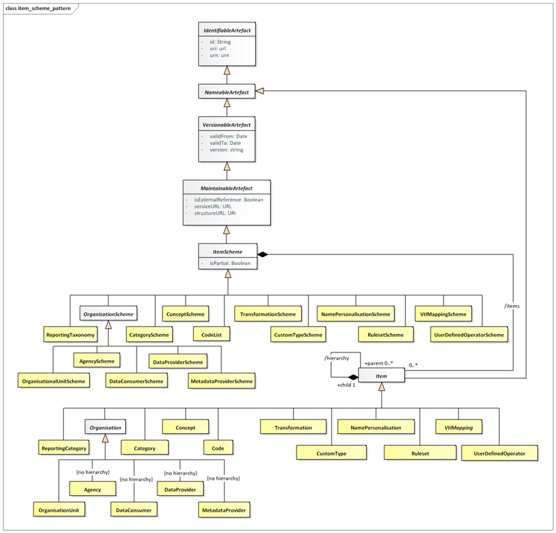 |
| Figure 13 The Item Scheme pattern |

### 3.5.3 Explanation of the Diagram

#### 3.5.3.1 Narrative

The *`ItemScheme`* is an abstract class which defines a set of *`Item`* (this class is also abstract). Its main purpose is to define a mechanism which can be used to create taxonomies which can classify other parts of the SDMX Information Model. It is derived from *`MaintainableArtefact`* which gives it the ability to be annotated, have identity, naming, versioning and be associated with an `Agency`. An example of a concrete class is a `ConceptScheme`. The associated `Concept`s are *`Item`s*.

In an exchange environment an *`ItemScheme`* is allowed to contain a sub-set of the *`Item`s* in the maintained *`ItemScheme`*. If such an *`ItemScheme`* is disseminated with a sub-set of the *`Item`s* then the fact that this is a sub-set is denoted by setting the `isPartial` attribute to "`true`".

A "partial" *`ItemScheme`* cannot be maintained independently in its partial form i.e., it cannot contain *`Item`s* that are not present in the full *`ItemScheme`* and the content of any one *`Item`* (e.g., names and descriptions) cannot deviate from the content in the full *`ItemScheme`*. Furthermore, the `id` of the *`ItemScheme`* where `isPartial` is set to "`true`" is the same as the `id` of the full *`ItemScheme`* (`agencyId`, `id`, `version`). This is important as this is the `id` that that is referenced in other structures (e.g., a `Codelist` referenced in a DSD) and this `id` is always the same, regardless of whether the disseminated *`ItemScheme`* is the full *`ItemScheme`* or a partial *`ItemScheme`*.

The purpose of a partial *`ItemScheme`* is to support the exchange and dissemination of a sub-set *`ItemScheme`* without the need to maintain multiple *`ItemScheme`s* which contain the same *`Item`s*. For instance, when a `Codelist` is used in a `DataStructureDefinition` it is sometimes the case that only a sub-set of the `Code`s in a `Codelist` are relevant. In this case a partial `Codelist` can be constructed using the Constraint mechanism explained later in this document.

*`Item`* inherits from *`NameableArtefact`* which gives it the ability to be annotated and have identity, and therefore has `id`, `uri` and `urn` attributes, a name and a description in the form of an `InternationalString`. Unlike the parent *`ItemScheme`*, the *`Item`* itself is not a *`MaintainableArtefact`* and therefore cannot have an independent `Agency` (i.e., it implicitly has the same `agencyId` as the *`ItemScheme`*).

The *`Item`* can be hierarchic and so one *`Item`* can have child *`Item`s*. The restriction of the hierarchic association is that a child *`Item`* can have only parent *`Item`*.

#### 3.5.3.2 Definitions

| Class | Feature | Description |
| --- | --- | --- |
| *`ItemScheme`* | Inherits from:  *`MaintainableArtefact`*  Direct sub classes are:  `CategoryScheme`  `ConceptScheme`  `Codelist`   `ReportingTaxonomy`  *`OrganisationScheme`*   `TransformationScheme`  `CustomTypeScheme`  `NamePersonalisationScheme`  `RulesetScheme`  `VtlMappingScheme`  `UserDefinedOperatorScheme` | The descriptive information for an arrangement or division of objects into groups based on characteristics, which the objects have in common. |
|  | `isPartial` | Denotes whether the Item Scheme contains a subset of the full set of Items in the maintained scheme. |
|  | `/items` | Association to the Items in the scheme. |
| *`Item`* | Inherits from:  *`NameableArtefact`*  Direct sub classes are  `Category`  `Concept`  `Code`  `ReportingCategory`  *`Organisation`*  `Transformation`  `CustomType`  `NamePersonalisation`  `Ruleset`  `VtlMapping`  `UserDefinedOperator` | The Item is an item of content in an Item Scheme. This may be a node in a taxonomy or ontology, a code in a code list etc.  Node that at the conceptual level the Organisation is not hierarchic. |
|  | `hierarchy` | This allows an Item optionally to have one or more child Items. |

## 3.6 The Structure Pattern

### 3.6.1 Context

The Structure Pattern is a basic architectural pattern which allows the specification of complex tabular structures which are often found in statistical data (such as Data Structure Definition, and Metadata Structure Definition). A Structure is a set of ordered lists. A pattern to underpin this tabular structure has been developed, so that commonalities between these structure definitions can be supported by common software and common syntax structures.

### 3.6.2 Class Diagrams

|  |
|:---:|
| 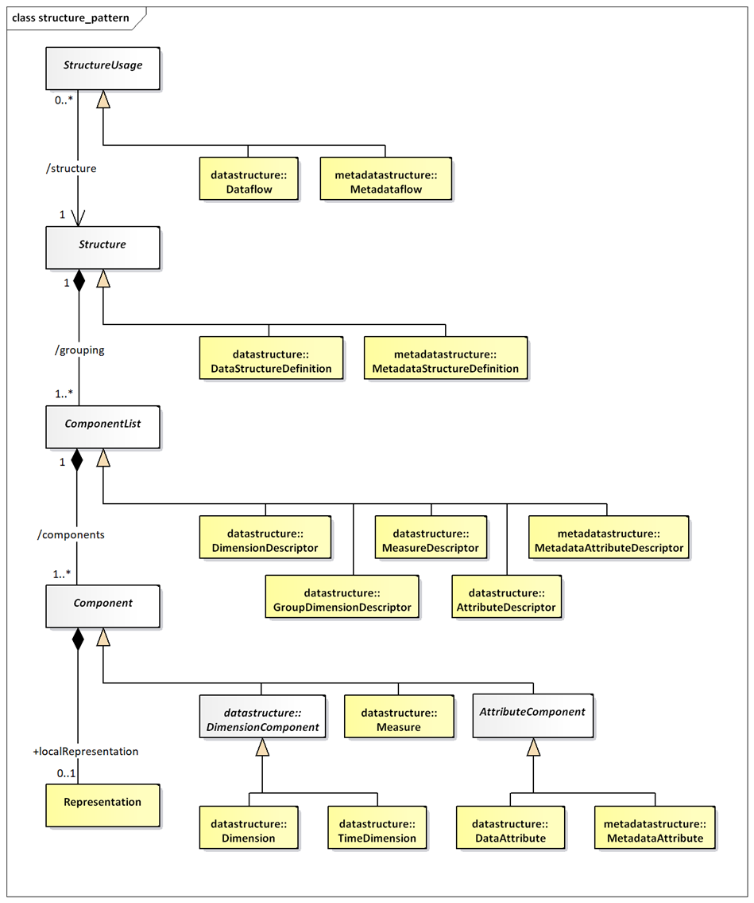 | 
| Figure 14: The Structure Pattern |

|  |
|:---:|
| 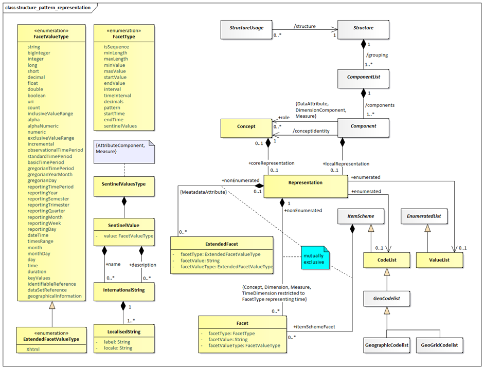 |
| Figure 15: Representation within the Structure Pattern |

### 3.6.3 Explanation of the Diagrams

#### 3.6.3.1 Narrative

The *`Structure`* is an abstract class which contains a set of one or more *`ComponentList`*(s) (this class is also abstract). An example of a concrete *`Structure`* is `DataStructureDefinition`.

The *`ComponentList`* is a list of one or more *`Component`*(s). The *`ComponentList`* has several concrete descriptor classes based on it: `DimensionDescriptor`, `GroupDimensionDescriptor`, `MeasureDescriptor`, and `AttributeDescriptor` of the `DataStructureDefinition` and `MetadataAttributeDescriptor` of the `MetadataStructureDefinition`.

The *`Component`* is contained in a *`ComponentList`*. The type of *`Component`* in a *`ComponentList`* is dependent on the concrete class of the *`ComponentList`* as follows:

`DimensionDescriptor`: `Dimension`, `TimeDimension`  
`GroupDimensionDescriptor`: `Dimension`, `TimeDimension`  
`MeasureDescriptor`: `Measure`  
`AttributeDescriptor`: `DataAttribute`, `MetadataAttributeRef`  
`MetadataAttributeDescriptor`: `MetadataAttribute`  

Each *`Component`* takes its semantic (and possibly also its representation) from a `Concept` in a `ConceptScheme`. This is represented by the `conceptIdentity` association to `Concept`.

The *`Component`* may also have a `localRepresentation`. This allows a concrete class, such as `Dimension`, to specify its representation which is local to the *`Structure`* in which it is contained (for `Dimension` this will be `DataStructureDefinition`), and thus overrides any `coreRepresentation` specified for the `Concept`.

The `Representation` can be enumerated or non-enumerated. The valid content of an enumerated representation is specified either in an *`ItemScheme`* which can be one of `Codelist`, `ValueList` or *`GeoCodelist`*. The valid content of a non-enumerated representation is specified as one or more `Facet`(s) (for example, these may specify minimum and maximum values). For any `Attribute` this is achieved by one of more `ExtendedFacet`(s), which allow the additional representation of XHTML.

The types of representation that are valid for specific components is expressed in the model as a constraint on the association:

* The `Dimension`, `DataAttribute`, `Measure`, `MetadataAttribute` may be enumerated and, if so, use an *`EnumeratedList`*.
* The `Dimension` and `Measure` may be non-enumerated and, if so, use one or more `Facet`(s), note that the `FacetValueType` applicable to the `TimeDimension` is restricted to those that represent time.
* The `MetadataAttribute` and `DataAttribute` may be non-enumerated and, if so, use one or more `ExtendedFacet`(s).

The *`Structure`* may be used by one or more *`StructureUsage`*(s). An example of this, in terms of concrete classes, is that a `Dataflow` (sub class of *`StructureUsage`*) may use a particular `DataStructureDefinition` (sub class of *`Structure`*), and similar constructs apply for the `Metadataflow` (link to `MetadataStructureDefinition`).

#### 3.6.3.2 Definitions

| Class | Feature | Description |
| --- | --- | --- |
| `StructureUsage` | Inherits from:  *`MaintainableArtefact`*  Sub classes are:  `Dataflow`  `Metadataflow` | An artefact whose components are described by a Structure. In concrete terms (sub-classes) an example would be a Dataflow which is linked to a given structure – in this case the Data Structure Definition. |
|  | `structure` | An association to a Structure specifying the structure of the artefact. |
| `Structure` | Inherits from:  *`MaintainableArtefact`*   Sub classes are:   `DataStructureDefinition`  `MetadataStructureDefinition` | Abstract specification of a list of lists to define a complex tabular structure. A concrete example of this would be statistical concepts, code lists, and their organisation in a data or metadata structure definition, defined by a centre institution, usually for the exchange of statistical information with its partners. |
|  | `grouping` | A composite association to one or more component lists. |
| *`ComponentList`* | Inherits from:  *`IdentifiableArtefact`*  Sub classes are:  `DimensionDescriptor`  `GroupDimensionDescriptor`  `MeasureDescriptor`  `AttributeDescriptor`  `MetadataAttributeDescriptor` | An abstract definition of a list of components. A concrete example is a Dimension Descriptor, which defines the list of Dimensions in a Data Structure Definition. |
|  | `components` | An aggregate association to one or more components which make up the list. |
| *`Component`* | Inherits from:  *`IdentifiableArtefact`*  Sub classes are:  `Measure`  *`AttributeComponent`*  *`DimensionComponent`* | A Component is an abstract super class used to define qualitative and quantitative data and metadata items that belong to a Component List and hence a Structure. Component is refined through its sub-classes. |
|  | `conceptIdentity` | Association to a Concept in a Concept Scheme that identifies and defines the semantic of the Component. |
|  | `localRepresentation` | Association to the Representation of the Component if this is different from the coreRepresentation of the Concept, which the Component uses (ConceptUsage). |
| `Representation` |  | The allowable value or format for Component or Concept |
|  | `+enumerated` | Association to an enumerated list that contains the allowable content for the Component when reported in a data or metadata set. The type of enumerated list that is allowed for any concrete Component is shown in the constraints on the association. |
|  | `+nonEnumerated` | Association to a set of Facets that define the allowable format for the content of the Component when reported in a data or metadata set. |
| `Facet` |  | Defines the format for the content of the Component when reported in a data or metadata set. |
|  | `facetType` | A specific content type, which is constrained by the Facet Type enumeration. |
|  | `facetValueType` | The format of the value of a Component when reported in a data or metadata set. This is constrained by the Facet Value Type enumeration. |
|  | `+itemSchemeFacet` | Defines the format of the identifiers in an Item Scheme used by a Component. Typically, this would define the number of characters (length) of the identifier. |
| `ExtendedFacet` |  | This has the same function as Facet but allows additionally an XHTML representation. This is constrained for use with a Metadata Attribute and a Data Attribute. |

The specification of the content and use of the sub classes to *`ComponentList`* and *`Component`* can be found in the section in which they are used (`DataStructureDefinition` and `MetadataStructureDefinition`). Moreover, the `FacetType` `SentinelValues` is explained in the datastructure representation diagram (see [5.3.2.2](#5322-definitions)), since it only concerns `DataStructureDefinitions`.

#### 3.6.3.3 Representation Constructs

The majority of SDMX `FacetValueType`s are compatible with those found in XML Schema, and have equivalents in most current implementation platforms:

| **SDMX Facet Value Type** | **XML Schema Data Type** | **JSON Schema Data Type** | **.NET Framework Type** | **Java Data Type** |
| --- | --- | --- | --- | --- |
| `String` | `xsd:string` | `string` | `System.String` | `java.lang.String` |
| `Big Integer` | `xsd:integer` | `integer` | `System.Decimal` | `java.math.BigInteger` |
| `Integer` | `xsd:int` | `integer` | `System.Int32` | `int` |
| `Long` | `xsd.long` | `integer` | `System.Int64` | `long` |
| `Short` | `xsd:short` | `integer` | `System.Int16` | `short` |
| `Decimal` | `xsd:decimal` | `number` | `System.Decimal` | `java.math.BigDecimal` |
| `Float` | `xsd:float` | `number` | `System.Single` | `float` |
| `Double` | `xsd:double` | `number` | `System.Double` | `double` |
| `Boolean` | `xsd:boolean` | `boolean` | `System.Boolean` | `boolean` |
| `URI` | `xsd:anyURI` | `string:uri` | `System.Uri` | `Java.net.URI or java.lang.String` |
| `DateTime` | `xsd:dateTime` | `string:date-time` | `System.DateTime` | `javax.xml.datatype.XMLGregorianCalendar` |
| `Time` | `xsd:time` | `string:time` | `System.DateTime` | `javax.xml.datatype.XMLGregorianCalendar` |
| `GregorianYear` | `xsd:gYear` | `string`[^2] | `System.DateTime` | `javax.xml.datatype.XMLGregorianCalendar` |
| `GregorianMonth` | `xsd:gYearMonth` | `string` | `System.DateTime` | `javax.xml.datatype.XMLGregorianCalendar` |
| `GregorianDay` | `xsd:date` | `string` | `System.DateTime` | `javax.xml.datatype.XMLGregorianCalendar` |
| `Day`, `MonthDay`, `Month` | `xsd:g`\* | `string` | `System.DateTime` | `javax.xml.datatype.XMLGregorianCalendar` |
| `Duration` | `xsd:duration` | `string` | `System.TimeSpan` | `javax.xml.datatype.Duration` |

There are also a number of SDMX data types which do not have these direct correspondences, often because they are composite representations or restrictions of a broader data type. These are detailed in Section 6 of the standards.

The `Representation` is composed of `Facet`s, each of which conveys characteristic information related to the definition of a value domain. Often a set of `Facet`s are needed to convey the required semantic. For example, a sequence is defined by a minimum of two `Facet`s: one to define the start value, and one to define the interval.

| Facet Type | Explanation |
| --- | --- |
| `isSequence` | The `isSequence` facet indicates whether the values are intended to be ordered, and it may work in combination with the `interval`, `startValue`, and `endValue` facet or the `timeInterval`, `startTime`, and `endTime` facets. If this attribute holds a value of `true`, a start value or time and a numeric or time interval must be supplied. If an end value is not given, then the sequence continues indefinitely. |
| `interval` | The `interval` attribute specifies the permitted `interval` (increment) in a sequence. In order for this to be used, the `isSequence` attribute must have a value of true. |
| `startValue` | The `startValue` facet is used in conjunction with the `isSequence` and `interval` facets (which must be set in order to use this facet). This facet is used for a numeric sequence and indicates the starting point of the sequence. This value is mandatory for a numeric sequence to be expressed. |
| `endValue` | The `endValue` facet is used in conjunction with the `isSequence` and `interval` facets (which must be set in order to use this facet). This facet is used for a numeric sequence and indicates that ending point (if any) of the sequence. |
| `timeInterval` | The `timeInterval` facet indicates the permitted duration in a time sequence. In order for this to be used, the `isSequence` facet must have a value of true. |
| `startTime` | The `startTime` facet is used in conjunction with the `isSequence` and `timeInterval` facets (which must be set in order to use this facet). This attribute is used for a time sequence and indicates the start time of the sequence. This value is mandatory for a time sequence to be expressed. |
| `endTime` | The `endTime` facet is used in conjunction with the `isSequence` and `timeInterval` facets (which must be set in order to use this facet). This facet is used for a time sequence and indicates that ending point (if any) of the sequence. |
| `minLength` | The `minLength` facet specifies the minimum and length of the value in characters. |
| `maxLength` | The `maxLength` facet specifies the maximum length of the value in characters. |
| `minValue` | The `minValue` facet is used for inclusive and exclusive ranges, indicating what the lower bound of the range is. If this is used with an inclusive range, a valid value will be greater than or equal to the value specified here. If the inclusive and exclusive data type is not specified (e.g., this facet is used with an integer data type), the value is assumed to be inclusive. |
| `maxValue` | The `maxValue` facet is used for inclusive and exclusive ranges, indicating what the upper bound of the range is. If this is used with an inclusive range, a valid value will be less than or equal to the value specified here. If the inclusive and exclusive data type is not specified (e.g., this facet is used with an integer data type), the value is assumed to be inclusive. |
| `decimals` | The `decimals` facet indicates the number of characters allowed after the decimal separator. |
| `pattern` | The `pattern` attribute holds any regular expression permitted in the implementation syntax (e.g., W3C XML Schema). |

# 4 Specific Item Schemes

## 4.1 Introduction

The structures that are an arrangement of objects into hierarchies or lists based on characteristics, and which are maintained as a group inherit from *`ItemScheme`*. These concrete classes are:
<ul>

`Codelist`

`ConceptScheme`

`CategoryScheme`

`AgencyScheme`, `DataProviderScheme`, `MetadataProviderScheme`, `DataConsumerScheme`, `OrganisationUnitScheme`, which all inherit from the abstract class *`OrganisationScheme`*

`ReportingTaxonomy`

`TransformationScheme`

`RulesetScheme`

`UserDefinedOperatorScheme`

`NamePersonalisationScheme`

`CustomTypeScheme`

`VtlMappingScheme`</ul>

Note that the VTL related schemes (the last 6 of the above list) are detailed in a dedicated section below ([section 15](#15-validation-and-transformation-language)).

## 4.2 Inheritance View

The inheritance and relationship views are shown together in each of the diagrams in the specific sections below.

## 4.3 Codelist

### 4.3.1 Class Diagram

|  |
|:---:|
| 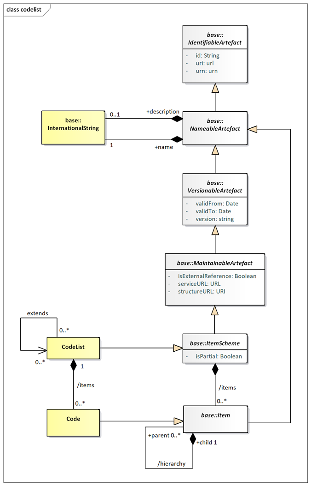 |
| Figure 16: Class diagram of the Codelist |

### 4.3.2 Explanation of the Diagram

#### 4.3.2.1 Narrative

The `Codelist` inherits from the *`ItemScheme`* and therefore has the following attributes:
<ul>

`id`

`uri`

`urn`

`version`

`validFrom`

`validTo`

`isExternalReference`

`serviceURL`

`structureURL`

`isPartial`</ul>

The `Code` inherits from *`Item`* and has the following attributes:
<ul>

`id`

`uri`

`urn`</ul>

Both `Codelist` and `Code` have the association to `InternationalString` to support a multi-lingual name, an optional multi-lingual description, and an association to `Annotation` to support notes (not shown).

Through the inheritance the `Codelist` comprise one or more `Code`s, and the `Code` itself can have one or more child `Code`s in the (inherited) `hierarchy` association. Note that a child `Code` can have only one parent `Code` in this association. A more complex `Hierarchy`, which allows multiple parents is described later.

A partial `Codelist` (where `isPartial` is set to '`true`') is identical to a `Codelist` and contains the `Code` and associated names and descriptions, just as in a normal `Codelist`. However, its content is a subset of the full `Codelist`. The way this works is described in section [3.5.3.1](#3531-narrative) on *`ItemScheme`*.

#### 4.3.2.2 Definitions

|  |  |  |
| --- | --- | --- |
| Class | Feature | Description |
| `Codelist` | Inherits from  *`ItemScheme`* | A list from which some statistical concepts (coded concepts) take their values. |
| `Code` | Inherits from  *`Item`* | A language independent set of letters, numbers or symbols that represent a concept whose meaning is described in a natural language. |
|  | `hierarchy` | Associates the parent and the child codes. |
|  | `extends` | Associates a Codelist with any Codelists that it may extend. |

### 4.3.3 Class Diagram – Codelist Extension

|  |
|:---:|
| 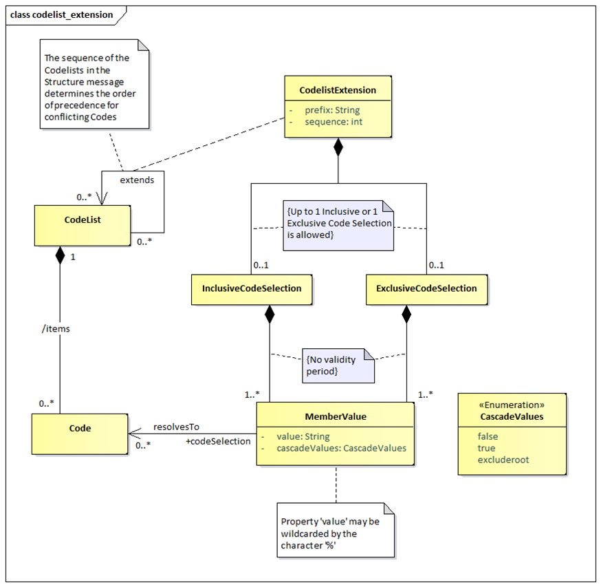 |
| Figure 17: Class diagram for Codelist Extension |

#### 4.3.3.1 Narrative

A `Codelist` may extend other `Codelist`s via the `CodelistExtension` class. The latter, via the `sequence`, indicates the order of precedence of the extended `Codelist`s for conflict resolution of `Code`s. Besides that, the `prefix` property is used to ensure uniqueness of inherited `Code`s in the extending[^3] `Codelist` in case conflicting `Code`s must be included in the latter. Each `CodelistExtension` association may include one `InclusiveCodeSelection` or one `ExclusiveCodeSelection`; those allow including or excluding a specific selection of `Code`s from the extended `Codelist`s.

The code selection classes may have `MemberValue`s in order to specify the subset of the `Code`s that should be included or excluded from the extended `Codelist`. A `MemberValue` may have a value that corresponds to a `Code`, including its children `Code`s (via the `cascadeValues` property), or even include instances of the wildcard character ‘%’ in order to point to a set of `Code`s with common parts in their identifiers.

#### 4.3.3.2 Definitions

|  |  |  |
| --- | --- | --- |
| Class | Feature | Description |
| `CodelistExtension` |  | The association between Codelists that may extend other Codelists. |
|  | `prefix` | A prefix to be used for a Codelist used in a extension, in order to avoid Code Conflicts. |
|  | `sequence` | The order that will be used when extending a Codelist, for resolving Code conflicts. The latest Codelist used overrides any previous Codelist. |
| `InclusiveCodeSelection` |  | The subset of Codes to be included when extending a `Codelist`. |
| `ExclusiveCodeSelection` |  | The subset of Codes to be excluded when extending a `Codelist`. |
| `MemberValue` | Inherits from:  `SelectionValue` | A collection of values based on Codes and their children. |
|  | `cascadeValues` | A property to indicate if the child Codes of the selected Code shall be included in the selection. It is also possible to include children and exclude the Code by using the 'excluderoot' value. |
|  | `value` | The value of the Code to include in the selection. It may include the ‘%’ character as a wildcard. |

### 4.3.4 Class Diagram – Geospatial Codelist

The geospatial support is implemented via an extension of the normal `Codelist`. This is illustrated in the following diagrams.

|  |
|:---:|
| 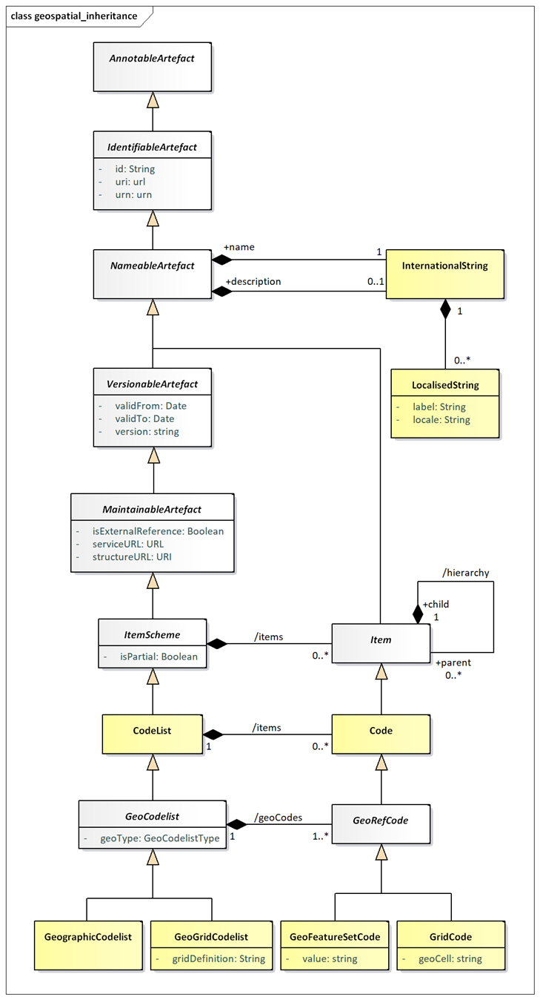 | 
| Figure 18: Inheritance for the GeoCodelist |

|  |
|:---:|
| 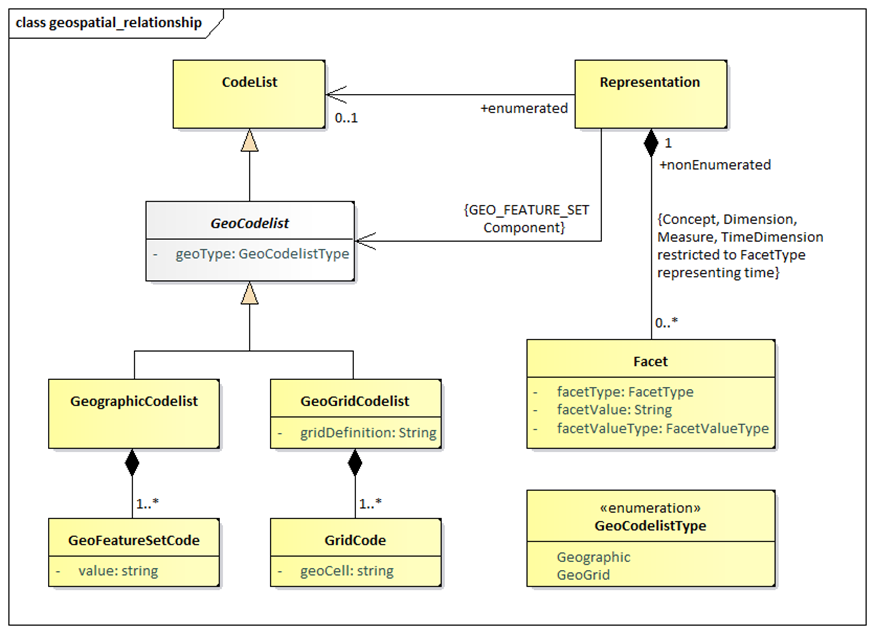 | 
| Figure 19: Class diagram for Geospatial Codelist |

#### 4.3.4.1 Narrative

A *`GeoCodelist`* is a specialisation of `Codelist` that includes geospatial information, by comprising a set of special `Code`s, i.e., *`GeoRefCode`s*. A *`GeoCodelist`* may be implemented by any of the two following classes, via the `geoType` property:
<ul>

`GeographicCodelist`

`GeoGridCodelist`</ul>

The former, i.e., `GeographicCodelist`, comprises a set of `GeoFeatureSetCode`s, by adding a value in the `Code` that follows a pattern to represent a geo feature set.

The latter, i.e., `GeoGridCodelist`, comprises a set of `GridCode`s, which are related to the `gridDefinition` specified in the `GeoGridCodelist`.

#### 4.3.4.2 Definitions

|  |  |  |
| --- | --- | --- |
| Class | Feature | Description |
| *`GeoCodelist`* | Abstract Class  Sub Classes:  `GeographicCodelist`  `GeoGridCodelist` | The abstract class that represents a special type of Codelist, which includes geospatial information. |
|  | `geoType` | The type of Geo Codelist that the Codelist will become. |
| *`GeoRefCode`* | Abstract Class  Sub Classes:  `GeoFeatureSetCode`  `GeoGridCode` | The abstract class that represents a special type of Code, which includes geospatial information. |
| `GeographicCodelist` |  | A special Codelist that has been extended to add a geographical feature set to each of its items, typically, this would include all types of administrative geographies. |
| `GeoGridCodelist` |  | A code list that has defined a geographical grid composed of cells representing regular squared portions of the Earth. |
|  | `gridDefinition` | Contains a regular expression string corresponding to the grid definition for the GeoGrid Codelist. |
| `GeoFeatureSetCode` |  | A Code that has a geo feature set. |
|  | `value` | The geo feature set of the Code, which represents a set of points defining a feature in a format defined a predefined pattern (see section 6). |
| `GeoGridCode` |  | A Code that represents a Geo Grid Cell belonging in a specific grid definition. |
|  | `geoCell` | The value used to assign the Code to one cell in the grid. |

## 4.4 ValueList

### 4.4.1 Class Diagram

|  |
|:---:|
| 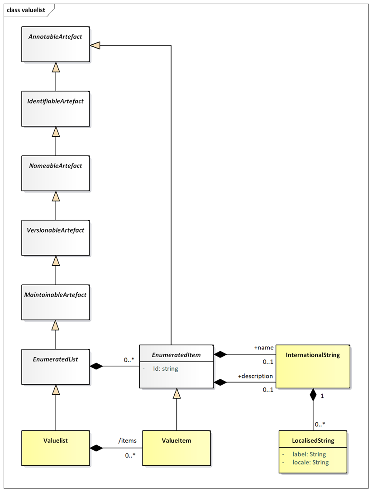 |
| Figure 20: Class diagram of the ValueList |

### 4.4.2 Explanation of the Diagram

#### 4.4.2.1 Narrative

A `ValueList` inherits from *`EnumeratedList`* (and hence the *`MaintenableArtefact`*) and thus has the following attributes:
<ul>

`id`

`uri`

`urn`

`version`

`validFrom`

`validTo`

`isExternalReference`

`registryURL`

`structureURL`

`repositoryURL`</ul>

`ValueItem` inherits from *`EnumeratedItem`*, which adds an `id`, with relaxed constraints, to the former.

Through the inheritance from *`NameableArtefact`* the `ValueList` has the association to `InternationalString` to support a multi-lingual name, an optional multi-lingual description, and an association to `Annotation` to support notes (not shown). Similarly, the `ValueItem`, inherits the association to `InternationalString` and to the `Annotation` from the *`EnumeratedItem`*.

The `ValueList` can have one or more `ValueItem`s.

#### 4.4.2.2 Definitions

|  |  |  |
| --- | --- | --- |
| **Class** | **Feature** | **Description** |
| `ValueList` | Inherits from  *`EnumeratedList`* | A list from which some statistical concepts (enumerated concepts) take their values. |
| `ValueItem` | Inherits from  *`EnumeratedItem`* | A language independent set of letters, numbers or symbols that represent a concept whose meaning is described in a natural language. |

## 4.5 Concept Scheme and Concepts

### 4.5.1 Class Diagram - Inheritance

|  |
|:---:|
| 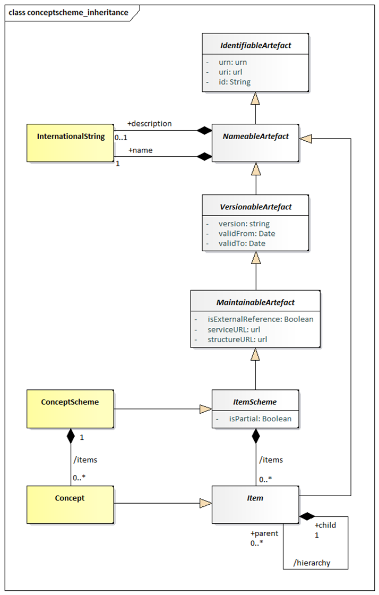 |
| Figure 21 Class diagram of the Concept Scheme |

### 4.5.2 Explanation of the Diagram

The `ConceptScheme` inherits from the *`ItemScheme`* and therefore has the following attributes:
<ul>

`id`

`uri`

`urn`

`version`

`validFrom`

`validTo`

`isExternalReference`

`registryURL`

`structureURL`

`repositoryURL`

`isPartial`</ul>

`Concept` inherits from *`Item`* and has the following attributes:
<ul>

`id`

`uri`

`urn`</ul>

Through the inheritance from *`NameableArtefact`* both `ConceptScheme` and `Concept` have the association to `InternationalString` to support a multi-lingual name, an optional multi-lingual description, and an association to `Annotation` to support notes (not shown).

Through the inheritance from *`ItemScheme`* the `ConceptScheme` comprise one or more `Concept`s, and the `Concept` itself can have one or more child `Concept`s in the (inherited) `hierarchy` association. Note that a child `Concept` can have only one parent `Concept` in this association.

A partial `ConceptScheme` (where `isPartial` is set to "`true`") is identical to a `ConceptScheme` and contains the `Concept` and associated names and descriptions, just as in a normal `ConceptScheme`. However, its content is a subset of the full `ConceptScheme`. The way this works is described in section [3.5.3.1](#3531-narrative) on *`ItemScheme`*.

### 4.5.3 Class Diagram - Relationship

|  |
|:---:|
| 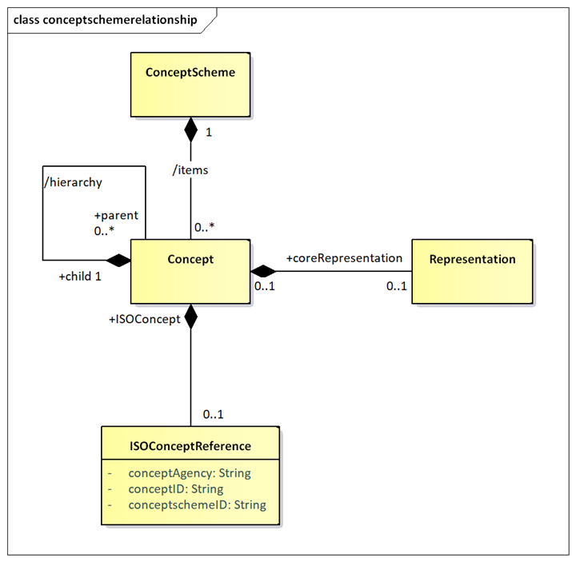 |
| Figure 22: Relationship class diagram of the Concept Scheme |

### 4.5.4 Explanation of the diagram

#### 4.5.4.1 Narrative

The `ConceptScheme` can have one or more `Concept`s. A `Concept` can have zero or more child `Concept`s, thus supporting a hierarchy of `Concept`s. Note that a child `Concept` can have only one parent `Concept` in this association. The purpose of the hierarchy is to relate concepts that have a semantic relationship: for example, a Reporting\_Country and Vis\_a\_Vis\_Country may both have Country as a parent concept, or a CONTACT may have a PRIMARY\_CONTACT as a child concept. It is not the purpose of such schemes to define reporting structures: these reporting structures are defined in the `MetadataStructureDefinition`.

The `Concept` can be associated with a `coreRepresentation`. The `coreRepresentation` is the specification of the format and value domain of the `Concept` when used on a structure like a `DataStructureDefinition` or a `MetadataStructureDefinition`, unless the specification of the `Representation` is overridden in the relevant structure definition. In a hierarchical `ConceptScheme` the `Representation` is inherited from the parent `Concept` unless overridden at the level of the child `Concept`.

The `Representation` is documented in more detail in the section on the SDMX Base.

The `Concept` may be related to a concept described in terms of the ISO/IEC 11179 standard. The `ISOConceptReference` identifies this concept and concept scheme in which it is contained.

#### 4.5.4.2 Definitions

| Class | Feature | Description |
| --- | --- | --- |
| `ConceptScheme` | Inherits from  *`ItemScheme`* | The descriptive information for an arrangement or division of concepts into groups based on characteristics, which the objects have in common. |
| `Concept` | Inherits from  *`Item`* | A concept is a unit of knowledge created by a unique combination of characteristics. |
|  | `/hierarchy` | Associates the parent and the child concept. |
|  | `coreRepresentation` | Associates a Representation. |
|  | `+ISOConcept` | Association to an ISO concept reference. |
| `ISOConceptReference` |  | The identity of an ISO concept definition. |
|  | `conceptAgency` | The maintenance agency of the concept scheme containing the concept. |
|  | `conceptSchemeID` | The identifier of the concept scheme. |
|  | `conceptID` | The identifier of the concept. |

## 4.6 Category Scheme

### 4.6.1 Context

This package defines the structure that supports the definition of and relationships between categories in a category scheme. It is similar to the package for concept scheme. An example of a category scheme is one which categorises data – sometimes known as a subject matter domain scheme or a data category scheme. Importantly, as will be seen later, the individual nodes in the scheme (the `Category`s) can be associated to any set of `IdentiableArtefacts` in a `Categorisation`.

### 4.6.2 Class diagram - Inheritance

|  |
|:---:|
| 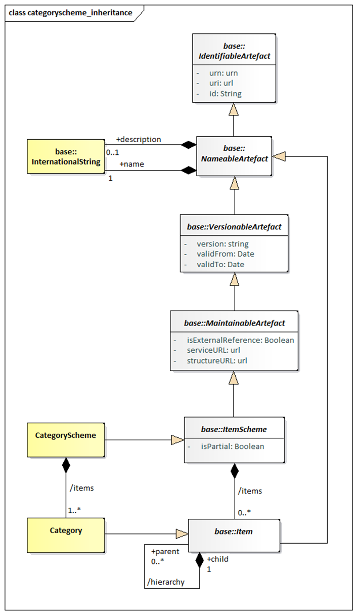 |
| Figure 23 Inheritance Class diagram of the Category Scheme |

### 4.6.3 Explanation of the Diagram

#### 4.6.3.1 Narrative

The `Category`s are modelled as a hierarchical *`ItemScheme`*. The `CategoryScheme` inherits from the *`ItemScheme`* and has the following attributes:
<ul>

`id`

`uri`

`urn`

`version`

`validFrom`

`validTo`

`isExternalReference`

`structureURL`

`serviceURL`

`isPartial`</ul>

`Category` inherits from *`Item`* and has the following attributes:
<ul>

`id`

`uri`

`urn`
</ul>

Both `CategoryScheme` and `Category` have the association to `InternationalString` to support a multi-lingual name, an optional multi-lingual description, and an association to `Annotation` to support notes (not shown on the model).

Through the inheritance the `CategoryScheme` comprise one or more `Category`s, and the `Category` itself can have one or more child `Category` in the (inherited) `hierarchy` association. Note that a child `Category` can have only one parent `Category` in this association.

A partial `CategoryScheme` (where `isPartial` is set to "`true`") is identical to a `CategoryScheme` and contains the `Category` and associated names and descriptions, just as in a normal `CategoryScheme`. However, its content is a subset of the full `CategoryScheme`. The way this works is described in section [3.5.3.1](#3531-narrative) on *`ItemScheme`*.

### 4.6.4 Class diagram - Relationship

|  |
|:---:|
| 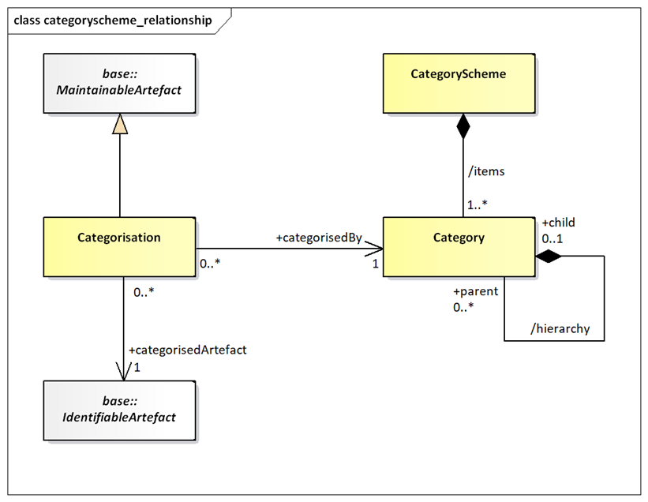 |
| Figure 24: Relationship Class diagram of the Category Scheme |

The `CategoryScheme` can have one or more `Category`s. The `Category` is Identifiable and has identity information. A `Category` can have zero or more child `Category`s, thus supporting a hierarchy of `Category`s. Any `IdentifiableArtefact` can be `+categorisedBy` a `Category`. This is achieved by means of a `Categorisation`. Each `Categorisation` can associate one `IdentifiableArtefact` with one `Category`. Multiple `Categorisations` can be used to build a set of `IdentifiableArtefact`s that are `+categorisedBy` the same `Category`. Note that there is no navigation (i.e. no embedded reference) to the `Categorisation` from the `Category`. From an implementation perspective this is necessary as `Categorisation` has no effect on the versioning of either the `CategoryScheme` or the `IdentifiableArtefact`.

#### 4.6.4.1 Definitions

| Class | Feature | Description |
| --- | --- | --- |
| `CategoryScheme` | Inherits from  *`ItemScheme`* | The descriptive information for an arrangement or division of categories into groups based on characteristics, which the objects have in common. |
|  | `/items` | Associates the categories. |
| `Category` | Inherits from  *`Item`* | An item at any level within a classification, typically tabulation categories, sections, subsections, divisions, subdivisions, groups, subgroups, classes and subclasses. |
|  | `/hierarchy` | Associates the parent and the child Category. |
| `Categorisation` | Inherits from  *`MaintainableArtefact`* | Associates an Identifable Artefact with a Category. |
|  | `+categorisedArtefact` | Associates the Identifable Artefact. |
|  | `+categorisedBy` | Associates the Category. |

## 4.7 Organisation Scheme

### 4.7.1 Class Diagram

|  |
|:---:|
| 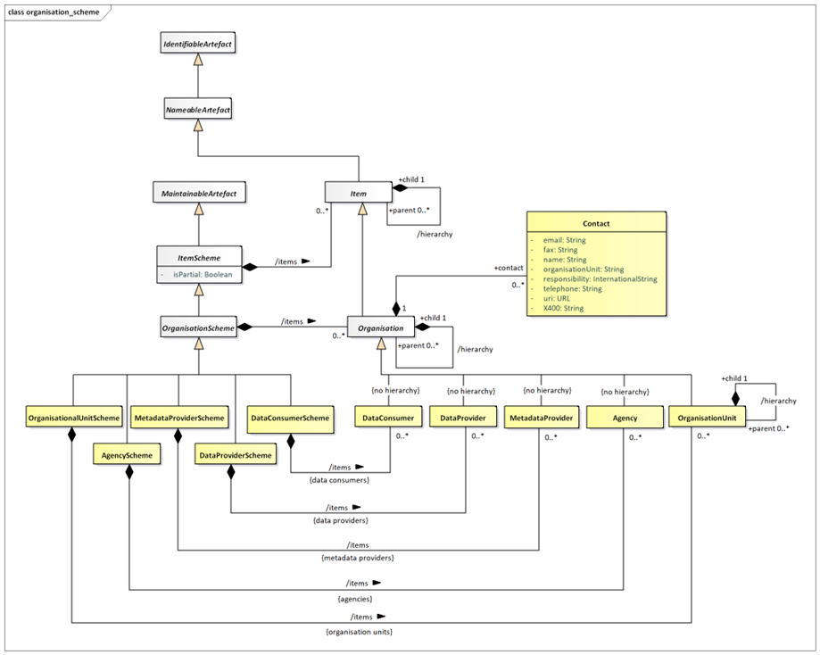 |
| Figure 25 The Organisation Scheme class diagram |

### 4.7.2 Explanation of the Diagram

#### 4.7.2.1 Narrative

The *`OrganisationScheme`* is abstract. It contains *`Organisation`* which is also abstract. The *`Organisation`* can have child *`Organisation`*.

The *`OrganisationScheme`* can be one of five types:

1. `AgencyScheme` – contains `Agency` which is restricted to a flat list of agencies (i.e., there is no hierarchy). Note that the SDMX system of (Maintenance) Agency can be hierarchic and this is explained in more detail in the SDMX Standards Section 6 “Technical Notes”.
2. `DataProviderScheme` – contains `DataProvider` which is restricted to a flat list of agencies (i.e., there is no hierarchy).
3. `MetadataProviderScheme` – contains `MetadataProvider` which is restricted to a flat list of agencies (i.e., there is no hierarchy).
4. `DataConsumerScheme` – contains `DataConsumer` which is restricted to a flat list of agencies (i.e., there is no hierarchy).
5. `OrganisationUnitScheme` – contains `OrganisationUnit` which does inherit the `/hierarchy` association from `Organisation`.

Reference metadata can be attached to the *`Organisation`* by means of the metadata attachment mechanism. This mechanism is explained in the Reference Metadata section of this document (see section [7](#7-metadata-structure-definition-and-metadata-set)). This means that the model does not specify the specific reference metadata that can be attached to a `DataProvider`, `MetadataProvider`, `DataConsumer`, `OrganisationUnit` or `Agency`, except for limited `Contact` information.

A partial *`OrganisationScheme*` (where `isPartial` is set to "`true`") is identical to an *`OrganisationScheme`* and contains the *`Organisation`* and associated names and descriptions, just as in a normal *`OrganisationScheme`*. However, its content is a subset of the full *`OrganisationScheme`*. The way this works is described in section [3.5.3.1](#3531-narrative) on *`ItemScheme`*.

#### 4.7.2.2 Definitions

| Class | Feature | Description |
| --- | --- | --- |
| *`OrganisationScheme`* | Abstract Class  Inherits from  *`ItemScheme`*  Sub classes are:   `AgencyScheme`  `DataProviderScheme`   `MetadataProviderScheme`  `DataConsumerScheme`  `OrganisationUnitScheme` | A maintained collection of Organisations. |
|  | `/items` | Association to the Organisations in the scheme. |
| *`Organisation`* | Abstract Class  Inherits from  *`Item`*  Sub classes are:   `Agency`  `DataProvider`  `MetadataProvider`  `DataConsumer`  `OrganisationUnit` | An organisation is a unique framework of authority within which a person or persons act, or are designated to act, towards some purpose. |
|  | `+contact` | Association to the Contact information. |
|  | `/hierarchy` | Association to child Organisations. |
| `Contact` |  | An instance of a role of an individual or an organization (or organization part or organization person) to whom an information item(s), a material object(s) and/or person(s) can be sent to or from in a specified context. |
|  | `name` | The designation of the Contact person by a linguistic expression. |
|  | `organisationUnit` | The designation of the organisational structure by a linguistic expression, within which Contact person works. |
|  | `responsibility` | The function of the contact person with respect to the organisation role for which this person is the Contact. |
|  | `telephone` | The telephone number of the Contact. |
|  | `fax` | The fax number of the Contact. |
|  | `email` | The Internet e-mail address of the Contact. |
|  | `X400` | The X400 address of the Contact. |
|  | `uri` | The URL address of the Contact. |
| `AgencyScheme` |  | A maintained collection of Maintenance Agencies. |
|  | `/items` | Association to the Maintenance Agency in the scheme. |
| `DataProviderScheme` |  | A maintained collection of Data Providers. |
|  | `/items` | Association to the Data Providers in the scheme. |
| `MetadataProviderScheme` |  | A maintained collection of Metadata Providers. |
|  | `/items` | Association to the Metadata Providers in the scheme. |
| `DataConsumerScheme` |  | A maintained collection of Data Consumers. |
|  | `/items` | Association to the Data Consumers in the scheme. |
| `OrganisationUnitScheme` |  | A maintained collection of Organisation Units. |
|  | `/items` | Association to the Organisation Units in the scheme. |
| `Agency` | Inherits from  ``Organisation`` | Responsible agency for maintaining artefacts such as statistical classifications, glossaries, structural metadata such as Data and Metadata Structure Definitions, Concepts and Code lists. |
| `DataProvider` | Inherits from  ``Organisation`` | An organisation that produces data. |
| `MetadataProvider` | Inherits from  ``Organisation`` | An organisation that produces reference metadata. |
| `DataConsumer` | Inherits from  ``Organisation`` | An organisation using data as input for further processing. |
| `OrganisationUnit` | Inherits from  ``Organisation`` | A designation in the organisational structure. |
|  | `/hierarchy` | Association to child Organisation Units |

## 4.8 Reporting Taxonomy

### 4.8.1 Class Diagram

|  |
|:---:|
| 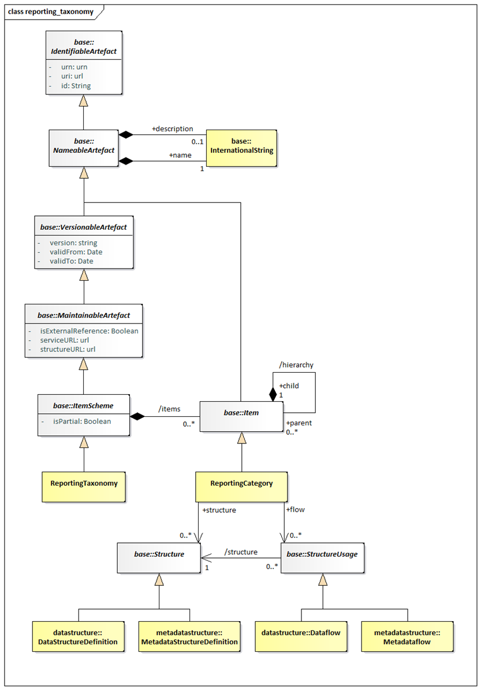 |
| Figure 26: Class diagram of the Reporting Taxonomy |

### 4.8.2 Explanation of the Diagram

#### 4.8.2.1 Narrative

In some data reporting environments, and in particular those in primary reporting, a report may comprise a variety of heterogeneous data, each described by a different *`Structure`*. Equally, a specific disseminated or published report may also comprise a variety of heterogeneous data. The definition of the set of linked sub reports is supported by the `ReportingTaxonomy`.

The `ReportingTaxonomy` is a specialised form of *`ItemScheme`*. Each `ReportingCategory` of the `ReportingTaxonomy` can link to one or more *`StructureUsage`* which itself can be one of `Dataflow`, or `Metadataflow`, and one or more *`Structure`*, which itself can be one of `DataStructureDefinition` or `MetadataStructureDefinition`. It is expected that within a specific `ReportingTaxonomy` each `Category` that is linked in this way will be linked to the same class (e.g. all `Category` in the scheme will link to a `Dataflow`). Note that a `ReportingCategory` can have child `ReportingCategory` and in this way it is possible to define a hierarchical `ReportingTaxonomy`. It is possible in this taxonomy that some `ReportingCategory` are defined just to give a reporting structure. For instance:

Section 1
1. linked to Datafow\_1
2. linked to Datafow\_2

Section 2
1. linked to Datafow\_3
2. linked to Datafow\_4

Here, the nodes of Section 1 and Section 2 would not be linked to `Dataflow` but the other would be linked to a `Dataflow` (and hence the `DataStructureDefinition`).

A partial `ReportingTaxonomy` (where `isPartial` is set to "`true`") is identical to a `ReportingTaxonomy` and contains the `ReportingCategory` and associated names and descriptions, just as in a normal `ReportingTaxonomy`. However, its content is a sub set of the full `ReportingTaxonomy` The way this works is described in section [3.5.3.1](#3531-narrative) on *`ItemScheme`*.

#### 4.8.2.2 Definitions

| Class | Feature | Description |
| --- | --- | --- |
| `ReportingTaxonomy` | Inherits from  *`ItemScheme`* | A scheme which defines the composition structure of a data report where each component can be described by an independent Dataflow or Metadataflow. |
|  | `/items` | Associates the Reporting Category |
| `ReportingCategory` | Inherits from  *`Item`* | A component that gives structure to the report and links to data and metadata. |
|  | `/hierarchy` | Associates child Reporting Category. |
|  | `+flow` | Association to the data and metadata flows that link to metadata about the provisioning and related data and metadata sets, and the structures that define them. |
|  | `+structure` | Association to the Data Structure Definition and Metadata Structure Definitions which define the structural metadata describing the data and metadata that are contained at this part of the report. |

# 5 Data Structure Definition and Dataset

## 5.1 Introduction

The `DataStructureDefiniton` is the class name for a structure definition for data. Some organisations know this type of definition as a “Key Family” and so the two names are synonymous. The term Data Structure Definition (also referred to as DSD) is used in this specification.

Many of the constructs in this layer of the model inherit from the SDMX Base Layer. Therefore, it is necessary to study both the inheritance and the relationship diagrams to understand the functionality of individual packages. In simple sub models these are shown in the same diagram but are omitted from the more complex sub models for the sake of clarity. In these cases, the inheritance diagram below shows the full inheritance tree for the classes concerned with data structure definitions.

There are very few additional classes in this sub model other than those shown in the inheritance diagram below. In other words, the SDMX Base gives most of the structure of this sub model both in terms of associations and in terms of attributes. The relationship diagrams shown in this section show clearly when these associations are inherited from the SDMX Base (see the Appendix “A Short Guide to UML in the SDMX Information Model” to see the diagrammatic notation used to depict this).

The actual SDMX Base construct from which the concrete classes inherit depends upon the requirements of the class for:
<ul>

Annotation – *`AnnotableArtefact`*

Identification – *`IdentifiableArtefact`*

Naming – *`NameableArtefact`*

Versioning – *`VersionableArtefact`*

Maintenance – *`MaintainableArtefact`*
</ul>

## 5.2 Inheritance View

### 5.2.1 Class Diagram

|  |
|:---:|
| 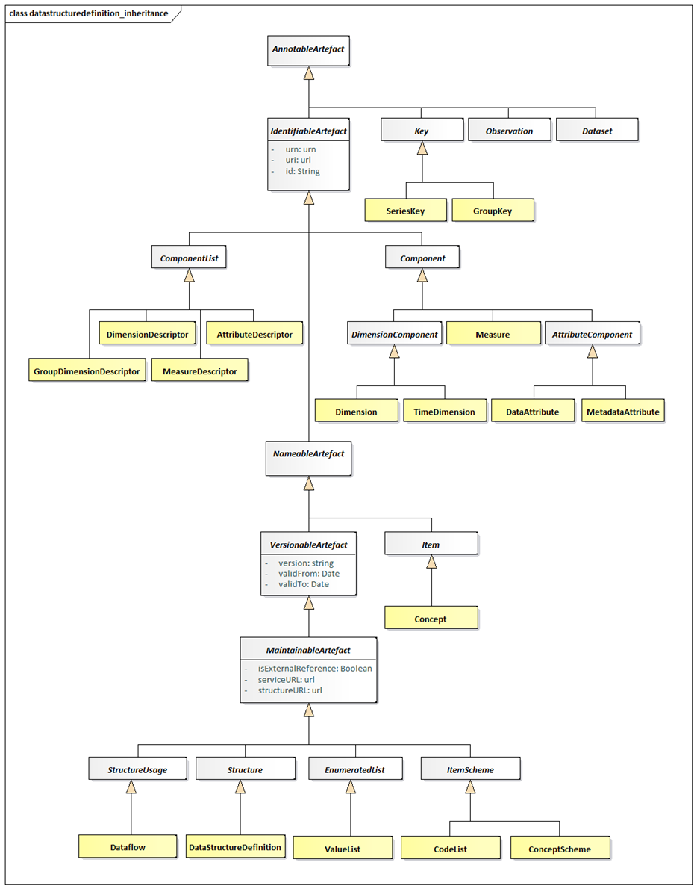 |
| Figure 27 Class inheritance in the Data Structure Definition and Data Set Packages |

### 5.2.2 Explanation of the Diagram

#### 5.2.2.1 Narrative

Those classes in the SDMX metamodel which require annotations inherit from *`AnnotableArtefact`*. These are:
<ul>

*`IdentifiableArtefact`*

*`DataSet`*

*`Key`* (and therefore *`SeriesKey`* and *`GroupKey`*)

*`Observation`*
</ul>

Those classes in the SDMX metamodel which require annotations and global identity are derived from *`IdentifiableArtefact`*. These are:
<ul>

*`NameableArtefact`*

*`ComponentList`*

*`Component`*
</ul>

Those classes in the SDMX metamodel which require annotations, global identity, multilingual name and multilingual description are derived from *`NameableArtefact`*. These are:
<ul>

*`VersionableArtefact`*

*`Item`*
</ul>

The classes in the SDMX metamodel which require annotations, global identity, multilingual name and multilingual description, and versioning are derived from *`VersionableArtefact`*. These are:
<ul>

*`MaintainableArtefact`*
</ul>

Abstract classes which represent information that is maintained by Maintenance Agencies all inherit from *`MaintainableArtefact`*, they also inherit all the features of a *`VersionableArtefact`*, and are:
<ul>

*`StructureUsage`*

*`Structure`*

*`ItemScheme`*
</ul>

All the above classes are abstract. The key to understanding the class diagrams presented in this section are the concrete classes that inherit from these abstract classes.

Those concrete classes in the SDMX Data Structure Definition and Dataset packages of the metamodel which require to be maintained by Agencies all inherit (via other abstract classes) from *`MaintainableArtefact`*, these are:
<ul>

`Dataflow`

`DataStructureDefinition`
</ul>

The component structures that are lists of lists, inherit directly from *`Structure`*. A *`Structure`* contains several lists of components. The concrete class that inherits from *`Structure`* is:
<ul>

`DataStructureDefinition`
</ul>

A `DataStructureDefinition` contains a list of dimensions, a list of measures and a list of attributes.

The concrete classes which inherit from *`ComponentList`* and are subcomponents of the `DataStructureDefinition` are:
<ul>

`DimensionDescriptor` – content is `Dimension` and `TimeDimension`

`DimensionGroupDescriptor` – content is an association to `Dimension`, `TimeDimension`

`MeasureDescriptor` – content is `Measure`

`AttributeDescriptor` – content is `DataAttribute` and an association to `MetadataAttribute`
</ul>

The classes that inherit from *`Component`* are:
<ul>

`Measure`

*`DimensionComponent`* and thereby its sub classes of `Dimension` and `TimeDimension`

*`AttributeComponent`* and thereby its sub classes of `DataAttribute` and `MetadataAttribute`
</ul>

The concrete classes identified above are the majority of the classes required to define the metamodel for the `DataStructureDefinition`. The diagrams and explanations in the rest of this section show how these concrete classes are related in order to support the functionality required.

## 5.3 Data Structure Definition – Relationship View

### 5.3.1 Class Diagram

|  |
|:---:|
| 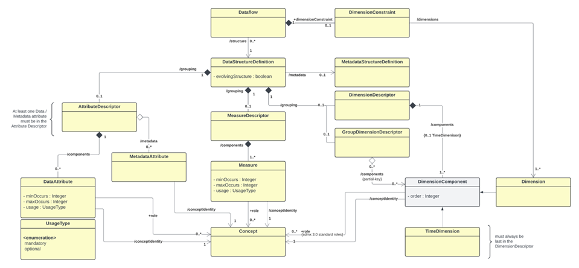 |
| Figure 28 Relationship class diagram of the Data Structure Definition excluding representation |

### 5.3.2 Explanation of the Diagrams

#### 5.3.2.1 Narrative

A `DataStructureDefinition` defines the `Dimension`s, `TimeDimension`, `DataAttribute`s, and `Measure`s, and associated `Representation`s, that comprise the valid structure of data and related attributes that are contained in a `DataSet`, which is defined by a `Dataflow`. In addition, a `DataStructureDefinition` may be related to one `MetadataStructureDefinition`, in order to use the latter’s `MetadataAttribute`s, by relating them to other *`Component`s* within the DSD, as explained below.

The `Dataflow` may also have additional metadata attached that define qualitative information and `Constraint`s on the use of the `DataStructureDefinition` such as the subset of `Code`s used in a `Dimension` (this is covered later in this document – see sections ["Constraints"](#12-constraints) and ["Data Provisioning"](#13-data-provisioning)). Each `Dataflow` has a maximum of one `DataStructureDefinition` specified which defines the structure of any `DataSet`s to be reported/disseminated. A `Dataflow` may optionally define which `Dimension`s it uses, by defining a `DimensionConstraint` (this is a mandatory requirement if the `DataStructureDefinition` sets its `evolvingStructure` property to "`true`" and is semantically referenced by the `Dataflow`).

There are two types of dimensions each having a common association to `Concept`:

* `Dimension`
* `TimeDimension`

Note that *`DimensionComponent`* can be any or all its sub classes i.e., `Dimension`, `TimeDimension`.

The *`DimensionComponent`*, `DataAttribute`, `MetadataAttribute` and `Measure` link to the `Concept` that defines its name and semantic (`/conceptIdentity` association to `Concept`). The `DataAttribute`, `Dimension` (but not `TimeDimension`) and `Measure` can optionally have a `+conceptRole` association with a `Concept` that identifies its role in the `DataStructureDefinition`, or one of the standard pre-defined roles, i.e., those published in "GUIDELINES FOR SDMX CONCEPT ROLES" by the SDMX SWG. The use of these roles is to enable applications to process the data in a meaningful way (e.g., relating a dimension value to a mapping vector). It is expected, beyond the standard roles published by the SWG, that communities (such as the official statistics community) will harmonise such roles within their community so that data can be exchanged and shared in a meaningful way within that community.

The valid values for a *`DimensionComponent`*, `Measure`, `DataAttribute` or `MetadataAttribute`, when used in this `DataStructureDefinition`, are defined by the `Representation`. This `Representation` is taken from the `Concept` definition (`coreRepresentation`) unless it is overridden in this `DataStructureDefinition` (`localRepresentation`) – see Figure 28. Note also that `TimeDimension` is constrained to specific `FacetValueType`s. Moreover, the `Representation`s of `MetadataAttribute`s are specified in the corresponding `MetadataStructureDefinition`, linked by the `DataStructureDefinition`.

There will always be a `DimensionDescriptor` grouping that identifies all of the `Dimension` comprising the full key. Together the `Dimension`s specify the key of an `Observation`.

The *`DimensionComponent`* can optionally be grouped by multiple `GroupDimensionDescriptor`s each of which identifies the group of `Dimension`s that can form a partial key. The `GroupDimensionDescriptor` must be identified (`GroupDimensionDescriptor`.`id`) and this is used in the `GroupKey` of the `DataSet` to declare which `DataAttribute`s or `MetadataAttribute`s are reported at this group level in the `DataSet`.

There can be a maximum of one `TimeDimension` specified in the `DimensionDescriptor`. The `TimeDimension` is used to specify the `Concept` used to convey the time period of the observation in a data set. The `TimeDimension` must contain a valid representation of time and cannot be coded.

There can be one or more `Measure`s under the `MeasureDescriptor`. `Measure`s represent the observable phenomena. Each `Measure` may have a valid representation, a `maxOccurs` attribute limiting the maximum number of values per `Measure` (which may be set to 'unbounded' for unlimited occurrences), as well as a `minOccurs` attribute, indicating the minimum required number of values, when the `Measure` is reported. If `minOccurs` or `maxOccurs` are omitted (they both default to ‘1’), the `Measure` is considered to take a single value; otherwise, it is an array. Moreover, the `usage` attribute indicates whether a `Measure` must be reported or not, by the corresponding values: `mandatory` or `optional`.

The `AttributeDescriptor` may contain one or more *`AttributeComponent`s*, i.e., at least one `DataAttribute` definition or one `MetadataAttribute` reference.

The `DataAttribute` defines a characteristic of data that are collected or disseminated and is grouped in the `DataStructureDefinition` by a single `AttributeDescriptor`. The `DataAttribute` can be indicated if it must be reported or not, by the corresponding value of the `usage` attribute: i.e., `mandatory` or `optional`. The property `minOccurs` specifies the minimum number of array values to be included when the `DataAttribute` is reported. Moreover, a `maxOccurs` attribute indicates whether the `DataAttribute` may need to report more than one values, i.e., an array of values. The `DataAttribute` may play a specific role in the structure and this is specified by the `+role` association to the `Concept` that identifies its role.

The `MetadataAttribute` defines reference metadata that may be collected or disseminated and is grouped together with `DataAttribute` under the `AttributeDescriptor`.

A `DataAttribute` or a `MetadataAttribute` (i.e., an *`AttributeComponent`*) is specified as being `+relatedTo` an `AttributeRelationship`, which defines the constructs to which the *`AttributeComponent`* is to be reported within a *`DataSet`*. An *`AttributeComponent`* can be specified as being related to one of the following artefacts:

* All data within the dataset (`DataflowRelationship`) – this is equivalent to attaching an *`AttributeComponent`* to all data within the `Dataflow`.
* `Dimension` or set of `Dimension`s (`DimensionRelationship`)
* Set of `Dimension`s specified by a `GroupKey` (`GroupRelationship` – this is retained for compatibility reasons – or `+groupKey` of the `DimensionRelationship`)
* `Observation` (`ObservationRelationship`)
* In addition to the positioning of an *`AttributeComponent`* within a *`DataSet`*, another relationship indicates the `Measure`(s) for which the *`AttributeComponent`* is reported. Regardless of the position of the *`AttributeComponent`* within the *`DataSet`*, the *`AttributeComponent`* may concern one, more than one, or all `Measure`s included in the DSD. This is expressed using the `MeasureRelationship` class, which relates a `DataAttribute` to one or more `Measure`s. Lack of the `MeasureRelationship` defaults to a relationship to all `Measure`s.

|  |
|:---:|
| 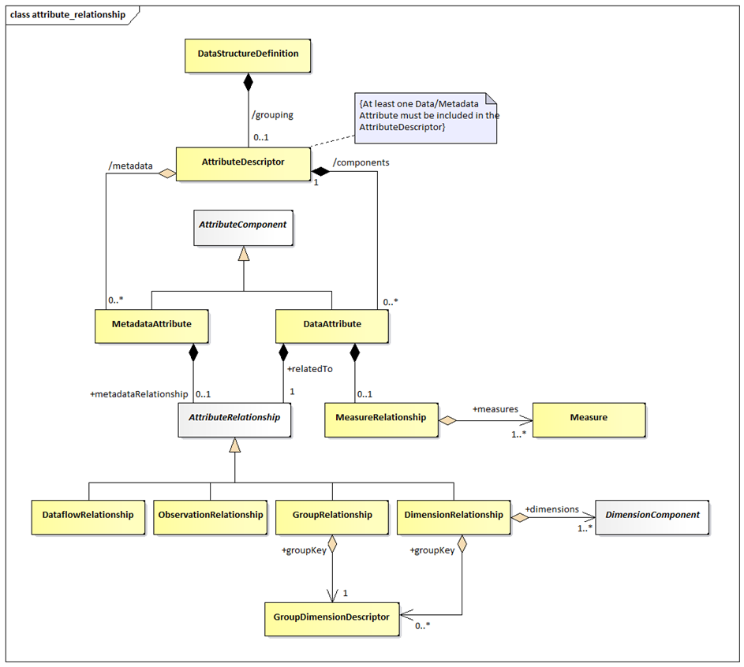 |
| Figure 29: Attribute Attachment Defined in the Data Structure Definition |

The following table details the possible relationships a `DataAttribute` may specify. Note that these relationships are mutually exclusive, and therefore only one of the following is possible.

| **Relationship** | **Meaning** | **Location in Data Set at which the Attribute is reported** |
| --- | --- | --- |
| `DataflowRelationship` | The value of the attribute is fixed for all data contained in the dataset. The Attribute value applies to all data defined by the underlying Dataflow. | The attribute is reported at the Dataset level. |
| `Dimension` (1..n) | The value of the attribute will vary with the value(s) of the referenced Dimension(s). In this case, Group(s) to which the attribute should be attached may optionally be specified. | The attribute is reported at the lowest level of the Dimension to which the Attribute is related, otherwise at the level of the Group if Attachment Group(s) is specified. |
| `Group` | The value of the Attribute varies with combination of values for all of the Dimensions contained in the Group. This is added as a convenience to listing all Dimensions and the attachment Group, but should only be used when the Attribute value varies based on all Group Dimension values. | The attribute is reported at the level of Group. |
| `Observation` | The value of the Attribute varies with the observed value. | The attribute is reported at the level of Observation. |

|  |
|:---:|
| 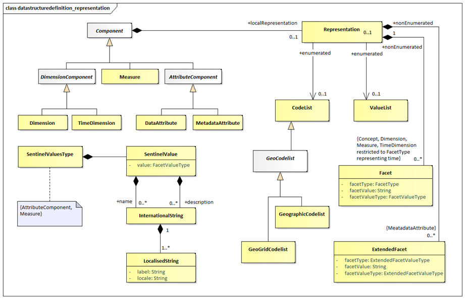 |
| Figure 30: Representation of DSD Components |

Each of `Dimension`, `TimeDimension`, `Measure`, `DataAttribute` and `MetadataAttribute` can have a `Representation` specified (using the `localRepresentation` association). If this is not specified in the `DataStructureDefinition` then the representation specified for `Concept` (`coreRepresentation`) is used. `Measure`, and `DataAttribute` may be also represented by multilingual text (as seen in the *`DataSet`* diagram further down). An exception is the `MetadataAttribute`, where its `Representation` is specified in the `MetadataStructureDefinition`.

A `DataStructureDefinition` can be extended to form a derived `DataStructureDefinition`. This is supported in the `StructureMap`.

#### 5.3.2.2 Definitions

| Class | Feature | Description |
| --- | --- | --- |
| *`StructureUsage`* |  | See “SDMX Base”. |
| `Dataflow` | Inherits from  *`StructureUsage`* | Abstract concept (i.e., the structure without any data) of a flow of data that providers will provide for different reference periods. |
|  | `/structure` | Associates a Dataflow to the Data Structure Definition. |
|  | `dimensionConstraint` | A list of Dimensions which the Dataflow uses. This is only required when the referenced DataStructureDefinition has the evolvingStructure property set to true and when the association to the DataStructureDefinition in on the latest minor version[^4]. |
| `DataStructureDefinition` |  | A collection of metadata concepts, their structure and usage when used to collect or disseminate data. |
|  | `/grouping` | An association to a set of metadata concepts that have an identified structural role in a Data Structure Definition. |
|  | `evolvingStructure` | An optional boolean property, defaulting to false. When true the DataStructureDefinition may have new Dimensions added without having to change its major version number. |
| `GroupDimensionDescriptor` | Inherits from  *`ComponentList`* | A set of metadata concepts that define a partial key derived from the Dimension Descriptor in a Data Structure Definition. |
|  | `/components` | An association to the Dimension components that comprise the group. |
| `DimensionDescriptor` | Inherits from  *`ComponentList`* | An ordered set of metadata concepts that, combined, classify a statistical series, and whose values, when combined (the key) in an instance such as a data set, uniquely identify a specific observation. |
|  | `/components` | An association to the Dimension and Time Dimension comprising the Key Descriptor. |
| `AttributeDescriptor` | Inherits from  *`ComponentList`* | A set metadata concepts that define the Attributes of a Data Structure Definition. |
|  | `/components` | An association to a Data Attribute component. |
| `MeasureDescriptor` | Inherits from  *`ComponentList`* | A metadata concept that defines the Measures of a Data Structure Definition. |
|  | `/components` | An association to a Measure component. |
| *`DimensionComponent`* | Inherits from  *`Component`*  Sub class  `Dimension`  `TimeDimension` | An abstract class representing any Component that can be used for identifying observations. | |
|  | `Order` | Specifies the order of the Dimension Components within the DSD. The property is used to indicate the position of the Dimension Component and determines the Key for identifying observations, or series. The Time Dimension, when specified, must be the last within the Dimension Descriptor. | |
| `Dimension` | Inherits from  *`DimensionComponent`* | A metadata concept used (most probably together with other metadata concepts) to classify a statistical series, e.g., a statistical concept indicating a certain economic activity or a geographical reference area. | |
|  | `/role` | Association to the Concept that specifies the role that that the Dimension plays in the Data Structure Definition. | |
|  | `/conceptIdentity` | An association to the metadata concept which defines the semantic of the Dimension. | |
| `TimeDimension` | Inherits from  *`DimensionComponent`* | A metadata concept that identifies the component in the key structure that has the role of “time”. | |
| `DataAttribute` | Inherits from  *`Component`* | A characteristic of an object or entity. | |
|  | `/role` | Association to the Concept that specifies the role that that the Data Attribute plays in the Data Structure Definition. | |
|  | `minOccurs` | Defines the minimum required occurrences for the Attribute. When equals to zero, the Attribute is conditional. | |
|  | `maxOccurs` | Defines the maximum allowed occurrences for the Attribute. | |
|  | `Usage` | Defines whether a Data Attribute must be reported or not. | |
|  | `+relatedTo` | Association to an Attribute Relationship. | |
|  | `/conceptIdentity` | An association to the Concept which defines the semantic of the component. | |
| `Measure` | Inherits from  *`Component`* | The metadata concept that is the phenomenon to be measured in a data set. In a data set the instance of the measure is often called the observation. | |
|  | `/conceptIdentity` | An association to the Concept which carries the values of the measures. | |
|  | `minOccurs` | Defines the minimum required occurrences for the Measure. When equals to zero, the Measure is conditional. | |
|  | `maxOccurs` | Defines the maximum allowed occurrences for the Measure. | |
|  | `Usage` | Defines whether a Measure must be reported or not. | |
| *`AttributeRelationship`* | Abstract Class    Sub classes   `ObservationRelationship`  `GroupRelationship`  `DimensionRelationship` | Specifies the type of artefact to which a Data Attribute can be attached in a Data Set. | |
| `ObservationRelationship` |  | The Data Attribute is related to the observations of the Data Set. | |
| `GroupRelationship` |  | The Data Attribute is related to a Group Dimension Descriptor construct. | |
|  | `+groupKey` | An association to the Group Dimension Descriptor | |
| `DimensionRelationship` |  | The Data Attribute is related to a set of Dimensions. | |
|  | `+dimensions` | Association to the set of Dimensions to which the Data Attribute is related. | |
|  | `+groupKey` | Association to the Group Dimension Descriptor which specifies the set of Dimensions to which the Data Attribute is attached. | |
| `MeasureRelationship` |  | The Measures that a Data Attribute is reported for. | |
|  | `+measures` | Association to the set of Measures to which a Data Attribute is related to. | |
| `SentinelValuesType` |  | This facet indicates that an Attribute or a Measure has sentinel values with special meaning within their data type. This is realised by providing such values within the TextFormat, in addition to any textType or other Facet. | |
| `SentinelValue` |  | A value that has a special meaning within the text format representation of the Component. | |
|  | `+name` | An association of a Sentinel Value to a multilingual name. | |
|  | `+description` | An association of a Sentinel Value to a multilingual description. | |

The explanation of the classes, attributes, and associations comprising the Representation is described in the section on the SDMX Base.

## 5.4 Data Set – Relationship View

### 5.4.1 Context

A data set comprises the collection of data values and associated metadata that are collected or disseminated according to a known `DataStructureDefinition`.

### 5.4.2 Class Diagram

|  |
|:---:|
| 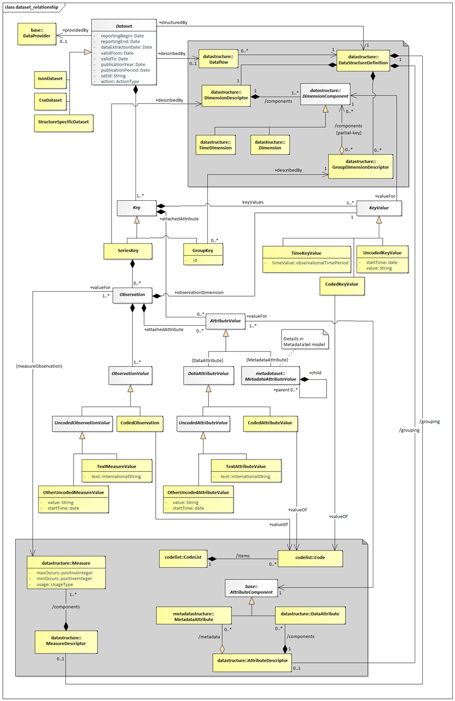 |
| Figure 31: Class Diagram of the Data Set |

### 5.4.3 Explanation of the Diagram

#### 5.4.3.1 Narrative – Data Set

Note that the *`DataSet`* must conform to the `DataStructureDefinition` associated to the `Dataflow` for which this *`DataSet`* is an “instance of data”. Whilst the model shows the association to the classes of the `DataStructureDefinition`, this is for conceptual purposes to show the link to the `DataStructureDefinition`. In the actual *`DataSet`* as exchanged there must, of course, be a reference to the `DataStructureDefinition` and optionally a `Dataflow` or a `ProvisionAgreement`, but the `DataStructureDefinition` is not necessarily exchanged with the data. Therefore, the `DataStructureDefinition` classes are shown in the grey areas, as these are not a part of the *`DataSet`* when the *`DataSet`* is exchanged. However, the structural metadata in the `DataStructureDefinition` can be used by an application to validate the contents of the *`DataSet`* in terms of the valid content of a *`KeyValue`* as defined by the `Representation` in the `DataStructureDefinition`.

An organisation playing the role of `DataProvider` can be responsible for one or more *`DataSet`*.

A *`DataSet`* is formatted as a `DataStructureDefinition` specific data set (`StructureSpecificDataSet`). The structured data set is structured according to one specific `DataStructureDefinition`; hence the latter is required for validation at the syntax level.

A *`DataSet`* is a collection of a set of *`Observation`s* that share the same dimensionality, which is specified by a set of unique components (`Dimension`, `TimeDimension`) defined in the `DimensionDescriptor` of the `DataStructureDefinition`, together with associated *`AttributeValue`s* that define specific characteristics about the artefact to which it is attached – *`Observation`s*, set of `Dimension`s. It can be structured in terms of a `SeriesKey` to which *`Observation`s* are reported.

The *`Observation`* can be the value(s) of the variable(s) being measured for the `Concept` associated to the `Measure`(s) in the `MeasureDescriptor` of the `DataStructureDefinition`. Each *`Observation`* associates one or more *`ObservationValue`s* with a *`KeyValue`* (`+observationDimension`) which is the value for the “Dimension at the Observation Level”. Any `Dimension` can be specified as being the “Dimension at the Observation Level”, and this specification is made at the level of the *`DataSet`* (i.e., it must be the same `Dimension` for the entire *`DataSet`*).

The *`KeyValue`* is a value for one of `TimeDimension` or `Dimension` specified in the `DataStructureDefinition`. If it is a `Dimension`, it can be coded (`CodedKeyValue`) or uncoded (`UncodedKeyValue`). If it is the `TimeDimension` then it is a `TimeKeyValue`. The actual value that the `CodedDimensionValue` can take must be one of the `Code`s in the `Codelist` specified as the `Representation` of the `Dimension` in the `DataStructureDefinition`.

An `ObservationValue` can be coded – this is the `CodedObservation` – or it can be uncoded – this is the `UncodedObservation`. In the case of uncoded observations, the values may be multilingual – expressed via the `TextMeasureValue` – or not (`OtherUncodedMeasureValue`).

The `GroupKey` is a subunit of the *`Key`* that has the same dimensionality as the `SeriesKey` but defines a subset of the *`KeyValue`s* of the `SeriesKey`. Its sub dimension structure is defined in the `GroupDimensionDescriptor` of the `DataStructureDefinition` identified by the same id as the `GroupKey`. The `id` identifies a “type” of group and the purpose of the `GroupKey` is to report one or more *`AttributeValue`* that are contained at this group level. The `GroupKey` is present when the `GroupDimensionDescriptor` is related to the `GroupRelationship` in the `DataStructureDefinition`. There can be many types of groups in a *`DataSet`*. If the `Group` is related to the `DimensionRelationship` in the `DataStructureDefinition` then the *`AttributeValue`* will be reported with the appropriate dimension in the `SeriesKey` or *`Observation`*.

In this way each of `SeriesKey`, `GroupKey`, and *`Observation`* can have zero or more *`AttributeValue`s* that define some metadata about the object to which it is associated. The *`AttributeValue`* may be either a *`DataAttributeValue`* or a *`MetadataAttributeValue`*, representing values of `DataAttribute`s defined in the DSD or `MetadataAttributes` of the linked MSD, respectively. The allowable `Concept`s and the objects to which these metadata can be associated (attached) are defined in the `DataStructureDefinition` and the linked `MetadataStructureDefinition`.

The *`AttributeValue`* links to the object type (`SeriesKey`, `GroupKey`, `Observation`) to which it is associated.

#### 5.4.3.2 Definitions

| Class | Feature | Description |
| --- | --- | --- |
| *`DataSet`* | Abstract Class  Sub classes  `StructureSpecificDataSet` | An organised collection of data. |
|  | `reportingBegin` | A specific time period in a known system of time periods that identifies the start period of a report. |
|  | `reportingEnd` | A specific time period in a known system of time periods that identifies the end period of a report. |
|  | `dataExtractionDate` | A specific time period that identifies the date and time that the data are extracted from a data source. |
|  | `validFrom` | Indicates the inclusive start time indicating the validity of the information in the data set. |
|  | `validTo` | Indicates the inclusive end time indicating the validity of the information in the data set. |
|  | `publicationYear` | Specifies the year of publication of the data or metadata in terms of whatever provisioning agreements might be in force. |
|  | `publicationPeriod` | Specifies the period of publication of the data or metadata in terms of whatever provisioning agreements might be in force. |
|  | `setId` | Provides an identification of the data set. |
|  | `action` | Defines the action to be taken by the recipient system (information, append, replace, delete) |
|  | `describedBy` | Associates a Dataflow and thereby a Data Structure Definition to the data set. |
|  | `+structuredBy` | Associates the Data Structure Definition that defines the structure of the Data Set. Note that the Data Structure Definition is the same as that associated (non-mandatory) to the Dataflow. |
|  | `+publishedBy` | Associates the Data Provider that reports/publishes the data. |
| `StructureSpecificDataSet` |  | An XML specific data format structure that contains data corresponding to one specific Data Structure Definition. |
| *`Key`* | Abstract class  Sub classes  `SeriesKey` `GroupKey` | Comprises the cross product of values of dimensions that identify uniquely an Observation. |
|  | `keyValues` | Association to the individual Key Values that comprise the Key. |
|  | `+attachedAttribute` | Association to the Attribute Values relating to the Series Key or Group Key. |
| *`KeyValue`* | Abstract class  Sub classes  `TimeKeyValue`  `CodedKeyValue` `UncodedKeyValue` | The value of a component of a key such as the value of the instance a Dimension in a Dimension Descriptor of a Data Structure Definition. |
|  | `+valueFor` | Association to the key component in the Data Structure Definition for which this Key Value is a valid representation.  Note that this is conceptual association as the key component is identified explicitly in the data set. |
| `TimeKeyValue` | Inherits from  *`KeyValue`* | The value of the Time Dimension component of the key. |
| `CodedKeyValue` | Inherits from  *`KeyValue`* | The value of a coded component of the key. The value is the Code to which this class is associated. |
|  | `+valueOf` | Association to the Code.  Note that this is a conceptual association showing that the Code must exist in the Code list associated with the Dimension in the Data Structure Definition. In the actual Data Set the value of the Code is placed in the Key Value. |
| `UnCodedKeyValue` | Inherits from  *`KeyValue`* | The value of an uncoded component of the key. |
|  | `value` | The value of the key component. |
|  | `startTime` | This attribute is only used if the textFormat of the attribute is of the Timespan type in the Data Structure Definition (in which case the value field takes a duration). |
| `GroupKey` | Inherits from  *`Key`* | A set of Key Values that comprise a partial key, of the same dimensionality as the Time Series Key for the purpose of attaching Data Attributes. |
|  | `+describedBy` | Associates the Group Dimension Descriptor defined in the Data Structure Definition. |
| `SeriesKey` | Inherits from  *`Key`* | Comprises the cross product of values of all the Key Values that, together with the Key Value of the +observation Dimension identify uniquely an Observation. |
|  | `+describedBy` | Associates the Dimension Descriptor defined in the Data Structure Definition. |
| `Observation` |  | The value(s) of the observed phenomenon in the context of the Key Values comprising the key. |
|  | `+valueFor` | Associates the Measure(s) defined in the Data Structure Definition.  The source multiplicity (1..\*) indicates that more than one values may be provided for a Measure, if the latter allows it. |
|  | `+attachedAttribute` | Association to the Attribute Values relating to the Observation. |
|  | `+observationDimension` | Association to the Key Value that holds the value of the “Dimension at the Observation Level”. |
| *`ObservationValue`* | Abstract class  Sub classes  *`UncodedObservationValue`*  `CodedObservation` |  |
| *`UncodedObservationValue`* | Abstract class  Inherits from  *`ObservationValue`*  Sub classes  `OtherUncodedMeasureValue`   `TextMeasureValue` |  |
| `OtherUncodedMeasureValue` | Inherits from  *`UncodedObservationValue`* | An observation that has a text value. |
|  | `value` | The value of the Uncoded Observation. |
|  | `startTime` | This attribute is only used if the textFormat of the Measure is of the Timespan type in the Data Structure Definition (in which case the value field takes a duration). |
| `TextMeasureValue` | Inherits from  *`UncodedObservationValue`* | An observation that has a localised text value |
|  | `text` | The localised text values. |
| `CodedObservation` | Inherits from  *`ObservationValue`* | An Observation that takes its value from a code in a Code list. |
|  | `+valueOf` | Association to the Code that is the value of the Observation.  Note that this is a conceptual association showing that the Code must exist in the `Codelist`(s) associated with the Measure(s) in the Data Structure Definition. In the actual Data Set the value of the Code is placed in the Observation. |
| *`AttributeValue`* | Abstract class  Sub classes  *`DataAttributeValue`*  *`MetadataAttributeValue`* | Represents the value for any Attribute reported in the Dataset, i.e., Data or Metadata Attribute. |
| *`DataAttributeValue`* | Abstract class  Inherits from  *`AttributeValue`*  Sub classes   *`UncodedAttributeValue`*  `CodedAttributeValue` | The value of a Data Attribute, such as the instance of a Coded Attribute or of an Uncoded Attribute in a structure such as a Data Structure Definition. |
|  | `+valueFor` | Association to the Data Attribute defined in the Data Structure Definition. Note that this is conceptual association as the Concept is identified explicitly in the data set.  The source multiplicity (1..\*) indicates the possibility to provide more than one values for a Data Attribute, if the latter allows it. |
| *`MetadataAttributeValue`* | (explained further in section “Metadata Set”) | The value of a Metadata Attribute, as specified in the Metadata Structure Definition, which is linked in the Data Structure Definition |
| *`UncodedAttributeValue`* | Inherits from  *`AttributeValue`*  Sub classes   `OtherUncodedAttributeValue`   `TextAttributeValue` |  |
| `OtherUncodedAttributeValue` | Inherits from  *`UncodedObservationValue`* | An attribute value that has a text value |
|  | `value` | The value of the Uncoded attribute. |
|  | `startTime` | This attribute is only used if the textFormat of the attribute is of the Timespan type in the Data Structure Definition (in which case the value field takes a duration). |
| `TextAttributeValue` | Inherits from  *`UncodedAttributeValue`* | An attribute that has a localised text value |
|  | text | The localised text values. |
| `CodedAttributeValue` | Inherits from  *`AttributeValue`* | An attribute that takes it value from a Code in Code list. |
|  | `+valueOf` | Association to the Code that is the value of the Attribute Value.  Note that this is a conceptual association showing that the Code must exist in the Code list associated with the Data Attribute in the Data Structure Definition. In the actual Data Set the value of the Code is placed in the Attribute Value. |

# 6 Cube

## 6.1 Context

Some statistical systems create views of data based on a “cube” structure. In essence, a cube is an n-dimensional object where the value of each dimension can be derived from a hierarchical code list. The utility of such cube systems is that it is possible to “roll up” or “drill down” each of the hierarchy levels for each of the dimensions to specify the level of granularity required to give a “view” of the data – some dimensions may be rolled up, others may be drilled down. Such systems give a dynamic view of the data, with aggregated values for rolled up dimension positions. For example, the individual countries may be rolled up into an economic region such as the EU, or a geographical region such as Europe, whilst another dimension, such as “type of road” may be drilled down to its lower level. The resulting measure (such as “number of accidents”) would then be an aggregation of the value for each individual country for the specific type of road.

Such cube systems rely, not on simple code lists, but on hierarchical code sets (see section [8](#8-hierarchy)).

## 6.2 Support for the Cube in the Information Model

Data reported using a Data Structure Definition structure (where each dimension value, if coded, is taken from a flat code list) can be described by a cube definition and can be processed by cube aware systems. The SDMX-IM supports the definition of such cubes in the following way:

* The `Hierarchy` defines the (often complex) hierarchies of codes.
* If required:
  + The `StructureMap` can group `DataStructureDefinition` that describe the cube
  + The `HierarchyAssociation` can provide a mechanism to apply a `Hierarchy` to the `Code`s in the `Codelist`s used by the `DataStructureDefinition`, providing also the context of which the hierarchy applies (e.g., a `Dataflow`).

# 7 Metadata Structure Definition and Metadata Set

## 7.1 Context

Besides the possibility to extend the components of Data Structure Definitions by metadata attributes defined in Metadata Structure Definitions, the SDMX metamodel allows metadata to describe any identifiable artefact. These metadata can be:

1. Exchanged without the need to embed it within the object that it is describing.

2. Stored separately from the object that it describes, yet be linked to it (for example, an organisation has a metadata repository which supports the dissemination of metadata resulting from metadata requests generated by systems or services that have access to the object for which the metadata pertains. This is common in web dissemination where additional metadata is available for viewing (and eventually downloading) by clicking on an “information” icon next to the object to which the metadata is attached).
3. Versioned and maintained like structural metadata, but from Metadata Providers than Agencies.

4. Reported according to a defined structure.

In order to achieve this, the following structures are modelled:

* The Metadata Structure Definition which comprises the metadata attributes that can be attached to the various object types (these attributes can be structured in a hierarchy), together with any constraints that may apply (e.g., association to a code list that contains valid values for the attribute when reported in a metadata set),
* The Metadataflow and/or Metadata Provision Agreement, which contains the objects to which the metadata are to be associated (attached),
* The Metadata Set, which contains reported metadata.

## 7.2 Inheritance

### 7.2.1 Introduction

As with the Data Structure Definition Structure, many of the constructs in this layer of the model inherit from the SDMX Base layer. Therefore, it is necessary to study both the inheritance and the relationship diagrams to understand the functionality of individual packages. The diagram below shows the full inheritance tree for the classes concerned with the `MetadataStructureDefinition`, the `MetadataProvisionAgreement`, the `Metadataflow` and the `MetadataSet`.

There are very few additional classes in the `MetadataStructureDefinition` package that do not themselves inherit from classes in the SDMX Base. In other words, the SDMX Base gives most of the structure of this sub model both in terms of associations and in terms of attributes. The relationship diagrams shown in this section show clearly when these associations are inherited from the SDMX Base (see the Appendix “A Short Guide to UML in the SDMX Information Model” to see the diagrammatic notation used to depict this).

### 7.2.2 Class Diagram - Inheritance

|  |
|:---:|
| 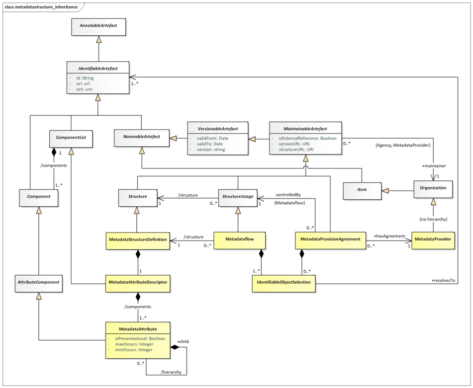 |
| Figure 32: Inheritance class diagram of the Metadata Structure Definition |

### 7.2.3 Explanation of the Diagram

#### 7.2.3.1 Narrative

It is important to the understanding of the relationship class diagrams presented in this section to identify the concrete classes that inherit from the abstract classes.

The concrete classes in this part of the SDMX metamodel, which require to be maintained by Maintenance Agencies, all inherit from `MaintainableArtefact`. These are:
<ul>

*`StructureUsage`* (concrete class is `Metadataflow`)

*`Structure`* (concrete class is `MetadataStructureDefinition`)

`MetadataProvisionAgreement`
</ul>

These classes also inherit the identity and versioning facets of *`IdentifiableArtefact`*, *`NameableArtefact`* and *`VersionableArtefact`*.

A *`Structure`* may contain several lists of components. In this case the `MetadataStructureDefinition` acts as a list and contains *`Component`s*, i.e., `MetadataAttribute`s.

## 7.3 Metadata Structure Definition

### 7.3.1 Introduction

The diagrams and explanations in the rest of this section show how these concrete classes are related in order to support the required functionality.

### 7.3.2 Structures Already Described

The `MetadataStructureDefinition` only contains `MetadataAttribute`s, since target objects are contained in `Metadataflow` and `MetadataProvisionAgreement`, since SDMX 3.0.

### 7.3.3 Class Diagram – Relationship

|  |
|:---:|
| 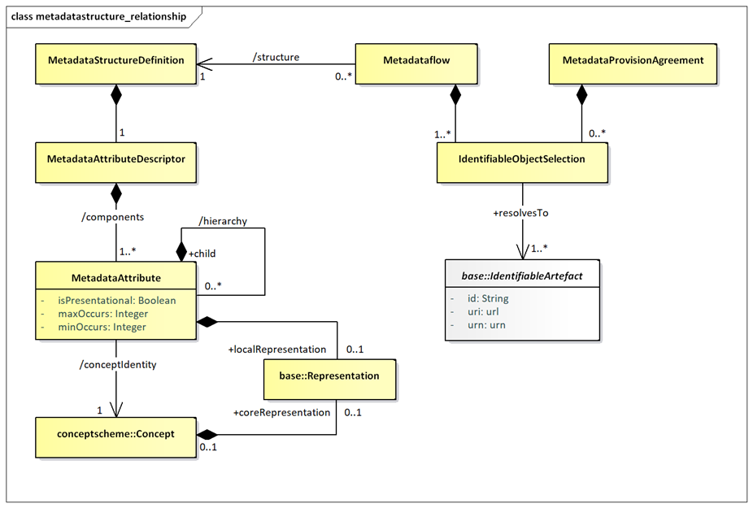 |
| Figure 33: Relationship class diagram of the Metadata Structure Definition |

### 7.3.4 Explanation of the Diagram

#### 7.3.4.1 Narrative

In brief, a `MetadataStructureDefinition` (MSD) defines the `MetadataAttribute`s, within an `MetadataAttributeDescriptor`, that can be associated with the objects identified in the `Metadataflow`s and `MetadataProvisionAgreement`s that refer to the MSD. The hierarchy of the `MetadataAttribute`s is specified within the `MetadataAttributeDescriptor`.

The `MetadataAttributeDescriptor` comprises a set of `MetadataAttribute`s – these can be defined as a hierarchy. Each `MetadataAttribute` identifies a `Concept` that is reported or disseminated in a `MetadataSet` (`/conceptIdentity`) that uses this `MetadataStructureDefinition`. Different `MetadataAttribute`s in the same `MetadataAttributeDescriptor` can use `Concept`s from different `ConceptScheme`s. Note that a `MetadataAttribute` does not link to a `Concept` that defines its role in this `MetadataStructureDefinition` (i.e., the `MetadataAttribute` does not play a role).

The `MetadataAttribute` can be specified as having multiple occurrences and/or specified as being mandatory (`minOccurs`=`1` or more) or optional (`minOccurs`=`0`). A hierarchical `MetadataStructureDefinition` can be defined by specifying a hierarchy for a `MetadataAttribute`.

It can be seen from this, that the specification of the objects to which a `MetadataAttribute` can be attached is indirect: the `MetadataAttribute`s are defined in a `MetadataStructureDefinition`, but they are attached to one or more *`IdentifiableArtefact`s* as defined in the `Metadataflow`s or `MetadataProvisionAgreement`s. This gives a flexible mechanism by which the actual objects need not be defined in concrete terms in the model but are defined dynamically by the *`IdentifiableObjectSelection`*. In this way, the `MetadataStructureDefinition` can be used to define any set of `MetadataAttribute`s regardless of the objects to which they can be attached.

Each `MetadataAttribute` can have a `Representation` specified (using the `localRepresentation` association). If this is not specified in the `MetadataStructureDefinition` then the `Representation` is taken from that defined for the `Concept` (the `coreRepresentation` association).

The definition of the various types of `Representation` can be found in the specification of the Base constructs. Note that if the `Representation` is non-enumerated then the association is to the `ExtendedFacet` (which allows for XHTML as a `FacetValueType`). If the `Representation` is enumerated, then it must use a `Codelist`.

The `Metadataflow` is linked to a `MetadataStructureDefinition`. The `Metadataflow`, in addition to the attributes inherited from the Base classes, it also has a list of *`IdentifiableObjectSelection`* constructs, which resolve into the *`IdentifiableArtefact`s* that the `Metadataset`s will refer to. The *`IdentifiableObjectSelection`* acts like a reference, but it may also include wildcarding part of the reference terms.

The `MetadataProvisionAgreement` is linked to a `Metadataflow`. The former, like the `Metadataflow`, may have *`IdentifiableObjectSelection`* constructs to be used for specifying the proper targets for reference metadata.

#### 7.3.4.2 Definitions

| Class | Feature | Description |
| --- | --- | --- |
| *`StructureUsage`* |  | See “SDMX Base”. |
| `Metadataflow` | Inherits from:   *`StructureUsage`* | Abstract concept (i.e., the structure without any metadata) of a flow of metadata that providers will provide for different reference periods. Specifies possible targets for metadata, via the Identifiable Object Selection. |
|  | `/structure` | Associates a Metadata Structure Definition. |
| `MetadataProvisionAgreement` |  | Links the Metadata Provider to the relevant Structure Usage (i.e., Metadataflow) for which the provider supplies metadata. The agreement may constrain the scope of the metadata that can be provided, by means of a Constraint. Specifies possible targets for metadata, via the Identifiable Object Selection. |
| `MetadataProvider` |  | See Organisation Scheme. |
| IdentifiableObjectSelection |  | A list or wildcarded expression resolving into Identifiable Objects that metadata will refer to. |
| `MetadataStructureDefinition` | Inherits from:  *`MaintainableArtefact`* | A collection of metadata concepts and their structure when used to collect or disseminate reference metadata. |
| `MetadataAttributeDescriptor` | Inherits from:  *`ComponentList`* | Defines a set of concepts that comprises the Metadata Attributes to be reported. |
|  | `/components` | An association to the Metadata Attributes relevant to the Metadata Attribute Descriptor. |
| `MetadataAttribute` |  | Identifies a Concept for which a value may be reported in a Metadata Set. |
|  | `/hierarchy` | Association to one or more child Metadata Attribute. |
|  | `/conceptIdentity` | An association to the concept which defines the semantic of the attribute. |
|  | `isPresentational` | Indication that the Metadata Attribute is present for structural purposes (i.e. it has child attributes) and that no value for this attribute is expected to be reported in a Metadata Set. |
|  | `minOccurs`  `maxOccurs` | Specifies how many occurrences of the Metadata Attribute may be reported at this point in the Metadataset. |
|  | `/localRepresentation` | Associates a Representation that overrides any core representation specified for the Concept itself. |
| `Representation` |  | The representation of the Metadata Attribute. |

## 7.4 Metadata Set

### 7.4.1 Class Diagram

|  |
|:---:|
| 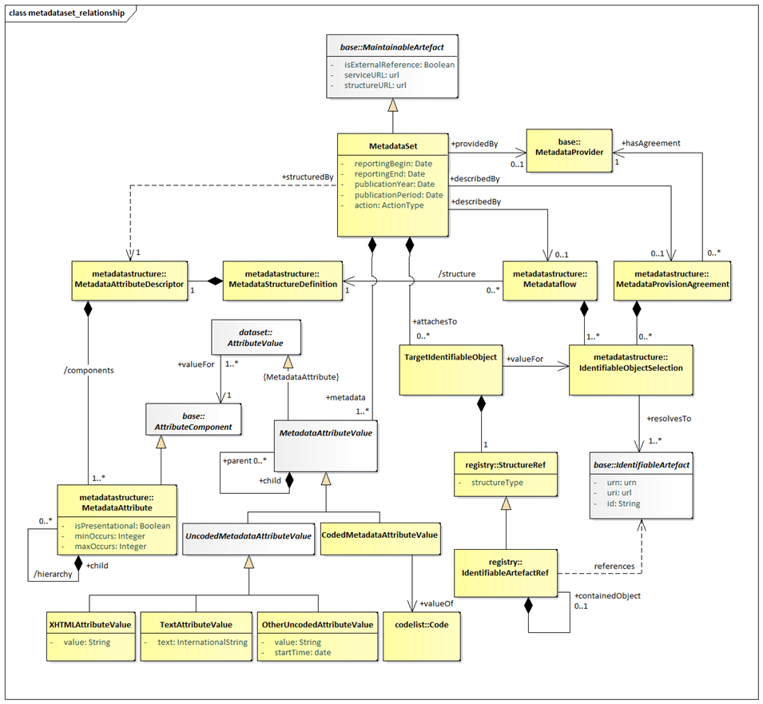 |
| Figure 34: Relationship Class Diagram of the Metadata Set |

### 7.4.2 Explanation of the Diagram

#### 7.4.2.1 Narrative

Note that the `MetadataSet` must conform to the `MetadataStructureDefinition` associated to the `Metadataflow` or `MetadataProvisionAgreement` for which this `MetadataSet` is an “instance of metadata”. Whilst the model shows the association to the classes of the `MetadataStructureDefinition`, this is for conceptual purposes to show the link to the `MetadataStructureDefinition`. In the actual `MetadataSet`, as exchanged, there must, of course, be a reference to the `MetadataStructureDefinition` and optionally a `Metadataflow` or a `MetadataProvisionAgreement`, but the `MetadataStructureDefinition` is not necessarily exchanged with the metadata. Note that the `MetadataStructureDefinition` classes are shown also but are not a part of the `MetadataSet` itself.

A `MetadataProvider` is maintaining one or more `MetadataSet`s, as the latter is a *`MaintainableArtefact`*.

A `MetadataSet` comprises a set of *`MetadataAttributeValue`s* and a set of `TargetIdentifiableObject`s , which must be part of those specified in the relevant `Metadataflow` or `MetadataProvisionAgreement`.

The `MetadataStructureDefinition` specifies which `MetadataAttribute`s are expected as *`MetadataAttributeValue`s*. The `TargetIdentifiableObject`s point to the *`IdentifiableArtefact`s* for which the *`MetadataAttributeValue`s* are reported.

A simple text value for the *`MetadataAttributeValue`* uses the *`UncodedMetadataAttributeValue`* sub class of *`MetadataAttributeValue`* whilst a coded value uses the `CodedMetadataAttributeValue` sub class.

The *`UncodedMetadataAttributeValue`* can be one of:

* `XHTMLAttributeValue` – the content is XHTML,
* `TextAttributeValue` – the content is textual and may contain the `text` in multiple languages,
* `OtherUncodedAttributeValue` – the content is a string value that must conform to the `Representation` specified for the `MetadataAttribute` in the `MetadataStructureDefinition`.

The `CodedMetadataAttributeValue` contains a value for a `Code` specified as the `Representation` for a `MetadataAttribute` in the `MetadataStructureDefinition`.

#### 7.4.2.2 Definitions

| Class | Feature | Description |
| --- | --- | --- |
| `MetadataSet` |  | Any organised collection of metadata. |
|  | `reportingBegin` | A specific time period in a known system of time periods that identifies the start period of a report. |
|  | `reportingEnd` | A specific time period in a known system of time periods that identifies the end period of a report. |
|  | `publicationYear` | Specifies the year of publication of the data or metadata in terms of whatever provisioning agreements might be in force. |
|  | `publicationPeriod` | Specifies the period of publication of the data or metadata in terms of whatever provisioning agreements might be in force. |
|  | `action` | Defines the action to be taken by the recipient system (information, append, replace, delete) |
|  | `+describedBy` | Associates a Metadataflow or a Metadata Provision Agreement to the Metadata Set. |
|  | `+structuredBy` | Associates the Metadata Attribute Descriptor of the Metadata Structure Definition that defines the structure of the Metadata Set. Note that this dependency explains that the Metadataset is structures according to the Metadata Structure Definition of the linked (by the +describedBy) Metadataflow or the Metadata Provision Agreement. |
|  | `+publishedBy` | Associates the Data Provider that reports/publishes the metadata. |
|  | `+attachesTo` | Associates the target identifiable objects to which metadata is to be attached. |
|  | `+metadata` | Associates the Metadata Attribute values which are to be associated with the object or objects identified by the Target Identifiable Objects(s). |
| `TargetIdentifiableObject` |  | Specifies the identification of an Identifiable object. |
|  | `+valueFor` | Associates the Target Identifiable Object being a part of the Identifiable Object Selection specified in the Dataflow or Metadata Provision Agreement. |
| `StructureRef` |  | Contains the identification of an Identifiable object. |
|  | `structureType` | The object type of the target object. |
| `IdentifiableArtefactRef` |  | Identification of the target object. |
|  | `+containedObject` | Association to a contained object in a hierarchy of Identifiable Objects such as a Transition in a Process Step. |
| *`MetadataAttributeValue`* | Abstract class  Sub classes are:  *`UncodedMetadataAttributeValue`*  `CodedMetadataAttributeValue` | The value for a Metadata Attribute. |
|  | `+valueFor`  (inherited from the *`AttributeValue`*) | Association to the Metadata Attribute in the Metadata Structure Definition that identifies the Concept and allowed Representation for the Metadata Attribute value.  Note that this is a conceptual association showing the link to the MSD construct. The syntax for the Metadata Attribute value will state, in some form, the id of the Metadata Attribute. |
|  | `+child` | Association to a child Metadata Attribute value consistent with the hierarchy defined in the MSD for the Metadata Attribute for which this child is a Metadata Attribute value. |
| *`UncodedMetadataAttributeValue`* | Inherits from  *`MetadataAttributeValue`*  Sub class:  `XHTMLAttributeValue`  `TextAttributeValue`  `OtherUncodedAttributeValue` | The content of a Metadata Attribute value where this is textual. |
| `XHTMLAttributeValue` |  | This contains XHTML |
|  | `value` | The string value of the XHTML |
| `TextAttributeValue` |  | This value of a Metadata Attribute value where the content is human-readable text. |
|  | `text` | The string value is text. This can be present in multiple language versions. |
| `OtherUncodedAttributeValue` |  | The value of a Metadata Attribute value where the content is not of human-readable text. |
|  | `value` | A text string that is consistent in format to that defined in the Representation of the Metadata Attribute for which this is a Metadata Attribute value. |
|  | `startTime` | This attribute is only used if the textFormat of the Metadata Attribute is of the Timespan type in the Metadata Structure Definition (in which case the value field takes a duration). |
| `CodedMetadataAttributeValue` | Inherits from  *`MetadataAttributeValue`* | The content of a Metadata Attribute value that is taken from a Code in a Code list. |
|  | `value` | The Code value of the Metadata Attribute value. |
|  | `+value` | Association to a Code in the Code list specified in the Representation of the Metadata Attribute for which this Metadata Attribute value is the value.  Note that this shows the conceptual link to the Item that is the value. In reality, the value itself will be contained in the Coded Metadata Attribute Value. |

# 8 Hierarchy

## 8.1 Scope

The `Codelist` described in the section on structural definitions supports a simple hierarchy of `Code`s and restricts any child `Code` to having just one parent `Code`. Whilst this structure is useful for supporting the needs of the `DataStructureDefinition` and the `MetadataStructureDefinition`, it may not be sufficient for supporting the more complex associations between codes that are often found in coding schemes such as a classification scheme. Often, the `Codelist` used in a `DataStructureDefinition` is derived from a more complex coding scheme. Access to such a coding scheme can aid applications, such as OLAP applications or data visualisation systems, to give more views of the data than would be possible with the simple `Codelist` used in the `DataStructureDefinition`. A `Hierarchy` may be linked to an `IndentifiableArtefact`, in order to assist

Note that a `Hierarchy` is not necessarily a balanced tree. A balanced tree is where levels are pre-defined and fixed, (i.e. a level always has the same set of codes, and any code has a fixed parent and child relationship to other codes). A statistical classification is an example of a balanced tree, and the support for a balanced hierarchy is a subset, and special case, of hierarchies.

The principal features of the `Hierarchy` are:

1. A child code can have more than one parent.

2. There can be more than one code that has no parent (i.e. more than one “root node”).

3. The levels in a hierarchy can be explicitly defined or they can be implicit: i.e. they exist only as parent/child relationships in the coding structure.

4. Hierarchies may be associated to the structures they refer to, via the `HierarchyAssociation`.

## 8.2 Inheritance

### 8.2.1 Class Diagram

|  |
|:---:|
| 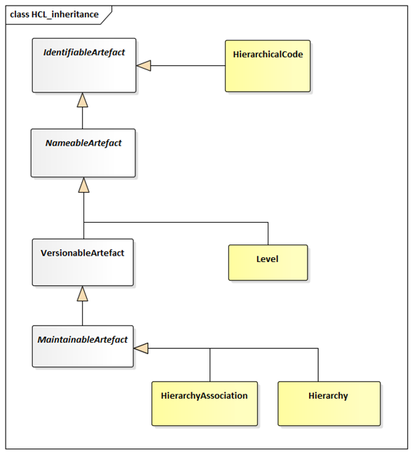 |
| Figure 35: Inheritance class diagram for the Hierarchy |

### 8.2.2 Explanation of the Diagram

#### 8.2.2.1 Narrative

The `Hierarchy` and `HierarchyAssociation` inherit from *`MaintainableArtefact`* and thus have identification, naming, versioning and a maintenance agency. The `Level` is a *`NameableArtefact`* and therefore has an Id, multi-lingual name and multi-lingual description. A `HierachicalCode` is an *`IdentifiableArtefact`*.

It is important to understand that the `Code`s participating in a `Hierarchy` are not themselves contained in the list – they are referenced from the list and are maintained in one or more `Codelist`s. This is explained in the narrative of the relationship class diagram below.

#### 8.2.2.2 Definitions

The definitions of the various classes, attributes, and associations are shown in the relationship section below.

## 8.3 Relationship

### 8.3.1 Class Diagram

|  |
|:---:|
| 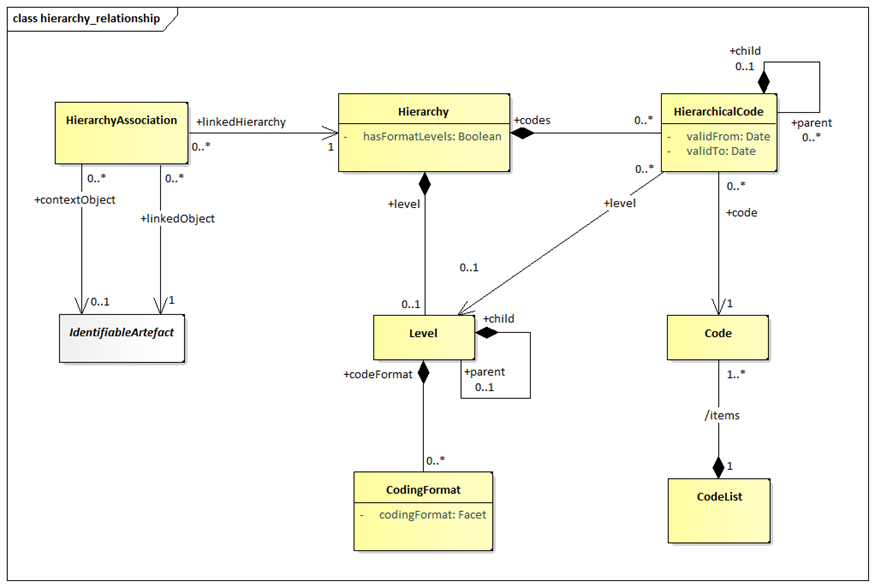 |
| Figure 36: Relationship class diagram of the Hierarchy |

### 8.3.2 Explanation of the Diagram

#### 8.3.2.1 Narrative

The basic principles of the `Hierarchy` are:

1. The `Hierarchy` is a specification of the structure of the Codes.

2. The `Code`s in the `Hierarchy` are not themselves a part of the artefact, rather they are references to `Code`s in one or more external `Codelist`s.

3. The hierarchy of `Code`s is specified in `HierarchicalCode`. This references the `Code` and its immediate child `HierarchicalCodes`.

A `Hierarchy` can have formal levels (`hasFormalLevels`="`true`"). However, even if `hasFormalLevels`="`false`" the `Hierarchy` can still have one or more `Level`s associated in order to document information about the `HierarchicalCodes`.

If `hasFormalLevels`="`false`" the `Hierarchy` is "value based" comprising a hierarchy of codes with no formal `Level`s. If `hasFormalLevels`="`true`" then the hierarchy is “level based” where each `Level` is a formal `Level` in the `Hierarchy`, such as those present in statistical classifications. In a “level based” hierarchy each `HierarchicalCode` is linked to the `Level` in which it resides. It is expected that all `HierarchicalCode`s at the same hierarchic level defined by the `+parent`/`+child` association will be linked to the same `Level`. Note that the `+level` association need only be specified if the `HierarchicalCode` is at a different hierarchical level (implied by the `HierarchicalCode` parent/child association) than the actual `Level` in the level hierarchy (implied by the `Level` parent/child association).

[Note that organisations wishing to be compliant with accepted models for statistical classifications should ensure that the Id is the number associated with the `Level`, where `Level`s are numbered consecutively starting with level 1 at the highest `Level`].

The `Level` may have `CodingFormat` information defined (e.g. coding type at that level).

A `HierarchyAssociation` links an *`IdentifiableArtefact`* (`+linkedObject`), that needs a `Hierarchy`, with the latter (`+linkedHierarchy`). The association is performed in a certain context (`+contextObject`), e.g. a `Dimension` in the context of a `Dataflow`.

#### 8.3.2.2 Definitions

| Class | Feature | Description |
| --- | --- | --- |
| `Hierarchy` | Inherits from:  *`MaintainableArtefact`* | A classification structure arranged in levels of detail from the broadest to the most detailed level. |
|  | `hasFormalLevels` | If “true”, this indicates a hierarchy where the structure is arranged in levels of detail from the broadest to the most detailed level.  If “false”, this indicates a hierarchy structure where the items in the hierarchy have no formal level structure. |
|  | `+codes` | Association to the top-level Hierarchical Codes in the Hierarchy. |
|  | `+level` | Association to the top Level in the Hierarchy. |
| `Level` | Inherits from  *`NameableArtefact`* | In a “level based” hierarchy this describes a group of Codes which are characterised by homogeneous coding, and where the parent of each Code in the group is at the same higher level of the Hierarchy.  In a “value based’ hierarchy this describes information about the Hierarchical Codes at the specified nesting level. |
|  | `+codeFormat` | Association to the Coding Format. |
|  | `+child` | Association to a child Level of Level. |
| `CodingFormat` |  | Specifies format information for the codes at this level in the hierarchy such as whether the codes at the level are alphabetic, numeric or alphanumeric and the code length. |
| `HierarchicalCode` |  | A hierarchic structure of code references. |
|  | `validFrom` | Date from which the construct is valid |
|  | `validTo` | Date from which construct is superseded. |
|  | `+code` | Association to the Code that is used at the specific point in the hierarchy. |
|  | `+child` | Association to a child Code in the hierarchy. |
|  | `+level` | Association to a Level where levels have been defined for the Hierarchy. |
| `Code` |  | The Code to be used at this point in the hierarchy. |
|  | /`items` | Association to the Code list containing the Code. |
| `Codelist` |  | The Code list containing the Code. |
| `HierarchyAssociation` | Inherits from:  *`MaintainableArtefact`* | An association between an Identifiable Artefact and a Hierarchy, within a specific context. |
|  | `+contextObject` | The context within which the association is performed. |
|  | `+linkedObject` | Associates the Identifiable Artefact that needs the Hierarchy. |
|  | `+linkedHierarchy` | Associated the Hierarchy. |

# 9 Structure Map

## 9.1 Scope

A `StructureMap` allows mapping between `DataStructureDefinition`s or `Dataflow`s. It ultimately maps one `DataStructureDefinition` to another (source to target) although it can do this via the `Dataflow` or directly against the `DataStructureDefinition`.

The `StructureMap` defines how the *structure* of a source `DataStructureDefinition` relates to the *structure* of the target `DataStructureDefinition`. The term *structure* in this instance refers to the `Dimension`s and `Attribute`s (collectively called *`Component`s*). An example relationship is source REF\_AREA `Dimension` maps to target COUNTRY `Dimension`. When converting data, systems should interpret this, as ‘data reported against REF\_AREA in the source dataset, should be converted to data against COUNTRY in the target dataset’. `StructureMap`s can make use of the `RepresentationMap` to describe how the reported value map, if there is a mapping to be done on the value, for example source REF\_AREA.US may map to COUNTRY.USA. In the case of mapping Dates, the `EpochMap` or `DatePatternMap` is used and maintained in the `StructureMap` that uses it.

### 9.1.1 Class Diagram – Relationship

|   |
|:---:|
| 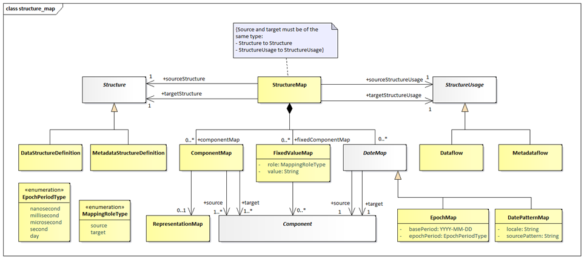 |
| Figure 37: Relationship Class diagram of the Structure Map |

### 9.1.2 Explanation of the Diagram

#### 9.1.2.1 Narrative

The `StructureMap` is a *`MaintainableArtefact`*. The `StructureMap` can either map a source and target `DataStructureDefinition` or a source and target `Dataflow`, it cannot mix source and target types. The `StructureMap` contains zero or more `ComponentMap`s. Each `ComponentMap` maps one or more *`Component`s* from the source `DataStructureDefinition` to one or more *`Component`s* in the target `DataStructureDefinition`[^5]. In addition, the `StructureMap` contains zero or more `FixedValueMap`s. In this case, one or more *`Component`s*, from the source or target `DataStructureDefinition`, map to a fixed value.

The rules pertaining to how reported values map, are maintained in either a `RepresentationMap`, `EpochMap`, or `DatePatternMap`. A `ComponentMap` can only reference one of these mapping types to define how the reported values relate from source *`Dataset`* to the target *`Dataset`*. If a `ComponentMap` has more than 1 source or target, a `RepresentationMap` must be used to describe how the values map, as it is the only map which can define multiple source and target values in combination.

If the `ComponentMap` does not reference any map type to describe how the values map in a *`Dataset`*, then the values from the source *`Dataset`* are copied to the target *`Dataset`* verbatim, with no mapping rules being applied.

A `RepresentationMap` is a separate `Maintainable` structure. `EpochMap` and `DatePatternMap` are maintained in the same `StructureMap` and are referenced locally from the `ComponentMap`. `EpochMap` and `DatePatternMap` are maintained outside of the `ComponentMap` and can therefore be reused by multiple `ComponentMap`s.

### 9.1.3 Class Diagram – Epoch Mapping and Date Pattern Mapping

|  |
|:---:|
| 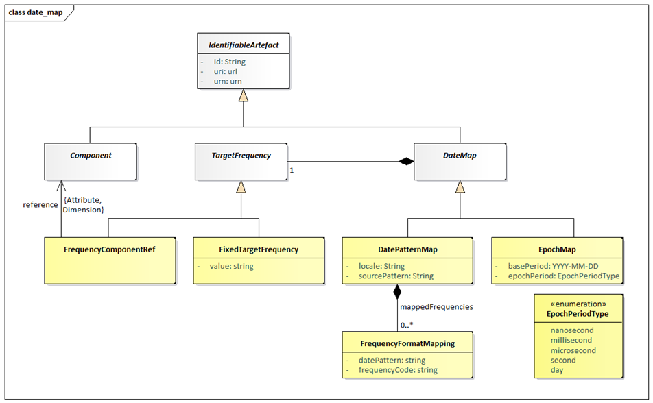 |
| Figure 38: Relationship Class diagram of the EpochMap and DatePatternMap |

### 9.1.4 Explanation of the Diagram

#### 9.1.4.1 Narrative

The `EpochMap` and `DatePatternMap` are both *`IdentifiableArtefact`*. An `EpochMap` and `DatePatternMap` both provide the ability to map source to target date formats. The `EpochMap` describes the source date as the number of epochs since a point in time, where the duration of each epoch is defined, e.g., number of milliseconds since 1970. The `DatePatternMap` describes the source date as a pattern for example `MM-YYYY`, accompanied by the appropriate locale.

Both mappings describe the target date as a frequency Identifier. The frequency identifier is given either a fixed value, e.g., ‘A’ or a reference to a `Dimension` or `Attribute` in the target `DataStructureDefinition` of the `StructureMap`, e.g. ‘FREQ’. In the latter case, the frequency id is derived at run time when the output series and observations are generated. Dates mapped using the frequency lookup can therefore be mapped using different frequencies depending on the series or observation being converted.

If the Frequency Identifier aligns with standard SDMX frequencies the output date format can be derived using standard SDMX date formatting (e.g., `A`=`YYYY`, `Q`=`YYYY-Qn`). If the SDMX standard formatting is not desired or if the frequency Id is not a standard SDMX frequency `Code`, the `FrequencyFormatMapping` can be used to describe the relationship between the frequency Id and the output date format, e.g., `A01`=`YYYY`.

#### 9.1.4.2 Definitions

| Class | Feature | Description |
| --- | --- | --- |
| `StructureMap` | Inherits from  *`MaintainableArtefact`* | Links a source and target structure where there is a semantic equivalence between the source and the target structures. |
|  | `+sourceStructure` | Association to the source Data Structure. |
|  | `+targetStructure` | Association to the target Data Structure |
|  | `+sourceStructureUsage` | Association to the source Dataflow. |
|  | `+targetStructureUsage` | Association to the target Dataflow. |
| `ComponentMap` | Inherits from  *`AnnotableArtefact`* | Links source and target Component(s) where there is a semantic equivalence between the source and the target Components. |
|  | `+source` | Association to zero or more source Components. |
|  | `+target` | Association to zero or more the target Components. |
|  | `mappingRules` | Reference to either a RepresentationMap, an EpochMap or a DatePatternMap. |
| `FixedValueMap` | Inherits from  *`AnnotableArtefact`* | Links a Component (source or target) to a fixed value. |
|  | `value` | The value that a Component will be fixed in a fixed component map. |
| *`DateMap`* | Inherits from  *`IdentifiableArtefact`* |  |
|  | `freqDimension` | The Dimension or Attribute of the target Data Structure Definition which will hold the frequency information for date conversion. Mutually exclusive with targetFrequencyId. |
|  | `yearStart` | The date of the start of the year, enabling mapping from high frequency to lower frequency formats. |
|  | `resolvePeriod` | Which point in time to resolve to when mapping from low frequency to high frequency periods. |
|  | `mappedFrequencies` | A reference to a map of frequency id to date pattern for output. |
| `EpochMap` | Inherits from  *`DateMap`* |  |
|  | `basePeriod` | Epoch zero starts on this period. |
|  | `targetFrequencyId` | The frequency to convert the input date into. Mutually exclusive with freqDimension. |
|  | `epochPeriod` | Describes the period of time that each epoch represents. |
| `DatePatternMap` | Inherits from  *`DateMap`* | Described a source date based on a string pattern, and how it maps to the target date. |
|  | `locale` | The locale on which the input will be parsed according to the pattern. |
| `DateMapping` |  |  |
|  | `sourcePattern` | Describes the source date using conventions for describing years, months, days, etc. |
|  | `targetFrequencyId` | The frequency to convert the input date into. Mutually exclusive with freqDimension. |
| `FrequencyFormatMapping` | Inherits from  `IdentifiableArtefact` | Describes the relationship between a frequency Id to the what the output date is formatted |
|  | `frequencyId` | The string used to describe the frequency |
|  | `datePattern` | The output date pattern for that frequency |

# 10 RepresentationMap

## 10.1 Scope

A `RepresentationMap` describes a mapping between source value(s) and target value(s) where the values are restricted to those in a `Codelist`, `ValueList` or be of a certain data type, e.g., Integer.

The `RepresentationMap` maps information from one or more sources, where the values for each source are used in combination to derive the output value for one or more targets. Each source value may match a substring of the original data (using `startIndex` and/or `endIndex`) or define a pattern matching rule described by a regular expression. The target value is provided as an absolute string, although it can make use of regular expression groups to carry across values from the source string to the target string without having to explicitly state the value to carry. An example is a regular expression which states ‘match a value starting with AB followed by anything, where the anything is marked a capture group’, the target can state ‘take the anything value and postfix it with AB’ thus enabling the mapping of ABX to XAB and ABY to YAB.

The absence of an output for an input is interpreted as ‘no output value for the given source value(s)’.

### 10.1.1 Class Diagram – Relationship

|   | 
|:---:|
| 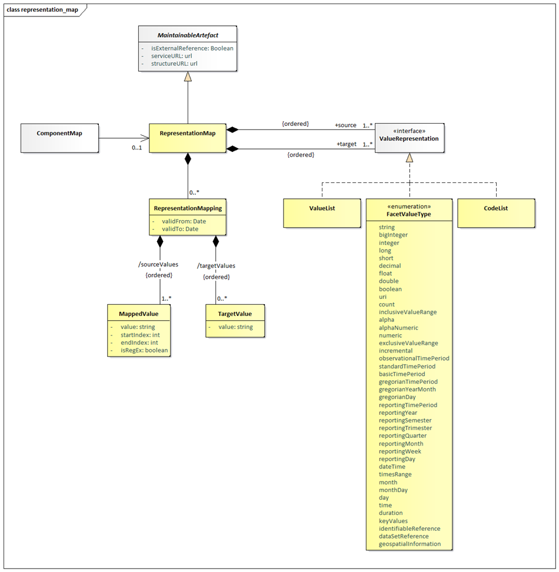 |
| Figure 39: Representation Map |

### 10.1.2 Explanation of the Diagram

#### 10.1.2.1 Narrative

The `RepresentationMap` is a *`MaintainableArtefact`*. It maps one or more source values to one or more target values, where values that are being mapped are defined by the *`ValueRepresentation`*. A *`ValueRepresentation`* is an abstract container which is either a `Codelist`, `ValueList` or a `FacetValueType`. Source and target values are in a list where the list order is important as the `RepresentationMapping` `sourceValues` and `targetValues` must match the order. It is permissible to mix types for both source and target values, allowing for example a `Codelist` to map to an Integer (which is a `FacetValueType`). The list of source or targets can also be mixed, for example a `Codelist` in conjunction with a `FacetValueType` and `ValueList` and can be defined as the source of a mapping, thus allowing rules such as ‘When CL\_AREA=UK AND AGE=26 CURRENCY=$’.

#### 10.1.2.2 Definitions

| Class | Feature | Description |
| --- | --- | --- |
| `RepresentationMap` | Inherits from  *`MaintainableArtefact`* | Links source and target representations, whose values may conform to a linked `Codelist`, `ValueList` or enumerated type such as Integer. |
|  | `source` | Association to one or more `Codelist`, `ValueList`, or `FacetValue` – mixed types are permissible |
|  | `target` | Association to one or more `Codelist`, `ValueList`, or `FacetValue` – mixed types are permissible |
| `RepresentationMapping` | Inherits from  *`AnnotableArtefact`* | Describes how the source value(s) map to the target value(s) |
|  | `validFrom` | Optional period describing when the mapping is applicable |
|  | `validTo` | Optional period describing which the mapping is no longer applicable. |
|  | `sourceValues` | Input value for source in the `RepresentationMap` |
|  | `targetValues` | Output value for each mapped target in the `RepresentationMap` |
| `MappedValue` |  | Describes an input value that is part of the `sourceValues` in a `RepresentationMapping` |
|  | `value` | The value to compare the source data with |
|  | `isRegEx` | If true, the value field should be treated as a regular expression when comparing with the source data |
|  | `startIndex` | If provided, a substring of the source data should be taken, starting from this index (starting at zero) before comparing with the *value* field for matching |
|  | `endIndex` | If provided, a substring of the source data should be taken, ending at this index (starting at zero) before comparing with the *value* field for matching |
| `TargetValue` |  | Describes the target value that is part of the `targetValues` of a `RepresentationMapping` |
|  | `value` | Represents a value for the `targetValues` of a `RepresenationMapping` |

# 11 `ItemSchemeMap`

## 11.1 Scope

An *`ItemSchemeMap`* is an abstract container to describe mapping rules between any item scheme, with the exception of `Codelist`s and `ValueList`s which are mapped using the `RepresentationMap`. A single source *`ItemScheme`* is mapped to a single target *`ItemScheme`*. The *`ItemSchemeMap`* then contains the rules for how the values from the source *`ItemScheme`* map to the values in the target *`ItemScheme`*. Each source value may match a substring of the original data (using `startIndex` and/or `endIndex`) or define a pattern matching rule described by a regular expression. The target value is provided as an absolute string, although it can make use of regular expression groups to carry across values from the source string to the target string without having to explicitly state the value to carry. An example is a regular expression which states ‘match a value starting with AB followed by anything, where the *anything* is marked a capture group’, the target can state ‘take the *anything* value and postfix it with AB’ thus enabling the mapping of ABX to XAB and ABY to YAB.

The absence of an output for an input is interpreted as ‘no output value for the given source value(s)’.

|   | 
|:---:|
| 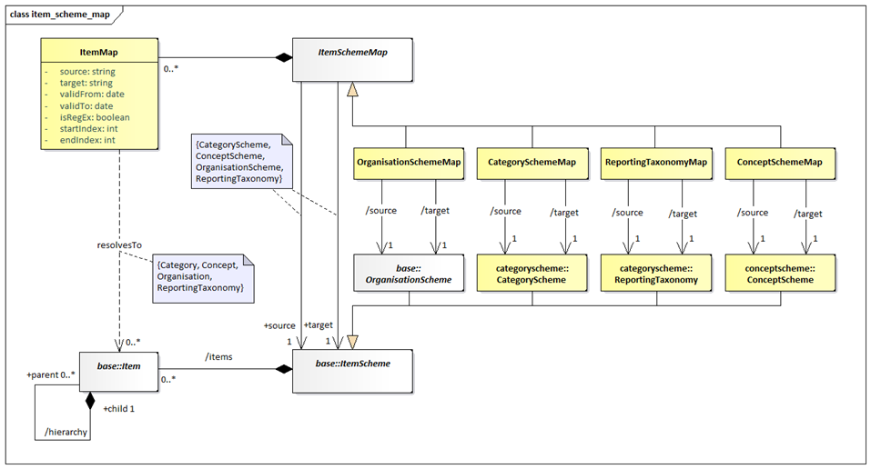 |
| Figure 40: Item Scheme Map |

### 11.1.1 Explanation of the Diagram

#### 11.1.1.1 Narrative

An *`ItemSchemeMap`* is an abstract type which inherits from *`MaintainableArtefact`*. It is subclassed by the 4 concrete classes:

* `OrganisationSchemeMap`
* `ConceptSchemeMap`
* `CategorySchemeMap`
* `ReportingTaxonomyMap`

An `OrganisationSchemeMap` maps a source `AgencyScheme`, `DataProviderScheme`, `DataConsumerScheme` or `OrganisationUnitScheme` to a target `AgencyScheme`, `DataProviderScheme`, `DataConsumerScheme` or `OrganisationUnitScheme`. It is permissible to mix source and target types to define an equivalence between *`Organisation`s* of different roles. The mapped items refer to the *`Organisation`s* in the source/target schemes.

A `ConceptSchemeMap` maps a source `ConceptScheme` to a target `ConceptScheme`. The mapped items refer to the `Concept`s in the source/target schemes.

A `CategorySchemeMap` maps a source `CategoryScheme` to a target `CategoryScheme`. The mapped items refer to the `Category`s in the source/target schemes.

A `ReportingTaxonomyMap` maps a source `ReportingTaxonomy` to a target `ReportingTaxonomy`. The mapped items refer to the `ReportingCategory`s in the source/target schemes.

#### 11.1.1.2 Definitions

| Class | Feature | Description |
| --- | --- | --- |
| *`ItemSchemeMap`* | Inherits from  *`MaintainableArtefact`* | Links source and target *`ItemScheme`s* |
|  | `+source` | Association to a source *`ItemScheme`* |
|  | `+target` | Association to a target *`ItemScheme`* |
| `ItemMap` | Inherits from  *`AnnotableArtefact`* | Describes how the source value maps to the target value |
|  | `validFrom` | Optional period describing when the mapping is applicable |
|  | `validTo` | Optional period describing which the mapping is no longer applicable. |
|  | `sourceValue` | Input value for source |
|  | `targetValue` | Output value for each mapped target |
|  | `isRegEx` | If true, the `sourceValue` field should be treated as a regular expression when comparing with the source data |
|  | `startIndex` | If provided, a substring of the source data should be taken, starting from this index (starting at zero) before comparing with the *value* field for matching |
|  | `endIndex` | If provided, a substring of the source data should be taken, ending at this index (starting at zero) before comparing with the *value* field for matching |
| `OrganisationSchemeMap` | Inherits from  *`ItemSchemeMap`* | Concrete Maintainable subtype of `ItemScheme`Map |
| `ConceptSchemeMap` | Inherits from  *`ItemSchemeMap`* | Concrete Maintainable subtype of `ItemScheme`Map |
| `CategorySchemeMap` | Inherits from  *`ItemSchemeMap`* | Concrete Maintainable subtype of `ItemScheme`Map |
| `ReportingTaxonomyMap` | Inherits from  *`ItemSchemeMap`* | Concrete Maintainable subtype of `ItemScheme`Map |

# 12 Constraints

## 12.1 Scope

The scope of this section is to describe the support in the metamodel for specifying both the access to and the content of a data source. The information may be stored in a resource such as a registry for use by applications wishing to locate data and metadata which are available via the Internet. The *`Constraint`* is also used to specify a subset of a `Codelist` which may be used as a partial `Codelist`, relevant in the context of the artefact to which the *`Constraint`* is attached e.g., `DataStructureDefinition`, `Dataflow`, `ProvisionAgreement`, `MetadataStructureDefinition`, `Metadataflow`, `MetadataProvisionAgreement`.

Note that in this metamodel the term data provider refers to both data and metadata providers.

The `Dataflow` and `Metadataflow`, themselves may be specified as containing only a subset of all the possible keys that could be derived from a `DataStructureDefinition` or `MetadataStructureDefinition`. Respectively, further subsets may be defined within a `ProvisionAgreement` and `MetadataProvisionAgreement`.

These specifications are called *`Constraint`* in this model.

## 12.2 Inheritance

### 12.2.1 Class Diagram of Constrainable Artefacts - Inheritance

|   |
|:---:|
| 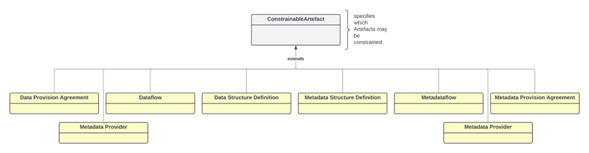 |
| Figure 41: Inheritance class diagram of constrainable and provisioning artefacts |

### 12.2.2 Explanation of the Diagram

#### 12.2.2.1 Narrative

Any artefact that inherits from the *`ConstrainableArtefact`* interface can have constraints defined. The artefacts that can have constraint metadata attached are:
<ul>

`Dataflow`

`ProvisionAgreement`

`DataProvider`

`DataStructureDefinition`

`Metadataflow`

`MetaDataProvider`

`MetadataProvisionAgreement`

`MetadataStructureDefinition`
</ul>

Note that, because the *`Constraint`* can specify a subset of the component values implied by a specific *`Structure`* (such as a specific `DataStructureDefinition` or specific `MetadataStructureDefinition`), the *`ConstrainableArtefact`s* must be associated with a specific *`Structure`*. Therefore, whilst the *`Constraint`* itself may not be linked directly to a `DataStructureDefinition` or `MetadataStructureDefinition`, the artefact that it is constraining will be linked to a `DataStructureDefinition` or `MetadataStructureDefinition`. A `DataProvider` and `MetadataProvider` indirectly reference DSDs and MSDs through their associated Data and Metadata Provision Agreements as such these *`Constraints`* are restricted to Cube Regions and are applicable only to the DSDs / MSDs which contain the Components being restricted.

## 12.3 Constraints

### 12.3.1 Relationship Class Diagram – high level view

|   | 
|:---:|
| 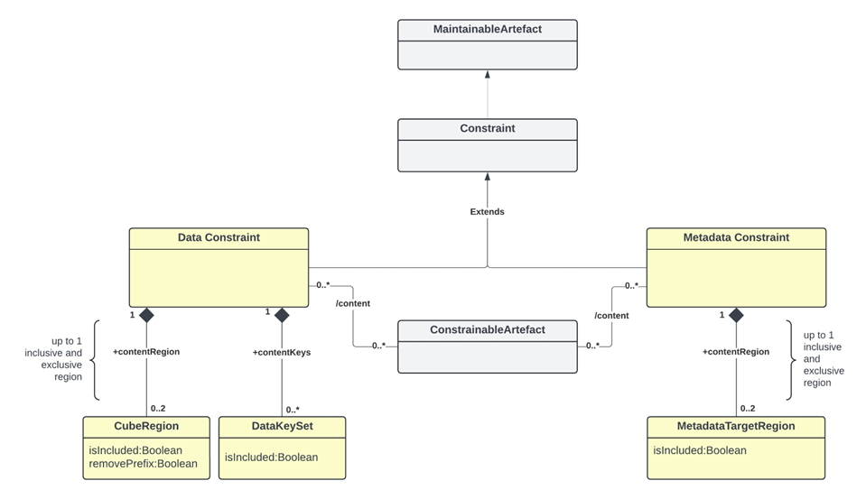 |
| Figure 42: Relationship class diagram showing constraint metadata |

### 12.3.2 Explanation of the Diagram

#### 12.3.2.1 Narrative

The constraint mechanism allows specific constraints to be attached to a *`ConstrainableArtefact`*. These constraints specify a subset of the total set of values or keys that may be present in any of the *`ConstrainableArtefact`s*.

For instance, a `DataStructureDefinition` specifies, for each `Dimension`, the list of allowable code values. However, a specific `Dataflow` that uses the `DataStructureDefinition` may contain only a subset of the possible range of keys that is theoretically possible from the `DataStructureDefinition` definition (the total range of possibilities is sometimes called the Cartesian product of the dimension values). In addition to this, a `DataProvider` that is capable of supplying data according to the `Dataflow` has a `ProvisionAgreement`, and the `DataProvider` may also wish to supply constraint information which may further constrain the range of possibilities in order to describe the data that the provider can supply. It may also be useful to describe the content of a data source in terms of the `KeySet`s or `CubeRegion`s contained within it.

A *`ConstrainableArtefact`* can have two types of *`Constraint`s*:

1. `DataConstraint` – is used as a mechanism to specify the set of keys (`DataKeySet`), or set of component values (`CubeRegion`) that can be reported against the target *`ConstrainableArtefact`*. Multiple such `DataConstraint`s may be present for a *`ConstrainableArtefact`*.

2. `MetadataConstraint` – is used as a mechanism to specify a set of component values (`MetadatTargetRegion`) that can be reported against the target *`ConstrainableArtefact`*. Multiple such `MetadataConstraint`s may be present for a *`ConstrainableArtefact`*.

Note also that another possible type of a *`Constraint`* is available; that is a `AvailableDataConstraint`, this is used to report the data that exists in a data source. An `AvailableDataConstraint` is not a *`MaintainableArtefact`* as it is generated dynamically based on the query. An `AvailableDataConstraint` contains only 1 `CubeRegion` which is used to specify the valid values per `Dimension` of the DSD that is is attached to.

### 12.3.3 Relationship Class Diagram – Detail

|   |
|:---:|
| 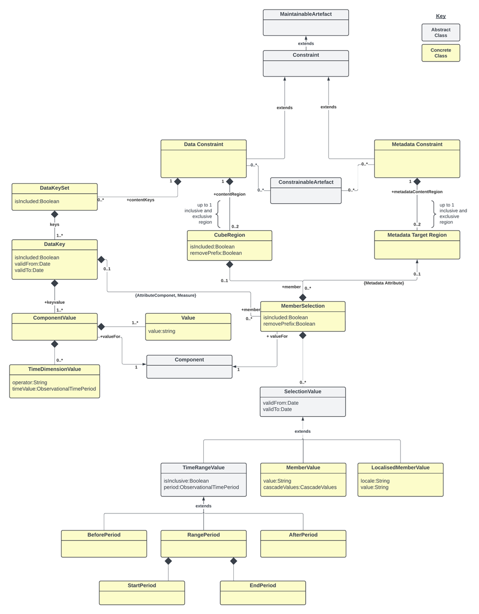 |
| Figure 43: Constraints – Key Set, Cube Region and Metadata Target Region |

#### 12.3.3.1 Explanation of the Diagram

A *`Constraint`* is a *`MaintainableArtefact`*.

A `DataConstraint` has a choice of two ways of specifying value subsets:

1. As a set of keys that can be present in the *`DataSet`* (`DataKeySet`). Each `DataKey` specifies a number of `ComponentValue`s each of which reference a *`Component`* (e.g., `Dimension`, `DataAttribute`). Each `ComponentValue` is a value that may be present for a *`Component`* of a structure when contained in a *`DataSet`*. In addition, each `DataKeySet` may also include `MemberSelection`s for `DataAttribute` or `Measure` components.

2. As a `CubeRegion` whose `MemberSelection`s `SelectionValues` define a subset of allowed/disallowed values for a *`Component`* when contained in a *`DataSet`*/*`MetadataSet`*. A `DataConstraint` is restricted to a maximum of 2 `CubeRegion`s, one to define included (allowable) content, and the other to define disallowed content (`isIncluded`=`false`).

The difference between (1) and (2) above is that :

1. Defines a combination of `Dimension` values, which are assessed in combination to reference one or more `Series` in a *`Dataset`*. This combination of values can be used to explicitly include or exclude the `Series` from being reported (via the `isIncluded` property). In addition, once a set of `Series` are targeted by a `DataKey` restrictions can be applied to `DataAttribute` and `Measure` values by defining subsets of values that are either allowed or disallowed. The `DataKeySet` targets its rules to specific `Series`.
2. Defines a subset of values that are allowed for a *`Component`*. Each `CubeRegion` `MemberSelection` defines a single *`Component`* to define a set of allowed or disallowed values, the `MemberSelection`s are processed indepently of each other. The `CubeRegion` supplies global rules, not series specific rules.

A `MetadataConstraint` has only one way of specifying value subsets:

1. As a set of `MetadataTargetRegion`s each of which defines a “slice” of the total structure (`MemberSelection`) in terms of one or more `MemberValue`s that may be present for a *`Component`* of a structure when contained in a `MetadataSet`.

In both `CubeRegion` and `MetadataTargetRegion`, the value in `ComponentValue`.`value` and `MemberValue`.`value` must be consistent with the *`Representation`* declared for the *`Component`* in the `DataStructureDefinition` (`Dimension` or `DataAttribute`) or `MetadataStructureDefinition` (`MetadataAttribute`). Note that in all cases the "operator" on the `value` is deemed to be "equals", unless the wildcard character is used '%'. In the latter case the "operation" is a partial matching, where the percentage character ('%') may match zero or more characters. Furthermore, it is possible in a `MemberValue` to specify that child values (e.g., child codes) are included in the *`Constraint`* by means of the `cascadeValues` attribute. The latter may take the following values:

* "`true`": all children are included,
* "`false`" (default), or
* "`excludeRoot`", where all children are included, and the root `Code` is excluded (i.e. the referenced `Code`).

It is possible to define for the `DataKeySet`, `DataKey`, `CubeRegion`, `MetadataTargetRegion` and `MemberSelection` whether the set is `included` (`isIncluded` = "`true`", default) or excluded (`isIncluded` = "`false`") from the *`Constraint`* definition. This attribute is useful if, for example, only a small sub-set of the possible values are not included in the set, then this smaller sub-set can be defined and excluded from the constraint. Note that if the child construct is “included” and the parent construct is “excluded” then the child construct is included in the list of constructs that are “excluded”.

In any `MemberSelection` that the corresponding *`Component`* was using `Codelist` with extensions, it is possible to remove the prefix that has been used, in order to refer to the original `Code`s. This is achieved via property `removePrefix`, which defaults to "`false`".

In `DataKey`s and `MemberValue`s it is possible, via the `validFrom` and `validTo` properties, to set a validity period for which the selected key or value is constrained.

#### 13.3.3.2 Definitions

| Class | Feature | Description |
| --- | --- | --- |
| *`ConstrainableArtefact`* | Abstract Class  Sub classes are:  `Dataflow`  `DataProvider`  `DataStructureDefinition`  `Metadataflow`  `MetadataProvisionAgreement`  `MetadataSet`  `MetadataStructureDefinition`  `ProvisionAgreement`  *`QueryDatasource`*  `SimpleDatasource` | An artefact that can have Constraints specified. |
|  | `content` | Associates the metadata that constrains the content to be found in a data or metadata source linked to the Constrainable Artefact. |
| *`Constraint`* | Inherits from  *`MaintainableArtefact`*  Abstract class  Sub classes are:  `DataConstraint`  `MetadataConstraint` | Specifies a subset of the definition of the allowable or actual content of a data or metadata source that can be derived from the Structure that defines code lists and other valid content. |
|  | `+dataContentKeys` | Association to a subset of Data Key Sets (i.e., value combinations) that can be derived from the definition of the structure to which the Constrainable Artefact is linked. |
|  | `+dataContentRegion` | Association to a subset of component values that can be derived from the Data Structure Definition to which the Constrainable Artefact is linked. |
|  | `+metadataContentRegion` | Association to a subset of component values that can be derived from the Metadata Structure Definition to which the Constrainable Artefact is linked. |
|  | `role` | Association to the role that the Constraint plays |
| `DataConstraint` | Inherits from  *`Constraint`* | Defines a Constraint in terms of the content that can be found in data sources linked to the Constrainable Artefact to which this constraint is associated. |
| `ConstraintRoleType` |  | Specifies the way the type of content of a Constraint in terms of its purpose. |
|  | `allowableContent` | The Constraint contains a specification of the valid subset of the Component values or keys. |
|  | `actualContent` | The Constraint contains a specification of the actual content of a data or metadata source in terms of the Component values or keys in the source. |
| `MetadataConstraint` | Inherits from  *`Constraint`* | Defines a Constraint in terms of the content that can be found in metadata sources linked to the Constrainable Artefact to which this constraint is associated. |
| `DataKeySet` |  | A set of data keys. |
|  | `isIncluded` | Indicates whether the Data Key Set is included in the constraint definition or excluded from the constraint definition. |
|  | `+keys` | Association to the Data Keys in the set. |
|  | `+member` | Association to the selection of a value subset for Attributes and Measures. |
| `DataKey` |  | The values of a key in a data set. |
|  | `isIncluded` | Indicates whether the Data Key is included in the constraint definition or excluded from the constraint definition. |
|  | `+keyValue` | Associates the Component Values that comprise the key. |
|  | `validFrom` | Date from which the Data Key is valid. |
|  | `validTo` | Date from which the Data Key is superseded. |
| `ComponentValue` |  | The identification and value of a Component of the key (e.g., Dimension) |
|  | `value` | The value of Component |
|  | `+valueFor` | Association to the Component (e.g., Dimension) in the Structure to which the Constrainable Artefact is linked. |
| `TimeDimensionValue` |  | The value of the Time Dimension component. |
|  | `timeValue` | The value of the time period. |
|  | `operator` | Indicates whether the specified value represents and exact time or time period, or whether the value should be handled as a range.  A value of greaterThan or greaterThanOrEqual indicates that the value is the beginning of a range (exclusive or inclusive, respectively).  A value of lessThan or lessThanOrEqual indicates that the value is the end or a range (exclusive or inclusive, respectively).  In the absence of the opposite bound being specified for the range, this bound is to be treated as infinite (e.g., any time period after the beginning of the provided time period for greaterThanOrEqual) |
| `CubeRegion` |  | A set of Components and their values that defines a subset or “slice” of the total range of possible content of a data structure to which the Constrainable Artefact is linked. |
|  | `isIncluded` | Indicates whether the Cube Region is included in the constraint definition or excluded from the constraint definition. |
|  | `+member` | Associates the set of Components that define the subset of values. |
| `MetadataTargetRegion` |  | A set of Components and their values that defines a subset or “slice” of the total range of possible content of a metadata structure to which the Constrainable Artefact is linked. |
|  | `isIncluded` | Indicates whether the Metadata Target Region is included in the constraint definition or excluded from the constraint definition. |
|  | `+member` | Associates the set of Components that define the subset of values. |
| `MemberSelection` |  | A set of permissible values for one component of the axis. |
|  | `isIncluded` | Indicates whether the Member Selection is included in the constraint definition or excluded from the constraint definition. |
|  | `removePrefix` | Indicates whether the Codes should keep or not the prefix, as defined in the extension of `Codelist`. |
|  | `+valuesFor` | Association to the Component in the Structure to which the Constrainable Artefact is linked, which defines the valid Representation for the Member Values. |
| *`SelectionValue`* | Abstract class.  Sub classes are:  `MemberValue`  *`TimeRangeValue`*  `LocalisedMemberValue` | A collection of values for the Member Selections that, combined with other Member Selections, comprise the value content of the Cube Region. |
|  | `validFrom` | Date from which the Selection Value is valid. |
|  | `validTo` | Date from which the Selection Value is superseded. |
| `MemberValue` | Inherits from  *`SelectionValue`* | A single value of the set of values for the Member Selection. |
|  | `value` | A value of the member. |
|  | `cascadeValues` | Indicates that the child nodes of the member are included in the Member Selection (e.g., child codes) |
| `LocalisedMemberValue` | Inherits from  *`SelectionValue`* | A single localised value of the set of values for a Member Selection. |
|  | `value` | A value of the member. |
|  | `locale` | The locale that the values must adhere to in the dataset. |
| *`TimeRangeValue`* | Inherits from  *`SelectionValue`*  Abstract Class  Concrete Classes:  `BeforePeriod`  `AfterPeriod`  `RangePeriod` | A time value or values that specifies the date or dates for which the constrained selection is valid. |
| `BeforePeriod` | Inherits from  *`TimeRangeValue`* | The period before which the constrained selection is valid. |
|  | `isInclusive` | Indication of whether the date is inclusive in the period. |
|  | `period` | The time period which acts as the latest possible reported period |
| `AfterPeriod` | Inherits from  *`TimeRangeValue`* | The period after which the constrained selection is valid. |
|  | `isInclusive` | Indication of whether the date is inclusive in the period. |
|  | `period` | The time period which acts as the earliest possible reported period |
| `RangePeriod` |  | The start and end periods in a date range. |
|  | `+start` | Association to the Start Period. |
|  | `+end` | Association to the End Period. |
| `StartPeriod` | Inherits from  *`TimeRangeValue`* | The period from which the constrained selection is valid. |
|  | `isInclusive` | Indication of whether the date is inclusive in the period. |
|  | `period` | The time period which acts as the start of the range |
| `EndPeriod` | Inherits from  *`TimeRangeValue`* | The period to which the constrained selection is valid. |
|  | `isInclusive` | Indication of whether the date is inclusive in the period. |
|  | `period` | The time period which acts as the end of the range |

# 13 Data Provisioning

## 13.1 Class Diagram

|   |
|:---:|
| 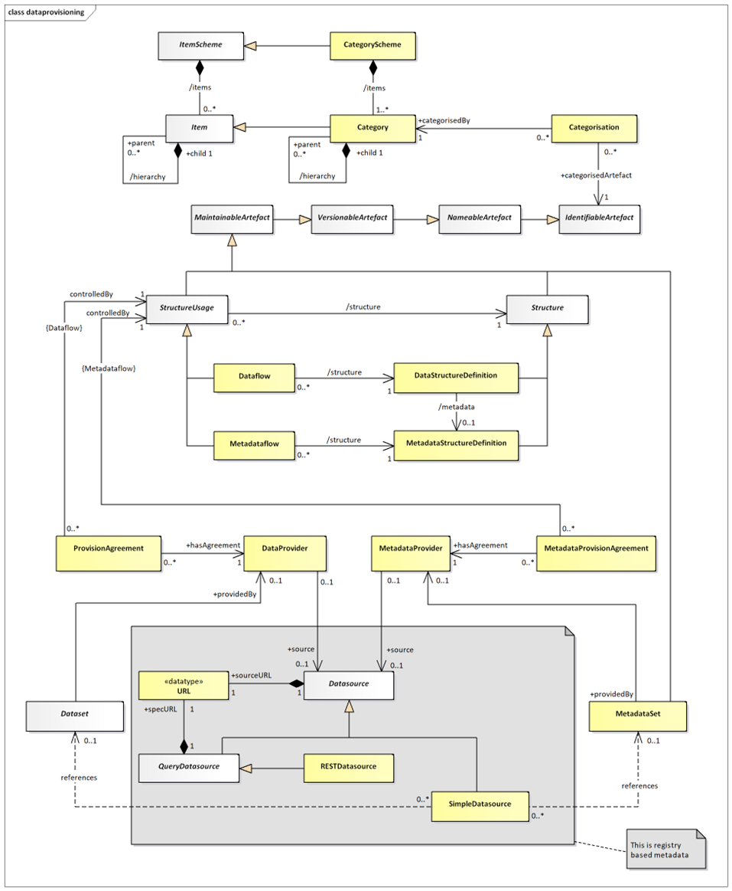 |
| Figure 44: Relationship and inheritance class diagram of data/metadata provisioning |

## 13.2 Explanation of the Diagram

### 13.2.1 Narrative

This sub model links many artefacts in the SDMX-IM and is pivotal to an SDMX metadata registry, as all of the artefacts in this sub model must be accessible to an application that is responsible for data and metadata registration or for an application that requires access to the data or metadata.

Whilst a registry contains all of the metadata depicted on the diagram above, the classes in the grey shaded area are specific to a registry-based scenario where data sources (either physical data and metadata sets or databases and metadata repositories) are registered. More details on how these classes are used in a registry scenario can be found in the SDMX Registry Interface document. (Section 5 of the SDMX Standards).

A `ProvisionAgreement` / `MetadataProvisionAgreement` links the artefact that defines how data / metadata are structured and classified (*`StructureUsage`*) to the `DataProvider` / `MetadataProvider`. By means of a data registration, it references the *`Datasource`* (data only), whether this be an SDMX conformant file on a website (`SimpleDatasource`) or a database service capable of supporting an SDMX query and responding with an SDMX conformant document (*`QueryDatasource`*).

The *`StructureUsage`*, which has concrete classes of `Dataflow` and `Metadataflow` identifies the corresponding `DataStructureDefinition` or `MetadataStructureDefinition`, and, via `Categorisation`, can link to one or more `Category`(s) in a `CategoryScheme` such as a subject matter domain scheme, by which the *`StructureUsage`* can be classified. This can assist in drilling down from subject matter domains to find the data or metadata that may be relevant.

The `SimpleDatasource` links to the actual `DataSet` on a website (this is shown on the diagram as a dependency called “references”). The `sourceURL` is obtained during the registration process of the `DataSet`. Additional information about the content of the `SimpleDatasource` is stored in the registry in terms of a *`Constraint`* (see [12.3](#123-constraints)) for the `Registration`.

The *`QueryDatasource`* is an abstract class that represents a data source, which can understand an SDMX RESTful query (`RESTDatasource`) and respond appropriately. Each of these different *`Datasource`s* inherit the `dataURL` from *`Datasource`*, and the *`QueryDatasource`* has an additional URL, the `specURL`, to locate the specification of the service (i.e., the open API specification for `RESTDatasource`), which describes how to access it. All other supported protocols are assumed to use the `SimpleDatasource` URL.

The diagram below shows in schematic way the essential navigation through the SDMX structural artefacts that eventually link to a data or metadata registration[^6].

|   | 
|:---:|
| 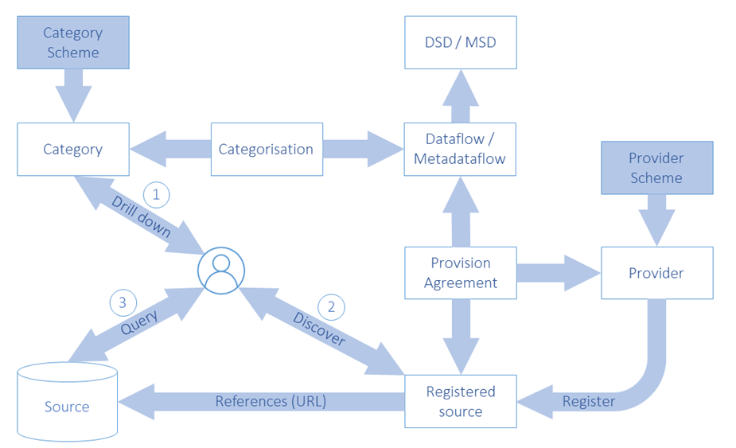 |
| Figure 45: Schematic of the linking of structural metadata to data and metadata registration |

### 13.2.2 Definitions

| Class | Feature | Description |
| --- | --- | --- |
| *`StructureUsage`* | Abstract class:  Sub classes are:  `Dataflow`  `Metadataflow` | This is described in the Base. |
|  | `controlledBy` | Association to the Provision Agreements that comprise the metadata related to the provision of data. |
| `DataProvider` |  | See Organisation Scheme. |
|  | `hasAgreement` | Association to the Provision Agreements for which the provider supplies data or metadata. |
|  | `+source` | Association to a data source, which can process a data query. |
| `MetadataProvider` |  | See Organisation Scheme. |
|  | `hasAgreement` | Association to the Metadata Provision Agreements for which the provider supplies data or metadata. |
|  | `+source` | Association to a metadata source, which can process a metadata query. |
| `ProvisionAgreement` |  | Links the Data Provider to the relevant Structure Usage (i.e., the Dataflow) for which the provider supplies data. The agreement may constrain the scope of the data that can be provided, by means of a DataConstraint. |
|  | `+source` | Association to a data source, which can process a data query. |
| `MetadataProvisionAgreement` |  | Links the Metadata Provider to the relevant Structure Usage (i.e., the Metadataflow) for which the provider supplies metadata. The agreement may constrain the scope of the metadata that can be provided, by means of a MetadataConstraint. |
|  | `+source` | Association to reference metadata source, which can process a metadata query. |
| *`Datasource`* | Abstract class  Sub classes are:  `SimpleDatasource`   *`QueryDatasource`* | Identification of the location or service from where data or reference metadata can be obtained. |
|  | `+sourceURL` | The URL of the data or reference metadata source (a file or a web service). |
| `SimpleDatasource` |  | An SDMX dataset accessible as a file at a URL. |
| *`QueryDatasource`* | Abstract class  Inherits from:  *`Datasource`*  Sub classes are:  `RESTDatasource` | A data source, which can process a data query. |
| `RESTDatasource` |  | A data source that is accessible via a RESTful web services interface. |
|  | `+specificationURL` | Association to the URL for the specification of the web service. |
| `Registration` |  | This is not detailed here but is shown as the link between the SDMX-IM and the Registry Service API. It denotes a data registration document. |

# 14 Process

## 14.1 Introduction

In any system that processes data and reference metadata the system itself is a series of processes and in each of these processes the data or reference metadata may undergo a series of transitions. This is particularly true of its path from raw data to published data and reference metadata. The process model presented here is a generic model that can capture key information about these stages in both a textual way and also in a more formalised way by linking to specific identifiable objects, and by identifying software components that are used.

## 14.2 Model – Inheritance and Relationship view

### 14.2.1 Class Diagram

|   |
|:---:|
| 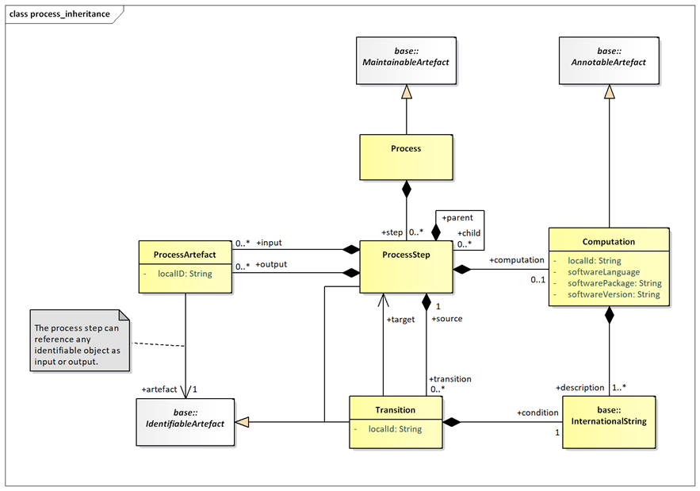 |
| Figure 46: Inheritance and Relationship class diagram of Process and Transitions |

### 14.2.2 Explanation of the Diagram

#### 14.2.2.1 Narrative

The `Process` is a set of hierarchical `ProcessStep`s. Each `ProcessStep` can take zero or more *`IdentifiableArtefact`s* as input and output. Each of the associations to the input and output *`IdentifiableArtefact`s* (`ProcessArtefact`) can be assigned a `localID`.

The computation performed by a `ProcessStep` is optionally described by a `Computation`, which can identify the software used by the `ProcessStep` and can also be described in textual form (`+description`) in multiple language variants. The `Transition` describes the execution of `ProcessStep`s from `+source` `ProcessStep` to `+target` `ProcessStep` based on the outcome of a `+condition` that can be described in multiple language variants.

#### 14.2.2.2 Definitions

| Class | Feature | Description |
| --- | --- | --- |
| `Process` | Inherits from  *`Maintainable`* | A scheme which defines or documents the operations performed on data or metadata in order to validate data or metadata to derive new information according to a given set of rules. |
|  | `+step` | Associates the Process Steps. |
| `ProcessStep` | Inherits from  *`IdentifiableArtefact`* | A specific operation, performed on data or metadata in order to validate or to derive new information according to a given set of rules. |
|  | `+input` | Association to the Process Artefact that identifies the objects which are input to the Process Step. |
|  | `+output` | Association to the Process Artefact that identifies the objects which are output from the Process Step. |
|  | `+child` | Association to child Processes that combine to form a part of this Process. |
|  | `+computation` | Association to one or more Computations. |
|  | `+transition` | Association to one or more Transitions. |
| `Computation` |  | Describes in textual form the computations involved in the process. |
|  | `localId` | Distinguishes between Computations in the same Process. |
|  | `softwarePackage`  `softwareLanguage`  `softwareVersion` | Information about the software that is used to perform the computation. |
|  | `+description` | Text describing or giving additional information about the computation. This can be in multiple language variants. |
| `Transition` | Inherits from  *`IdentifiableArtefact`* | An expression in a textual or formalised way of the transformation of data between two specific operations (Processes) performed on the data. |
|  | `+target` | Associates the Process Step that is the target of the Transition. |
|  | `+condition` | Associates a textual description of the Transition. |
| `ProcessArtefact` |  | Identification of an object that is an input to or an output from a Process Step. |
|  | `+artefact` | Association to an Identifiable Artefact that is the input to or the output from the Process Step. |

# 15 Validation and Transformation Language

## 15.1 Introduction

This SDMX model package supports the definition of Transformations, which are algorithms to calculate new data starting from already existing ones, written using the Validation and Transformation Language (VTL)[^7].

The purpose of this model package is to enable the:

* definition of validation and transformation algorithms by means of VTL, in order to specify how to calculate new SDMX data from existing ones;
* exchange of the definition of VTL algorithms, also together the definition of the data structures of the involved data (for example, exchange the data structures of a reporting framework together with the validation rules to be applied, exchange the input and output data structures of a calculation task together with the VTL transformations describing the calculation algorithms);
* execution of VTL algorithms, either interpreting the VTL transformations or translating them in whatever other computer language is deemed as appropriate;

This model package does not explain the VTL language or any of the content published in the VTL guides. Rather, this is an illustration of the SDMX classes and attributes that allow defining VTL transformations applied to SDMX artefacts.

The SDMX model represented below is consistent with the VTL 2.0 specification. However, the former uses the SDMX terminology and is a model at technical level (from which the SDMX implementation artefacts for defining VTL transformations are built), whereas the latter uses the VTL terminology and is at conceptual level. The guidelines for mapping these terminologies and using the VTL in the SDMX context can be found in a dedicated chapter (“*Validation and Transformation Language*”) of the Section 6 of the SDMX Standards (“*SDMX Technical Notes*”), often referenced below.

## 15.2 Model - Inheritance view

### 15.2.1 Class Diagram

|   | 
|:---:|
| 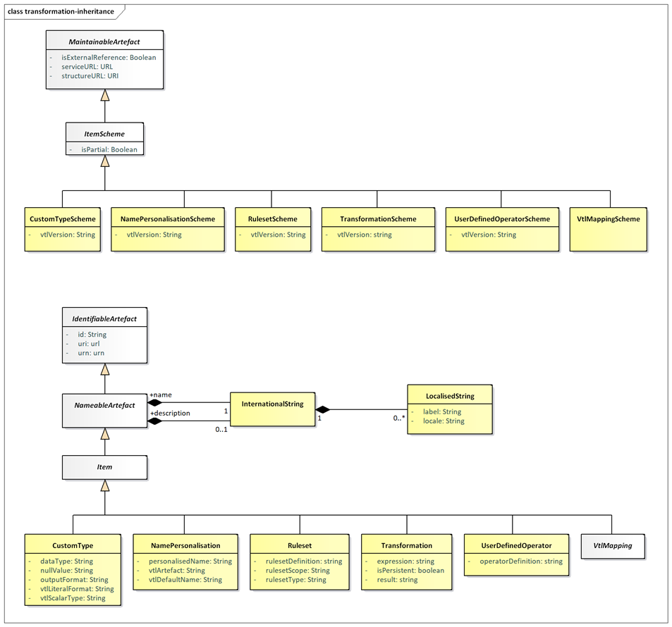 |
| Figure 47: Class inheritance diagram in the Transformations and Expressions Package |

### 15.2.2 Explanation of the Diagram

#### 15.2.2.1 Narrative

The model artefacts `TransformationScheme`, `RulesetScheme`, `UserDefinedOperatorScheme`, `NamePersonalisationScheme`, `CustomTypeScheme`, and `VtlMappingScheme` inherit from *`ItemScheme`*

These schemes inherit from the *`ItemScheme`* and therefore have the following attributes:
<ul>

`id`

`uri`

`urn`

`version`

`validFrom`

`validTo`

`isExternalReference`

`registryURL`

`structureURL`

`repositoryURL`

`isPartial`
</ul>

The model artefacts `Transformation`, `Ruleset`, `UserDefinedOperator`, `NamePersonalisation`, `VtlMapping`, `CustomType` inherit the attributes and associations of *`Item`* which itself inherits from *`NameableArtefact`*. They have the following attributes:
<ul>

`id`

`uri`

`urn`
</ul>

The multi-lingual name and description are provided by the relationship to `InternationalString` from *`NameableArtefact`*.

## 15.3 Model - Relationship View

### 15.3.1 Class Diagram

|   | 
|:---:|
| 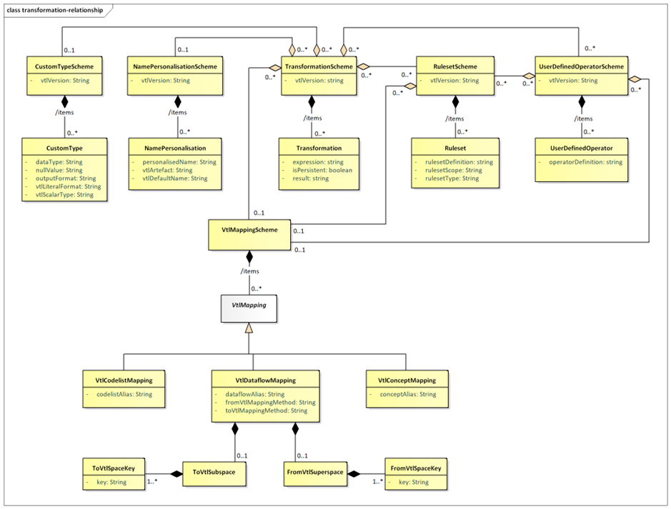 |
| Figure 48: Relationship diagram in the Transformations and Expressions Package |

### 15.3.2 Explanation of the Diagram

#### 15.3.2.1 Narrative - Overview

**Transformation Scheme**

A `TransformationScheme` is a set of `Transformation`s aimed at obtaining some meaningful results for the user (e.g. the validation of one or more Data Sets). This set of `Transformation`s is meant to be executed together (in the same run) and may contain any number of `Transformation`s in order to produce any number of results. Therefore, a `TransformationScheme` can be considered as a VTL program.

The `TransformationScheme` must include the attribute `vtlVersion` expressed as a string (e.g. “2.0”), as the version of the VTL determines which syntax is used in defining the transformations of the scheme.

A `Transformation` consists of a statement which assigns the outcome of the evaluation of a VTL `expression` to a `result` (an artefact of the VTL Information Model, which in the SDMX context can be a persistent or non-persistent `Dataflow`[^8].

For example, assume that D1, D2 and D3 are SDMX `Dataflow`s (called Data Sets in VTL) containing information on some goods, specifically: D3 the current stocks, D1 the stocks of the previous date, D2 the flows in the last period. A possible VTL `Transformation` aimed at checking the consistency between flows and stocks is the following:

Dr := If ( (D1 + D2) = D3, then "true", else "false")

In this Transformation:

|  |  |
| --- | --- |
| `Dr` | is the result (a new dataflow) |
| `:=` | is an assignment operator |
| `If((D1+D2)=D3, then "true", else "false")` | is the expression | 
| `D1`, `D2`, `D3` | are the operands |
| `If`, `( )`, `+`, `=` | are VTL operators | 

The `Transformation` model artefact contains three attributes:

1. `result`
   
   The left-hand side of a VTL statement, which specifies the Artefact to which the outcome of the expression is assigned. An artefact cannot be result of more than one `Transformation`.

2. `isPersistent`
   
   An assignment operator, which specifies also the persistency of the left-hand side. The assignment operators are two, namely ‘:=’ for non-persistent assignment (the result is non-persistent) and ‘<-’ for persistent assignment (the result is persistent).

3. `expression`
   
   The right-hand side of a VTL statement, which is the expression to be evaluated. An `expression` consists in the invocation of VTL operators in a certain order. When an operator is invoked, for each input parameter, an actual argument is passed to the operator, which returns an actual argument for the output parameter. An `expression` is simply a text string written according the VTL grammar.

Because an Artefact can be the `result` of just one `Transformation` and a `Transformation` belongs to just one `TransformationScheme`, it follows also that a derived Artefact (e.g., a new `Dataflow`) is produced in just one `TransformationScheme`.

The `result` of a `Transformation` can be input of other `Transformation`s. The VTL assumes that non-persistent results are maintained only within the same `TransformationScheme` in which they are produced. Therefore, a non-persistent result of a `Transformation` can be the operand of other `Transformation`s of the same `TransformationScheme`, whereas a persistent result can be operand of transformations of any `TransformationScheme`[^9].

The `TransformationScheme` has an association to zero of more `RulesetScheme`, zero or more `UserDefinedOperatorScheme`, zero or one `NamePersonalisationScheme`, zero or one `VtlMappingScheme`, and zero or one `CustomTypeScheme`.

The `RulesetScheme`, `UserDefinedOperatorScheme`, `NamePersonalisationScheme` and `CustomTypeScheme` have the attribute `vtlVersion`. Thus, a `TransformationScheme` using a specific version of VTL can be linked to such schemes only if they are consistent with the same VTL version.

The `VtlMappingScheme` associated to a `TransformationScheme` must contain the mappings between the references to the SDMX artefacts from the `TransformationScheme` and the structured identifiers of these SDMX artefacts.

**Ruleset Scheme**

Some VTL Operators can invoke rulesets, i.e., sets of previously defined rules to be applied by the Operator. Once defined, a `Ruleset` is persistent and can be invoked as many times as needed. The knowledge of the rulesets’ definitions (if any) is essential for understanding the actual behaviour of the `Transformation` that use them: this is achieved through the `RulesetScheme` model artefact. The `RulesetScheme` is the container for one or more `Ruleset`.

The `Ruleset` model artefact contains the following attributes:

1. `rulesetType` – the type of the ruleset according to VTL (VTL 2.0 allows two types: “datapoint” and “hierarchical” ruleset);
2. `rulesetScope` – the VTL artefact on which the ruleset is defined; VTL 2.0 allows rulesets defined on Value Domains, which correspond to SDMX `Codelist`s and rulesets defined on Variables, which correspond to SDMX `Concept`s for which a definite `Representation` is assumed;
3. `rulesetDefinition` – the VTL statement that defines the ruleset according to the syntax of the VTL definition language.

The `RulesetScheme` can have an association with zero or more `VtlMappingScheme`. These mappings define the correspondence between the references to the SDMX artefacts contained in the `rulesetDefinition` and the structured identifiers of these SDMX artefacts.

The rulesets defined on Value Domains reference `Codelist`s. The rulesets defined on Variables reference `Concept`s (for which a definite `Representation` is assumed). In conclusion, in the VTL rulesets there can exist mappings for: `Codelist`s and `Concept`s.

**User Defined Operator Scheme**

The `UserDefinedOperatorScheme` is a container for zero of more `UserDefinedOperator`. The `UserDefinedOperator` is defined using VTL standard operators. This is essential for understanding the actual behaviour of the `Transformation`s that invoke them.

The attribute `operatorDefinition` contains the VTL statement that defines the operator according to the syntax of the VTL definition language.

Although the VTL user defined operators are conceived to be defined on generic operands, so that the specific artefacts to be manipulated are passed as parameters at the invocation, it is also possible that they reference specific SDMX artefacts like `Dataflow`s and `Codelist`s. Therefore, the `UserDefinedOperatorScheme` can link to zero or one `VtlMappingScheme`, which must contain the mappings between the VTL references and the structured URN of the corresponding SDMX artefacts (see also the “*VTL mapping*” section below).

The definition of a `UserDefinedOperator` can also make use of VTL rulesets; therefore, the `UserDefinedOperatorScheme` can link to zero, one or more `RulesetScheme`, which must contain the definition of these `Ruleset`s (see also the “*Ruleset Scheme*” section above).

**Name Personalisation Scheme**

In some operations, the VTL assigns by default some standard names to some measures and/or attributes of the data structure of the result[^10]. The VTL allows also to personalise the names to be assigned. The knowledge of the personalised names (if any) is essential for understanding the actual behaviour of the `Transformation`: this is achieved through the `NamePersonalisationScheme`. A `NamePersonalisation` specifies a personalised name that will be assigned in place of a VTL default name. The `NamePersonalisationScheme` is a container for zero or more `NamePersonalisation`.

**VTL Mapping**

The mappings between SDMX and VTL can be relevant to the names of the artefacts and to the methods for converting the data structures from SDMX to VTL and vice-versa. These features are achieved through the `VtlMappingScheme`, which is a container for zero or more `VtlMapping`.

The VTL assumes that the operands are directly referenced through their actual names (unique identifiers). In the VTL transformations, rulesets, user defined operators, the SDMX artefacts are referenced through VTL aliases. The `alias` can be the complete URN of the artefact, an abbreviated URN, or another user-defined name, as described in the Section 6 of the SDMX Standards.[^11]

The `VTLmapping` defines the correspondence between the VTL alias and the structured identifier of the SDMX artefact, for each referenced SDMX artefact. This correspondence is needed for the following kinds of SDMX artefacts: `Dataflow`s, `Codelist`s and `Concept`s. Therefore, there are the following corresponding mapping subclasses: `VtlDataflowMapping`, `VtlCodelistMapping` and `VtlConceptMapping`.

As for the `Dataflow`s, it is also possible to specify the method to convert the Data Structure of the `Dataflow`. This kind of conversion can happen in two directions, from SDMX to VTL when a SDMX `Dataflow` is accessed by a VTL Transformation (`toVtlMappingMethod`), or from VTL to SDMX when a SDMX derived `Dataflow` is calculated through VTL (`fromVtlMappingMethod`).[^12]

The default mapping method from SDMX to VTL is called “Basic”. Three alternative mapping methods are possible, called “Pivot”, “Basic-A2M”, “Pivot-A2M” (“A2M” stands for “Attributes to Measures”, i.e. the SDMX `DataAttribute`s become VTL measures).

The default mapping method from VTL to SDMX is also called “Basic”, and the two alternative mapping methods are called “Unpivot” and “M2A” (“M2A” stands for “Measures to Attributes”, i.e. some VTL measures become SDMX `DataAttribute`s according to what is declared in the DSD).

In both the mapping directions, no specification is needed if the default mapping method (Basic) is used. When an alternative mapping method is applied for some `Dataflow`, this must be specified in `toVtlMappingMethod` or `fromVtlMappingMethod`.

**ToVtlSubspace, ToVtlSpaceKey, FromVtlSuperspace, FromVtlSpaceKey**

Although in general one SDMX `Dataflow` is mapped to one VTL dataset and vice-versa, it is also allowed to map distinct parts of a single SDMX `Dataflow` to distinct VTL data sets according to the rules and conventions described in the Section 6 of the SDMX Standards.[^13]

In the direction from SDMX to VTL, this is achieved by fixing the values of some predefined Dimensions of the SDMX Data Structure: all the observations having such combination of values are mapped to one corresponding VTL dataset (the Dimensions having fixed values are not maintained in the Data Structure of the resulting VTL dataset). The `ToVtlSubspace` and `ToVtlSpaceKey` classes allow to define these Dimensions. When one SDMX `Dataflow` is mapped to just one VTL dataset these classes are not used.

Analogously, in the direction from VTL to SDMX, it is possible to map more calculated VTL datasets to distinct parts of a single SDMX `Dataflow`, as long as these VTL datasets have the same Data Structure. This can be done by providing, for each VTL dataset, distinct values for some additional SDMX Dimensions that are not part of the VTL data structure. The `FromVtlSuperspace` and `FromVtlSpaceKey` classes allow to define these dimensions. When one VTL dataset is mapped to just one SDMX `Dataflow` these classes are not used.

**Custom Type Scheme**

As already said, a `Transformation` consists of a statement which assigns the outcome of the evaluation of a VTL `expression` to a `result`, i.e. an artefact of the VTL Information Model. which in the SDMX context can be a persistent or non-persistent `Dataflow`[^14]. Therefore, the VTL data type of the outcome of the VTL `expression` has to be converted into the SDMX data type of the resulting `Dataflow`. A default conversion table from VTL to SDMX data types is assumed[^15]. The `CustomTypeScheme` allows to specify custom conversions that override the default conversion table. The `CustomTypeScheme` is a container for zero or more `CustomType`. A `CustomType` specifies the custom conversion from a VTL scalar type that will override the default conversion. The overriding SDMX data type is specified by means of the `dataType` and `outputFormat` attributes (the SDMX data type assumes the role of external representation in respect to VTL[^16].

Moreover, the `CustomType` allows to customize the default format of VTL literals and the (possible) SDMX value to be produced when a VTL measure or attribute is NULL.

VTL `expression` can contain literals, i.e. specific values of a certain VTL data type written according to a certain format. For example, consider the following `Transformation` that extracts from the dataflow D1 the observations for which the “reference\_date” belongs to the years 2018 and 2019:

Dr := D1 [ filter between (reference\_date, 2018-01-01, 2019-12-31)]

In this expression, the two values `2018-01-01` and `2019-12-31` are literals of the VTL "date" scalar type expressed in the format `YYYY-MM-DD`.

The VTL literals are assumed to be written in the same SDMX format specified in the default conversion table mentioned above, for the conversion from VTL to SDMX data types. If a different format is used for a certain VTL scalar type, it must be specified in the `vtlLiteralFormat` attribute of the `CustomType`.

Regarding the management of NULLs, in the conversions between SDMX and VTL, by default a missing value in SDMX in converted in VTL NULL and vice-versa, for any VTL scalar type. If a different value is needed, after the conversion from SDMX to VTL, proper VTL operators can be used for obtaining it. In the conversion from VTL to SDMX the desired value can be declared in the `nullValue` attribute (separately for each VTL basic scalar type).

#### 15.3.2.2 Definitions

| Class | Feature | Description |
| --- | --- | --- |
| `TransformationScheme` | Inherits from  *`ItemScheme`* | Contains the definitions of transformations meant to produce some derived data and be executed together |
|  | `vtlVersion` | The version of the VTL language used for defining transformations |
| `Transformation` | Inherits from  *`Item`* | A VTL statement which assigns the outcome of an expression to a result. |
|  | `result` | The left-hand side of the VTL statement, which identifies the result artefact. |
|  | `isPersistent` | A boolean that indicates whether the result is permanently stored or not, depending on the VTL assignment operator. |
|  | `expression` | The right-hand side of the VTL statement that is the expression to be evaluated, which includes the references to the operands of the Transformation. |
| `RulesetScheme` | Inherits from  *`ItemScheme`* | Container of rulesets. |
|  | `vtlVersion` | The version of the VTL language used for defining the rulesets |
| `Ruleset` | Inherits from  *`Item`* | A persistent set of rules which can be invoked by means of appropriate VTL operators. |
|  | `rulesetDefinition` | A VTL statement for the definition of a ruleset (according to the syntax of the VTL definition language) |
|  | `rulesetType` | The VTL type of the ruleset (e.g., in VTL 2.0, datapoint or hierarchical) |
|  | `rulesetScope` | The model artefact on which the ruleset is defined (e.g., in VTL 2.0, valuedomain or variable) |
| `UserDefinedOperatorScheme` | Inherits from  *`ItemScheme`* | Container of user defined operators |
|  | `vtlVersion` | The version of the VTL language used for defining the user defined operators |
| `UserDefinedOperator` | Inherits from  *`Item`* | Custom VTL operator (not existing in the standard library) that extends the VTL standard library for specific purposes. |
|  | `operatorDefinition` | A VTL statement for the definition of a new operator: it specifies the operator name, its parameters and their data types, the VTL expression that defines its behaviour. |
| `NamePersonalisationScheme` | Inherits from  *`ItemScheme`* | Container of name personalisations. |
|  | `vtlVersion` | The VTL version which the VTL default names to be personalised belong to. |
| `NamePersonalisation` | Inherits from  *`Item`* | Definition of personalised name to be used in place of a VTL default name. |
|  | `vtlArtefact` | VTL model artefact to which the VTL default name to be personalised refers, e.g. variable, value domain. |
|  | `vtlDefaultName` | The VTL default name to be personalised. |
|  | `personalisedName` | The personalised name to be used in place of the VTL default name. |
| `VtlMappingScheme` | Inherits from  *`ItemScheme`* | Container of VTL mappings. |
| `VtlMapping` | Inherits from  *`Item`*  Sub classes are:  `VtlDataflowMapping`   `VtlCodelistMapping`  `VtlConceptMapping` | Single mapping between the reference to a SDMX artefact made from VTL transformations, rulesets, user defined operators and the corresponding SDMX structure identifier. |
| `VtlDataflowMapping` | Inherits from  *`VtlMapping`* | Single mapping between the reference to a SDMX dataflow and the corresponding SDMX structure identifier |
|  | `dataflowAlias` | Alias used in VTL to reference a SDMX dataflow (it can be the URN, the abbreviated URN or a user defined alias). The alias must be univocal: different SDMX artefacts cannot have the same VTL alias. |
|  | `toVtlMappingMethod` | Custom specification of the mapping method from SDMX to VTL data structures for the dataflow (overriding the default “basic” method). |
|  | `fromVtlMappingMethod` | Custom specification of the mapping method from VTL to SDMX data structures for the dataflow (overriding the default “basic” method). |
| `VtlCodelistMapping` | Inherits from  *`VtlMapping`* | Single mapping between the VTL reference to a SDMX `codelist` and the SDMX structure identifier of the codelist. |
|  | `codelistAlias` | Name used in VTL to reference a SDMX codelist. The name/alias must be univocal: different SDMX artefacts cannot have the same VTL alias. |
| `VtlConceptMapping` | Inherits from  *`VtlMapping`* | Single mapping between the VTL reference to a SDMX concept and the SDMX structure identifier of the concept. |
|  | `conceptAlias` | Name used in VTL to reference a SDMX concept. The name/alias must be univocal: different SDMX artefacts cannot have the same VTL alias. |
| `ToVtlSubspace` |  | Subspace of the dimensions of the SDMX dataflow used to identify the parts of the dataflow to be mapped to distinct VTL datasets |
| `ToVtlSpaceKey` |  | A dimension of the SDMX dataflow that contributes to identify the parts of the dataflow to be mapped to distinct VTL datasets. |
|  | `Key` | The identity of the dimension in the data structure definition of the dataflow that contributes to identify the parts of the dataflow to be mapped to distinct VTL datasets |
| `FromVtlSuperspace` |  | Superspace is composed of the dimensions to be added to the data structure of the VTL result dataset in order to obtain the data structure of the derived SDMX dataflow (in case the latter is a superset of distinct VTL datasets calculated independently). |
| `FromVtlSpaceKey` |  | A SDMX dimension to be added to the data structure of the VTL result dataset in order to obtain the data structure of the derived SDMX dataflow |
|  | `Key` | The identity of the dimension to be added to the data structure of the VTL result dataset in order to obtain the data structure of the derived SDMX dataflow. |
| `CustomTypeScheme` | Inherits from  *`ItemScheme`* | Container of custom specifications for VTL basic scalar types. |
|  | `vtlVersion` | The VTL version, which the VTL scalar types belong to. |
| `CustomType` | Inherits from  *Item* | Custom specification for a VTL basic scalar type. |
|  | `vtlScalarType` | VTL scalar type for which the custom specifications are given. |
|  | `outputFormat` | Custom specification of the VTL formatting mask needed to obtain to the desired representation, i.e. the desired SDMX format (e.g. YYYY-MM-DD, see also the VTL formatting mask in the VTL Reference Manual and the SDMX Technical Notes). If not specified, the “Default output format” of the default conversion table from VTL to SDMX is used. [^17] |
|  | `datatype` | Custom specification of the external (SDMX) data type in which the VTL data type must be converted (e.g. the GregorianDay). If not specified, the “Default SDMX data type” of the default conversion table from VTL to SDMX is used. [^18] |
|  | `nullValue` | Custom specification of the SDMX value to be produced for the VTL NULL values, with reference to the vtlScalarType specified above. If no value is specified, no value is produced. |
|  | `vtlLiteralFormat` | Custom specification of the format of the VTL literals belonging to the vtlScalarType used in the VTL program (e.g. YYYY-MM-DD)[^19]. If not specified, the “Default output format” of the default conversion table from VTL to SDMX is assumed.[^20] |

# 16 Appendix 1: A Short Guide to UML in the SDMX Information Model

## 16.1 Scope

The scope of this document is to give a brief overview of the diagram notation used in UML. The examples used in this document have been taken from the SDMX UML model.

## 16.2 Use Cases

In order to develop the data models it is necessary to understand the functions that require to be supported. These are defined in a use case model. The use case model comprises actors and use cases and these are defined below.

The **actor** can be defined as follows:
<ul>

*“An actor defines a coherent set of roles that users of the system can play when interacting with it. An actor instance can be played by either an individual or an external system”*
</ul>

The actor is depicted as a stick man as shown below.

|  |
|:---:|
|  |
| Figure 49 Actor |

The **use case** can be defined as follows:
<ul>

*“A use case defines a set of use-case instances, where each instance is a sequence of actions a system performs that yields an observable result of value to a particular actor”*
</ul>

|  |
|:---:|
|  |
| Figure 50 Use case |

|  |
|:---:|
| 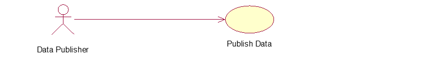 |
| Figure 51 Actor and use case |

|  |
|:---:|
| 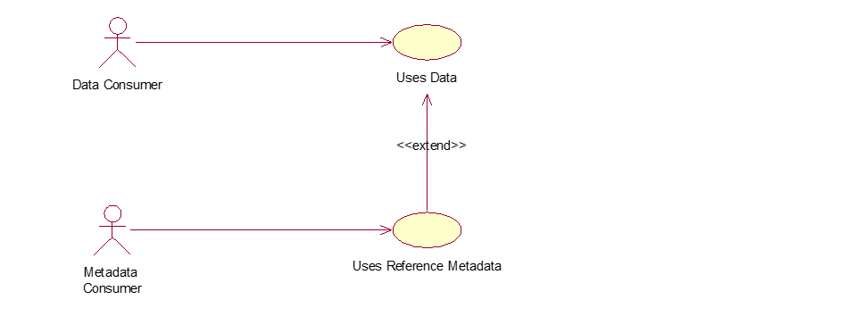 |
| Figure 52 Extend use cases |

An extend use case is where a use case may be optionally extended by a use case that is independent of the using use case. The arrow in the association points to he owning use case of the extension. In the example above the Uses Data use case is optionally extended by the Uses Metadata use case.

## 16.3 Classes and Attributes

### 16.3.1 General

A class is something of interest to the user. The equivalent name in an entity-relationship model (E-R model) is the entity and the attribute. In fact, if the UML is used purely as a means of modelling data, then there is little difference between a class and an entity.

|  |
|:---:|
| 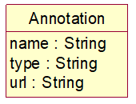 |
| Figure 53 Class and its attributes |

Figure 53 shows that a class is represented by a rectangle split into three compartments. The top compartment is for the class name, the second is for attributes and the last is for operations. Only the first compartment is mandatory. The name of the class is `Annotation`, and it belongs to the package SDMX-Base. It is common to group related artefacts (classes, use-cases, etc.) together in packages. `Annotation` has three “String” attributes – `name`, `type`, and `url`. The full identity of the attribute includes its class e.g. the name attribute is `Annotation`.`name`.

Note that by convention the class names use `UpperCamelCase` – the words are concatenated and the first letter of each word is capitalized. An attribute uses `lowerCamelCase` - the first letter of the first (or only) word is not capitalized, the remaining words have capitalized first letters.

### 16.3.2 Abstract Class

An abstract class is drawn because it is a useful way of grouping classes, and avoids drawing a complex diagram with lots of association lines, but where it is not foreseen that the class serves any other purpose (i.e. it is always implemented as one of its sub classes). In the diagram in this document an abstract class is depicted with its name in italics, and coloured white.

|  |
|:---:|
| 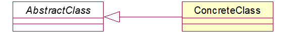 |
| Figure 54 Abstract and concrete classes |

## 16.4 Associations

### 16.4.1 General

In an E-R model these are known as relationships. A UML model can give more meaning to the associations than can be given in an E-R relationship. Furthermore, the UML notation is fixed (i.e. there is no variation in the way associations are drawn). In an E-R diagram, there are many diagramming techniques, and it is the relationship in an E-R diagram that has many forms, depending on the particular E-R notation used.

### 16.4.2 Simple Association

|  |
|:---:|
| 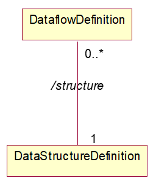 |
| Figure 55 A simple association |

Here the `DataflowDefinition` class has an association with the `DataStructureDefinition` class. The diagram shows that a `DataflowDefinition` can have an association with only one `DataStructureDefinition` (1) and that a `DataStructureDefinition` can be linked to many `DataflowDefinition`s (0..\*). The association is sometimes named to give more semantics.

In UML it is possible to specify a variety of “multiplicity” rules. The most common ones are:
<ul>

Zero or one (0..1)

Zero or many (0..\*)

One or many (1..\*)

Many (\*)

Unspecified (blank)
</ul>

### 16.4.3 Aggregation

|  |
|:---:|
| 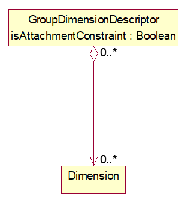 |
| Figure 56: A simple aggregate association |

|  |
|:---:|
| 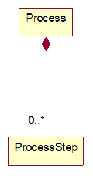 |
| Figure 57 A composition aggregate association |

An association with an aggregation relationship indicates that one class is a subordinate class (or a part) of another class. In an aggregation relationship. There are two types of aggregation, a simple aggregation where the child class instance can outlive its parent class, and a composition aggregation where the child class's instance lifecycle is dependent on the parent class's instance lifecycle. In the simple aggregation it is usual, in the SDMX Information model, for this association to also be a reference to the associated class.

### 16.4.4 Association Names and Association-end (role) Names

It can be useful to name associations as this gives some more semantic meaning to the model i.e. the purpose of the association. It is possible for two classes to be joined by two (or more) associations, and in this case it is extremely useful to name the purpose of the association. Figure 58 shows a simple aggregation between `CategoryScheme` and `Category` called /`items` (this means it is derived from the association between the super classes – in this case between the *`ItemScheme`* and the *`Item`*, and another between `Category` called /`hierarchy`.

|  |
|:---:|
| 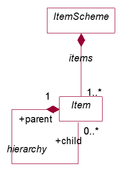 |
| Figure 58 Association names and end names |

Furthermore, it is possible to give role names to the association-ends to give more semantic meaning – such as parent and child in a tree structure association. The role is shown with “+” preceding the role name (e.g. in the diagram above the semantic of the association is that a *`Item`* can have zero or one parent *`Item`s* and zero or many child *`Item`*).

In this model the preference has been to use role names for associations between concrete classes and association names for associations between abstract classes. The reason for using an association name is often useful to show a physical association between two sub classes that inherit the actual association between the super class from which they inherit. This is possible to show in the UML with association names, but not with role names. This is covered later in “Derived Association”.

Note that in general the role name is given at just one end of the association.

### 16.4.5 Navigability

Associations are, in general, navigable in both directions. For a conceptual data model it is not necessary to give any more semantic than this.

However, UML allows a notation to express navigability in one direction only. In this model this “navigability” feature has been used to represent referencing. In other words, the class at the navigable end of the association is referenced from the class at the non-navigable end. This is aligned, in general, with the way this is implemented in the XML schemas.

|  |
|:---:|
| 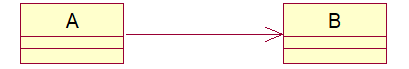 |
| Figure 59 One way association |

Here it is possible to navigate from A to B, but there is no implementation support for navigation from B to A using this association.

### 16.4.6 Inheritance

Sometimes it is useful to group common attributes and associations together in a super class. This is useful if many classes share the same associations with other classes, and have many (but not necessarily all) attributes in common. Inheritance is shown as a triangle at the super class.

|  |
|:---:|
| 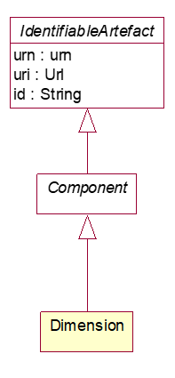 |
| Figure 60 Inheritance |

Here the `Dimension` is derived from *`Component`* which itself is derived from *`IdentifiableArtefact`*. Both *`Component`* and *`IdentifiableArtefact`* are abstract superclasses. The `Dimension` inherits the attributes and associations of all of the super classes in the inheritance tree. Note that a super class can be a concrete class (i.e. it exists in its own right as well as in the context of one of its sub classes), or an abstract class.

### 16.4.7 Derived association

It is often useful in a relationship diagram to show associations between sub classes that are derived from the associations of the super classes from which the sub classes inherit. A derived association is shown by `/` preceding the association name e.g. *`/name`*.

|  |
|:---:|
| 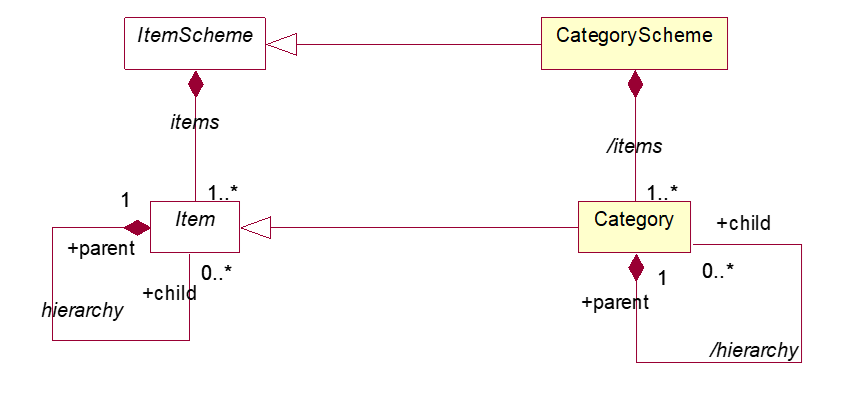 |
| Figure 61 Derived associations |

[^1] OLAP: Online analytical processing  
[^2] In the JSON schemas, more complex data types are complemented with regular expressions, whenever no direct mapping to a standard type exists.  
[^3] The Codelist that extends 0..\* Codelists is the 'extending' Codelist, while the Codelist(s) that are inherited is/are the 'extended' Codelist(s).  
[^4] Referencing the latest minor version of the Data Structure is achieved by the reference including the plus operator on the minor version to indicate it links to the latest stable version, for example 2.0+.0 will resolve to the highest version 2.x.y.  
[^5] Source and target Data Structure Definition are either directly linked from the StructureMap or indirectly via the linked source and target Dataflow   
[^6] Provider Scheme, Provider, Provision Agreement and Registered source refer both to data and reference metadata.  
[^7] The Validation and Transformation Language is a standard language designed and published under the SDMX initiative. VTL is described in the VTL User and Reference Guides available on the SDMX website <https://sdmx.org>.  
[^8] Or a part of a Dataflow, see also the chapter “Validation and Transformation Language” of the Section 6 of the SDMX Standards (“SDMX Technical Notes”), paragraph “Mapping dataflow subsets to distinct VTL data sets”.  
[^9] Provided that the VTL consistency rules are accomplished (see the “Generic Model for Transformations” in the VTL User Manual and its sub-section “Transformation Consistency”).    
[^10] For example, the **check** operator produces some new components in the result called by default **bool\_var**, **errorcode**, **errorlevel**, **imbalance**. These names can be personalised if needed.  
[^11] SDMX Technical Notes, chapter “Validation and Transformation Language”, section “References to SDMX artefacts from VTL statements”.  
[^12] For a more thorough description of these conversions, see the Section 6 of the SDMX Standards (“SDMX Technical Notes”), chapter “Validation and Transformation Language”, section “Mapping between SDMX and VTL”.  
[^13] SDMX Technical Notes, chapter “Validation and Transformation Language”, section “Mapping dataflow subsets to distinct VTL data sets”.  
[^14] Or a part of a Dataflow, as described in the previous paragraph.  
[^15] The default conversion table from VTL to SDMX is described in the the Section 6 of the SDMX Standards (“SDMX Technical Notes”), chapter “Validation and Transformation Language”, section “Mapping VTL basic scalar types to SDMX data types”.  
[^16] About VTL internal and external representations, see also the VTL User Manual, section “Basic scalar types”, p.53.  
[^17] See “Mapping VTL basic scalar types to SDMX data types” in the SDMX Technical Notes, chapter “Validation and Transformation Language”.  
[^18] See “Mapping VTL basic scalar types to SDMX data types” in the SDMX Technical Notes, chapter “Validation and Transformation Language”.  
[^19] See also the VTL formatting mask in the VTL Reference Manual and the SDMX Technical Notes. [↑](#footnote-ref-20)  
[^20] See “Mapping VTL basic scalar types to SDMX data types” in the SDMX Technical Notes, chapter “Validation and Transformation Language.

_____________________________________
© SDMX 2025  
http://www.sdmx.org/