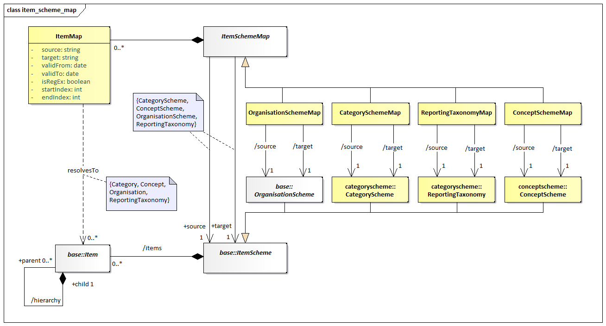

# ItemSchemeMap

## Scope

An `ItemSchemeMap` is an abstract container to describe mapping rules
between any item scheme, with the exception of `Codelists` and `ValueLists`
which are mapped using the `RepresentationMap`. A single source
`ItemScheme` is mapped to a single target `ItemScheme`. The
`ItemSchemeMap` then contains the rules for how the values from the
source `ItemScheme` map to the values in the target `ItemScheme`. Each
source value may match a substring of the original data (using
`startIndex` and/or `endIndex`) or define a pattern matching rule described
by a regular expression. The target value is provided as an absolute
string, although it can make use of regular expression groups to carry
across values from the source string to the target string without having
to explicitly state the value to carry. An example is a regular
expression which states ‘match a value starting with `AB` followed by
anything, where the `anything` is marked a capture group’, the target
can state ‘take the `anything` value and postfix it with `AB`’ thus
enabling the mapping of `ABX` to `XAB` and `ABY` to `YAB`.

The absence of an output for an input is interpreted as ‘no output value
for the given source value(s)’.

/// figure-caption | 40
Item Scheme Map
///

### Explanation of the Diagram

#### Narrative

An `ItemSchemeMap` is an abstract type which inherits from Maintainable.
It is subclassed by the 4 concrete classes:

- `OrganisationSchemeMap`
- `ConceptSchemeMap`
- `CategorySchemeMap`
- `ReportingTaxonomyMap`

An `OrganisationSchemeMap` maps a source `AgencyScheme`, `DataProviderScheme`,
`DataConsumerScheme` or `OrganisationUnitScheme` to a target `AgencyScheme`,
`DataProviderScheme`, `DataConsumerScheme` or `OrganisationUnitScheme`. It is
permissible to mix source and target types to define an equivalence
between Organisations of different roles. The mapped items refer to the
Organisations in the source/target schemes.

A `ConceptSchemeMap` maps a source `ConceptScheme` to a target
`ConceptScheme`. The mapped items refer to the `Concept`s in the
source/target schemes.

A `CategorySchemeMap` maps a source `CategoryScheme` to a target
`CategoryScheme`. The mapped Items refer to the `Categories` in the
source/target schemes.

A `ReportingTaxonomyMap` maps a source `ReportingTaxonomy` to a target
`ReportingTaxonomy`. The mapped Items refer to the `ReportingCategory` in
the source/target schemes.

#### Definitions

| Class | Feature | Description |
| --- | --- | --- |
| `ItemSchemeMap` | Inherits from `MaintainableArtefact` | Links source and target `ItemSchemes` |
|  | `source` | Association to a source `ItemScheme` |
|  | `target` | Association to a target `ItemScheme` |
| `ItemMap` | Inherits from `AnnotableArtefact` | Describes how the source value maps to the target value |
|  | `validFrom` | Optional period describing when the mapping is applicable |
|  | `validTo` | Optional period describing when the mapping is no longer applicable |
|  | `sourceValue` | Input value for source |
|  | `targetValue` | Output value for each mapped target |
|  | `isRegEx` | If true, the `sourceValue` field should be treated as a regular expression when comparing with the source data |
|  | `startIndex` | If provided, a substring of the source data should be taken, starting from this index (starting at zero) before comparing with the `value` field for matching |
|  | `endIndex` | If provided, a substring of the source data should be taken, ending at this index (starting at zero) before comparing with the `value` field for matching |
| `OrganisationSchemeMap` | Inherits from `ItemSchemeMap` | Concrete `Maintainable` subtype of `ItemSchemeMap` |
| `ConceptSchemeMap` | Inherits from `ItemSchemeMap` | Concrete `Maintainable` subtype of `ItemSchemeMap` |
| `CategorySchemeMap` | Inherits from `ItemSchemeMap` | Concrete `Maintainable` subtype of `ItemSchemeMap` |
| `ReportingTaxonomyMap` | Inherits from `ItemSchemeMap` | Concrete `Maintainable` subtype of `ItemSchemeMap` |
