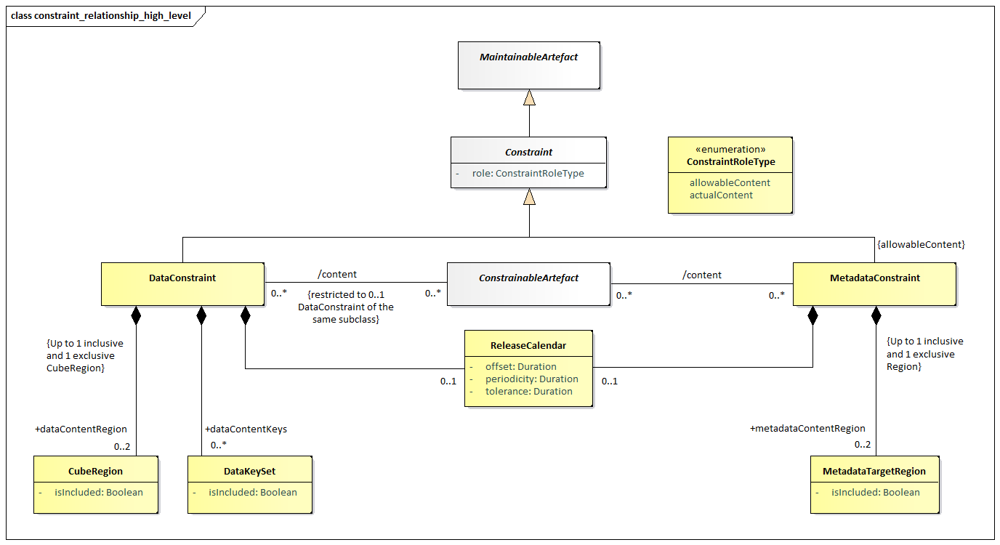
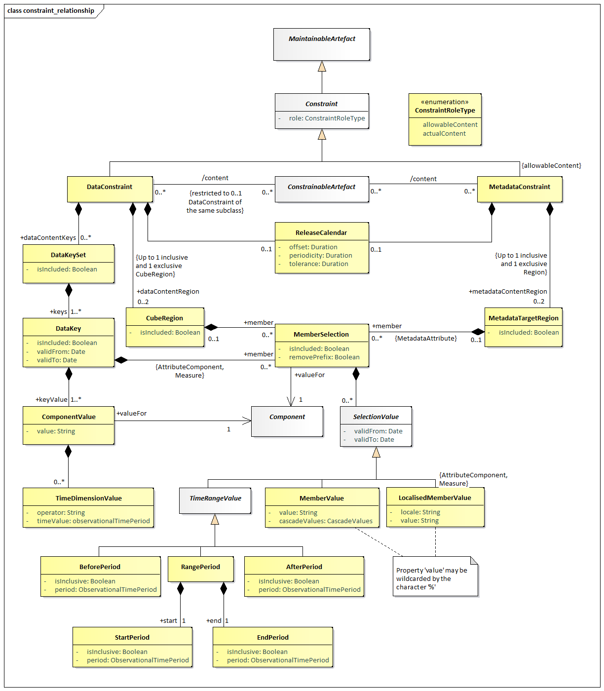

# Constraints

## Scope

The scope of this section is to describe the support in the metamodel
for specifying both the access to and the content of a data source. The
information may be stored in a resource such as a registry for use by
applications wishing to locate data and metadata which are available via
the Internet. The `Constraint` is also used to specify a subset of a
`Codelist` which may be used as a partial `Codelist`, relevant in the
context of the artefact to which the `Constraint` is attached e.g.,
`DataStructureDefinition`, `Dataflow`, `ProvisionAgreement`,
`MetadataStructureDefinition`, `Metadataflow`, `MetadataProvisionAgreement`.

Note that in this metamodel the term data provider refers to both data and metadata
providers.

The `Dataflow` and `Metadataflow`, themselves may be specified as containing
only a subset of all the possible keys that could be derived from a
`DataStructureDefinition` or `MetadataStructureDefinition`. Respectively,
further subsets may be defined within a `ProvisionAgreement` and
`MetadataProvisionAgreement`.

These specifications are called `Constraint` in this model.

## Inheritance

### Class Diagram of Constrainable Artefacts - Inheritance

/// figure-caption | 41
Inheritance class diagram of constrainable and provisioning
artefacts
///

### Explanation of the Diagram

#### Narrative

Any artefact that inherits from the `ConstrainableArtefact` interface
can have constraints defined. The artefacts that can have constraint
metadata attached are:

- `Dataflow`
- `ProvisionAgreement`
- `DataProvider`
- `DataStructureDefinition`
- `Metadataflow`
- `MetaDataProvider`
- `MetadataProvisionAgreement`
- `MetadataStructureDefinition`

Note that, because the `Constraint` can specify a subset of the
component values implied by a specific `Structure` (such as a specific
`DataStructureDefinition` or specific `MetadataStructureDefinition`), the
`ConstrainableArtefact`s must be associated with a specific `Structure`.
Therefore, whilst the `Constraint` itself may not be linked directly to
a `DataStructureDefinition` or `MetadataStructureDefinition`, the artefact
that it is constraining will be linked to a `DataStructureDefinition` or
`MetadataStructureDefinition`. A `DataProvider` and `MetadataProvider` indirectly
reference DSDs and MSDs through their associated Data and Metadata Provision
Agreements as such these Constraints are restricted to Cube Regions and are
applicable only to the DSDs / MSDs which contain the Components being restricted.

## Constraints

### Relationship Class Diagram – high level view

///  figure-caption
Relationship class diagram showing constraint metadata
///

### Explanation of the Diagram

#### Narrative

The constraint mechanism allows specific constraints to be attached to a
`ConstrainableArtefact`. These
constraints specify a subset of the total set of values or keys that may
be present in any of the `ConstrainableArtefacts`.

For instance, a `DataStructureDefinition` specifies, for each Dimension,
the list of allowable code values. However, a specific `Dataflow` that
uses the `DataStructureDefinition` may contain only a subset of the
possible range of keys that is theoretically possible from the
`DataStructureDefinition` definition (the total range of possibilities is
sometimes called the Cartesian product of the dimension values). In
addition to this, a `DataProvider` that is capable of supplying data
according to the `Dataflow` has a `ProvisionAgreement`, and the `DataProvider`
may also wish to supply constraint information which may further
constrain the range of possibilities in order to describe the data that
the provider can supply. It may also be useful to describe the content
of a data source in terms of the `KeySets` or `CubeRegions` contained within
it.

A `ConstrainableArtefact` can have two types of `Constraint`s:

1. `DataConstraint` – is used as a mechanism to specify the set of keys
    (`DataKeySet`), or set of component values (`CubeRegion`) that can be reported
    against the target `ConstrainableArtefact`. Multiple such `DataConstraints` may
    be present for a `ConstrainableArtefact`.
2. `MetadataConstraint` – is used as a mechanism to specify a set of component
    values (`MetadataTargetRegion`) that can be reported against the target
    `ConstrainableArtefact`. Multiple such `MetadataConstraints` may be present
    for a `ConstrainableArtefact`.

Note also that another possible type of a `Constraint` is available; that is a
`AvailableDataConstraint`, this is used to report the data that exists in a data
source. An `AvailableDataConstraint` is not a Maintainable Artefact as it is
generated dynamically based on the query.  An `AvailableDataConstraint` contains
only 1 `CubeRegion` which is used to specify the valid values per Dimension of
the DSD that it is attached to.

### Relationship Class Diagram – Detail

{ width="550" }
///  figure-caption
Constraints – Key Set, Cube Region and Metadata Target Region
///

#### Explanation of the Diagram

A `Constraint` is a `MaintainableArtefact`.

A `DataConstraint` has a choice of two ways of specifying value subsets:

1. As a set of keys that can be present in the `DataSet` (`DataKeySet`).
    Each `DataKey` specifies a number of `ComponentValues` each of which
    reference a `Component` (e.g., Dimension, `DataAttribute`). Each
    `ComponentValue` is a value that may be present for a `Component` of a
    structure when contained in a `DataSet`. In addition, each
    `DataKeySet` may also include `MemberSelections` for `AttributeComponents`
    or Measures.
2. As a `CubeRegion` whose `MemberSelections` `SelectionValues` define a subset of
    allowed/disallowed values for a `Component` when contained in a
    `DataSet`/`MetadataSet`. A `DataConstraint` is restricted to a maximum of 2
    `CubeRegions`, one to define included (allowable) content, and the other to
    define disallowed content (`isIncluded=false`).

The difference between (1) and (2) above is that :

1. Defines a combination of `Dimension` values, which are assessed in combination
    to reference one or more `Series` in a `Dataset`.  This combination of values
    can be used to explicitly include or exclude the Series from being reported
    (via the `isIncluded` property).  In addition, once a set of Series are
    targeted by a `DataKey` restrictions can be applied to `Attribute` and `Measure`
    values by defining subsets of values that are either allowed or disallowed.
    The `DataKeySet` targets its rules to specific Series.
2. Defines a subset of values that are allowed for a `Component`. Each `CubeRegion`
    `MemberSelection` defines a single Component to define a set of allowed or
    disallowed values, the `MemberSelections` are processed independently of
    each other. The Cube Region supplies global rules, not series specific rules.

A `MetadataConstraint` has only one way of specifying value subsets:

1. As a set of `MetadataTargetRegions` each of which defines a “slice” of
    the total structure (`MemberSelection`) in terms of one or more
    `MemberValues` that may be present for a `Component` of a structure
    when contained in a `MetadataSet`.

In both `CubeRegion` and `MetadataTargetRegion`, the value in
`ComponentValue`.value and `MemberValue`.value must be consistent with the
`Representation` declared for the `Component` in the
`DataStructureDefinition` (Dimension or `DataAttribute`) or
`MetadataStructureDefinition` (`MetadataAttribute`). Note that in all cases
the "operator" on the value is deemed to be "equals", unless the
wildcard character is used `'%'`. In the latter case the "operation" is a
partial matching, where the percentage character (`'%'`) may match zero or
more characters. Furthermore, it is possible in a `MemberValue` to specify
that child values (e.g., child codes) are included in the Constraint by
means of the `cascadeValues` attribute. The latter may take the following
values:

- `"true"`: all children are included,
- `"false"` (default), or
- `"excludeRoot"`, where all children are included, and the root Code is
    excluded (i.e. the referenced Code).

It is possible to define for the `DataKeySet`, `DataKey`, `CubeRegion`,
`MetadataTargetRegion` and `MemberSelection` whether the set is included
(`isIncluded = "true"`, default) or excluded (`isIncluded = "false"`) from
the Constraint definition. This attribute is useful if, for example,
only a small sub-set of the possible values are not included in the set,
then this smaller sub-set can be defined and excluded from the
constraint. Note that if the child construct is “included” and the
parent construct is “excluded” then the child construct is included in
the list of constructs that are “excluded”.

In any `MemberSelection` that the corresponding `Component` was using
Codelist with extensions, it is possible to remove the prefix that has
been used, in order to refer to the original Codes. This is achieved via
property `removePrefix`, which defaults to `“false”`.

In `DataKeys` and `MemberValues` it is possible, via the `validFrom` and
`validTo` properties, to set a validity period for which the selected key
or value is constrained.

#### Definitions

| Class | Feature | Description |
| :--- | :--- | :--- |
| `ConstrainableArtefact` | Abstract Class Sub classes are: `Dataflow` `DataProvider` `DataStructureDefinition` `Metadataflow` `MetadataProvisionAgreement` `MetadataSet` `MetadataStructureDefinition` `ProvisionAgreement` `QueryDatasource` `SimpleDatasource` | An artefact that can have Constraints specified. |
|  | `content` | Associates the metadata that constrains the content to be found in a data or metadata source linked to the Constrainable Artefact. |
| `Constraint` | Inherits from `MaintainableArtefact` Abstract class Sub classes are: `DataConstraint` `MetadataConstraint` | Specifies a subset of the definition of the allowable or actual content of a data or metadata source that can be derived from the Structure that defines code lists and other valid content. |
|  | `+dataContentKeys` | Association to a subset of Data Key Sets (i.e., value combinations) that can be derived from the definition of the structure to which the Constrainable Artefact is linked. |
|  | `+dataContentRegion` | Association to a subset of component values that can be derived from the Data Structure Definition to which the Constrainable Artefact is linked. |
|  | `+metadataContentRegion` | Association to a subset of component values that can be derived from the Metadata Structure Definition to which the Constrainable Artefact is linked. |
|  | role | Association to the role that the Constraint plays |
| `DataConstraint` | Inherits from `Constraint` | Defines a Constraint in terms of the content that can be found in data sources linked to the Constrainable Artefact to which this constraint is associated. |
| `ConstraintRoleType` |  | Specifies the way the type of content of a Constraint in terms of its purpose. |
|  | `allowableContent` | The Constraint contains a specification of the valid subset of the Component values or keys. |
|  | `actualContent` | The Constraint contains a specification of the actual content of a data or metadata source in terms of the Component values or keys in the source. |
| `MetadataConstraint` | Inherits from `Constraint` | Defines a Constraint in terms of the content that can be found in metadata sources linked to the Constrainable Artefact to which this constraint is associated. |
| `DataKeySet` |  | A set of data keys. |
|  | `isIncluded` | Indicates whether the Data Key Set is included in the constraint definition or excluded from the constraint definition. |
|  | `+keys` | Association to the Data Keys in the set. |
|  | `+member` | Association to the selection of a value subset for Attributes and Measures. |
| `DataKey` |  | The values of a key in a data set. |
|  | `isIncluded` | Indicates whether the Data Key is included in the constraint definition or excluded from the constraint definition. |
|  | `+keyValue` | Associates the Component Values that comprise the key. |
|  | `validFrom` | Date from which the Data Key is valid. |
|  | `validTo` | Date from which the Data Key is superseded. |
| `ComponentValue` |  | The identification and value of a Component of the key (e.g., Dimension) |
|  | `value` | The value of Component |
|  | `+valueFor` | Association to the Component (e.g., Dimension) in the Structure to which the Constrainable Artefact is linked. |
| `TimeDimensionValue` |  | The value of the Time Dimension component. |
|  | `timeValue` | The value of the time period. |
|  | `operator` | Indicates whether the specified value represents and exact time or time period, or whether the value should be handled as a range. A value of `greaterThan` or `greaterThanOrEqual` indicates that the value is the beginning of a range (exclusive or inclusive, respectively). A value of `lessThan` or `lessThanOrEqual` indicates that the value is the end or a range (exclusive or inclusive, respectively). In the absence of the opposite bound being specified for the range, this bound is to be treated as infinite (e.g., any time period after the beginning of the provided time period for `greaterThanOrEqual`) |
| `CubeRegion` |  | A set of Components and their values that defines a subset or “slice” of the total range of possible content of a data structure to which the Constrainable Artefact is linked. |
|  | `isIncluded` | Indicates whether the Cube Region is included in the constraint definition or excluded from the constraint definition. |
|  | `+member` | Associates the set of Components that define the subset of values. |
| `MetadataTargetRegion` |  | A set of Components and their values that defines a subset or “slice” of the total range of possible content of a metadata structure to which the Constrainable Artefact is linked. |
|  | `isIncluded` | Indicates whether the Metadata Target Region is included in the constraint definition or excluded from the constraint definition. |
|  | `+member` | Associates the set of Components that define the subset of values. |
| `MemberSelection` |  | A set of permissible values for one component of the axis. |
|  | `isIncluded` | Indicates whether the Member Selection is included in the constraint definition or excluded from the constraint definition. |
|  | `removePrefix` | Indicates whether the Codes should keep or not the prefix, as defined in the extension of Codelist. |
|  | `+valuesFor` | Association to the Component in the Structure to which the Constrainable Artefact is linked, which defines the valid Representation for the Member Values. |
| `SelectionValue` | Abstract class. Sub classes are: `MemberValue` `TimeRangeValue` `LocalisedMemberValue` | A collection of values for the Member Selections that, combined with other Member Selections, comprise the value content of the Cube Region. |
|  | `validFrom` | Date from which the Selection Value is valid. |
|  | `validTo` | Date from which the Selection Value is superseded. |
| `MemberValue` | Inherits from `SelectionValue` | A single value of the set of values for the Member Selection. |
|  | `value` | A value of the member. |
|  | `cascadeValues` | Indicates that the child nodes of the member are included in the Member Selection (e.g., child codes) |
| `LocalisedMemberValue` | Inherits from `SelectionValue` | A single localised value of the set of values for a Member Selection. |
|  | `value` | A value of the member. |
|  | `locale` | The locale that the values must adhere to in the dataset. |
| `TimeRangeValue` | Inherits from `SelectionValue` Abstract Class Concrete Classes: `BeforePeriod` `AfterPeriod` `RangePeriod` | A time value or values that specifies the date or dates for which the constrained selection is valid. |
| `BeforePeriod` | Inherits from `TimeRangeValue` | The period before which the constrained selection is valid. |
|  | `isInclusive` | Indication of whether the date is inclusive in the period. |
|  | `period` | The time period which acts as the latest possible reported period |
| `AfterPeriod` | Inherits from `TimeRangeValue` | The period after which the constrained selection is valid. |
|  | `isInclusive` | Indication of whether the date is inclusive in the period. |
|  | `period` | The time period which acts as the earliest possible reported period |
| `RangePeriod` |  | The start and end periods in a date range. |
|  | `+start` | Association to the Start Period. |
|  | `+end` | Association to the End Period. |
| `StartPeriod` | Inherits from `TimeRangeValue` | The period from which the constrained selection is valid. |
|  | `isInclusive` | Indication of whether the date is inclusive in the period. |
|  | `period` | The time period which acts as the start of the range |
| `EndPeriod` | Inherits from `TimeRangeValue` | The period to which the constrained selection is valid. |
|  | `isInclusive` | Indication of whether the date is inclusive in the period. |
|  | `period` | The time period which acts as the end of the range |
