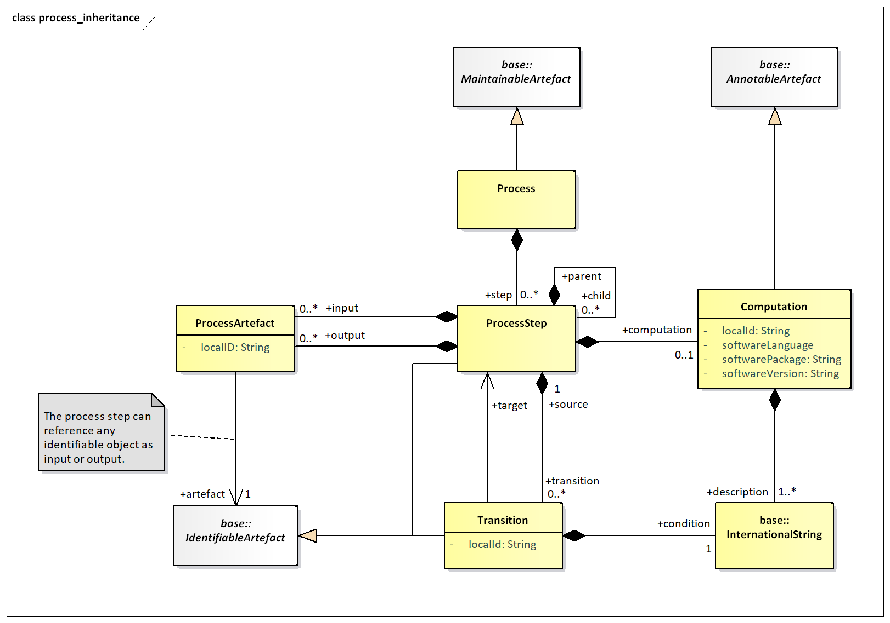

# Process

## Introduction

In any system that processes data and reference metadata the system
itself is a series of processes and in each of these processes the data
or reference metadata may undergo a series of transitions. This is
particularly true of its path from raw data to published data and
reference metadata. The process model presented here is a generic model
that can capture key information about these stages in both a textual
way and also in a more formalised way by linking to specific
identifiable objects, and by identifying software components that are
used.

## Model – Inheritance and Relationship view

### Class Diagram

/// figure-caption | 46
Inheritance and Relationship class diagram of Process and
Transitions
///

### Explanation of the Diagram

#### Narrative

The Process is a set of hierarchical `ProcessSteps`. Each `ProcessStep` can
take zero or more `IdentifiableArtefact`s as input and output. Each of
the associations to the input and output `IdentifiableArtefact`s
(`ProcessArtefact`) can be assigned a `localID`.

The computation performed by a `ProcessStep` is optionally described by a
Computation, which can identify the software used by the `ProcessStep` and
can also be described in textual form (`+description`) in multiple
language variants. The Transition describes the execution of
`ProcessSteps` from `+source` `ProcessStep` to `+target` `ProcessStep` based on
the outcome of a `+condition` that can be described in multiple language
variants.

#### Definitions

| Class | Feature | Description |
| :--- | :--- | :--- |
| `Process` | Inherits from `Maintainable` | A scheme which defines or documents the operations performed on data or metadata in order to validate data or metadata to derive new information according to a given set of rules. |
|  | `+step` | Associates the process steps. |
| `ProcessStep` | Inherits from `IdentifiableArtefact` | A specific operation, performed on data or metadata in order to validate or to derive new information according to a given set of rules. |
|  | `+input` | Association to the process artefact that identifies the objects which are input to the process step. |
|  | `+output` | Association to the process artefact that identifies the objects which are output from the process step. |
|  | `+child` | Association to child processes that combine to form a part of this process. |
|  | `+computation` | Association to one or more computations. |
|  | `+transition` | Association to one or more transitions. |
| `Computation` |  | Describes in textual form the computations involved in the process. |
|  | `localId` | Distinguishes between computations in the same process. |
|  | `softwarePackage` / `softwareLanguage` / `softwareVersion` | Information about the software that is used to perform the computation. |
|  | `+description` | Text describing or giving additional information about the computation. This can be in multiple language variants. |
| `Transition` | Inherits from `IdentifiableArtefact` | An expression in a textual or formalised way of the transformation of data between two specific operations (processes) performed on the data. |
|  | `+target` | Associates the process step that is the target of the transition. |
|  | `+condition` | Associates a textual description of the transition. |
| `ProcessArtefact` |  | Identification of an object that is an input to or an output from a process step. |
|  | `+artefact` | Association to an identifiable artefact that is the input to or the output from the process step. |
