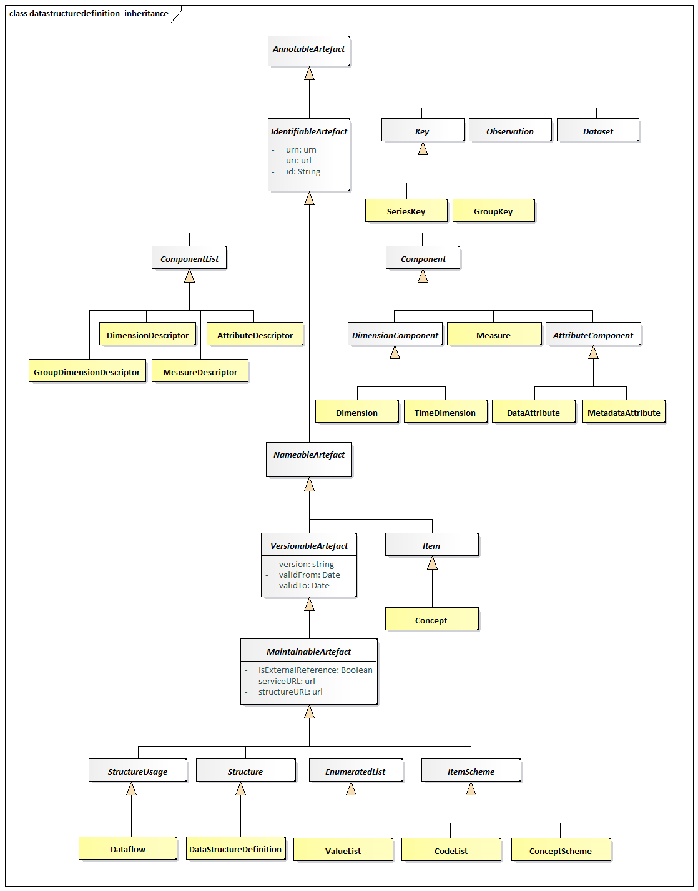
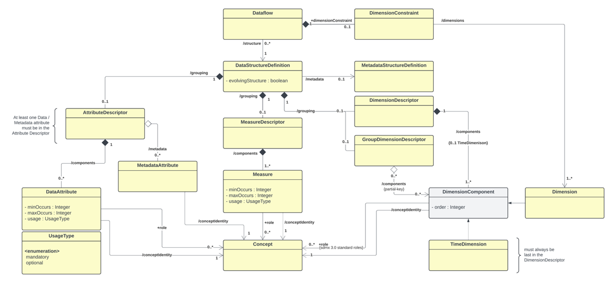
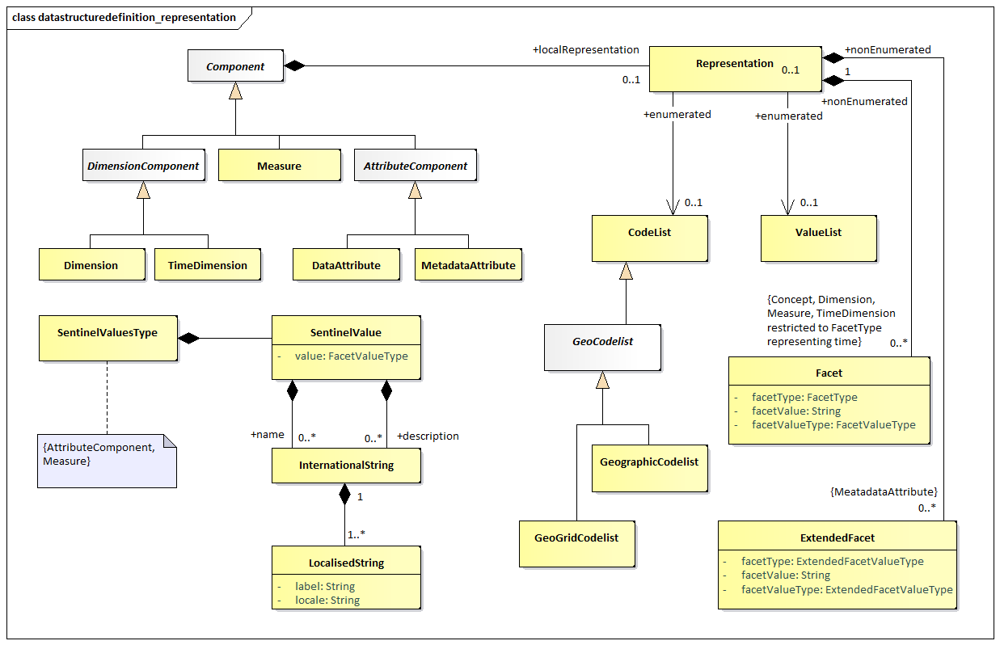

#  Data Structure Definition and Dataset

## Introduction

The `DataStructureDefiniton` is the class name for a structure definition
for data. Some organisations know this type of definition as a “Key
Family” and so the two names are synonymous. The term Data Structure
Definition (also referred to as DSD) is used in this specification.

Many of the constructs in this layer of the model inherit from the SDMX
Base Layer. Therefore, it is necessary to study both the inheritance and
the relationship diagrams to understand the functionality of individual
packages. In simple sub models these are shown in the same diagram but
are omitted from the more complex sub models for the sake of clarity. In
these cases, the inheritance diagram below shows the full inheritance
tree for the classes concerned with data structure definitions.

There are very few additional classes in this sub model other than those
shown in the inheritance diagram below. In other words, the SDMX Base
gives most of the structure of this sub model both in terms of
associations and in terms of attributes. The relationship diagrams shown
in this section show clearly when these associations are inherited from
the SDMX Base (see the Appendix
[A Short Guide to UML in the SDMX Information Model](./15_Appendix_1:_A_Short_Guide_to_UML_in_the_SDMX_Information_Model.md)
to see the diagrammatic notation used to depict this).

The actual SDMX Base construct from which the concrete classes inherit
depends upon the requirements of the class for:

- Annotation – `AnnotableArtefact`
- Identification – `IdentifiableArtefact`
- Naming – `NameableArtefact`
- Versioning – `VersionableArtefact`
- Maintenance – `MaintainableArtefact`

## Inheritance View

### Class Diagram

{ width="550" }
/// figure-caption | 27
Class inheritance in the Data Structure Definition and
Data Set Packages
///

### Explanation of the Diagram

#### Narrative

Those classes in the SDMX metamodel which require annotations inherit
from `AnnotableArtefact`. These are:

- `IdentifiableArtefact`
- `DataSet`
- `Key` (and therefore `SeriesKey` and `GroupKey`)
- `Observation`

Those classes in the SDMX metamodel which require annotations and global
identity are derived from `IdentifiableArtefact`. These are:

- `NameableArtefact`
- `ComponentList`
- `Component`

Those classes in the SDMX metamodel which require annotations, global
identity, multilingual name and multilingual description are derived
from `NameableArtefact`. These are:

- `VersionableArtefact`
- `Item`

The classes in the SDMX metamodel which require annotations, global
identity, multilingual name and multilingual description, and versioning
are derived from `VersionableArtefact`. These are:

- `MaintainableArtefact`

Abstract classes which represent information that is maintained by
Maintenance Agencies all inherit from `MaintainableArtefact`, they also
inherit all the features of a `VersionableArtefact`, and are:

- `StructureUsage`
- `Structure`
- `ItemScheme`

All the above classes are abstract. The key to understanding the class
diagrams presented in this section are the concrete classes that inherit
from these abstract classes.

Those concrete classes in the SDMX Data Structure Definition and Dataset
packages of the metamodel which require to be maintained by Agencies all
inherit (via other abstract classes) from `MaintainableArtefact`, these
are:

- `Dataflow`
- `DataStructureDefinition`

The component structures that are lists of lists, inherit directly from
`Structure`. A `Structure` contains several lists of components. The
concrete class that inherits from `Structure` is:

- `DataStructureDefinition`

A `DataStructureDefinition` contains a list of dimensions, a list of
measures and a list of attributes.

The concrete classes which inherit from `ComponentList` and are
subcomponents of the `DataStructureDefinition` are:

- `DimensionDescriptor` – content is `Dimension` and `TimeDimension`
- `DimensionGroupDescriptor` – content is an association to `Dimension`,
    `TimeDimension`
- `MeasureDescriptor` – content is `Measure`
- `AttributeDescriptor` – content is `DataAttribute` and an association to
- `MetadataAttribute`

The classes that inherit from `Component` are:

- `Measure`
- `DimensionComponent` and thereby its sub classes of `Dimension` and
    `TimeDimension`
- `Attribute` and thereby its sub classes of `DataAttribute` and
    `MetadataAttribute`

The concrete classes identified above are the majority of the classes
required to define the metamodel for the `DataStructureDefinition`. The
diagrams and explanations in the rest of this section show how these
concrete classes are related in order to support the functionality
required.

## Data Structure Definition – Relationship View

### Class Diagram 

/// figure-caption
Relationship class diagram of the Data Structure Definition excluding representation
///

### Explanation of the Diagrams

#### Narrative

A `DataStructureDefinition` defines the `Dimension`s, `TimeDimension`,
`DataAttributes`, and `Measure`s, and associated `Representation`s, that
comprise the valid structure of data and related attributes that are
contained in a `DataSet`, which is defined by a `Dataflow`. In addition, a
`DataStructureDefinition` may be related to one
`MetadataStructureDefinition`, in order to use the latter’s
`MetadataAttributes`, by relating them to other `Components` within the
DSD, as explained below.

The `Dataflow` may also have additional metadata attached that define
qualitative information and Constraints on the use of the
`DataStructureDefinition` such as the subset of `Code`s used in a `Dimension`
(this is covered later in this document – see sections [Constraints](./11_Constraints.md)
and 
[Data Provisioning](./12_Data_Provisioning.md)). Each `Dataflow` has a maximum of one
`DataStructureDefinition` specified which defines the structure of any
`DataSets` to be reported/disseminated.
A `Dataflow` may optionally define which `Dimensions` it uses, by defining a
`DimensionConstraint` (this is a mandatory requirement if the
`DataStructureDefinition` sets its `evolvingStructure` property to `‘true’` and 
is semantically referenced by the `Dataflow`).

There are two types of dimensions each having a common association to
`Concept`:

- `Dimension`
- `TimeDimension`

Note that `DimensionComponent` can be any or all its sub classes i.e.,
`Dimension`, `TimeDimension`.

The `DimensionComponent`, `DataAttribute`, `MetadataAttribute` and `Measure`
link to the `Concept` that defines its name and semantic (`/conceptIdentity`
association to `Concept`). The `DataAttribute`, `Dimension` (but not
`TimeDimension`) and `Measure` can optionally have a `+conceptRole`
association with a `Concept` that identifies its role in the
`DataStructureDefinition`, or one of the standard pre-defined roles, i.e.,
those published in "GUIDELINES FOR SDMX CONCEPT ROLES" by the SDMX SWG.
The use of these roles is to enable applications to process the data in
a meaningful way (e.g., relating a dimension value to a mapping vector).
It is expected, beyond the standard roles published by the SWG, that
communities (such as the official statistics community) will harmonise
such roles within their community so that data can be exchanged and
shared in a meaningful way within that community.

The valid values for a `DimensionComponent`, `Measure`, `DataAttribute` or
`MetadataAttribute`, when used in this `DataStructureDefinition`, are
defined by the `Representation`. This `Representation` is taken from the
`Concept` definition (`coreRepresentation`) unless it is overridden in this
`DataStructureDefinition` (`localRepresentation`) – see Figure 28. Note also
that `TimeDimension` is constrained to specific `FacetValueTypes`. Moreover,
the `Representation`s of `MetadataAttributes` are specified in the
corresponding `MetadataStructureDefinition`, linked by the
`DataStructureDefinition`.

There will always be a `DimensionDescriptor` grouping that identifies all
of the `Dimension` comprising the full key. Together the `Dimension`s
specify the key of an Observation.

The `DimensionComponent` can optionally be grouped by multiple
`Group`Dimension`Descriptors` each of which identifies the group of
`Dimension`s that can form a partial key. The `Group`Dimension`Descriptor`
must be identified (`Group`Dimension`Descriptor`.id) and this is used in the
`GroupKey` of the `DataSet` to declare which `DataAttributes` or
`MetadataAttributes` are reported at this group level in the `DataSet`.

There can be a maximum of one `TimeDimension` specified in the
`DimensionDescriptor`. The `TimeDimension` is used to specify the `Concept`
used to convey the time period of the observation in a data set. The
`TimeDimension` must contain a valid representation of time and cannot be
coded.

There can be one or more `Measure`s under the `MeasureDescriptor`. `Measure`s
represent the observable phenomena. Each `Measure` may have a valid
representation, a `maxOccurs` attribute limiting the maximum number of
values per `Measure` (which may be set to 'unbounded' for unlimited
occurrences), as well as a `minOccurs` attribute, indicating the minimum
required number of values, when the `Measure` is reported. If `minOccurs` or
`maxOccurs` are omitted (they both default to ‘1’), the `Measure` is
considered to take a single value; otherwise, it is an array. Moreover,
the usage attribute indicates whether a `Measure` must be reported or not,
by the corresponding values: mandatory or optional.

The `AttributeDescriptor` may contain one or more `Attribute`s, i.e., at
least one `DataAttribute` definition or one `MetadataAttribute` reference.

The `DataAttribute` defines a characteristic of data that are collected or
disseminated and is grouped in the `DataStructureDefinition` by a single
`AttributeDescriptor`. The `DataAttribute` can be indicated if it must be
reported or not, by the corresponding value of the usage attribute:
i.e., mandatory or optional. The property `minOccurs` specifies the
minimum number of array values to be included when the `DataAttribute` is
reported. Moreover, a `maxOccurs` attribute indicates whether the
`DataAttribute` may need to report more than one values, i.e., an array of
values. The `DataAttribute` may play a specific role in the structure and
this is specified by the +role association to the `Concept` that
identifies its role.

The `MetadataAttribute` defines reference metadata that may be collected
or disseminated and is grouped together with `DataAttribute` under the
`AttributeDescriptor`.

A `DataAttribute` or a `MetadataAttribute` (i.e., an `AttributeComponent`)
is specified as being `+relatedTo` an `AttributeRelationship`, which defines
the constructs to which the `AttributeComponent` is to be reported
within a `DataSet`. An `AttributeComponent` can be specified as being
related to one of the following artefacts:

- All data within the dataset (`DataflowRelationship`) – this is
    equivalent to attaching an Attribute to all data within the
    `Dataflow`.
- `Dimension` or set of `Dimension`s (`DimensionRelationship`)
- Set of `Dimension`s specified by a `GroupKey` (`GroupRelationship` – this
    is retained for compatibility reasons – or `+groupKey` of the
    `DimensionRelationship`)
- Observation (`ObservationRelationship`)
- In addition to the positioning of an `AttributeComponent` within a
    `DataSet`, another relationship indicates the `Measure`(s) for which
    the `AttributeComponent` is reported. Regardless of the position of
    the `AttributeComponent` within the `DataSet`, the
    `AttributeComponent` may concern one, more than one, or all `Measure`s
    included in the DSD. This is expressed using the `MeasureRelationship`
    class, which relates a `DataAttribute` to one or more `Measure`s. Lack
    of the `MeasureRelationship` defaults to a relationship to all
    `Measure`s.

/// figure-caption
Attribute Attachment Defined in the Data Structure Definition
///

The following table details the possible relationships a `DataAttribute`
may specify. Note that these relationships are mutually exclusive, and
therefore only one of the following is possible.

| Relationship | Meaning | Location in Data Set at which the Attribute is reported |
| :--- | :--- | :--- |
| `DataflowRelationship` | The value of the attribute is fixed for all data contained in the dataset. The attribute value applies to all data defined by the underlying `Dataflow`. | The attribute is reported at the dataset level. |
| `Dimension` (1..n) | The value of the attribute will vary with the value(s) of the referenced `Dimension`(s). In this case, group(s) to which the attribute should be attached may optionally be specified. | The attribute is reported at the lowest level of the `Dimension` to which the attribute is related, otherwise at the level of the group if attachment group(s) is specified. |
| `Group` | The value of the attribute varies with combination of values for all of the `Dimension`s contained in the group. This is added as a convenience to listing all `Dimension`s and the attachment group, but should only be used when the attribute value varies based on **all** group `Dimension` values. | The attribute is reported at the level of group. |
| `Observation` | The value of the attribute varies with the observed value. | The attribute is reported at the level of observation. |

/// figure-caption
Representation of DSD Components
///

Each of `Dimension`, `TimeDimension`, `Measure`, `DataAttribute` and
`MetadataAttribute` can have a `Representation` specified (using the
`localRepresentation` association). If this is not specified in the
`DataStructureDefinition` then the representation specified for `Concept`
(`coreRepresentation`) is used. `Measure`, and `DataAttribute` may be also
represented by multilingual text (as seen in the `DataSet` diagram further
down). An exception is the `MetadataAttribute`, where its `Representation`
is specified in the `MetadataStructureDefinition`.

A `DataStructureDefinition` can be extended to form a derived
`DataStructureDefinition`. This is supported in the `StructureMap`.

####  Definitions

| Class | Feature | Description |
| :--- | :--- | :--- |
| `StructureUsage` |  | See "SDMX Base". |
| `Dataflow` | Inherits from `StructureUsage` | Abstract concept (the structure without any data) of a flow of data that providers will provide for different reference periods. |
|  | `/structure` | Associates a `Dataflow` to the `DataStructureDefinition`. |
|  | `dimensionConstraint` | A list of Dimensions which the `Dataflow` uses. This is only required when the referenced `DataStructureDefinition` has the `evolvingStructure` property set to `true` and when the association to the `DataStructureDefinition` is on the latest minor version.[^1] |
| `DataStructureDefinition` |  | A collection of metadata concepts, their structure and usage when used to collect or disseminate data. |
|  | `/grouping` | An association to a set of metadata concepts that have an identified structural role in a `DataStructureDefinition`. |
|  | `evolvingStructure` | An optional boolean property, defaulting to `false`. When `true` the DataStructureDefinition may have new Dimensions added without having to change its major version number.  |
| `GroupDimensionDescriptor` | Inherits from `ComponentList` | A set of metadata concepts that define a partial key derived from the `DimensionDescriptor` in a `DataStructureDefinition`. |
|  | `/components` | An association to the `Dimension` components that comprise the group. |
| `DimensionDescriptor` | Inherits from `ComponentList` | An ordered set of metadata concepts that, combined, classify a statistical series, and whose values, when combined (the key) in an instance such as a data set, uniquely identify a specific observation. |
|  | `/components` | An association to the `Dimension` and `TimeDimension` comprising the key descriptor. |
| `AttributeDescriptor` | Inherits from `ComponentList` | A set of metadata concepts that define the attributes of a `DataStructureDefinition`. |
|  | `/components` | An association to a `DataAttribute` component. |
| `MeasureDescriptor` | Inherits from `ComponentList` | A metadata concept that defines the `Measure`s of a `DataStructureDefinition`. |
|  | `/components` | An association to a `Measure` component. |
| `DimensionComponent` | Inherits from `Component` Sub class: `Dimension`, `TimeDimension` | An abstract class representing any component that can be used for identifying observations. |
|  | `Order` | Specifies the order of the `DimensionComponent`s within the DSD. The property is used to indicate the position of the `DimensionComponent` and determines the key for identifying observations or series. The `TimeDimension`, when specified, must be the last within the `DimensionDescriptor`. |
| `Dimension` | Inherits from `DimensionComponent` | A metadata concept used (often together with other metadata concepts) to classify a statistical series, e.g., a statistical concept indicating a certain economic activity or a geographical reference area. |
|  | `/role` | Association to the `Concept` that specifies the role that the `Dimension` plays in the `DataStructureDefinition`. |
|  | `/conceptIdentity` | An association to the metadata concept which defines the semantic of the `Dimension`. |
| `TimeDimension` | Inherits from `DimensionComponent` | A metadata concept that identifies the component in the key structure that has the role of "time". |
| `DataAttribute` | Inherits from `Component` | A characteristic of an object or entity. |
|  | `/role` | Association to the `Concept` that specifies the role that the `DataAttribute` plays in the `DataStructureDefinition`. |
|  | `minOccurs` | Defines the minimum required occurrences for the attribute. When equal to zero, the attribute is conditional. |
|  | `maxOccurs` | Defines the maximum allowed occurrences for the attribute. |
|  | `Usage` | Defines whether a `DataAttribute` must be reported or not. |
|  | `+relatedTo` | Association to an `AttributeRelationship`. |
|  | `/conceptIdentity` | An association to the `Concept` which defines the semantic of the component. |
| `Measure` | Inherits from `Component` | The metadata concept that is the phenomenon to be measured in a data set. In a data set the instance of the measure is often called the observation. |
|  | `/conceptIdentity` | An association to the `Concept` which carries the values of the measures. |
|  | `minOccurs` | Defines the minimum required occurrences for the `Measure`. When equal to zero, the `Measure` is conditional. |
|  | `maxOccurs` | Defines the maximum allowed occurrences for the `Measure`. |
|  | `Usage` | Defines whether a `Measure` must be reported or not. |
| `AttributeRelationship` | Abstract class Sub classes: `ObservationRelationship`, `GroupRelationship`, `DimensionRelationship` | Specifies the type of artefact to which a `DataAttribute` can be attached in a data set. |
| `ObservationRelationship` |  | The `DataAttribute` is related to the observations of the data set. |
| `GroupRelationship` |  | The `DataAttribute` is related to a `GroupDimensionDescriptor` construct. |
|  | `+groupKey` | An association to the `GroupDimensionDescriptor`. |
| `DimensionRelationship` |  | The `DataAttribute` is related to a set of `Dimension`s. |
|  | `+dimensions` | Association to the set of `Dimension`s to which the `DataAttribute` is related. |
|  | `+groupKey` | Association to the `GroupDimensionDescriptor` which specifies the set of `Dimension`s to which the `DataAttribute` is attached. |
| `MeasureRelationship` |  | The `Measure`s that a `DataAttribute` is reported for. |
|  | `+measures` | Association to the set of `Measure`s to which a `DataAttribute` is related. |
| `SentinelValuesType` |  | This facet indicates that an attribute or a `Measure` has sentinel values with special meaning within their data type. This is realised by providing such values within the `TextFormat`, in addition to any `textType` or other facet. |
| `SentinelValue` |  | A value that has a special meaning within the text format representation of the component. |
|  | `+name` | An association of a sentinel value to a multilingual name. |
|  | `+description` | An association of a sentinel value to a multilingual description. |

[^1]:
    Referencing the latest minor version of the Data Structure is achieved by the
    reference including the plus operator on the minor version to indicate it links
    to the latest stable version, for example 2.0+.0 will resolve to the highest version 2.x.y.

The explanation of the classes, attributes, and associations comprising
the `Representation` is described in the section on the [SDMX Base](./2_SDMX_Base_Package.md).

## Data Set – Relationship View

### Context

A data set comprises the collection of data values and associated
metadata that are collected or disseminated according to a known
`DataStructureDefinition`.

### Class Diagram

{ width="550" }
/// figure-caption
Class Diagram of the Data Set
///

### Explanation of the Diagram

#### Narrative – Data Set

Note that the `DataSet` must conform to the `DataStructureDefinition`
associated to the `Dataflow` for which this `DataSet` is an “instance of
data”. Whilst the model shows the association to the classes of the
`DataStructureDefinition`, this is for conceptual purposes to show the
link to the `DataStructureDefinition`. In the actual `DataSet` as
exchanged there must, of course, be a reference to the
`DataStructureDefinition` and optionally a `Dataflow` or a
`ProvisionAgreement`, but the `DataStructureDefinition` is not necessarily
exchanged with the data. Therefore, the `DataStructureDefinition` classes
are shown in the grey areas, as these are not a part of the `DataSet`
when the `DataSet` is exchanged. However, the structural metadata in the
`DataStructureDefinition` can be used by an application to validate the
contents of the `DataSet` in terms of the valid content of a `KeyValue`
as defined by the `Representation` in the `DataStructureDefinition`.

An organisation playing the role of `DataProvider` can be responsible for
one or more `DataSet`.

A `DataSet` is formatted as a `DataStructureDefinition` specific data set
(`StructureSpecificDataSet`). The structured data set is structured
according to one specific `DataStructureDefinition`; hence the latter is
required for validation at the syntax level.

A `DataSet` is a collection of a set of `Observation`s that share the
same dimensionality, which is specified by a set of unique components
(`Dimension`, `TimeDimension`) defined in the `DimensionDescriptor` of the
`DataStructureDefinition`, together with associated `AttributeValue`s that
define specific characteristics about the artefact to which it is
attached – `Observation`s, set of `Dimension`s. It can be structured in
terms of a `SeriesKey` to which `Observation`s are reported.

The `Observation` can be the value(s) of the variable(s) being measured
for the `Concept` associated to the `Measure`(s) in the `MeasureDescriptor` of
the `DataStructureDefinition`. Each `Observation` associates one or more
`ObservationValue`s with a `KeyValue` (`+observationDimension`) which is the
value for the “`Dimension` at the Observation Level”. Any `Dimension` can be
specified as being the “`Dimension` at the Observation Level”, and this
specification is made at the level of the `DataSet` (i.e., it must be
the same `Dimension` for the entire `DataSet`).

The `KeyValue` is a value for one of `TimeDimension` or `Dimension`
specified in the `DataStructureDefinition`. If it is a `Dimension`, it can
be coded (`CodedKeyValue`) or uncoded (`UncodedKeyValue`). If it is the
`TimeDimension` then it is a `TimeKeyValue`. The actual value that the
`Coded`Dimension`Value` can take must be one of the Codes in the Codelist
specified as the `Representation` of the `Dimension` in the
`DataStructureDefinition`.

An `ObservationValue` can be coded – this is the `CodedObservation` – or it
can be uncoded – this is the `UncodedObservation`. In the case of uncoded
observations, the values may be multilingual – expressed via the
`Text`Measure`Value` – or not (`OtherUncoded`Measure`Value`).

The `GroupKey` is a subunit of the `Key` that has the same dimensionality
as the `SeriesKey` but defines a subset of the `KeyValues` of the `SeriesKey`.
Its sub dimension structure is defined in the `Group`Dimension`Descriptor`
of the `DataStructureDefinition` identified by the same id as the
`GroupKey`. The id identifies a “type” of group and the purpose of the
`GroupKey` is to report one or more `AttributeValue` that are contained at
this group level. The `GroupKey` is present when the
`Group`Dimension`Descriptor` is related to the `GroupRelationship` in the
`DataStructureDefinition`. There can be many types of groups in a
`DataSet`. If the Group is related to the `DimensionRelationship` in the
`DataStructureDefinition` then the `AttributeValue` will be reported with
the appropriate dimension in the `SeriesKey` or Observation.

In this way each of `SeriesKey`, `GroupKey`, and Observation can have zero
or more `AttributeValue`s that define some metadata about the object to
which it is associated. The `AttributeValue` may be either a
`DataAttributeValue` or a `MetadataAttributeValue`, representing values
of `DataAttributes` defined in the DSD or `MetadataAttributes` of the linked
MSD, respectively. The allowable `Concept`s and the objects to which these
metadata can be associated (attached) are defined in the
`DataStructureDefinition` and the linked `MetadataStructureDefinition`.

The `AttributeValue` links to the object type (`SeriesKey`, `GroupKey`,
Observation) to which it is associated.

#### Definitions

| Class | Feature | Description |
| :--- | :--- | :--- |
| `DataSet` | Abstract class. Subclasses: `StructureSpecificDataSet` | An organised collection of data. |
|  | `reportingBegin` | A specific time period in a known system of time periods that identifies the start period of a report. |
|  | `reportingEnd` | A specific time period in a known system of time periods that identifies the end period of a report. |
|  | `dataExtractionDate` | A specific time period that identifies the date and time that the data are extracted from a data source. |
|  | `validFrom` | Indicates the inclusive start time indicating the validity of the information in the data set. |
|  | `validTo` | Indicates the inclusive end time indicating the validity of the information in the data set. |
|  | `publicationYear` | Specifies the year of publication of the data or metadata in terms of whatever provisioning agreements might be in force. |
|  | `publicationPeriod` | Specifies the period of publication of the data or metadata in terms of whatever provisioning agreements might be in force. |
|  | `setId` | Provides an identification of the data set. |
|  | `action` | Defines the action to be taken by the recipient system (`information`, `append`, `replace`, `delete`). |
|  | `describedBy` | Associates a `Dataflow` and thereby a Data Structure Definition to the data set. |
|  | `structuredBy` | Associates the Data Structure Definition that defines the structure of the data set. Note that the Data Structure Definition is the same as that associated (non-mandatory) to the `Dataflow`. |
|  | `publishedBy` | Associates the Data Provider that reports/publishes the data. |
| `StructureSpecificDataSet` |  | An XML specific data format structure that contains data corresponding to one specific Data Structure Definition. |
| `Key` | Abstract class. Subclasses: `SeriesKey`, `GroupKey` | Comprises the cross product of values of dimensions that identify uniquely an Observation. |
|  | `keyValues` | Association to the individual Key Values that comprise the Key. |
|  | `attachedAttribute` | Association to the Attribute Values relating to the Series Key or Group Key. |
| `KeyValue` | Abstract class. Subclasses: `TimeKeyValue`, `CodedKeyValue`, `UncodedKeyValue` | The value of a component of a key such as the value of the instance of a `Dimension` in a `DimensionDescriptor` of a Data Structure Definition. |
|  | `valueFor` | Association to the key component in the Data Structure Definition for which this Key Value is a valid representation. Note that this is a conceptual association as the key component is identified explicitly in the data set. |
| `TimeKeyValue` | Inherits from `KeyValue` | The value of the Time `Dimension` component of the key. |
| `CodedKeyValue` | Inherits from `KeyValue` | The value of a coded component of the key. The value is the Code to which this class is associated. |
|  | `valueOf` | Association to the Code. Note that this is a conceptual association showing that the Code must exist in the Code list associated with the `Dimension` in the Data Structure Definition. In the actual Data Set the value of the Code is placed in the Key Value. |
| `UncodedKeyValue` | Inherits from `KeyValue` | The value of an uncoded component of the key. |
|  | `value` | The value of the key component. |
|  | `startTime` | This attribute is only used if the `textFormat` of the attribute is of the Timespan type in the Data Structure Definition (in which case the value field takes a duration). |
| `GroupKey` | Inherits from `Key` | A set of Key Values that comprise a partial key, of the same dimensionality as the Time Series Key for the purpose of attaching Data Attributes. |
|  | `describedBy` | Associates the Group `DimensionDescriptor` defined in the Data Structure Definition. |
| `SeriesKey` | Inherits from `Key` | Comprises the cross product of values of all the Key Values that, together with the Key Value of the observation `Dimension`, identify uniquely an Observation. |
|  | `describedBy` | Associates the `DimensionDescriptor` defined in the Data Structure Definition. |
| `Observation` |  | The value(s) of the observed phenomenon in the context of the Key Values comprising the key. |
|  | `valueFor` | Associates the `Measure`(s) defined in the Data Structure Definition. The source multiplicity (1..*) indicates that more than one value may be provided for a `Measure`, if the latter allows it. |
|  | `attachedAttribute` | Association to the Attribute Values relating to the Observation. |
|  | `observationDimension` | Association to the Key Value that holds the value of the "Dimension at the Observation Level". |
| `ObservationValue` | Abstract class. Subclasses: `UncodedObservationValue`, `CodedObservation` |  |
| `UncodedObservationValue` | Abstract class. Inherits from `ObservationValue`. Subclasses: `OtherUncodedMeasureValue`, `TextMeasureValue` |  |
| `OtherUncodedMeasureValue` | Inherits from `UncodedObservationValue` | An observation that has a text value. |
|  | `value` | The value of the Uncoded Observation. |
|  | `startTime` | This attribute is only used if the `textFormat` of the `Measure` is of the Timespan type in the Data Structure Definition (in which case the value field takes a duration). |
| `TextMeasureValue` | Inherits from `UncodedObservationValue` | An observation that has a localised text value. |
|  | `text` | The localised text values. |
| `CodedObservation` | Inherits from `ObservationValue` | An Observation that takes its value from a code in a Code list. |
|  | `valueOf` | Association to the Code that is the value of the Observation. Note that this is a conceptual association showing that the Code must exist in the Codelist(s) associated with the `Measure`(s) in the Data Structure Definition. In the actual Data Set the value of the Code is placed in the Observation. |
| `AttributeValue` | Abstract class. Subclasses: `DataAttributeValue`, `MetadataAttributeValue` | Represents the value for any Attribute reported in the Dataset, i.e., Data or Metadata Attribute. |
| `DataAttributeValue` | Abstract class. Inherits from `AttributeValue`. Subclasses: `UncodedAttributeValue`, `CodedAttributeValue` | The value of a Data Attribute, such as the instance of a Coded Attribute or of an Uncoded Attribute in a structure such as a Data Structure Definition. |
|  | `valueFor` | Association to the Data Attribute defined in the Data Structure Definition. Note that this is conceptual association as the `Concept` is identified explicitly in the data set. The source multiplicity (1..*) indicates the possibility to provide more than one value for a Data Attribute, if the latter allows it. |
| `MetadataAttributeValue` | (explained further in section "Metadata Set") | The value of a Metadata Attribute, as specified in the Metadata Structure Definition, which is linked in the Data Structure Definition. |
| `UncodedAttributeValue` | Abstract class. Inherits from `AttributeValue`. Subclasses: `OtherUncodedAttributeValue`, `TextAttributeValue` |  |
| `OtherUncodedAttributeValue` | Inherits from `UncodedAttributeValue` | An attribute value that has a text value. |
|  | `value` | The value of the Uncoded attribute. |
|  | `startTime` | This attribute is only used if the `textFormat` of the attribute is of the Timespan type in the Data Structure Definition (in which case the value field takes a duration). |
| `TextAttributeValue` | Inherits from `UncodedAttributeValue` | An attribute that has a localised text value. |
|  | `text` | The localised text values. |
| `CodedAttributeValue` | Inherits from `AttributeValue` | An attribute that takes its value from a Code in Code list. |
|  | `valueOf` | Association to the Code that is the value of the Attribute Value. Note that this is a conceptual association showing that the Code must exist in the Code list associated with the Data Attribute in the Data Structure Definition. In the actual Data Set the value of the Code is placed in the Attribute Value. |
