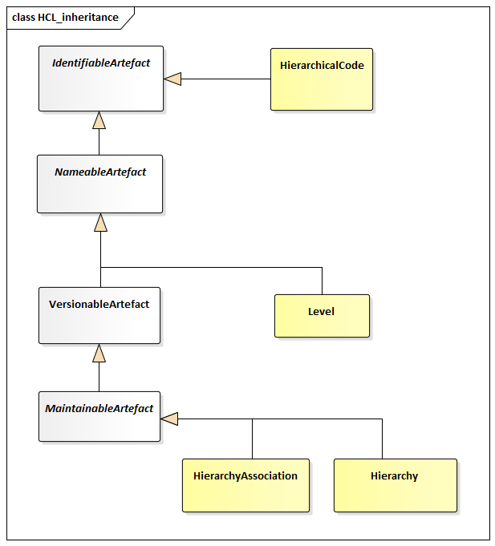
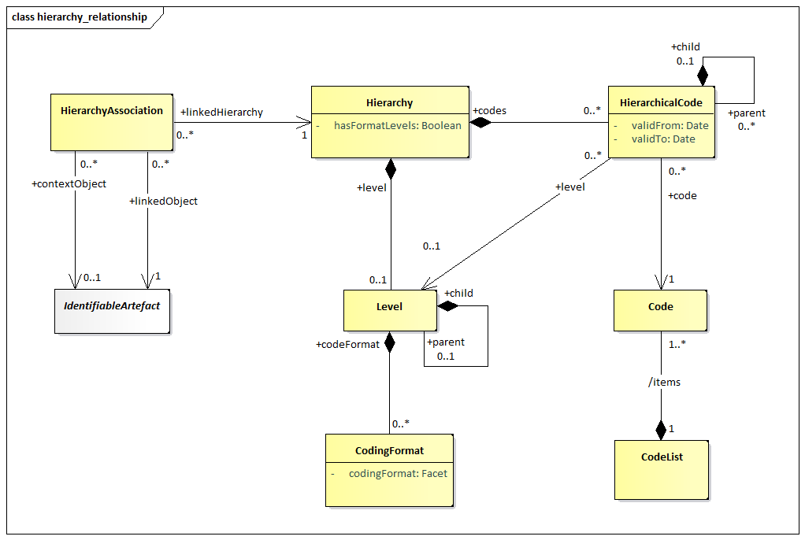

# Hierarchy

## Scope

The `Codelist` described in the section on structural definitions supports
a simple hierarchy of `Code`s and restricts any child `Code` to having just
one parent `Code`. Whilst this structure is useful for supporting the
needs of the `DataStructureDefinition` and the
`MetadataStructureDefinition`, it may not be sufficient for supporting the
more complex associations between codes that are often found in coding
schemes such as a classification scheme. Often, the `Codelist` used in a
`DataStructureDefinition` is derived from a more complex coding scheme.
Access to such a coding scheme can aid applications, such as OLAP
applications or data visualisation systems, to give more views of the
data than would be possible with the simple `Codelist` used in the
`DataStructureDefinition`. A `Hierarchy` may be linked to an
`IndentifiableArtefact`, in order to assist

Note that a `Hierarchy` is not necessarily a balanced tree. A balanced
tree is where levels are pre-defined and fixed, (i.e. a level always has
the same set of codes, and any code has a fixed parent and child
relationship to other codes). A statistical classification is an example
of a balanced tree, and the support for a balanced hierarchy is a
subset, and special case, of hierarchies.

The principal features of the `Hierarchy` are:

1. A child code can have more than one parent.
2. There can be more than one code that has no parent (i.e. more than
    one “root node”).
3. The levels in a hierarchy can be explicitly defined or they can be
    implicit: i.e. they exist only as parent/child relationships in the
    coding structure.
4. Hierarchies may be associated to the structures they refer to, via
    the `HierarchyAssociation`.

## Inheritance

### Class Diagram

/// figure-caption | 35
Inheritance class diagram for the `Hierarchy`
///

### Explanation of the Diagram

#### Narrative

The `Hierarchy` and `HierarchyAssociation` inherit from
`MaintainableArtefact` and thus have identification, naming, versioning
and a maintenance agency. The `Level` is a `NameableArtefact` and
therefore has an Id, multi-lingual name and multi-lingual description. A
`HierachicalCode` is an `IdentifiableArtefact`.

It is important to understand that the `Code`s participating in a
`Hierarchy` are not themselves contained in the list – they are referenced
from the list and are maintained in one or more `Codelist`s. This is
explained in the narrative of the relationship class diagram below.

#### Definitions

The definitions of the various classes, attributes, and associations are
shown in the relationship section below.

## Relationship

### Class Diagram

/// figure-caption
Relationship class diagram of the `Hierarchy`
///

### Explanation of the Diagram

#### Narrative

The basic principles of the `Hierarchy` are:

1. The `Hierarchy` is a specification of the structure of the `Code`s.
2. The `Code`s in the `Hierarchy` are not themselves a part of the
    artefact, rather they are references to `Code`s in one or more
    external `Codelist`s.
3. The hierarchy of `Code`s is specified in `HierarchicalCode`. This
    references the `Code` and its immediate child `HierarchicalCodes`.

A `Hierarchy` can have formal levels (`hasFormalLevels="true"`). However,
even if `hasFormalLevels="false"` the `Hierarchy` can still have one or more
Levels associated in order to document information about the
`HierarchicalCodes`.

If `hasFormalLevels="false"` the `Hierarchy` is “value based” comprising a
hierarchy of codes with no formal Levels. If `hasFormalLevels="true"` then
the hierarchy is “level based” where each Level is a formal Level in the
`Hierarchy`, such as those present in statistical classifications. In a
“level based” hierarchy each `HierarchicalCode` is linked to the Level in
which it resides. It is expected that all `HierarchicalCodes` at the same
hierarchic level defined by the `+parent`/`+child` association will be
linked to the same Level. Note that the `+level` association need only be
specified if the `HierarchicalCode` is at a different hierarchical level
(implied by the `HierarchicalCode` parent/child association) than the
actual Level in the level hierarchy (implied by the Level parent/child
association).

\[Note that organisations wishing to be compliant with accepted models
for statistical classifications should ensure that the Id is the number
associated with the `Level`, where `Level`s are numbered consecutively
starting with level 1 at the highest Level\].

The `Level` may have `CodingFormat` information defined (e.g. coding type at
that level).

A `HierarchyAssociation` links an `IdentifiableArtefact` (`+linkedObject`),
that needs a `Hierarchy`, with the latter (`+linkedHierarchy`). The
association is performed in a certain context (`+contextObject`), e.g. a
Dimension in the context of a Dataflow.

#### Definitions

| Class | Feature | Description |
| :--- | :--- | :--- |
| `Hierarchy` | Inherits from: `MaintainableArtefact` | A classification structure arranged in levels of detail from the broadest to the most detailed level. |
|  | `hasFormalLevels` | If `true`, this indicates a hierarchy where the structure is arranged in levels of detail from the broadest to the most detailed level. If `false`, this indicates a hierarchy structure where the items in the hierarchy have no formal level structure. |
|  | `+codes` | Association to the top-level hierarchical `Code`s in the `Hierarchy`. |
|  | `+level` | Association to the top `Level` in the `Hierarchy`. |
| `Level` | Inherits from `NameableArtefact` | In a "level based" hierarchy this describes a group of `Code`s which are characterised by homogeneous coding, and where the parent of each `Code` in the group is at the same higher level of the `Hierarchy`. In a "value based" hierarchy this describes information about the hierarchical `Code`s at the specified nesting level. |
|  | `+codeFormat` | Association to the `CodingFormat`. |
|  | `+child` | Association to a child `Level` of `Level`. |
| `CodingFormat` |  | Specifies format information for the codes at this level in the hierarchy such as whether the codes at the level are alphabetic, numeric or alphanumeric and the code length. |
| `HierarchicalCode` |  | A hierarchic structure of code references. |
|  | `validFrom` | Date from which the construct is valid. |
|  | `validTo` | Date from which the construct is superseded. |
|  | `+code` | Association to the `Code` that is used at the specific point in the hierarchy. |
|  | `+child` | Association to a child `Code` in the hierarchy. |
|  | `+level` | Association to a `Level` where levels have been defined for the `Hierarchy`. |
| `Code` |  | The `Code` to be used at this point in the hierarchy. |
|  | `/items` | Association to the `Codelist` containing the `Code`. |
| `Codelist` |  | The `Codelist` containing the `Code`. |
| `HierarchyAssociation` | Inherits from: `MaintainableArtefact` | An association between an `IdentifiableArtefact` and a `Hierarchy`, within a specific context. |
|  | `+contextObject` | The context within which the association is performed. |
|  | `+linkedObject` | Associates the `IdentifiableArtefact` that needs the `Hierarchy`. |
|  | `+linkedHierarchy` | Associates the `Hierarchy`. |
