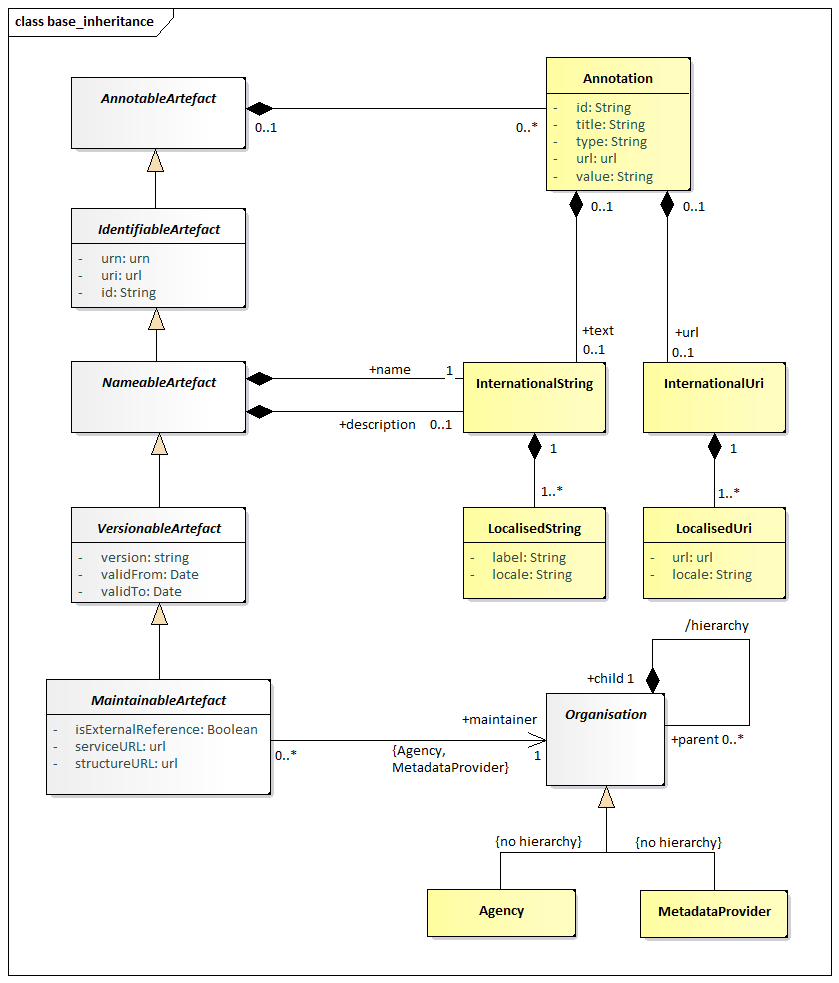
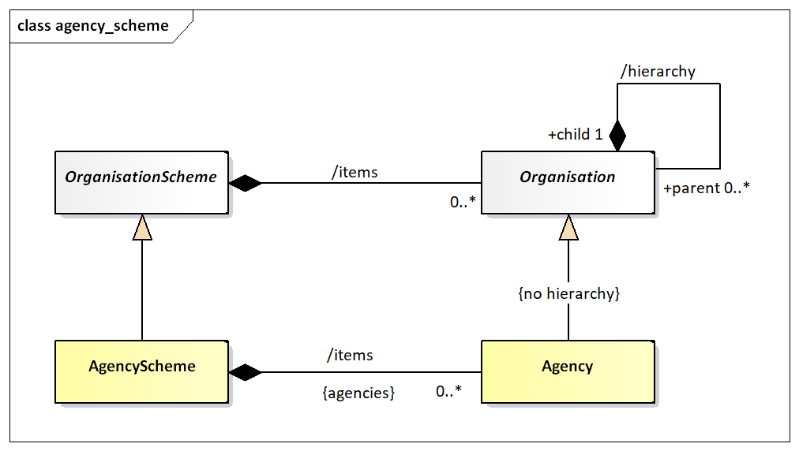
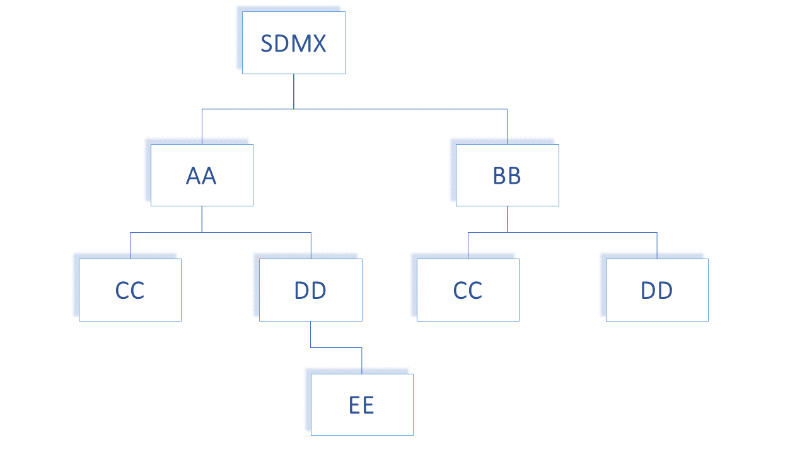

# 6 Identification of SDMX Objects

## 6.1 Identification, Versioning, and Maintenance

All major classes of the SDMX Information model inherit from one of:

- ***IdentifiableArtefact*** – this gives an object the ability to be
    uniquely identified (see following section on identification), to
    have a user-defined URI, and to have multi-lingual annotations.
- ***NameableArtefact*** – this has all of the features of
    *IdentifiableArtefact* plus the ability to have a multi-lingual name
    and description.
- ***VersionableArtefact*** – this has all of the above features plus
    a version number, according to the SDMX versioning rules in SDMX
    Standards Section 6 “Technical Notes”, paragraph “4.3 Versioning”,
    and a validity period.
- ***MaintainableArtefact*** – this has all of the above features,
    plus registry and structure URIs, and an association to the
    maintenance organisation of the object.

### 6.1.1 Identification, Naming, Versioning, and Maintenance Model

/// caption
Figure 5: Class diagram of fundamental artefacts in the SDMX-IM
///

The table below shows the identification and related data attributes to
be stored in a registry for objects that are one of:

- *Annotable*
- *Identifiable*
- *Nameable*
- *Versionable*
- *Maintainable*

| <strong>Object Type</strong> | <strong>Data Attributes</strong> | <strong>Status</strong> | <strong>Data type</strong> | <strong>Notes</strong> |
| :--- | :--- | :--- | :--- | :--- |
| <em>Annotable</em> | AnnotationTitle | C | string |  |
| AnnotationType | C | string |  |
| AnnotationURN | C | string |  |
| AnnotationText in the form of InternationalString | C |  | This can have language-specific variants |
| <em>Identifiable</em> | All content as for <em>Annotable</em> plus |  |  |  |
| id | M | string |  |
| uri | C | string |  |
| urn | C | string | Although the urn is computable and therefore may not be submitted or stored physically, the Registry must return the urn for each object, and must be able to service a query on an object referenced solely by its urn. |
| <em>Nameable</em> | All content as for <em>Identifiable</em> plus |  |  |  |
| Name in the form of InternationalString | M | string | This can have language specific variants. |
| Description in the form of InternationalString | C | string | This can have language specific variants. |
| <em>Versionable</em> | All content as for <em>Identifiable</em> plus |  |  |  |
| version | M | string | This is the version number according to SDMX versioning rules. |
| validFrom | C | Date/time |  |
| validTo | C | Date/time |  |
| <em>Maintainable</em> | All content as for <em>Versionable</em> plus |  |  |  |
| isExternalReference | C | boolean | Value of “true” indicates that the actual resource is held outside of this registry. The actual reference is given in the registry URI or the structureURL, each of which must return a valid SDMX-ML file. |
| serviceURL | C | string | The url of the service that can be queried for this resource. |
| structureURL | C | string | The url of the resource. |
| (Maintenance) organisationId | M | string | The object must be linked to a maintenance organisation, i.e., Agency or Metadata Provider. |
/// caption
Table 1: Common Attributes of Object Types
///

## 6.2 Unique identification of SDMX objects 

### 6.2.1 Agencies and Metadata Providers

The Maintenance Agency in SDMX is maintained in an Agency Scheme which
itself is a sub class of Organisation Scheme – this is shown in the
class diagram below.

/// caption
Figure 6: Agency Scheme Model
///

The Agency in SDMX is extremely important. The Agency Id system used in
SDMX is an n-level structure. The top level of this structure is
maintained by SDMX. Any Agency in this top level can declare sub
agencies and any sub agency can also declare sub agencies. The Agency
Scheme has a fixed id and version (version ‘1.0’) and is never declared
explicitly in the SDMX object identification mechanism.

In order to achieve this SDMX adopts the following rules:

- Agencies are maintained in an Agency Scheme (which is a sub class of
    Organisation Scheme).
- The agency of the Agency Scheme must also be declared in a
    (different) Agency Scheme.
- The “top-level” agency is SDMX and maintains the “top-level” Agency
    Scheme.
- Agencies registered in the top-level scheme can themselves maintain
    a single Agency Scheme. Agencies in these second-tier schemes can
    themselves maintain a single Agency Scheme and so on.
- The AgencyScheme has a fixed version, i.e., ‘1.0’, hence it is an
    exception from the Semantic Versioning that other Artefacts follow.
- There can be only one AgencyScheme maintained by any one Agency. It
    has a fixed id of AGENCIES.
- The /hierarchy of Organisation is not inherited by Maintenance
    Agency – thus each Agency Scheme is a flat list of Maintenance
    Agencies.
- The format of the agency identifier is agencyID.agencyID etc. The
    top-level agency in this identification mechanism is the agency
    registered in the SDMX agency scheme. In other words, SDMX is not a
    part of the hierarchical ID structure for agencies. However, SDMX
    is, itself, a maintenance agency and is contained in the top-level
    Agency Scheme.

This supports a hierarchical structure of agencyID.

An example is shown below.

The following organizations maintain an Agency Scheme.

- SDMX – contains Agencies AA, BB
- AA – contains Agencies CC, DD
- BB – contains Agencies CC, DD
- DD – Contains Agency EE

Each agency is identified by its full hierarchy excluding SDMX.

e.g., the id of EE as an agencyID is AA.DD.EE

An example of this is shown in the XML snippet below:

**&lt;str:Codelists&gt;  
&lt;str:Codelist id="CL\_FREQ" agencyID="SDMX" version="1.0.0"&gt;  
&lt;com:Name xml:lang="en"&gt;Standard frequency
Codelist&lt;/com:Name&gt;  
&lt;/str:Codelist&gt;  
&lt;str:Codelist id="CL\_FREQ" agencyID="AA" version="1.0.0"&gt;  
&lt;com:Name xml:lang="en"&gt;Codelist maintained by agency
AA&lt;/com:Name&gt;  
&lt;/str:Codelist&gt;  
&lt;str:Codelist id="CL\_FREQ" agencyID="AA.CC" version="1.0.0"&gt;  
&lt;com:Name xml:lang="en"&gt;Codelist maintained by the AA unit
CC&lt;/com:Name&gt;  
&lt;/str:Codelist&gt;  
&lt;str:Codelist id="CL\_FREQ" agencyID="BB.CC" version="1.0.0"&gt;  
&lt;com:Name xml:lang="en"&gt;Codelist maintained by the BB unit
CC&lt;/com:Name&gt;  
&lt;/str:Codelist&gt;**

Figure 8: Example Showing Use of Agency Identifiers

Each of these maintenance agencies has an identical Code list with the
Id CL\_BOP. However, each is uniquely identified by means of the
hierarchic agency structure.

Following the same principles, the Metadata Provider is the maintenance
organisation for a special subset of Maintainable Artefacts, i.e., the
Metadatasets; the latter are the containers of reference metadata
combined with a target that those metadata refer to.

### 6.2.2 Universal Resource Name (URN)

#### 6.2.2.1 Introduction

To provide interoperability between SDMX Registry/Repositories in a
distributed network environment, it is important to have a scheme for
uniquely identifying (and thus accessing) all first-class (Identifiable)
SDMX-IM objects. Most of these unique identifiers are composite
(containing maintenance agency, or parent object identifiers), and there
is a need to be able to construct a unique reference as a single string.
This is achieved by having a globally unique identifier called a
universal resource name (URN) which is generated from the actual
identification components in the SDMX-RR APIs. In other words, the URN
for any Identifiable Artefact is constructed from its component
identifiers (agency, id, version etc.).

#### 6.2.2.2 URN Structure

##### Case Rules for URN

For the URN, all parts of the string are case sensitive. The generic
structure of the URN is as follows:

SDMXprefix.SDMX-IM-package-name.class-name=agencyid:maintainedobject-id(maintainedobject-version).\*containerobject-id.object-id

\* this can repeat and may not be present (see explanation below)

Note that in the SDMX Information Model there are no concrete
Versionable Artefacts that are not a Maintainable Artefact. For this
reason, the only version information that is allowed is for the
maintainable object.

The Maintenance agency identifier is separated from the maintainable
artefact identifier by a colon ‘:’. All other identifiers in the SDMX
URN syntax are separated by a period ‘.’. The version information is
encapsulated in parentheses ‘()’ and adheres to the SDMX versioning
rules, as explained in SDMX Standards Section 6 “Technical Notes”,
paragraph “4.3 Versioning.

#### 6.2.2.3 Explanation of the generic structure 

In the explanation below the actual object that is the target of the URN
is called the **actual object**.

**SDMXPrefix**: urn:sdmx:org

**SDMX-IM-package-name**: sdmx.infomodel.package=

The packages are:

- base
- codelist
- conceptscheme
- datastructure
- categoryscheme
- registry
- metadatastructure
- process
- structuremapping
- transformation

**maintainable-object-id** is the identifier of the maintainable object.
This will always be present as all identifiable objects are either a
maintainable object or contained in a maintainable object.

**maintainable-object-version** is the version, according to the SDMX
versioning rules, of the maintainable object and is enclosed in
parentheses ‘()’, which are always present.

**container-object-id** is the identifier of an intermediary object that
contains the actual object which the URN is identifying. It is not
mandatory as many actual objects do not have an intermediary container
object. For instance, a Code is in a maintained object (Codelist) and
has no intermediary container object, whereas a MetadataAttribute has an
intermediary container object (MetadataAttributeDescriptor) and may have
an intermediary container object, which is its parent MetadataAttribute.
For this reason, the container object id may repeat, with each
repetition identifying the object at the next-lower level in its
hierarchy. Note that if there is only a single containing object in the
model then it is NOT included in the URN structure. This applies to
AttributeDescriptor, DimensionDescriptor, and MeasureDescriptor where
there can be only one such object and this object has a fixed id.
Therefore, whilst each of these has a URN, the id of the
AttributeDescriptor, DimensionDescriptor, and MeasureDescriptor is not
included when the actual object is a DataAttribute or a Dimension/
TimeDimension, or a Measure.

Note that although a Code can have a parent Code and a Concept can have
a parent Concept these are maintained in a flat structure and therefore
do not have a container-object-id.

For example, the sequence is agency:DSDid(version).DimensionId and not
agency:DSDid(version).DimensionDescriptorId.DimensionId.

object-id is the identifier of the actual object unless the actual
object is a *Maintainable* object. If present it is always the last id
and is not followed by any other character.

##### Generic Examples of the URN Structure

<u>Actual object is a maintainable</u>

SDMXPrefix.SDMX-IM-package-name.classname=agencyid:maintained-object-id(version)

<u>Actual object is contained in a maintained object with no
intermediate containing object</u>

SDMXPrefix.SDMX-IM-package-name.classname=agencyid:maintained-object-id(version).object-id

<u>Actual object is contained in a maintained object with an
intermediate containing object</u>

SDMXPrefix.SDMX-IM-package-name.classname=agencyid:maintained-object-id(version).contained-object-id.object-id

<u>Actual object is contained in a maintained object with no
intermediate containing</u> <u>object but the object type itself is
hierarchical</u>

In this case the object id may not be unique in itself but only within
the context of the hierarchy. In the general syntax of the URN all
intermediary objects in the structure (with the exception, of course, of
the maintained object) are shown as a contained object. An example here
would be a Category in a CategoryScheme. The Category is hierarchical,
and all intermediate Categories are shown as a contained object. The
example below shows the generic structure for CategoryScheme/ Category/
Category.

SDMXPrefix.SDMX-IM-package-name.classname=agencyid:maintained-object-id(version).contained-object-id.object-id

Actual object is contained in a maintained object with an intermediate
containing object and the object type itself is hierarchical

In this case the generic syntax is the same as for the example above as
the parent object is regarded as a containing object, even if it is of
the same type. An example here is a MetadataAttribute where the
contained objects are MetadataAttributeDescriptor (first contained
object id) and MetadataAttribute (subsequent contained object ids). The
example below shows the generic structure for MSD/
MetadataAttributeDescriptor/ MetadataAttribute/ MetadataAttribute

SDMXPrefix.SDMX-IM-package-name.classname=agencyid:maintained-object-id(version).contained-object-id.contained-object-id
contained-object-id.object-id

##### Concrete Examples of the URN Structure

The Data Structure Definition CRED\_EXT\_DEBT of legacy version 2.1
maintained by the top-level Agency TFFS would have the URN:

urn:sdmx:org.sdmx.infomodel.datastructure.DataStucture=TFFS:CRED\_EXT\_
DEBT(2.1)

The URN for a code for Argentina maintained by ISO in the code list
CL\_3166A2 of semantic version 1.0.0 would be:

urn:sdmx:org.sdmx.infomodel.codelist.Code=ISO:CL\_3166A2(1.0.0).AR

The URN for a category (id of 1) which has parent category (id of 2)
maintained by SDMX in the category scheme SUBJECT\_MATTER\_DOMAINS of
the semantic extended version 1.0.0-draft would be:

urn:sdmx:org.sdmx.infomodel.categoryscheme.Category=SDMX:SUBJECT\_MATTER\_DOMAINS(1.0.0-draft).1.2

The URN for a Metadata Attribute maintained by SDMX in the MSD
CONTACT\_METADATA of semantic version 1.0.0 where the hierarchy of the
Metadata Attribute is CONTACT\_DETAILS/CONTACT\_NAME would be:

urn:sdmx:org.sdmx.infomodel.metadatastructure.MetadataAttribute=SDMX:CONTACT\_METADATA(1.0.0).CONTACT\_DETAILS.CONTACT\_NAME

The TFFS defines ABC as a sub-Agency of TFFS then the URN of a Dataflow
maintained by ABC and identified as EXTERNAL\_DEBT of semantic version
1.0.0 would be:

urn:sdmx:org.sdmx.infomodel.datastructure.Dataflow=TFFS.ABC:EXTERNAL\_DEBT(1.0.0)

The SDMX-RR MUST support this globally unique identification scheme. The
SDMX-RR MUST be able to create the URN from the individual
identification attributes submitted and to transform the URN to these
identification attributes. The identification attributes are:

- **Identifiable and Nameable Artefacts**: id (in some cases this id
    may be hierarchic)

- **Maintainable Artefacts**: id, version, agencyId

The SDMX-RR MUST be able to resolve the unique identifier of an SDMX
artefact and to produce an SDMX-ML rendering of that artefact if it is
located in the Registry.

### 6.2.3 Table of SDMX-IM Packages and Classes

The table below lists all of the packages in the SDMX-IM together with
the concrete classes that are in these packages and whose objects have a
URN.

| <strong>Package</strong> | <strong>URN class name (model class name where this is different)</strong> |
| :--- | :--- |
| base | Agency |
|  | AgencyScheme |
|  | DataConsumer |
|  | DataConsumerScheme |
|  | DataProvider |
|  | DataProviderScheme |
|  | MetadataProvider |
|  | MetadataProviderScheme |
|  | OrganisationUnit |
|  | OrganisationUnitScheme |
|  |  |
| datastructure | AttributeDescriptor |
|  | DataAttribute |
|  | Dataflow |
|  | DataStructure (DataStructureDefinition) |
|  | Dimension |
|  | DimensionDescriptor |
|  | GroupDimensionDescriptor |
|  | Measure |
|  | MeasureDescriptor |
|  | TimeDimension |
|  |  |
| metadatastructure | MetadataAttribute |
|  | MetadataAttributeDescriptor |
|  | MetadataStructure (MetadataStructureDefinition) |
|  | Metadataflow |
|  | MetadataSet |
|  |  |
| process | Process |
|  | ProcessStep |
|  | Transition |
|  |  |
| registry | DataConstraint |
|  | MetadataConstraint |
|  | MetadataProvisionAgreement |
|  | ProvisionAgreement |
|  | Subscription |
|  |  |
| structuremapping | CategorySchemeMap |
|  | ConceptSchemeMap |
|  | OrganisationSchemeMap |
|  | ReportingTaxonomyMap |
|  | RepresentationMap |
|  | StructureMap |
|  |  |
| codelist | Code |
|  | Codelist |
|  | HierarchicalCode |
|  | Hierarchy |
|  | HierarchyAssociation |
|  | Level |
|  | ValueList |
|  |  |
| categoryscheme | Categorisation |
|  | Category |
|  | CategoryScheme |
|  | ReportingCategory |
|  | ReportingTaxonomy |
|  |  |
| conceptscheme | Concept |
|  | ConceptScheme |
|  |  |
| transformation | CustomType |
|  | CustomTypeScheme |
|  | NamePersonalisation |
|  | NamePersonalisationScheme |
|  | Ruleset |
|  | RulesetScheme |
|  | Transformation |
|  | TransformationScheme |
|  | UserDefinedOperator |
|  | UserDefinedOperatorScheme |
|  | VtlCodelistMapping |
|  | VtlConceptMapping |
|  | VtlDataflowMapping |
|  | VtlMappingScheme |
|  |  |

Table 2: SDMX-IM Packages and Contained Classes

### 6.2.4 URN Identification components of SDMX objects 

The table below describes the identification components for all SDMX
object types that have identification. Note the actual attributes are
all ‘id’ but have been prefixed by their class name or multiple class
names to show navigation, e.g., ‘conceptSchemeAgencyId’ is really the
‘Id’ attribute of the Agency class that is associated to the
ConceptScheme.

Note that for brevity the URN examples omit the prefix (classnames in
italics indicate maintainable objects, keywords in bold indicate fixed
value) All URNs have the prefix:

urn:sdmx.org.sdmx.infomodel.{package}.{classname}=

| <strong>Classname</strong> | <strong>Ending URN pattern</strong> | <strong>Example</strong> |
| :--- | :--- | :--- |
| Agency<a class="footnote-ref" href="#fn1" id="fnref1" role="doc-noteref">1</a> | agencySchemeAgencyId:<strong>AGENCIES</strong>(<strong>1.0</strong>).agencyId | ECB:<strong>AGENCIES</strong>(<strong>1.0</strong>).AA |
| <em>AgencyScheme</em> | agencySchemeAgencyId:<strong>AGENCIES</strong>(<strong>1.0</strong>) | ECB:<strong>AGENCIES</strong>(<strong>1.0</strong>) |
| <em>Categorisation</em> | categorisationAgencyId:categorisationId(version) | IMF:cat001(1.0.0) |
| Category | categorySchemeAgencyId:categorySchemeId(version).categoryId.categoryId.categoryId etc. | IMF:SDDS(1.0.0):level_1_category.level_2_category … |
| <em>CategoryScheme</em> | categorySchemeAgencyId:categorySchemeId(version) | IMF:SDDS(1.0.0) |
| <em>CategorySchemeMap</em> | catSchemeMapAgencyId:catSchemeMapId(version) | SDMX:EUROSTAT_SUBJECT_DOMAIN(1.0.0) |
| Code | codeListAgencyId:codelistId(version).codeId | SDMX:CL_FREQ(1.0.0).Q |
| <em>Codelist</em> | codeListAgencyId:codeListId(version) | SDMX:CL_FREQ(1.0.0) |
| ComponentMap | structureMapAgencyId:structureMap(version).componentMapId | SDMX:BOP_STRUCTURES(1.0.0).REF_AREA_TO_COUNTRY |
| Concept | conceptSchemeAgencyId:conceptSchemeId(version).conceptId | SDMX:CROSS_DOMAIN_CONCEPTS(1.0.0).FREQ |
| <em>ConceptScheme</em> | conceptSchemeAgencyId:conceptSchemeId(version) | SDMX:CROSS_DOMAIN_CONCEPTS(1.0.0) |
| <em>ConceptSchemeMap</em> | conceptSchemeMapAgencyId:conceptSchemeMapId(version) | SDMX:CONCEPT_MAP(1.0.0) |
| CustomType | 
customTypeSchemeAgencyId
 
customTypeSchemeId(version)
 
customTypeId
 | ECB: CUSTOM_TYPE_SCHEME(1.0.0).CUSTOM_TYPE_1 |
| <em>CustomTypeScheme</em> | 
customTypeSchemeAgencyId
 
customTypeSchemeId(version)
 | ECB:CUSTOM_TYPE_SCHEME(1.0.0) |
| DataAttrribute | dataStructureDefinitionAgencyId:dataStructureDefinitionId(version).dataAttributeId | TFFS:EXT_DEBT(1.0.0).OBS_STATUS |
| <em>DataConstraint</em> | dataConstraintAgencyId:dataConstraintId(version) | TFFS:CREDITOR_DATA_CONTENT(1.0.0) |
| DataConsumer | dataConsumerSchemeAgencyId:<strong>DATA_CONSUMERS</strong>(<strong>1.0</strong>).dataConsumerId | SDMX:<strong>DATA_CONSUMERS</strong>(<strong>1.0</strong>).CONSUMER_1 |
| <em>DataConsumerScheme</em> | dataConsumerSchemeAgencyId:<strong>DATA_CONSUMERS</strong>(<strong>1.0</strong>) | SDMX:<strong>DATA_CONSUMERS</strong>(<strong>1.0</strong>) |
| <em>Dataflow</em> | dataflowAgencyId:dataflowId(version) | TFFS:CRED_EXT_DEBT(1.0.0) |
| DataProvider | dataProviderSchemeAgencyId:<strong>DATA_PROVIDERS</strong>(<strong>1.0</strong>).dataProviderId | SDMX:<strong>DATA_PROVIDERS</strong>(<strong>1.0</strong>).PROVIDER_1 |
| <em>DataProviderScheme</em> | dataProviderSchemeAgencyId:<strong>DATA_PROVIDERS</strong>(<strong>1.0</strong>) | SDMX:<strong>DATA_PROVIDERS</strong>(<strong>1.0</strong>) |
| <em>DataStructure</em> | dataStructureDefinitionAgencyId:dataStructureDefinitionId(version) | TFFS:EXT_DEBT(1.0.0) |
| Dimension | dataStructureDefinitionAgencyId:dataStructureDefinitionId(version).dimensionId | TFFS:EXT_DEBT(1.0.0).FREQ |
| DimensionDescriptor  MeasureDescriptor  AttributeDescriptor | dataStructureDefinitionAgencyId:dataStructureDefinitionId(version).componentListId  where the componentListId is the name of the class (there is only one occurrence of each in the Data Structure Definition) | TFFS:EXT_DEBT(1.0.0).DimensionDescriptor  TFFS:EXT_DEBT(1.0.0).MeasureDescriptor  TFFS:EXT_DEBT(1.0.0).AttributeDescriptor |
| GroupDimensionDescriptor | dataStructureDefinitionAgencyId:dataStructureDefinitionId(version).groupDimensionDescriptorId | TFFS:EXT_DEBT(1.0.0).SIBLING |
| HierarchicalCode | hierarchyAgencyId:hierarchyId(version).hierarchicalCode.hierarchicalCode | UNESCO:H-C-GOV(1.0.0).GOV_CODE1.GOV_CODE1_1 |
| <em>Hierarchy</em> | hierarchyAgencyId:hierarchyId(version) | UNESCO:H-C-GOV(1.0.0) |
| <em>HierarchyAssociation</em> | hierarchyAssociationAgencyId:hierarchyAssociationId(version) | UNESCO:CL_EXP_SOURCE(1.0.0) |
| Level | hierarchyAgencyId:hierarchyId(version).level | UNESCO:H-C-GOV(1.0.0).LVL1 |
| Measure | dataStructureDefinitionAgencyId:dataStructureDefinitionId(version).measureId | TFFS:EXT_DEBT(1.0.0).OBS_VALUE |
| MetadataAttribute | msdAgencyId:msdId(version).metadataAttributeId.metadataAttributeId | IMF:SDDS_MSD(1.0.0).COMPILATION.METHOD |
| MetadataAttributeDescriptor | msdAgencyId:msdId(version).metadataAttributeDescriptorId | IMF:SDDS_MSD(1.0.0).MetadataAttributeDescriptor |
| <em>MetadataConstraint</em> | metadataConstraintAgencyId:metadataConstraintId(version) | TFFS:CREDITOR_METADATA_CONTENT(1.0.0) |
| <em>Metadataflow</em> | metadataflowAgencyId:metadataflowId(version) | IMF:SDDS_MDF(1.0.0) |
| MetadataProvider | metadataProviderSchemeAgencyId:<strong>METADATA_PROVIDERS</strong>(<strong>1.0</strong>).metadataProviderId | SDMX:<strong>METADATA_PROVIDERS</strong>(<strong>1.0</strong>).MD_PROVIDER_1 |
| <em>MetadataProviderScheme</em> | metadataProviderSchemeAgencyId:<strong>METADATA_PROVIDERS</strong>(<strong>1.0</strong>) | SDMX:<strong>METADATA_PROVIDERS</strong>(<strong>1.0</strong>) |
| <em>MetadataProvisionAgreement</em> | metadataProvisionAgreementAgencyId:metadataProvisionAgreementId(version) | IMF:SDDS_MDF_AB(1.0.0) |
| <em>MetadataSet</em> | metadataProviderId:metadataSetId(version) | MD_PROVIDER:METADATASET(1.0.0) |
| <em>MetadataStructure</em> | msdAgencyId:msdId(version) | IMF:SDDS_MSD(1.0.0) |
| NamePersonalisation | 
namePersonalisationSchemeAgencyId
 
namePersonalisationSchemeId(version)
 
namePersonalisationId
 | ECB:PSN_SCHEME(1.0.0).PSN1234 |
| <em>NamePersonalisationScheme</em> | 
namePersonalisationSchemeAgencyId
 
namePersonalisationSchemeId(version)
 | ECB:PSN_SCHEME(1.0.0) |
| <em>OrganisationSchemeMap</em> | orgSchemeMapAgencyId:orgSchemeMapId(version) | SDMX:AGENCIES_PROVIDERS(1.0.0) |
| OrganisationUnit | organisationUnitSchemeAgencyId:organisationUnitSchemeId(version).organisationUnitId | ECB:ORGANISATIONS(1.0.0).1F |
| <em>OrganisationUnitScheme</em> | organisationUnitSchemeAgencyId:organisationUnitSchemeId(version) | ECB:ORGANISATIONS(1.0.0) |
| <em>Process</em> | processAgencyId:processId{version) | BIS:PROCESS1(1.0.0) |
| ProcessStep | processAgencyId:processId(version).processStepId.processStepId | BIS:PROCESS1(1.0.0).STEP1.STEP1_1 |
| <em>ProvisionAgreement</em> | provisionAgreementAgencyId:provisionAgreementId(version) | TFFS:CRED_EXT_DEBT_AB(1.0.0) |
| ReportingCategory | reportingTaxonomyAgencyId: reportingTaxonomyId(version).reportingCategoryId.reportingCategoryId | IMF:REP_1(1.0.0):LVL1_REP_CAT.LVL2_REP_CAT |
| <em>ReportingTaxonomy</em> | reportingTaxonomyAgencyId:reportingTaxonomyId(version) | IMF:REP_1(1.0.0) |
| <em>ReportingTaxonomyMap</em> | repTaxonomyAgencyId:repTaxonomyId(version) | SDMX:RT_MAP(1.0.0) |
| <em>RepresentationMap</em> | repMapAgencyId:repMapId(version) | SDMX:REF_AREA_MAPPING(1.0.0) |
| Ruleset | 
rulesetSchemeAgencyId
 
rulesetSchemeId(version)
 
rulesetId
 | ECB:RULESET_23(1.0.0).SET111 |
| <em>RulesetScheme</em> | 
rulesetSchemeAgencyId
 
rulesetSchemeId(version)
 | ECB:RULESET_23(1.0.0) |
| <em>StructureMap</em> | structureMapAgencyId:structureMap(version) | SDMX:BOP_STRUCTURES(1.0.0) |
| Subscription | The Subscription is not itself an Identifiable Artefact and therefore it does not follow the rules for URN structure.  The name of the URN is registryURN  There is no pre-determined format. | This cannot be generated by a common mechanism as subscriptions, although maintainable in the sense that they can be submitted and deleted, are not mandated to be created by a maintenance agency and have no versioning mechanism. It is therefore the responsibility of the target registry to generate a unique Id for the Subscription, and for the application creating the subscription to store the registry URN that is returned from the registry in the subscription response message. |
| TimeDimension | dataStructureDefinitionAgencyId:dataStructureDefinitionId(version).timeDimensionId | TFFS:EXT_DEBT(1.0.0).TIME_PERIOD |
| Transformation | 
transformationSchemeAgencyId
 
transformationSchemeId(version)
 
transformationId
 | ECB:TRANSFORMATION_SCHEME(1.0.0).TRANS_1 |
| <em>TransformationScheme</em> | transformationSchemeAgencyId transformationSchemeId(version) | ECB: TRANSFORMATION_SCHEME(1.0.0) |
| Transition | processAgencyId:processId(version).processStepId.transitionId | BIS:PROCESS1(1.0.0).STEP1.TRANSITION1 |
| UserDefinedOperator | 
userDefinedOperatorSchemeAgencyId
 
userDefinedOperatorSchemeId(version)
 
usserDefinedOperatorId
 | ECB:OS_CALC(1.2.0).OS267 |
| <em>UserDefinedOperatorScheme</em> | 
userDefinedOperatorSchemeAgencyId
 
userDefinedOperatorSchemeId(version)
 | ECB:OS_CALC(1.2.0) |
| <em>ValueList</em> | valuelistAgencyId:valuelistId(version) | SDMX:VLIST(1.0.0) |
| VtlCodelistMapping | 
vtlMappingSchemeAgencyId
 
vtlMappingSchemeId(version)
 
vtlCodelistMappingId
 | ECB:CLIST_MP(2.0.0).ABZ |
| VtlConceptMapping | 
vtlMappingSchemeAgencyId
 
vtlMappingSchemeId(version)
 
vtlConceptMappingId
 | ECB:CLIST_MP(1.0.0).XYA |
| VtlDataflowMapping | 
vtlMappingSchemeAgencyId
 
vtlMappingSchemeId(version)
 
vtlDataflowMappingId
 | ECB:CLIST_MP(1.0.0).MOQ |
| <em>VtlMappingScheme</em> | 
vtlMappingSchemeAgencyId
 
VtlMappingSchemeId(version)
 | ECB:CLIST_MP(2.0.0) |

<aside id="footnotes" class="footnotes footnotes-end-of-document"
role="doc-endnotes">

<ol>
<li id="fn1">
The identification of an Agency in the URN structure for
the maintainable object is by means of the agencyId. The AgencyScheme is
not identified as SDMX has a mechanism for identifying an Agency
uniquely by its Id. Note that this Id may be hierarchical. For example,
a sub-agency of IMF is referred like this: IMF.SubAgency1<a
href="#fnref1" class="footnote-back" role="doc-backlink">↩︎</a>
</li>
</ol>
</aside>

Table 3: Table of identification components for SDMX Identifiable
Artefacts