# 7 Implementation Notes

## 7.1 Structural Definition Metadata

### 7.1.1 Introduction

The SDMX Registry must have the ability to support agencies in their
role of defining and disseminating structural metadata artefacts. These
artefacts include data structure definitions, code lists, concepts etc.
and are fully defined in the SDMX-IM. An authenticated agency may submit
valid structural metadata definitions which must be stored in the
registry. Note that the term “structural metadata” refers as a general
term to all structural components (Data Structure Definitions, Metadata
Structure Definitions, Code Lists, Concept Schemes, etc.)

At a minimum, structural metadata definitions may be submitted to and
queried from the registry via an HTTP/HTTPS POST in the form of one of
the SDMX-ML messages for structural metadata and the SDMX RESTful API
for structure queries. The message may contain all structural metadata
items for the whole registry, structural metadata items for one
maintenance agency, or individual structural metadata items.

Structural metadata items

- may only be modified by the maintenance agency which created them;
- may only be deleted by the agency which created them;
- may not be deleted if they are referenced from other constructs in
    the Registry.

The level of granularity for the maintenance of SDMX Structural Metadata
objects in the registry is the Maintainable Artefact. Especially for
Item Schemes, though, partial maintenance may be performed, i.e., at the
level of the Item, by submitting an Item Scheme with the 'isPartial'
flag set and a reduced set of Items.

The following table lists the Maintainable Artefacts.

| <strong>Maintainable Artefacts</strong> |  | <strong>Content</strong> |
| :--- | :--- | :--- |
| | <strong>Abstract Class</strong> | <strong>Concrete Class</strong> |  |
| Item Scheme | Codelist | Code |
|  | Concept Scheme | Concept |
|  | Category Scheme | Category |
|  | Organisation Unit Scheme | Organisation Unit |
|  | Agency Scheme | Agency |
|  | Data Provider Scheme | Data Provider |
|  | Metadata Provider Scheme | Metadata Provider |
|  | Data Consumer Scheme | Data Consumer |
|  | Reporting Taxonomy | Reporting Category |
|  | Transformation Scheme | Transformation |
|  | Custom Type Scheme | Custom Type |
|  | Name Personalisation Scheme | Name Personalisation |
|  | Vtl Mapping Scheme | <p>Vtl Codelist Mapping</p><br><p>Vtl Concept Mapping</p> |
|  | Ruleset Scheme | Ruleset |
|  | User Defined Operator Scheme | User Defined Operator |
| Enumerated List | ValueList | Value Item |
| Structure | Data Structure Definition | <p>Dimension Descriptor</p><br><p>Group Dimension Descriptor</p><br><p>Dimension</p><br><p>Time Dimension</p><br><p>Attribute Descriptor</p><br><p>Data Attribute</p><br><p>Measure Descriptor</p><br><p>Measure</p> |
|  | Metadata Structure Definition | <p>Metadata Attribute Descriptor</p><br><p>Metadata Attribute</p> |
| Structure Usage | Dataflow |  |
|  | Metadataflow |  |
| None | Process | Process Step |
| None | Structure Map | <p>Component Map</p><br><p>Epoch Map</p><br><p>Date Pattern Map</p> |
| None | Representation Map | Representation Mapping |
| Item Scheme Map | Organisation Scheme Map | Item Map |
|  | Concept Scheme Map | Item Map |
|  | Category Scheme Map | Item Map |
|  | Reporting Taxonomy Map | Item Map |
| None | Provision Agreement |  |
| None | Metadata Provision Agreement |  |
| None | Hierarchy | Hierarchical Code |
| None | Hierarchy Association |  |
| None | Categorisation |  |
/// caption
Table 4: Table of Maintainable Artefacts for Structural Definition
Metadata
///

### 7.1.2 Item Scheme, Structure

The artefacts included in the structural definitions are:

- All types of Item Scheme (Codelist, Concept Scheme, Category Scheme,
    Organisation Scheme, Agency Scheme, Data Provider Scheme, Metadata
    Provider Scheme, Data Consumer Scheme, Organisation Unit Scheme,
    Transformation Scheme, Name Personalisation Scheme, Custom Type
    Scheme, Vtl Mapping Scheme, Ruleset Scheme, User Defined Operator
    Scheme)
- All types of Enumerated List (ValueList)[^1]
- All types of Structure (Data Structure Definition, Metadata
    Structure Definition)
- All types of Structure Usage (Dataflow, Metadataflow)

### 7.1.3 Structure Usage

#### 7.1.3.1 Structure Usage: Basic Concepts

The Structure Usage defines, in its concrete classes of Dataflow and
Metadataflow, which flows of data and metadata use which specific
Structure, and importantly for the support of data and metadata
discovery, the Structure Usage can be linked to one or more Category in
one or more Category Scheme using the Categorisation mechanism. This
gives the ability for an application to discover data and metadata by
“drilling down” the Category Schemes.

#### 7.1.3.2 Structure Usage Schematic

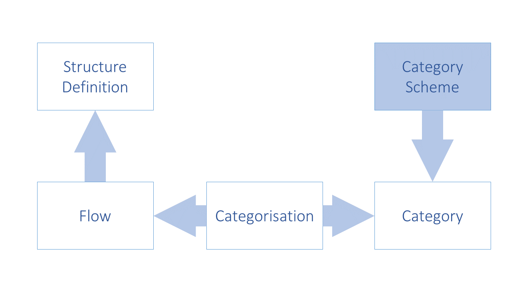
/// caption
Figure 9: Schematic of Linking the Data and Metadata Flows to Categories
and Structure Definitions
///

#### 7.1.3.3 Structure Usage Model 

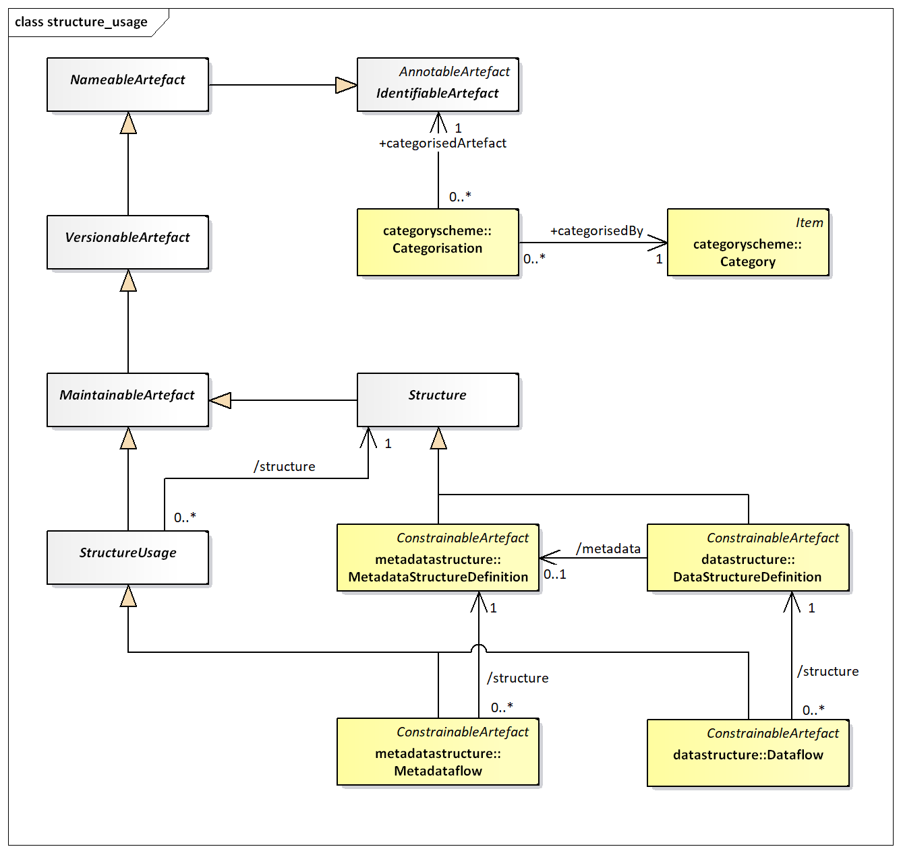
/// caption
Figure 10: SDMX-IM of links from Structure Usage to Category
///

In addition to the maintenance of the Dataflow and the Metadataflow, the
following links must be maintained in the registry:

- Dataflow to Data Structure Definition
- Metadataflow to Metadata Structure Definition

The following links may be created by means of a Categorisation

- Categorisation to Dataflow and Category
- Categorisation to Metadataflow and Category

## 7.2 Data and Metadata Provisioning

### 7.2.1 Provisioning Agreement: Basic concepts

Data/Metadata provisioning defines a framework in which the provision of
different types of statistical data and metadata by various
data/metadata providers can be specified and controlled. This framework
is the basis on which the existence of data can be made known to the
SDMX-enabled community and hence the basis on which data can
subsequently be discovered. Such a framework can be used to regulate the
data content to facilitate the building of intelligent applications. It
can also be used to facilitate the processing implied by service level
agreements, or other provisioning agreements in those scenarios that are
based on legal directives. Additionally, quality and timeliness metadata
can be supported by this framework which makes it practical to implement
information supply chain monitoring.

Note that the term “data provisioning” here includes both the
provisioning of data and metadata.

Although the Provision Agreement directly supports the data-sharing
“pull” model, it is also useful in “push” exchanges (bilateral and
gateway scenarios), or in a dissemination environment. It should be
noted, too, that in any exchange scenario, the registry functions as a
repository of structural metadata.

### 7.2.2 Provisioning Agreement Model – pull use case

An organisation which publishes statistical data or reference metadata
and wishes to make it available to an SDMX enabled community is called a
Data Provider. In terms of the SDMX Information Model, the Data Provider
is maintained in a Data Provider Scheme.

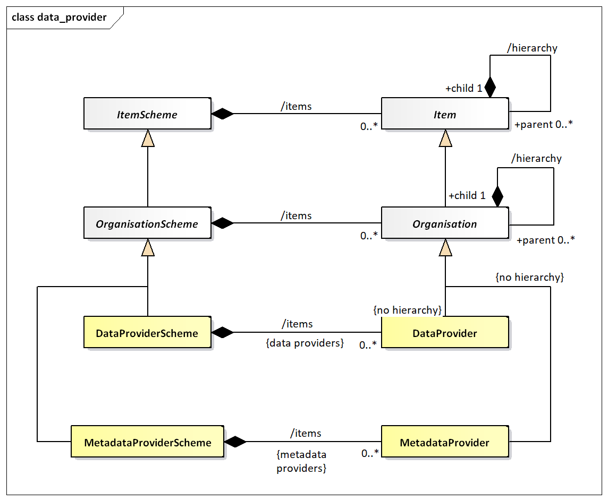
/// caption
Figure 11: SDMX-IM of the Data Provider
///

Note that the Data Provider does not inherit the hierarchy association.
The diagram below shows a logical schematic of the data model classes
required to maintain provision agreements.

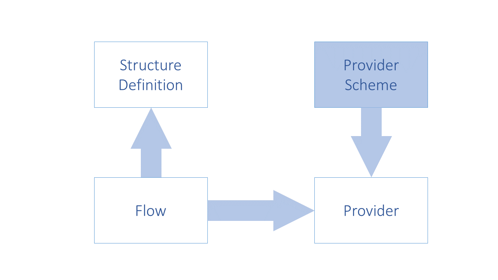
/// caption
Figure 12: Schematic of the Provision Agreement
///

The diagram below is a logical representation of the data required in
order to maintain Provision Agreements.
/// caption
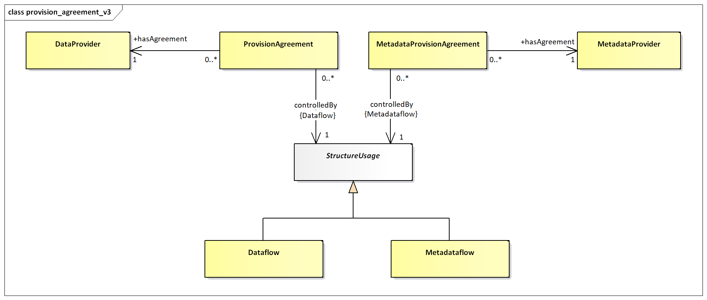
///

Figure 13: Logical class diagram of the information contained in the
Provision Agreement

A Provision Agreement is structural metadata. Each Provision Agreement
must reference a Data Provider or Metadata Provider and a Dataflow or
Metadataflow Definition. The Data/Metadata Provider and the
Dataflow/Metadataflow must exist already in order to set up a Metadata
Provision or Provision Agreement.

## 7.3 Data and Metadata Constraints

### 7.3.1 Data and Metadata Constraints: Basic Concepts

Constraints are, effectively, lists of the valid or actual content of
data and metadata. Constraints can be used to specify a subset of the
theoretical content of data set or metadata set which can be derived
from the specification of the DSD or MSD. A Constraint can comprise a
list of keys or a list of content (usually code values) of a specific
component such as a dimension or attribute.

Constraints comprise the specification of subsets of key or attribute
values that are contained in a data source, or is to be provided for a
Dataflow or Metadataflow, or directly attached to a Data Structure
Definition or Metadata Structure Definition. This is important metadata
because, for example, the full range of possibilities which is implied
by the Data Structure Definition (e.g., the complete set of valid keys
is the Cartesian product of all the values in the code lists for each of
the Dimensions) is often more than is actually present in any specific
data source, or more than is intended to be supplied according to a
specific Dataflow.

Often a Data Provider will not be able to provide data for all key
combinations, either because the combination itself is not meaningful,
or simply because the provider does not have the data for that
combination. In this case the Data Provider could constrain the data
source (at the level of the Provision Agreement or the Data Provider) by
supplying metadata that defines the key combinations or cube regions
that are available. This is done by means of a Constraint. The
Constraint is also used to define a code list subset which is used to
populate a partial code list.

Furthermore, it is often useful to define subsets or views of the Data
Structure Definition which restrict values in some code lists,
especially where many such subsets restrict the same Data Structure
Definition. Such a view is called a Dataflow, and there can be one or
more defined for any Data Structure Definition.

Whenever data is published or made available by a Data Provider, it must
conform to a Dataflow (and hence to a Data Structure Definition). The
Dataflow is thus a means of enabling content based processing.

In addition, Constraints can be extremely useful in a data visualisation
system, such as dissemination of statistics on a website. In such a
system a Cube Region can be used to specify the Dimension codes that
actually exist in a data source (these can be used to build relevant
selection tables), and the Key Set can be used to specify the keys that
exist in a data source (these can be used to guide the user to select
only those Dimension code values that will return data based on the
Dimension values already selected).

### 7.3.2 Data and Metadata Constraints: Schematic

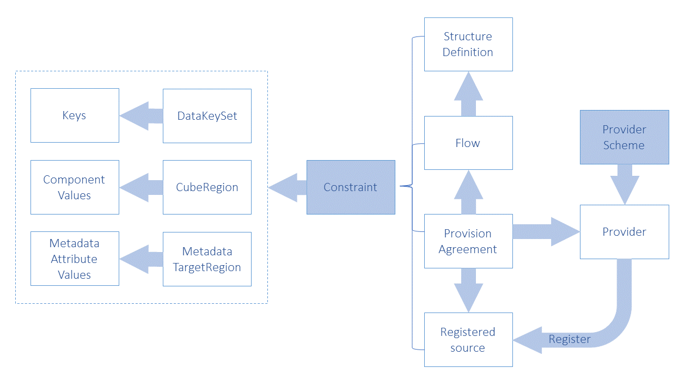
/// caption
Figure 14: Schematic of the Constraint and the Artefacts that can be
constrained
///

### 7.3.3 Data and Metadata Constraints: Model

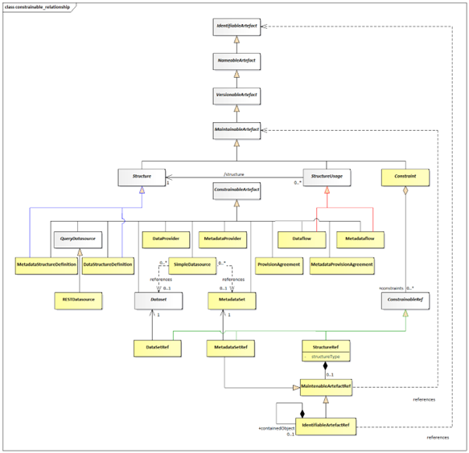
/// caption
Figure 15: Logical class diagram showing inheritance between and
reference to constrainable artefacts
///

Logical class diagram showing inheritance between and reference to
constrainable artefacts

The class diagram above shows that Data Provider, Metadata Provider,
Dataflow, Metadataflow, Provision Agreement, Metadata Provision
Agreement, Data Structure Definition, Metadata Structure Definition,
Simple Datasource and REST Datasource (via the abstract Query
Datasource) are all concrete sub-classes of Constrainable Artefact and
can therefore have Constraints specified. Note that the actual
Constraint as submitted is associated to the reference classes which
inherit from ConstrainableRef: these are used to refer to the classes to
which the Constraint applies.

The content of the Constraint can be found in the SDMX Information Model
document.

## 7.4 Data and Metadata Registration

### 7.4.1 Basic Concepts

A Data Provider has published a new dataset conforming to an existing
Dataflow (and hence Data Structure Definition). This is implemented as
either a web-accessible SDMX-ML file, or in a database which has a
web-services interface capable of responding to an SDMX RESTful query
with an SDMX-ML data stream.

The Data Provider wishes to make this new data available to one or more
data collectors in a “pull” scenario, or to make the data available to
data consumers. To do this, the Data Provider registers the new dataset
with one or more SDMX conformant registries that have been configured
with structural and provisioning metadata. In other words, the registry
“knows” the Data Provider and “knows” what data flows the data provider
has agreed to make available.

The same mechanism can be used to report or make available a metadata
set.

SDMX-RR supports dataset and metadata set registration via the
Registration Request, which can be created by the Data/Metadata Provider
(giving the Data Provider maximum control). The registry responds to the
registration request with a registration response which indicates if the
registration was successful. In the event of an error, the error
messages are returned as a registry exception within the response.

### 7.4.2 The Registration Request 

#### 7.4.2.1 Registration Request Schematic 

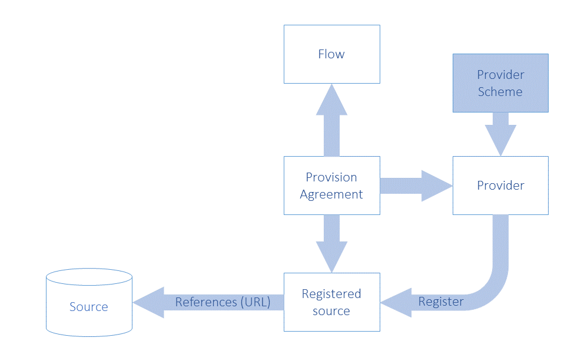
/// caption
Figure 16: Schematic of the Objects Concerned with registration
///

#### 7.4.2.2 Registration Request Model 

The following UML diagram shows the composition of the registration
request. Each request is made up of one or more Registrations, one per
dataset or metadata set to be registered. The Registration can
optionally have information, which has been extracted from the
Registration:

- validFrom
- validTo
- lastUpdated

The last updated date is useful during the discovery process to make
sure the client knows which data is freshest.

The Registration has an action attribute which takes one of the
following values:

| <strong>Action Attribute Value</strong> | <strong>Behaviour</strong> |
| :--- | :--- |
| Append | Add this Registration to the registry |
| Replace | Replace the existing Registration with identified by the id in the<br>Registration of the SubmitRegistrationRequest |
| Delete | Delete the existing Registration identified by the id in the<br>Registration of the SubmitRegistrationRequest |


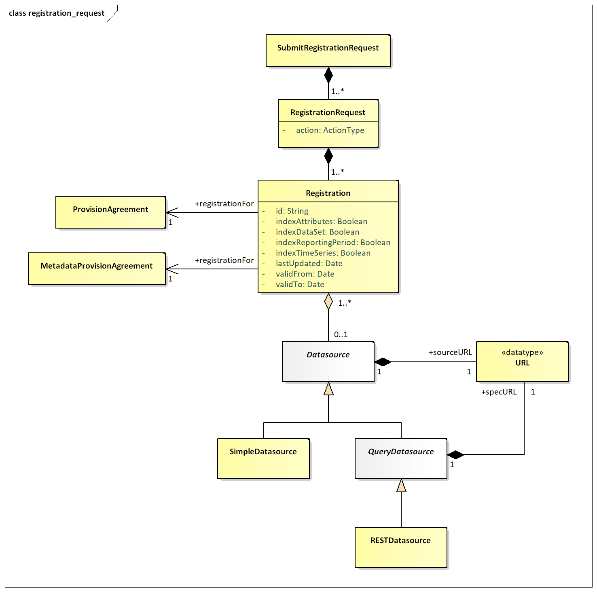
/// caption
Figure 17: Logical Class Diagram of Registration of Data and Metadata
///

The *QueryDatasource* is an abstract class that represents a data
source, which can understand an API query (i.e., a RESTful query –
RESTDatasource) and respond appropriately. Each data source inherits the
dataURL from *Datasource*, and the *QueryDatasource* has an additional
URL to locate the specification of the service (specURL) to describe how
to access it. All other supported protocols are assumed to use the
SimpleDatasource URL.

A SimpleDatasource is used to reference a physical SDMX-ML file that is
available at a URL.

The RegistrationRequest has an action attribute which defines whether
this is a new (append) or updated (replace) Registration, or that the
Registration is to be deleted (delete). The id is only provided for the
replace and delete actions, as the Registry will allocate the unique id
of the (new) Registration.

The Registration includes attributes that state how a SimpleDatasource
is to be indexed when registered. The Registry registration process must
act as follows:

Information in the data or metadata set is extracted and placed in one
or more *Constraint*s (see the *Constraint* model in the SDMX
Information Model – Section 2 of the SDMX Standards). The information to
be extracted is indicated by the Boolean values set on the
ProvisionAgreement or MetadataProvisionAgreement as shown in the table
below.

| <blockquote><br><p><strong>Indexing Required</strong></p><br></blockquote> | <blockquote><br><p><strong>Registration Process Activity</strong></p><br></blockquote> |
| :--- | :--- |
| <blockquote><br><p>indexTimeSeries</p><br></blockquote> | Extract all the series keys and create a KeySet(s) Constraint. |
| <blockquote><br><p>indexDataSet</p><br></blockquote> | Extract all the codes and other content of the Key value of the<br>Series Key in a Data Set and create one or more Cube Regions containing<br>Member Selections of Dimension Components of the Constraints model in<br>the SDMX-IM, and the associated Selection Value. |
| <blockquote><br><p>indexReportingPeriod</p><br></blockquote> | <blockquote><br><p>This applies only to a registered <u>dataset</u>.</p><br><p>Extract the Reporting Begin and Reporting End from the Header of the<br>Message containing the data set, and create a Reference Period<br>constraint.</p><br></blockquote> |
| <blockquote><br><p>indexAttributes</p><br></blockquote> | <blockquote><br><p><strong>Data Set</strong></p><br><p>Extract the content of the Attribute Values in a Data Set and create<br>one or more Cube Regions containing Member Selections of Data Attribute<br>Components of the Constraints model in the SDMXIM, and the associated<br>Selection Value</p><br></blockquote><br><p><strong>Metadata Set</strong></p><br><blockquote><br><p>Indicate the presence of a Reported Attribute by creating one or more<br>Cube Regions containing Member Selections of Metadata Attribute<br>Components of the Constraints model in the SDMX-IM. Note that the<br>content is not stored in the Selection Value.</p><br></blockquote> |


Constraints that specify the contents of a *QueryDatasource* are
submitted to the Registry via the structure submission service (i.e.,
the RESTful API).

The Registration must reference the ProvisionAgreement or
MetadataProvisionAgreement to which it relates.

### 7.4.3 Registration Response 

After a registration request has been submitted to the registry, a
response is returned to the submitter indicating success or failure.
Given that a registration request can hold many Registrations, then
there must be a registration status for each Registration. The
SubmitRegistration class has a status field, which is either set to
“Success”, “Warning” or “Failure”.

If the registration has succeeded, a Registration will be returned –
this holds the Registry-allocated Id of the newly registered
*Datasource* plus a *Datasource* holding the URL to access the dataset,
metadataset, or query service.

The RegistrationResponse returns set of registration status (one for
each registration submitted) in terms of a StatusMessage (this is common
to all Registry responses) that indicates success or failure. In the
event of registration failure, a set of MessageText are returned, giving
the error messages that occurred during registration. It is entirely
possible when registering a batch of datasets, that the response will
contain some successful and some failed statuses. The logical model for
the RegistrationResponse is shown below:

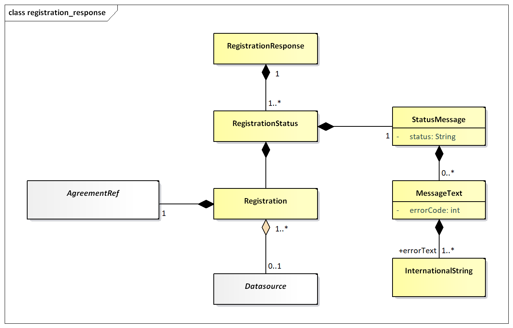
/// caption
Figure 18: Logical class diagram showing the registration response
///

## 7.5 Subscription and Notification Service 

The contents of the SDMX Registry/Repository will change regularly: new
code lists and key families will be published and new datasets and
metadata-sets will be registered. To obviate the need for users to
repeatedly query the registry to see when new information is available,
a mechanism is provided to allow users to be notified when these events
happen.

A user can submit a subscription in the registry that defines which
events are of interest, and either an email and/or an HTTP address to
which a notification of qualifying events will be delivered. The
subscription will be identified in the registry by a URN, which is
returned to the user when the subscription is created. If the user wants
to delete the subscription at a later point, the subscription URN is
used as identification. Subscriptions have a validity period expressed
as a date range (startDate, endDate) and the registry may delete any
expired subscriptions, and will notify the subscriber on expiry.

When a registry/repository artefact is modified, any subscriptions which
are observing the object are activated, and either an email or HTTP POST
is instigated to report details of the changes to the user specified in
the subscription. This is called a “notification”.

###  7.5.1 Subscription Logical Class Diagram 

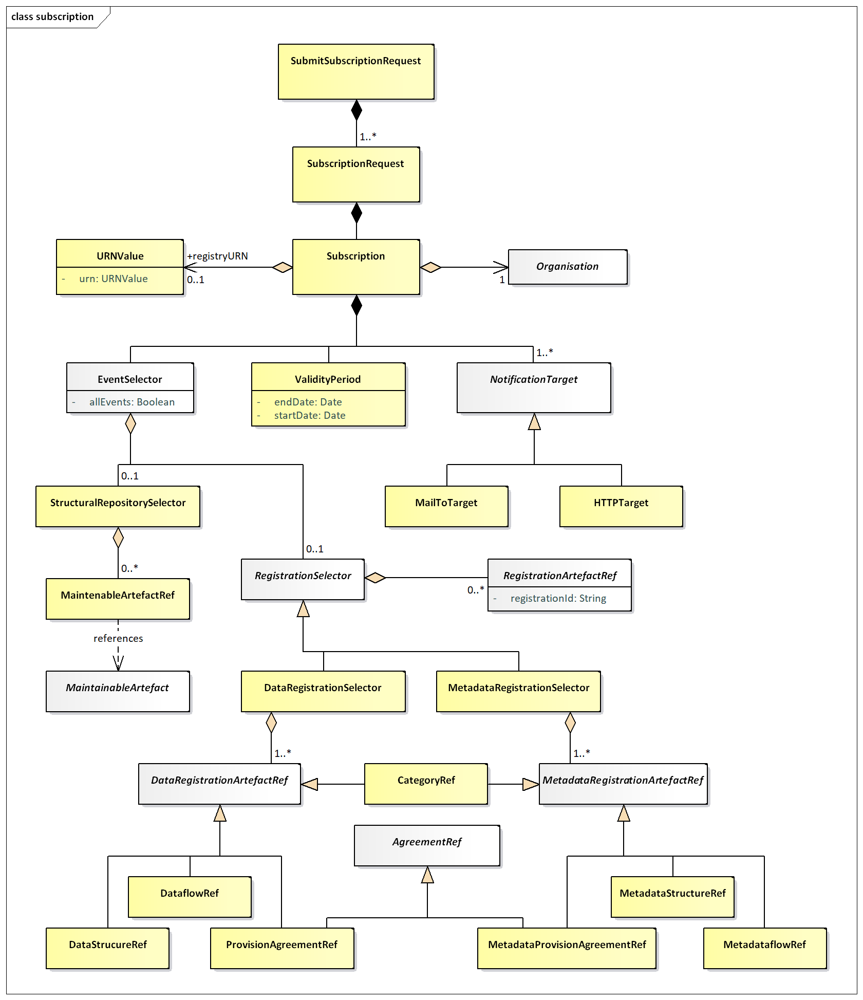
/// caption
Figure 19: Logical Class Diagram of the Subscription
///

###  7.5.2 Subscription Information

Regardless of the type of registry/repository events being observed, a
subscription always contains:

1. A set of URIs describing the end-points to which notifications must
    be sent if the subscription is activated. The URIs can be either
    mailto: or http: protocol. In the former case an email notification
    is sent; in the latter an HTTP POST notification is sent.
2. A user-defined identifier, which is returned in the response to the
    subscription request. This helps with asynchronous processing and is
    NOT stored in the Registry.
3. A validity period which defines both when the subscription becomes
    active and expires. The subscriber may be sent a notification on
    expiration of the subscription.
4. A selector which specifies which type of events are of interest. The
    set of event types is:

| <strong>Event Type</strong> | <strong>Comment</strong> |
| :--- | :--- |
| STRUCTURAL_REPOSITORY_EVENTS | Life-cycle changes to Maintainable Artefacts in the structural<br>metadata repository. |
| DATA_REGISTRATION_EVENTS | Whenever a published dataset is registered. This can be either a<br>SDMXML data file or an SDMX conformant database. |
| METADATA_REGISTRATION_EVENTS | Whenever a published metadataset is registered. This can be either a<br>SDMXML reference metadata file or an SDMX conformant database. |
| ALL_EVENTS | All events of the specified EventType |


###  7.5.3 Wildcard Facility 

Subscription notification supports wildcarded identifier components
URNs, which are identifiers which have some or all of their component
parts replaced by the wildcard character \`\*\`. Identifier components
comprise:

- agencyID
- id
- version

Examples of wildcarded identifier components for an identified object
type of Codelist are shown below:

``` http
AgencyID = \*
Id = \*
Version = \*
```

This subscribes to all Codelists of all versions for all agencies.

``` http
AgencyID = AGENCY1
Id = CODELIST1
Version = \*
```

This subscribes to all versions of Codelist CODELIST1 maintained by the
agency AGENCY1.

``` http
AgencyID = AGENCY1
Id = \*
Version = \*
```

This subscribes to all versions of all Codelist objects maintained by
the agency AGENCY1.

``` http
AgencyID = \*
Id = CODELIST1
Version = \*
```

This subscribes to all versions of Codelist CODELIST1 maintained by any
agency.

Note that if the subscription is to the latest stable version then this
can be achieved by the + character, i.e.:

``` http
Version = +
```

A subscription to the latest version (whether stable, draft or
non-versioned) can be achieved by the ~ character, i.e.:

``` http
Version = ~
```

A subscription to the latest stable version within major version 2
starting with version 2.3.1 can be achieved by adding the + character
after the minor version number, i.e.:

``` http
Version = 2.3+.1
```

The complete SDMX versioning syntax can be found in the SDMX Standards
Section 6 “Technical Notes”, paragraph “4.3 Versioning”.

### 7.5.4 Structural Repository Events 

Whenever a maintainable artefact (data structure definition, concept
scheme, codelist, metadata structure definition, category scheme, etc.)
is added to, deleted from, or modified in the structural metadata
repository, a structural metadata event is triggered. Subscriptions may
be set up to monitor all such events, or focus on specific artefacts
such as a Data Structure Definition.

### 7.5.5 Registration Events 

Whenever a dataset or metadata-set is registered a registration event is
created. A subscription may be observing all data or metadata
registrations, or it may focus on specific registrations as shown in the
table below:

| <strong>Selector</strong> | <strong>Comment</strong> |
| :--- | :--- |
| DataProvider &amp; MetadataProvider | Any datasets or metadata sets registered by the specified data or<br>metadata provider will activate the notification. |
| ProvisionAgreement &amp; MetadataProvisionAgreement | Any datasets or metadata sets registered for the agreement will<br>activate the notification. |
| Dataflow &amp; Metadataflow | Any datasets or metadata sets registered for the specified dataflow<br>(or metadataflow) will activate the notification. |
| DataStructureDefinition &amp; MetadataStructureDefinition | Any datasets or metadata sets registered for those dataflows (or<br>metadataflows) that are based on the specified Data Structure Definition<br>will activate the notification |
| Category | Any datasets or metadata sets registered for those dataflows,<br>metadataflows, provision agreements that are categorised by the<br>category. |


The event will also capture the semantic of the registration: deletion
or replacement of an existing registration or a new registration.

## 7.6 Notification

### 7.6.1 Logical Class Diagram

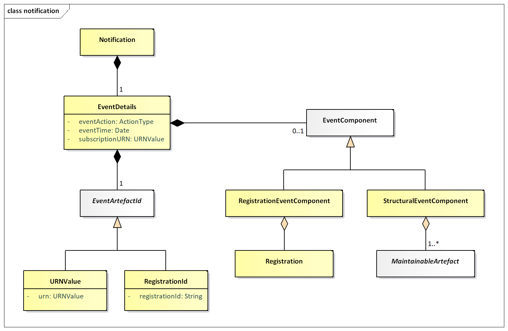
/// caption
Figure 20: Logical Class Diagram of the Notification
///

A notification is an XML document that is sent to a user via email or
http POST whenever a subscription is activated. It is an asynchronous
one-way message.

Regardless of the registry component that caused the event to be
triggered, the following common information is in the message:

- Date and time that the event occurred
- The URN of the artefact that caused the event
- The URN of the Subscription that produced the notification
- Event Action: Add, Replace, or Delete.

Additionally, supplementary information may be contained in the
notification as detailed below.

### 7.6.2 Structural Event Component

The notification will contain the MaintainableArtefact that triggered
the event in a form similar to the SDMX-ML structural message (using
elements from that namespace).

###  7.6.3 Registration Event Component

The notification will contain the Registration.

[^1]: Note that Codelist is also an EnumeratedList.