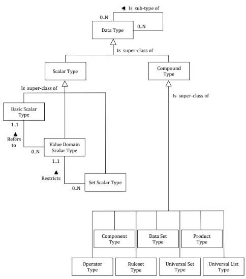
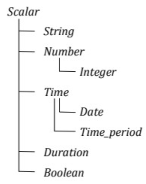

# Validation and Transformation Language (VTL)

## Introduction

The Validation and Transformation Language (VTL) supports the definition
of Transformations, which are algorithms to calculate new data starting
from already existing ones[6]. The purpose of the VTL in the SDMX
context is to enable the:

- definition of validation and transformation algorithms, in order to
    specify how to calculate new data from existing ones;
- exchange of the definition of VTL algorithms, also together the
    definition of the data structures of the involved data (for example,
    exchange the data structures of a reporting framework together with
    the validation rules to be applied, exchange the input and output
    data structures of a calculation task together with the VTL
    Transformations describing the calculation algorithms);
- compilation and execution of VTL algorithms, either interpreting the
    VTL Transformations or translating them in whatever other computer
    language is deemed as appropriate.

It is important to note that the VTL has its own information model (IM),
derived from the Generic Statistical Information Model (GSIM) and
described in the VTL User Guide. The VTL IM is designed to be compatible
with more standards, like SDMX, DDI (Data Documentation Initiative) and
GSIM, and includes the model artefacts that can be manipulated (inputs
and/or outputs of Transformations, e.g. "Data Set", "Data Structure")
and the model artefacts that allow the definition of the transformation
algorithms (e.g. "Transformation", "Transformation Scheme").

The VTL language can be applied to SDMX artefacts by mapping the SDMX IM
model artefacts to the model artefacts that VTL can manipulate[7]. Thus,
the SDMX artefacts can be used in VTL as inputs and/or outputs of
Transformations. It is important to be aware that the artefacts do not
always have the same names in the SDMX and VTL IMs, nor do they always
have the same meaning. The more evident example is given by the SDMX
Dataset and the VTL "Data Set", which do not correspond one another: as
a matter of fact, the VTL "Data Set" maps to the SDMX "Dataflow", while
the SDMX "Dataset" has no explicit mapping to VTL (such an abstraction
is not needed in the definition of VTL Transformations). A SDMX
"Dataset", however, is an instance of a SDMX "Dataflow" and can be the
artefact on which the VTL transformations are executed (i.e., the
Transformations are defined on Dataflows and are applied to Dataflow
instances that can be Datasets).

The VTL programs (Transformation Schemes) are represented in SDMX
through the TransformationScheme maintainable class which is composed of
Transformation (nameable artefact). Each Transformation assigns the
outcome of the evaluation of a VTL expression to a result.

This section does not explain the VTL language or any of the content
published in the VTL guides. Rather, this is a description of how the
VTL can be used in the SDMX context and applied to SDMX artefacts.

## References to SDMX artefacts from VTL statements

### Introduction

The VTL can manipulate SDMX artefacts (or objects) by referencing them
through pre-defined conventional names (aliases).

The alias of an SDMX artefact can be its URN (Universal Resource Name),
an abbreviation of its URN or another user-defined name.

In any case, the aliases used in the VTL Transformations have to be
mapped to the SDMX artefacts through the VtlMappingScheme and VtlMapping
classes (see the section of the SDMX IM relevant to the VTL). A
VtlMapping allows specifying the aliases to be used in the VTL
Transformations, Rulesets[8] or User Defined Operators[9] to reference
SDMX artefacts. A VtlMappingScheme is a container for zero or more
VtlMapping.

The correspondence between an alias and a SDMX artefact must be
one-to-one, meaning that a generic alias identifies one and just one
SDMX artefact while a SDMX artefact is identified by one and just one
alias. In other words, within a VtlMappingScheme an artefact can have
just one alias and different artefacts cannot have the same alias.

The references through the URN and the abbreviated URN are described in
the following paragraphs.

### References through the URN

This approach has the advantage that in the VTL code the URN of the
referenced artefacts is directly intelligible by a human reader but has
the drawback that the references are verbose.

The SDMX URN[10] is the concatenation of the following parts, separated
by special symbols like dot, equal, asterisk, comma, and parenthesis:

- SDMXprefix
- SDMX-IM-package-name
- class-name
- agency-id
- maintainedobject-id
- maintainedobject-version
- container-object-id [11]
- object-id

The generic structure of the URN is the following:

SDMXprefix.SDMX-IM-package-name.class-name=agency-id:maintainedobject-id
(maintainedobject-version).\*container-object-id.object-id

The **SDMXprefix** is "urn:sdmx:org", always the same for all SDMX
artefacts.

The SDMX-IM-package-name is the concatenation of the string
"sdmx.infomodel." with the package-name, which the artefact belongs to.
For example, for referencing a Dataflow the SDMX-IM-package-name is
"sdmx.infomodel.datastructure", because the class Dataflow belongs to
the package "datastructure".

The class-name is the name of the SDMX object class, which the SDMX
object belongs to (e.g., for referencing a Dataflow the class-name is
"Dataflow"). The VTL can reference SDMX artefacts that belong to the
classes Dataflow, Dimension, TimeDimension, Measure, DataAttribute,
Concept, Codelist.

The agency-id is the acronym of the agency that owns the definition of
the artefact, for example for the Eurostat artefacts the agency-id is
"ESTAT"). The agency-id can be composite (for example
AgencyA.Dept1.Unit2).

The maintainedobject-id is the name of the maintained object which the
artefact belongs to, and in case the artefact itself is
maintainable[12], coincides with the name of the artefact. Therefore the
maintainedobject-id depends on the class of the artefact:

- if the artefact is a Dataflow, which is a maintainable class, the
    maintainedobject-id is the Dataflow name (dataflow-id);
- if the artefact is a Dimension, Measure, TimeDimension or
    DataAttribute, which are not maintainable and belong to the
    DataStructure maintainable class, the maintainedobject-id is the
    name of the DataStructure (dataStructure-id) which the artefact
    belongs to;
- if the artefact is a Concept, which is not maintainable and belongs
    to the ConceptScheme maintainable class, the maintainedobject-id is
    the name of the ConceptScheme (conceptScheme-id) which the artefact
    belongs to;
- if the artefact is a Codelist, which is a maintainable class, the
    maintainedobject-id is the Codelist name (codelist-id).

The maintainedobject-version is the version, according to the SDMX
versioning rules, of the maintained object which the artefact belongs to
(for example, possible versions might be 1.0, 2.3, 1.0.0, 2.1.0 or
3.1.2).

The container-object-id does not apply to the classes that can be
referenced in VTL Transformations, therefore is not present in their URN

The object-id is the name of the non-maintainable artefact (when the
artefact is maintainable its name is already specified as the
maintainedobject-id, see above), in particular it has to be specified:

- if the artefact is a Dimension, TimeDimension, Measure or
    DataAttribute (the object-id is the name of one of the artefacts
    above, which are data structure components)
- if the artefact is a Concept (the object-id is the name of the
    Concept)

For example, by using the URN, the VTL Transformation that sums two SDMX
Dataflows DF1 and DF2 and assigns the result to a third persistent
Dataflow DFR, assuming that DF1, DF2 and DFR are the maintainedobject-id
of the three Dataflows, that their version is 1.0.0 and their Agency is
AG, would be written as[^13]:

```xml
'urn:sdmx:org.sdmx.infomodel.datastructure.Dataflow=AG:DFR(1.0.0)' <-
'urn:sdmx:org.sdmx.infomodel.datastructure.Dataflow=AG:DF1(1.0.0)' +
'urn:sdmx:org.sdmx.infomodel.datastructure.Dataflow=AG:DF2(1.0.0)'
```

### Abbreviation of the URN

The complete formulation of the URN described above is exhaustive but
verbose, even for very simple statements. In order to reduce the
verbosity through a simplified identifier and make the work of
transformation definers easier, proper abbreviations of the URN are
possible. Using this approach, the referenced artefacts remain
intelligible in the VTL code by a human reader.

The URN can be abbreviated by omitting the parts that are not essential
for the identification of the artefact or that can be deduced from other
available information, including the context in which the invocation is
made. The possible abbreviations are described below.

- The SDMXprefix can be omitted for all the SDMX objects, because it
    is a prefixed string (urn:sdmx:org), always the same for SDMX
    objects.
- The SDMX-IM-package-name can be omitted as well because it can be
    deduced from the class-name that follows it (the table of the
    SDMX-IM packages and classes that allows this deduction is in the
    SDMX 2.1 Standards - Section 5 - Registry Specifications, paragraph
    6.2.3). In particular, considering the object classes of the
    artefacts that VTL can reference, the package is:
    - "datastructure" for the classes Dataflow, Dimension,
        TimeDimension, Measure, DataAttribute,
    - "conceptscheme" for the class Concept,
    - "codelist" for the class Codelist.
- The class-name can be omitted as it can be deduced from the VTL
    invocation. In particular, starting from the VTL class of the
    invoked artefact (e.g. dataset, component, identifier, measure,
    attribute, variable, valuedomain), which is known given the syntax
    of the invoking VTL operator[^14], the SDMX class can be deduced from
    the mapping rules between VTL and SDMX (see the section "Mapping
    between VTL and SDMX" hereinafter)[^15].
- If the agency-id is not specified, it is assumed by default equal to
    the agency-id of the TransformationScheme, UserDefinedOperatorScheme
    or RulesetScheme from which the artefact is invoked. For example,
    the agency-id can be omitted if it is the same as the invoking
    TransformationScheme and cannot be omitted if the artefact comes
    from another agency[^16]. Take also into account that, according to
    the VTL consistency rules, the agency of the result of a
    Transformation must be the same as its TransformationScheme,
    therefore the agency-id can be omitted for all the results (left
    part of Transformation statements).
- As for the maintainedobject-id, this is essential in some cases
    while in other cases it can be omitted:
    - if the referenced artefact is a Dataflow, which is a
        maintainable class, the maintainedobject-id is the dataflow-id
        and obviously cannot be omitted;
    - if the referenced artefact is a Dimension, TimeDimension,
        Measure, DataAttribute, which are not maintainable and belong to
        the DataStructure maintainable class, the maintainedobject-id is
        the dataStructure-id and can be omitted, given that these
        components are always invoked within the invocation of a
        Dataflow, whose dataStructure-id can be deduced from the SDMX
        structural definitions;
    - if the referenced artefact is a Concept, which is not
        maintainable and belong to the ConceptScheme maintainable class,
        the maintained object is the conceptScheme-id and cannot be
        omitted;
    - if the referenced artefact is a Codelist, which is a
        maintainable class, the maintainedobject-id is the codelist-id
        and obviously cannot be omitted.
- When the maintainedobject-id is omitted, the
    maintainedobject-version is omitted too. When the
    maintainedobject-id is not omitted and the maintainedobject-version
    is omitted, the version 1.0 is assumed by default.
    - As said, the container-object-id does not apply to the classes that
        can be referenced in VTL Transformations, therefore is not present
        in their URN
  - The object-id does not exist for the artefacts belonging to the
      Dataflow, and Codelist classes, while it exists and cannot be
      omitted for the artefacts belonging to the classes Dimension,
      TimeDimension, Measure, DataAttribute and Concept, as for them the
      object-id is the main identifier of the artefact

[^14]: Since these references to SDMX objects include non-permitted characters as per the VTL ID notation, they need to be included between single quotes, according to the VTL rules for irregular names.
[^15]: For the syntax of the VTL operators see the VTL Reference Manual
[^16]: In case the invoked artefact is a VTL component, which can be invoked only within the invocation of a VTL data set (SDMX Dataflow), the specific SDMX class-name (e.g. Dimension, TimeDimension, Measure or DataAttribute) can be deduced from the data structure of the SDMX Dataflow, which the component belongs to.

The simplified object identifier is obtained by omitting all the first
part of the URN, including the special characters, till the first part
not omitted.

For example, the full formulation that uses the complete URN shown at
the end of the previous paragraph:

```xml
'urn:sdmx:org.sdmx.infomodel.datastructure.Dataflow=AG:DFR(1.0.0)' :=
'urn:sdmx:org.sdmx.infomodel.datastructure.Dataflow=AG:DF1(1.0.0)' +
'urn:sdmx:org.sdmx.infomodel.datastructure.Dataflow=AG:DF2(1.0.0)'
```

by omitting all the non-essential parts would become simply:

```sh
DFR := DF1 + DF2
```

The references to the Codelists can be simplified similarly. For
example, given the non-abbreviated reference to the Codelist
AG:CL\_FREQ(1.0.0), which is[^17]:

```xml
'urn:sdmx:org.sdmx.infomodel.codelist.Codelist=AG:CL_FREQ(1.0.0)'
```

[^17]: If the Agency is composite (for example AgencyA.Dept1.Unit2), the agency is considered different even if only part of the composite name is different (for example AgencyA.Dept1.Unit3 is a different Agency than the previous one). Moreover the agency-id cannot be omitted in part (i.e., if a TransformationScheme owned by AgencyA.Dept1.Unit2 references an artefact coming from AgencyA.Dept1.Unit3, the specification of the agency-id becomes mandatory and must be complete, without omitting the possibly equal parts like AgencyA.Dept1)

if the Codelist is referenced from a RulesetScheme belonging to the
agency AG, omitting all the optional parts, the abbreviated reference
would become simply[^18]:

```xml
CL_FREQ
```

As for the references to the components, it can be enough to specify the
component-Id, given that the dataStructure-Id can be omitted. An example
of non-abbreviated reference, if the data structure is DST1 and the
component is SECTOR, is the following:

```xml
'urn:sdmx:org.sdmx.infomodel.datastructure.DataStructure=AG:DST1(1.0.0).SECTOR'
```

The corresponding fully abbreviated reference, if made from a
TransformationScheme belonging to AG, would become simply:

```xml
SECTOR
```

For example, the Transformation for renaming the component SECTOR of the
Dataflow DF1 into SEC can be written as[^19]:

```xml
'DFR(1.0.0)' := 'DF1(1.0.0)' [rename SECTOR to SEC]
```

In the references to the Concepts, which can exist for example in the
definition of the VTL Rulesets, at least the conceptScheme-id and the
concept-id must be specified.

An example of non-abbreviated reference, if the conceptScheme-id is CS1
and the concept-id is SECTOR, is the following:

```xml
'urn:sdmx:org.sdmx.infomodel.conceptscheme.Concept=AG:CS1(1.0.0).SECTOR'
```

The corresponding fully abbreviated reference, if made from a
RulesetScheme belonging to AG, would become simply:

```xml
CS1(1.0.0).SECTOR
```

The Codes and in general all the Values can be written without any other
specification, for example, the transformation to check if the values of
the measures of the Dataflow DF1 are between 0 and 25000 can be written
like follows:

```xml
'DFR(1.0.0)' := between ( 'DF1(1.0.0)', 0, 25000 )
```

The artefact (Component, Concept, Codelist …) which the Values are
referred to can be deduced from the context in which the reference is
made, taking also into account the VTL syntax. In the Transformation
above, for example, the values 0 and 2500 are compared to the values of
the measures of DF1(1.0.0).

### User-defined alias

The third possibility for referencing SDMX artefacts from VTL statements
is to use user-defined aliases not related to the SDMX URN of the
artefact.

This approach gives preference to the use of symbolic names for the SDMX
artefacts. As a consequence, in the VTL code the referenced artefacts
may become not directly intelligible by a human reader. In any case, the
VTL aliases are associated to the SDMX URN through the VtlMappingScheme
and VtlMapping classes. These classes provide for structured references
to SDMX artefacts whatever kind of reference is used in VTL statements
(URN, abbreviated URN or user-defined aliases).

### References to SDMX artefacts from VTL Rulesets

The VTL Rulesets allow defining sets of reusable Rules that can be
applied by some VTL operators, like the ones for validation and
hierarchical roll-up. A "Rule" consists in a relationship between Values
belonging to some Value Domains or taken by some Variables, for example:
(i) when the Country is USA then the Currency is USD; (ii) the Benelux
is composed by Belgium, Luxembourg, Netherlands.

The VTL Rulesets have a signature, in which the Value Domains or the
Variables on which the Ruleset is defined are declared, and a body,
which contains the Rules.

In the signature, given the mapping between VTL and SDMX better
described in the following paragraphs, a reference to a VTL Value Domain
becomes a reference to a SDMX Codelist, while a reference to a VTL
Represented Variable becomes a reference to a SDMX Concept, assuming for
it a definite representation[^21].

[^21]: Rulesets of this kind cannot be reused when the referenced Concept has a different representation. 

In general, for referencing SDMX Codelists and Concepts, the conventions
described in the previous paragraphs apply. In the Ruleset syntax, the
elements that reference SDMX artefacts are called "valueDomain" and
"variable" for the Datapoint Rulesets and "ruleValueDomain",
"ruleVariable", "condValueDomain" "condVariable" for the Hierarchical
Rulesets). The syntax of the Ruleset signature allows also to define
aliases of the elements above, these aliases are valid only within the
specific Ruleset definition statement and cannot be mapped to SDMX.[^22]

[^22]: See also the section "VTL-DL Rulesets" in the VTL Reference Manual.

In the body of the Rulesets, the Codes and in general all the Values can
be written without any other specification, because the artefact, which
the Values are referred (Codelist, Concept) to can be deduced from the
Ruleset signature.

## Mapping between SDMX and VTL artefacts

### When the mapping occurs

The mapping methods between the VTL and SDMX object classes allow
transforming a SDMX definition in a VTL one and vice-versa for the
artefacts to be manipulated.

It should be remembered that VTL programs (i.e. Transformation Schemes)
are represented in SDMX through the TransformationScheme maintainable
class which is composed of Transformations (nameable artefacts). Each
Transformation assigns the outcome of the evaluation of a VTL expression
to a result: the input operands of the expression and the result can be
SDMX artefacts.

Every time a SDMX object is referenced in a VTL Transformation as an
input operand, there is the need to generate a VTL definition of the
object, so that the VTL operations can take place. This can be made
starting from the SDMX definition and applying a SDMX-VTL mapping method
in the direction from SDMX to VTL. The possible mapping methods from
SDMX to VTL are described in the following paragraphs and are conceived
to allow the automatic deduction of the VTL definition of the object
from the knowledge of the SDMX definition.

In the opposite direction, every time an object calculated by means of
VTL must be treated as a SDMX object (for example for exchanging it
through SDMX), there is the need of a SDMX definition of the object, so
that the SDMX operations can take place. The SDMX definition is needed
for the VTL objects for which a SDMX use is envisaged[^23].

[^23]: If a calculated artefact is persistent, it needs a persistent definition, i.e. a SDMX definition in a SDMX environment. In addition,  possible calculated artefact that are not persistent may require a SDMX definition, for example when the result of a non-persistent calculation is disseminated through SDMX tools (like an inquiry tool).

The mapping methods from VTL to SDMX are described in the following
paragraphs as well, however they do not allow the complete SDMX
definition to be automatically deduced from the VTL definition, more
than all because the former typically contains additional information in
respect to the latter. For example, the definition of a SDMX DSD
includes also some mandatory information not available in VTL (like the
concept scheme to which the SDMX components refer, the ‘usage’ and
‘attributeRelationship’ for the DataAttributes and so on). Therefore the
mapping methods from VTL to SDMX provide only a general guidance for
generating SDMX definitions properly starting from the information
available in VTL, independently of how the SDMX definition it is
actually generated (manually, automatically or part and part).

### General mapping of VTL and SDMX data structures

This section makes reference to the VTL "Model for data and their
structure"[23] and the correspondent SDMX "Data Structure
Definition"[24].

The main type of artefact that the VTL can manipulate is the VTL Data
Set, which in general is mapped to the SDMX Dataflow. This means that a
VTL Transformation, in the SDMX context, expresses the algorithm for
calculating a derived Dataflow starting from some already existing
Dataflows (either collected or derived).[25]

While the VTL Transformations are defined in term of Dataflow
definitions, they are assumed to be executed on instances of such
Dataflows, provided at runtime to the VTL engine (the mechanism for
identifying the instances to be processed are not part of the VTL
specifications and depend on the implementation of the VTL-based
systems). As already said, the SDMX Datasets are instances of SDMX
Dataflows, therefore a VTL Transformation defined on some SDMX Dataflows
can be applied on some corresponding SDMX Datasets.

A VTL Data Set is structured by one and just one Data Structure and a
VTL Data Structure can structure any number of Data Sets.
Correspondingly, in the SDMX context a SDMX Dataflow is structured by
one and just one DataStructureDefinition and one DataStructureDefinition
can structure any number of Dataflows.

A VTL Data Set has a Data Structure made of Components, which in turn
can be Identifiers, Measures and Attributes. Similarly, a SDMX
DataflowDefinition has a DataStructureDefinition made of components that
can be DimensionComponents, Measure and DataAttributes. In turn, a SDMX
DimensionComponent can be a Dimension or a TimeDimension.
Correspondingly, in the SDMX implementation of the VTL, the VTL
Identifiers can be (optionally) distinguished in similar sub-classes
(Simple Identifier, Time Identifier) even if such a distinction is not
evidenced in the VTL IM.

The possible mapping options are described in more detail in the
following sections.

### Mapping from SDMX to VTL data structures

#### Basic Mapping

The main mapping method from SDMX to VTL is called **Basic** mapping.
This is considered as the default mapping method and is applied unless a
different method is specified through the VtlMappingScheme and
VtlDataflowMapping classes.

When transforming **from SDMX to VTL**, this method consists in leaving
the components unchanged and maintaining their names and roles,
according to the following table:

| **SDMX** | **VTL** |
| :--- | :--- |
| Dimension | (Simple) Identifier |
| TimeDimension | (Time) Identifier |
| Measure | Measure |
| DataAttribute | Attribute |

The SDMX DataAttributes, in VTL they are all considered "at data point /
observation level" (i.e. dependent on all the VTL Identifiers), because
VTL does not have the SDMX AttributeRelationships, which defines the
construct to which the DataAttribute is related (e.g. observation,
dimension or set or group of dimensions, whole data set).

With the Basic mapping, one SDMX observation[26] generates one VTL data
point.

#### Pivot Mapping

An alternative mapping method from SDMX to VTL is the **Pivot** mapping,
which makes sense and is different from the Basic method only for the
SDMX data structures that contain a Dimension that plays the role of
measure dimension (like in SDMX 2.1) and just one Measure. Through this
method, these structures can be mapped to multi-measure VTL data
structures. Besides that, a user may choose to use any Dimension acting
as a list of Measures (e.g., a Dimension with indicators), either by
considering the “Measure” role of a Dimension, or at will using any
coded Dimension. Of course, in SDMX 3.0, this can only work when only
one Measure is defined in the DSD.

In SDMX 2.1 the MeasureDimension was a subclass of DimensionComponent
like Dimension and TimeDimension. In the current SDMX version, this
subclass does not exist anymore, however a Dimension can have the role
of measure dimension (i.e. a Dimension that contributes to the
identification of the measures). In SDMX 2.1 a DataStructure could have
zero or one MeasureDimensions, in the current version of the standard,
from zero to many Dimension may have the role of measure dimension.
Hereinafter a Dimension that plays the role of measure dimension is
referenced for simplicity as “MeasureDimension“, i.e. maintaining the
capital letters and the courier font even if the MeasureDimension is not
anymore a class in the SDMX Information Model of the current SDMX
version. For the sake of simplicity, the description below considers
just one Dimension having the role of MeasureDimension (i.e., the more
simple and common case). Nevertheless, it maintains its validity also if
in the DataStructure there are more dimension with the role of
MeasureDimensions: in this case what is said about the MeasureDimension
must be applied to the combination of all the MeasureDimensions
considered as a joint variable[27].

Among other things, the Pivot method provides also backward
compatibility with the SDMX 2.1 data structures that contained a
MeasureDimension.

If applied to SDMX structures that do not contain any MeasureDimension,
this method behaves like the Basic mapping (see the previous paragraph).

The SDMX structures that contain a MeasureDimension are mapped as
described below (this mapping is equivalent to a pivoting operation):

- A SDMX simple dimension becomes a VTL (simple) identifier and a SDMX
    TimeDimension becomes a VTL (time) identifier;
- Each possible Code Cj of the SDMX MeasureDimension is mapped to a
    VTL Measure, having the same name as the SDMX Code (i.e. Cj); the
    VTL Measure Cj is a new VTL component even if the SDMX data
    structure has not such a Component;
- The SDMX MeasureDimension is not mapped to VTL (it disappears in the
    VTL Data Structure);
- The SDMX Measure is not mapped to VTL as well (it disappears in the
    VTL Data Structure);
- An SDMX DataAttribute is mapped in different ways according to its
    AttributeRelationship:
    - If, according to the SDMX AttributeRelationship, the values of
        the DataAttribute do not depend on the values of the
        MeasureDimension, the SDMX DataAttribute becomes a VTL Attribute
        having the same name. This happens if the AttributeRelationship
        is not specified (i.e. the DataAttribute does not depend on any
        DimensionComponent and therefore is at data set level), or if it
        refers to a set (or a group) of dimensions which does not
        include the MeasureDimension;
    - Otherwise, if, according to the SDMX AttributeRelationship, the
        values of the DataAttribute depend on the MeasureDimension, the
        SDMX DataAttribute is mapped to one VTL Attribute for each
        possible Code of the SDMX MeasureDimension. By default, the
        names of the VTL Attributes are obtained by concatenating the
        name of the SDMX DataAttribute and the names of the
        correspondent Code of the MeasureDimension separated by
        underscore. For example, if the SDMX DataAttribute is named DA
        and the possible Codes of the SDMX MeasureDimension are named
        C1, C2, …, Cn, then the corresponding VTL Attributes will be
        named DA\_C1, DA\_C2, …, DA\_Cn (if different names are desired,
        they can be achieved afterwards by renaming the Attributes
        through VTL operators).
    - Like in the Basic mapping, the resulting VTL Attributes are
        considered as dependent on all the VTL identifiers (i.e. "at
        data point / observation level"), because VTL does not have the
        SDMX notion of Attribute Relationship.

The summary mapping table of the "pivot" mapping from SDMX to VTL for
the SDMX data structures that contain a MeasureDimension is the
following:

| <strong>SDMX</strong> | <strong>VTL</strong> |
| :--- | :--- |
| Dimension | (Simple) Identifier |
| TimeDimension | (Time) Identifier |
| <p>MeasureDimension &amp;</p><br><p>one Measure</p> | One Measure for each Code of the SDMX MeasureDimension |
| DataAttribute not depending on the MeasureDimension | Attribute |
| DataAttribute depending on the MeasureDimension | One Attribute for each Code of the SDMX MeasureDimension |

Using this mapping method, the components of the data structure can
change in the conversion from SDMX to VTL and it must be taken into
account that the VTL statements can reference only the components of the
resulting VTL data structure.

At observation / data point level, calling Cj (j=1, … n) the
j<sup>th</sup> Code of the MeasureDimension:

- The set of SDMX observations having the same values for all the
    Dimensions except than the MeasureDimension become one multi-measure
    VTL Data Point, having one Measure for each Code Cj of the SDMX
    MeasureDimension;
- The values of the SDMX simple Dimensions, TimeDimension and
    DataAttributes not depending on the MeasureDimension (these
    components by definition have always the same values for all the
    observations of the set above) become the values of the
    corresponding VTL (simple) Identifiers, (time) Identifier and
    Attributes.
- The value of the Measure of the SDMX observation belonging to the
    set above and having MeasureDimension=Cj becomes the value of the
    VTL Measure Cj
- For the SDMX DataAttributes depending on the MeasureDimension, the
    value of the DataAttribute DA of the SDMX observation belonging to
    the set above and having MeasureDimension=Cj becomes the value of
    the VTL Attribute DA\_Cj

#### From SDMX DataAttributes to VTL Measures

- In some cases, it may happen that the DataAttributes of the SDMX
    DataStructure need to be managed as Measures in VTL. Therefore, a
    variant of both the methods above consists in transforming all the
    SDMX DataAttributes in VTL Measures. When DataAttributes are
    converted to Measures, the two methods above are called Basic\_A2M
    and Pivot\_A2M (the suffix "A2M" stands for Attributes to Measures).
    Obviously, the resulting VTL data structure is, in general,
    multi-measure and does not contain Attributes.

The Basic\_A2M and Pivot\_A2M behaves respectively like the Basic and
Pivot methods, except that the final VTL components, which according to
the Basic and Pivot methods would have had the role of Attribute, assume
instead the role of Measure.

Proper VTL features allow changing the role of specific attributes even
after the SDMX to VTL mapping: they can be useful when only some of the
DataAttributes need to be managed as VTL Measures.

### Mapping from VTL to SDMX data structures

#### Basic Mapping

The main mapping method **from VTL to SDMX** is called **Basic** mapping
as well.

This is considered as the default mapping method and is applied unless a
different method is specified through the VtlMappingScheme and
VtlDataflowMapping classes.

The method consists in leaving the components unchanged and maintaining
their names and roles in SDMX, according to the following mapping table,
which is the same as the basic mapping from SDMX to VTL, only seen in
the opposite direction.

Mapping table:

| <strong>VTL</strong> | <strong>SDMX</strong> |
| :--- | :--- |
| (Simple) Identifier | Dimension |
| (Time) Identifier | TimeDimension |
| Measure | Measure |
| Attribute | DataAttribute |

If the distinction between simple identifier and time identifier is not
maintained in the VTL environment, the classification between Dimension
and TimeDimension exists only in SDMX, as declared in the relevant
DataStructureDefinition.

Regarding the Attributes, because VTL considers all of them "at
observation level", the corresponding SDMX DataAttributes should be put
"at observation level" as well, unless some different information about
their AttributeRelationship is otherwise available.

Note that the basic mappings in the two directions (from SDMX to VTL and
vice-versa) are (almost completely) reversible. In fact, if a SDMX
structure is mapped to a VTL structure and then the latter is mapped
back to SDMX, the resulting data structure is like the original one
(apart for the AttributeRelationship, that can be different if the
original SDMX structure contains DataAttributes that are not at
observation level). In reverse order, if a VTL structure is mapped to
SDMX and then the latter is mapped back to VTL, the original data
structure is obtained.

As said, the resulting SDMX definitions must be compliant with the SDMX
consistency rules. For example, the SDMX DSD must have the
AttributeRelationship for the DataAttributes, which does not exist in
VTL.

#### Unpivot Mapping

An alternative mapping method from VTL to SDMX is the **Unpivot**
mapping.

Although this mapping method can be used in any case, it makes major
sense in case the VTL data structure has more than one measure component
(multi-measures VTL structure). This is used to support the SDMX 2.1
case of a MeasureDimension or any other Dimension acting as a list of
Measures, under the assumptions explained in section “Pivot Mapping”.

The multi-measures VTL structures are converted to SDMX Dataflows having
an added MeasureDimension, which disambiguates the VTL multiple
Measures, and a new Measure in place of the VTL ones, containing the
values of the VTL Measures.

The **unpivot** mapping behaves like follows:

- like in the basic mapping, a VTL (simple) identifier becomes a SDMX
    Dimension and a VTL (time) identifier becomes a SDMX TimeDimension
    (as said, a measure identifier cannot exist in multi-measure VTL
    structures);
- a MeasureDimension component called "measure\_name" is added to the
    SDMX DataStructure;
- a Measure component called "obs\_value" is added to the SDMX
    DataStructure;
- each VTL Measure is mapped to a Code of the SDMX MeasureDimension
    having the same name as the VTL Measure (therefore all the VTL
    Measure Components do not originate Components in the SDMX
    DataStructure);
- a VTL Attribute becomes a SDMX DataAttribute having
    AttributeRelationship referred to all the SDMX DimensionComponents
    including the TimeDimension and except the MeasureDimension.

The summary mapping table of the **unpivot** mapping method is the
following:

| <strong>VTL</strong> | <strong>SDMX</strong> |
| :--- | :--- |
| (Simple) Identifier | Dimension |
| (Time) Identifier | TimeDimension |
| All Measure Components | <p>MeasureDimension (having one Code for each VTL measure component)<br>&amp;</p><br><p>one Measure</p> |
| Attribute | DataAttribute depending on all SDMX Dimensions including the<br>TimeDimension and except the MeasureDimension |

At observation / data point level:

- a multi-measure VTL Data Point becomes a set of SDMX observations,
    one for each VTL Measure;
- the values of the VTL Identifiers become the values of the
    corresponding SDMX DimensionComponents, for all the observations of
    the set above;
- the name of the j<sup>th</sup> VTL Measure (e.g. “Cj”) becomes the
    Code of the SDMX MeasureDimension of the j<sup>th</sup> observation
    of the set;
- the value of the j<sup>th</sup> VTL Measure becomes the value of the
    SDMX Measure of the j<sup>th</sup> observation of the set;
- the values of the VTL Attributes become the values of the
    corresponding SDMX DataAttributes (in principle for all the
    observations of the set above).

If desired, this method can be applied also to mono-measure VTL
structures, provided that none of the VTL Components has already the
role of Measure Identifier. Like in the general case, a MeasureDimension
component called “measure\_name” is added to the SDMX DataStructure, in
this case it has just one possible Code, corresponding to the name of
the unique VTL Measure. The original VTL Measure would not become a
Component in the SDMX data structure. The value of the VTL Measure would
be assigned to the unique SDMX Measure called “obs\_value”.

In any case, the resulting SDMX definitions must be compliant with the
SDMX consistency rules. For example, the possible Codes of the SDMX
MeasureDimension need to be listed in a SDMX Codelist, with proper id,
agency and version; moreover, the SDMX DSD must have the
AttributeRelationship for the DataAttributes, which does not exist in
VTL.

#### From VTL Measures to SDMX Data Attributes

More than all for the multi-measure VTL structures (having more than one
Measure Component), it may happen that the Measures of the VTL Data
Structure need to be managed as DataAttributes in SDMX. Therefore, a
third mapping method consists in transforming some VTL measures in a
corresponding SDMX Measures and all the other VTL Measures in SDMX
DataAttributes. This method is called M2A (“M2A” stands for “Measures to
DataAttributes”).

All VTL Measures maintain their names in SDMX. The VTL Measure
Components that become SDMX DataAttributes are the ones declared as
DataAttributes in the target SDMX data structure definition.

The mapping table is the following:

| VTL | SDMX |
| :--- | :--- |
| (Simple) Identifier | Dimension |
| (Time) Identifier | TimeDimension |
| Some Measures | Measure |
| Other Measures | DataAttribute |
| Attribute | DataAttribute |

Even in this case, the resulting SDMX definitions must be compliant with
the SDMX consistency rules. For example, the SDMX DSD must have the
attributeRelationship for the DataAttributes, which does not exist in
VTL.

### Declaration of the mapping methods between data structures

In order to define and understand properly VTL Transformations, the
applied mapping methods must be specified in the SDMX structural
metadata. If the default mapping method (Basic) is applied, no
specification is needed.

A customized mapping can be defined through the VtlMappingScheme and
VtlDataflowMapping classes (see the section of the SDMX IM relevant to
the VTL). A VtlDataflowMapping allows specifying the mapping methods to
be used for a specific dataflow, both in the direction from SDMX to VTL
(toVtlMappingMethod) and from VTL to SDMX (fromVtlMappingMethod); in
fact a VtlDataflowMapping associates the structured URN that identifies
a SDMX Dataflow to its VTL alias and its mapping methods.

It is possible to specify the toVtlMappingMethod and
fromVtlMappingMethod also for the conventional dataflow called
"generic\_dataflow": in this case the specified mapping methods are
intended to become the default ones, overriding the "Basic" methods. In
turn, the toVtlMappingMethod and fromVtlMappingMethod declared for a
specific Dataflow are intended to override the default ones for such a
Dataflow.

The VtlMappingScheme is a container for zero or more VtlDataflowMapping
(it may contain also mappings towards artefacts other than dataflows).

### Mapping dataflow subsets to distinct VTL Data Sets

Until now it has been assumed to map one SMDX Dataflow to one VTL Data
Set and vice-versa. This mapping one-to-one is not mandatory according
to VTL because a VTL Data Set is meant to be a set of observations (data
points) on a logical plane, having the same logical data structure and
the same general meaning, independently of the possible physical
representation or storage (see VTL 2.0 User Manual page 24), therefore a
SDMX Dataflow can be seen either as a unique set of data observations
(corresponding to one VTL Data Set) or as the union of many sets of data
observations (each one corresponding to a distinct VTL Data Set).

As a matter of fact, in some cases it can be useful to define VTL
operations involving definite parts of a SDMX Dataflow instead than the
whole.[28]

Therefore, in order to make the coding of VTL operations simpler when
applied on parts of SDMX Dataflows, it is allowed to map distinct parts
of a SDMX Dataflow to distinct VTL Data Sets according to the following
rules and conventions. This kind of mapping is possible both from SDMX
to VTL and from VTL to SDMX, as better explained below.[29]

Given a SDMX Dataflow and some predefined Dimensions of its
DataStructure, it is allowed to map the subsets of observations that
have the same combination of values for such Dimensions to correspondent
VTL datasets.

For example, assuming that the SDMX Dataflow DF1(1.0.0) has the
Dimensions INDICATOR, TIME\_PERIOD and COUNTRY, and that the user
declares the Dimensions INDICATOR and COUNTRY as basis for the mapping
(i.e. the mapping dimensions): the observations that have the same
values for INDICATOR and COUNTRY would be mapped to the same VTL dataset
(and vice-versa).

In practice, this kind mapping is obtained like follows:

- For a given SDMX Dataflow, the user (VTL definer) declares the
    DimensionComponents on which the mapping will be based, in a given
    order.[30] Following the example above, imagine that the user
    declares the Dimensions INDICATOR and COUNTRY.
- The VTL Data Set is given a name using a special notation also
    called “ordered concatenation” and composed of the following parts:
    - The reference to the SDMX Dataflow (expressed according to the
        rules described in the previous paragraphs, i.e. URN,
        abbreviated URN or another alias); for example DF(1.0.0);
    - a slash (“/”) as a separator; [31]
    - The reference to a specific part of the SDMX Dataflow above,
        expressed as the concatenation of the values that the SDMX
        DimensionComponents declared above must have, separated by dots
        (“.”) and written in the order in which these
        DimensionComponents are defined[32]. For example POPULATION.USA
        would mean that such a VTL Data Set is mapped to the SDMX
        observations for which the dimension *INDICATOR* is equal to
        POPULATION and the dimension *COUNTRY* is equal to USA.

In the VTL Transformations, this kind of dataset name must be referenced
between single quotes because the slash (“/”) is not a regular character
according to the VTL rules.

Therefore, the generic name of this kind of VTL datasets would be:

```xml
'DF(1.0.0)/INDICATORvalue.COUNTRYvalue'
```

Where DF(1.0.0) is the Dataflow and *INDICATORvalue* and *COUNTRYvalue*
are placeholders for one value of the INDICATOR and COUNTRY dimensions.

Instead the specific name of one of these VTL datasets would be:

```xml
‘DF(1.0.0)/POPULATION.USA’
```xml

In particular, this is the VTL dataset that contains all the
observations of the Dataflow DF(1.0.0) for which *INDICATOR* =
POPULATION and *COUNTRY* = USA.

Let us now analyse the different meaning of this kind of mapping in the
two mapping directions, i.e. from SDMX to VTL and from VTL to SDMX.

As already said, the mapping from SDMX to VTL happens when the SDMX
dataflows are operand of VTL Transformations, instead the mapping from
VTL to SDMX happens when the VTL Data Sets that is result of
Transformations[33] need to be treated as SDMX objects. This kind of
mapping can be applied independently in the two directions and the
Dimensions on which the mapping is based can be different in the two
directions: these Dimensions are defined in the ToVtlSpaceKey and in the
FromVtlSpaceKey classes respectively.

First, let us see what happens in the <u>mapping direction from SDMX to
VTL</u>, i.e. when parts of a SDMX Dataflow (e.g. DF1(1.0.0)) need to be
mapped to distinct VTL Data Sets that are operand of some VTL
Transformations.

As already said, each VTL Data Set is assumed to contain all the
observations of the SDMX Dataflow having INDICATOR=*INDICATORvalue* and
COUNTRY= *COUNTRYvalue*. For example, the VTL dataset
‘DF1(1.0.0)/POPULATION.USA’ would contain all the observations of
DF1(1.0.0) having INDICATOR = POPULATION and COUNTRY = USA.

In order to obtain the data structure of these VTL Data Sets from the
SDMX one, it is assumed that the SDMX DimensionComponents on which the
mapping is based are dropped, i.e. not maintained in the VTL data
structure; this is possible because their values are fixed for each one
of the invoked VTL Data Sets[34]. After that, the mapping method from
SDMX to VTL specified for the Dataflow DF1(1.0.0) is applied (i.e.
basic, pivot …).

In the example above, for all the datasets of the kind
‘DF1(1.0.0)/*INDICATORvalue*.*COUNTRYvalue*’, the dimensions INDICATOR
and COUNTRY would be dropped so that the data structure of all the
resulting VTL Data Sets would have the identifier TIME\_PERIOD only.

It should be noted that the desired VTL Data Sets (i.e. of the kind
‘DF1(1.0.0)/ *INDICATORvalue*.*COUNTRYvalue*’) can be obtained also by
applying the VTL operator “**sub**” (subspace) to the Dataflow
DF1(1.0.0), like in the following VTL expression:

```xml
‘DF1(1.0.0)/POPULATION.USA’ :=
DF1(1.0.0) \[ sub INDICATOR=“POPULATION”, COUNTRY=“USA” \];
‘DF1(1.0.0)/POPULATION.CANADA’ :=
DF1(1.0.0) \[ sub INDICATOR=“POPULATION”, COUNTRY=“CANADA” \];
… … …
```xml

In fact the VTL operator “sub” has exactly the same behaviour.
Therefore, mapping different parts of a SDMX Dataflow to different VTL
Data Sets in the direction from SDMX to VTL through the ordered
concatenation notation is equivalent to a proper use of the operator
“**sub**” on such a Dataflow. [35]

In the direction from SDMX to VTL it is allowed to omit the value of one
or more DimensionComponents on which the mapping is based, but
maintaining all the separating dots (therefore it may happen to find two
or more consecutive dots and dots in the beginning or in the end). The
absence of value means that for the corresponding Dimension all the
values are kept and the Dimension is not dropped.

For example, ‘DF(1.0.0)/POPULATION.’ (note the dot in the end of the
name) is the VTL dataset that contains all the observations of the
Dataflow DF(1.0.0) for which *INDICATOR* = POPULATION and COUNTRY = any
value.

This is equivalent to the application of the VTL “sub” operator only to
the identifier *INDICATOR*:

```xml
‘DF1(1.0.0)/POPULATION.’ :=
DF1(1.0.0) \[ sub INDICATOR=“POPULATION” \];
```xml

Therefore the VTL Data Set ‘DF1(1.0.0)/POPULATION.’ would have the
identifiers COUNTRY and TIME\_PERIOD.

Heterogeneous invocations of the same Dataflow are allowed, i.e.
omitting different Dimensions in different invocations.

Let us now analyse <u>the mapping direction from VTL to SDMX</u>.

In this situation, distinct parts of a SDMX Dataflow are calculated as
distinct VTL datasets, under the constraint that they must have the same
VTL data structure.

For example, let us assume that the VTL programmer wants to calculate
the SDMX Dataflow DF2(1.0.0) having the Dimensions TIME\_PERIOD,
INDICATOR, and COUNTRY and that such a programmer finds it convenient to
calculate separately the parts of DF2(1.0.0) that have different
combinations of values for INDICATOR and COUNTRY:

- each part is calculated as a VTL derived Data Set, result of a
    dedicated VTL Transformation; [36]
- the data structure of all these VTL Data Sets has the TIME\_PERIOD
    identifier and does not have the INDICATOR and COUNTRY
    identifiers.[37]

Under these hypothesis, such derived VTL Data Sets can be mapped to
DF2(1.0.0) by declaring the DimensionComponents INDICATOR and COUNTRY as
mapping dimensions[38].

The corresponding VTL Transformations, assuming that the result needs to
be persistent, would be of this kind: [39]

```xml
‘DF2(1.0.0)/INDICATORvalue.COUNTRYvalue’ <- expression
```

Some examples follow, for some specific values of INDICATOR and COUNTRY:

```xml
‘DF2(1.0.0)/GDPPERCAPITA.USA’ &lt;- expression11;
‘DF2(1.0.0)/GDPPERCAPITA.CANADA’ &lt;- expression12;
… … …
‘DF2(1.0.0)/POPGROWTH.USA’ &lt;- expression21;
‘DF2(1.0.0)/POPGROWTH.CANADA’ &lt;- expression22;
… … …
```xml

As said, it is assumed that these VTL derived Data Sets have the
TIME\_PERIOD as the only identifier. In the mapping from VTL to SMDX,
the Dimensions INDICATOR and COUNTRY are added to the VTL data structure
on order to obtain the SDMX one, with the following values respectively:

VTL dataset INDICATOR value COUNTRY value

```xml
‘DF2(1.0.0)/GDPPERCAPITA.USA’ GDPPERCAPITA USA
‘DF2(1.0.0)/GDPPERCAPITA.CANADA’ GDPPERCAPITA CANADA
… … …
‘DF2(1.0.0)/POPGROWTH.USA’ POPGROWTH USA ‘DF2(1.0.0)/POPGROWTH.CANADA’
POPGROWTH CANADA
… … …
```

It should be noted that the application of this many-to-one mapping from
VTL to SDMX is equivalent to an appropriate sequence of VTL
Transformations. These use the VTL operator “calc” to add the proper VTL
identifiers (in the example, INDICATOR and COUNTRY) and to assign to
them the proper values and the operator “union” in order to obtain the
final VTL dataset (in the example DF2(1.0.0)), that can be mapped
one-to-one to the homonymous SDMX Dataflow. Following the same example,
these VTL Transformations would be:

```xml
DF2bis_GDPPERCAPITA_USA := ‘DF2(1.0.0)/GDPPERCAPITA.USA’
[calc identifier INDICATOR := ”GDPPERCAPITA”,
identifier COUNTRY := ”USA”\];

DF2bis_GDPPERCAPITA_CANADA := ‘DF2(1.0.0)/GDPPERCAPITA.CANADA’

[calc identifier INDICATOR:=”GDPPERCAPITA”,
identifier COUNTRY:=”CANADA”];
… … …
DF2bis_POPGROWTH_USA := ‘DF2(1.0.0)/POPGROWTH.USA’
[calc identifier INDICATOR := ”POPGROWTH”,
identifier COUNTRY := ”USA”];
DF2bis_POPGROWTH_CANADA’ := ‘DF2(1.0.0)/POPGROWTH.CANADA’
[calc identifier INDICATOR := ”POPGROWTH”,
identifier COUNTRY := ”CANADA”];
… … …
DF2(1.0) <- UNION (DF2bis\_GDPPERCAPITA\_USA’,
 DF2bis_GDPPERCAPITA_CANADA’,
… ,
DF2bis\_POPGROWTH\_USA’,
DF2bis\_POPGROWTH\_CANADA’
…);
```

In other words, starting from the datasets explicitly calculated through
VTL (in the example ‘DF2(1.0)/GDPPERCAPITA.USA’ and so on), the first
step consists in calculating other (non-persistent) VTL datasets (in the
example DF2bis\_GDPPERCAPITA\_USA and so on) by adding the identifiers
INDICATOR and COUNTRY with the desired values (*INDICATORvalue* and
*COUNTRYvalue)*. Finally, all these non-persistent Data Sets are united
and give the final result DF2[1.0](40), which can be mapped one-to-one
to the homonymous SDMX Dataflow having the dimension components
TIME\_PERIOD, INDICATOR and COUNTRY.

Therefore, mapping different VTL datasets having the same data structure
to different parts of a SDMX Dataflow, i.e. in the direction from VTL to
SDMX, through the ordered concatenation notation is equivalent to a
proper use of the operators “calc” and “union” on such datasets. [41]

It is worth noting that in the direction from VTL to SDMX it is
mandatory to specify the value for every Dimension on which the mapping
is based (in other word, in the name of the calculated VTL dataset is
<u>not</u> possible to omit the value of some of the Dimensions).

### Mapping variables and value domains between VTL and SDMX

With reference to the VTL “model for Variables and Value domains”, the
following additional mappings have to be considered:

| VTL | SDMX |
| :--- | :--- |
| <strong>Data Set Component</strong> | Although this abstraction exists in SDMX, it does not have an<br>explicit definition and correspond to a Component (either a<br>DimensionComponent or a Measure or a DataAttribute) belonging to one<br>specific Dataflow<a class="footnote-ref" href="#fn1" id="fnref1" role="doc-noteref"><sup>1</sup></a> |
| <strong>Represented Variable</strong> | <strong>Concept</strong> with a definite Representation |
| <strong>Value Domain</strong> | <strong>Representation</strong> (see the Structure Pattern in the<br>Base Package) |
| <strong>Enumerated Value Domain / Code List</strong> | <strong>Codelist</strong> |
| <strong>Code</strong> | <strong>Code</strong> (for enumerated DimensionComponent, Measure,<br>DataAttribute) |
| <strong>Described Value Domain</strong> | non-enumerated <strong>Representation</strong> (having Facets /<br>ExtendedFacets, see the Structure Pattern in the Base Package) |
| <strong>Value</strong> | Although this abstraction exists in SDMX, it does not have an<br>explicit definition and correspond to a <strong>Code</strong> of a<br>Codelist (for enumerated Representations) or to a valid<br><strong>value</strong> (for non-enumerated Representations) |
| <strong>Value Domain Subset / Set</strong> | This abstraction does not exist in SDMX |
| <strong>Enumerated Value Domain Subset / Enumerated<br>Set</strong> | This abstraction does not exist in SDMX |
| <strong>Described Value Domain Subset / Described Set</strong> | This abstraction does not exist in SDMX |
| <strong>Set list</strong> | This abstraction does not exist in SDMX |

<aside id="footnotes" class="footnotes footnotes-end-of-document"
role="doc-endnotes">
<hr />
<ol>
<li id="fn1"><p>Through SDMX Constraints, it is possible to specify the
values that a Component of a Dataflow can assume.<a href="#fnref1"
class="footnote-back" role="doc-backlink">↩︎</a></p></li>
</ol>
</aside>

The main difference between VTL and SDMX relies on the fact that the VTL
artefacts for defining subsets of Value Domains do not exist in SDMX,
therefore the VTL features for referring to predefined subsets are not
available in SDMX. These artefacts are the Value Domain Subset (or Set),
either enumerated or described, the Set List (list of values belonging
to enumerated subsets) and the Data Set Component (aimed at defining the
set of values that the Component of a Data Set can take, possibly a
subset of the codes of Value Domain).

Another difference consists in the fact that all Value Domains are
considered as identifiable objects in VTL either if enumerated or not,
while in SDMX the Codelist (corresponding to a VTL enumerated Value
Domain) is identifiable, while the SDMX non-enumerated Representation
(corresponding to a VTL non-enumerated Value Domain) is not
identifiable. As a consequence, the definition of the VTL Rulesets,
which in VTL can refer either to enumerated or non-enumerated value
domains, in SDMX can refer only to enumerated Value Domains (i.e. to
SDMX Codelists).

As for the mapping between VTL variables and SDMX Concepts, it should be
noted that these artefacts do not coincide perfectly. In fact, the VTL
variables are represented variables, defined always on the same Value
Domain (“Representation” in SDMX) independently of the data set / data
structure in which they appear[42], while the SDMX Concepts can have
different Representations in different DataStructures.[43] This means
that one SDMX Concept can correspond to many VTL Variables, one for each
representation the Concept has.

Therefore, it is important to be aware that some VTL operations (for
example the binary operations at data set level) are consistent only if
the components having the same names in the operated VTL Data Sets have
also the same representation (i.e. the same Value Domain as for VTL).
For example, it is possible to obtain correct results from the VTL
expression

```xml
DS_c := DS_a + DS_b (where DS_a, DS_b, DS_c are VTL Data Sets)
```

if the matching components in DS\_a and DS\_b (e.g. ref\_date,
geo\_area, sector …) refer to the same general representation. In
simpler words, DS\_a and DS\_b must use the same values/codes (for
ref\_date, geo\_area, sector … ), otherwise the relevant values would
not match and the result of the operation would be wrong.

As mentioned, the property above is not enforced by construction in
SDMX, and different representations of the same Concept can be not
compatible one another (for example, it may happen that geo\_area is
represented by ISO-alpha-3 codes in DS\_a and by ISO alpha-2 codes in
DS\_b). Therefore, it will be up to the definer of VTL Transformations
to ensure that the VTL expressions are consistent with the actual
representations of the correspondent SDMX Concepts.

It remains up to the SDMX-VTL definer also the assurance of the
consistency between a VTL Ruleset defined on Variables and the SDMX
Components on which the Ruleset is applied. In fact, a VTL Ruleset is
expressed by means of the values of the Variables (i.e. SDMX Concepts),
i.e. assuming definite representations for them (e.g. ISO-alpha-3 for
country). If the Ruleset is applied to SDMX Components that have the
same name of the Concept they refer to but different representations
(e.g. ISO-alpha-2 for country), the Ruleset cannot work properly.

## Mapping between SDMX and VTL Data Types

### VTL Data types

According to the VTL User Guide the possible operations in VTL depend on
the data types of the artefacts. For example, numbers can be multiplied
but text strings cannot. In the VTL Transformations, the compliance
between the operators and the data types of their operands is statically
checked, i.e., violations result in compile-time errors.

The VTL data types are sub-divided in scalar types (like integers,
strings, etc.), which are the types of the scalar values, and compound
types (like Data Sets, Components, Rulesets, etc.), which are the types
of the compound structures. See below the diagram of the VTL data types,
taken from the VTL User Manual:


///caption
Figure 22 – VTL Data Types
///

The VTL scalar types are in turn subdivided in basic scalar types, which
are elementary (not defined in term of other data types) and Value
Domain and Set scalar types, which are defined in terms of the basic
scalar types.

The VTL basic scalar types are listed below and follow a hierarchical
structure in terms of supersets/subsets (e.g. "scalar" is the superset
of all the basic scalar types):


///caption
Figure 23 – VTL Basic Scalar Types
///

### VTL basic scalar types and SDMX data types

The VTL assumes that a basic scalar type has a unique internal
representation and can have more external representations.

The internal representation is the format used within a VTL system to
represent (and process) all the scalar values of a certain type. In
principle, this format is hidden and not necessarily known by users. The
external representations are instead the external formats of the values
of a certain basic scalar type, i.e. the formats known by the users. For
example, the internal representation of the dates can be an integer
counting the days since a predefined date (e.g. from 01/01/4713 BC up to
31/12/5874897 AD like in Postgres) while two possible external
representations are the formats YYYY-MM-GG and MM-GG-YYYY (e.g.
respectively 2010-12-31 and 12-31-2010).

The internal representation is the reference format that allows VTL to
operate on more values of the same type (for example on more dates) even
if such values have different external formats: these values are all
converted to the unique internal representation so that they can be
composed together (e.g. to find the more recent date, to find the time
span between these dates and so on).

The VTL assumes that a unique internal representation exists for each
basic scalar type but does not prescribe any particular format for it,
leaving the VTL systems free to using they preferred or already existing
internal format. By consequence, in VTL the basic scalar types are
abstractions not associated to a specific format.

SDMX data types are conceived instead to support the data exchange,
therefore they do have a format, which is known by the users and
correspond, in VTL terms, to external representations. Therefore, for
each VTL basic scalar type there can be more SDMX data types (the latter
are explained in the section "General Notes for Implementers" of this
document and are actually much more numerous than the former).

The following paragraphs describe the mapping between the SDMX data
types and the VTL basic scalar types. This mapping shall be presented in
the two directions of possible conversion, i.e. from SDMX to VTL and
vice-versa.

The conversion from SDMX to VTL happens when an SDMX artefact acts as
inputs of a VTL Transformation. As already said, in fact, at compile
time the VTL needs to know the VTL type of the operands in order to
check their compliance with the VTL operators and at runtime it must
convert the values from their external (SDMX) representations to the
corresponding internal (VTL) ones.

The opposite conversion, i.e. from VTL to SDMX, happens when a VTL
result, i.e. a VTL Data Set output of a Transformation, must become a
SDMX artefact (or part of it). The values of the VTL result must be
converted into the desired (SDMX) external representations (data types)
of the SDMX artefact.

### Mapping SDMX data types to VTL basic scalar types

The following table describes the default mapping for converting from
the SDMX data types to the VTL basic scalar types.

| SDMX data type (BasicComponentDataType) | Default VTL basic scalar type |
| :--- | :--- |
| <p>String</p><br><p>(string allowing any character)</p> | string |
| <p>Alpha</p><br><p>(string which only allows A-z)</p> | string |
| <p>AlphaNumeric</p><br><p>(string which only allows A-z and 0-9)</p> | string |
| <p>Numeric</p><br><p>(string which only allows 0-9, but is not numeric so that is can<br>having leading zeros)</p> | string |
| <p>BigInteger</p><br><p>(corresponds to XML Schema xs:integer datatype; infinite set of<br>integer values)</p> | integer |
| <p>Integer</p><br><p>(corresponds to XML Schema xs:int datatype; between -2147483648 and<br>+2147483647 (inclusive))</p> | integer |
| <p>Long</p><br><p>(corresponds to XML Schema xs:long datatype; between<br>-9223372036854775808 and +9223372036854775807 (inclusive))</p> | integer |
| <p>Short</p><br><p>(corresponds to XML Schema xs:short datatype; between -32768 and<br>-32767 (inclusive))</p> | integer |
| <p>Decimal</p><br><p>(corresponds to XML Schema xs:decimal datatype; subset of real<br>numbers that can be represented as decimals)</p> | number |
| <p>Float</p><br><p>(corresponds to XML Schema xs:float datatype; patterned after the<br>IEEE single-precision 32-bit floating point type)</p> | number |
| <p>Double</p><br><p>(corresponds to XML Schema xs:double datatype; patterned after the<br>IEEE double-precision 64-bit floating point type)</p> | number |
| <p>Boolean</p><br><p>(corresponds to the XML Schema xs:boolean datatype; support the<br>mathematical concept of binary-valued logic: {true, false})</p> | boolean |
| <p>URI</p><br><p>(corresponds to the XML Schema xs:anyURI; absolute or relative<br>Uniform Resource Identifier Reference)</p> | string |
| <p>Count</p><br><p>(an integer following a sequential pattern, increasing by 1 for each<br>occurrence)</p> | integer |
| <p>InclusiveValueRange</p><br><p>(decimal number within a closed interval, whose bounds are specified<br>in the SDMX representation by the facets minValue and maxValue)</p> | number |
| <p>ExclusiveValueRange</p><br><p>(decimal number within an open interval, whose bounds are specified<br>in the SDMX representation by the facets minValue and maxValue)</p> | number |
| <p>Incremental</p><br><p>(decimal number the increased by a specific interval (defined by the<br>interval facet), which is typically enforced outside of the XML<br>validation)</p> | number |
| <p>ObservationalTimePeriod</p><br><p>(superset of StandardTimePeriod and TimeRange)</p> | time |
| <p>StandardTimePeriod</p><br><p>(superset of BasicTimePeriod and ReportingTimePeriod)</p> | time |
| <p>BasicTimePeriod</p><br><p>(superset of GregorianTimePeriod and DateTime)</p> | date |
| <p>GregorianTimePeriod</p><br><p>(superset of GregorianYear, GregorianYearMonth, and<br>GregorianDay)</p> | date |
| <p>GregorianYear</p><br><p>(YYYY)</p> | date |
| <p>GregorianYearMonth / GregorianMonth</p><br><p>(YYYY-MM)</p> | date |
| <p>GregorianDay</p><br><p>(YYYY-MM-DD)</p> | date |
| <p>ReportingTimePeriod</p><br><p>(superset of RepostingYear, ReportingSemester, ReportingTrimester,<br>ReportingQuarter, ReportingMonth, ReportingWeek, ReportingDay)</p> | time_period |
| <p>ReportingYear</p><br><p>(YYYY-A1 – 1 year period)</p> | time_period |
| <p>ReportingSemester</p><br><p>(YYYY-Ss – 6 month period)</p> | time_period |
| <p>ReportingTrimester</p><br><p>(YYYY-Tt – 4 month period)</p> | time_period |
| <p>ReportingQuarter</p><br><p>(YYYY-Qq – 3 month period)</p> | time_period |
| <p>ReportingMonth</p><br><p>(YYYY-Mmm – 1 month period)</p> | time_period |
| <p>ReportingWeek</p><br><p>(YYYY-Www – 7 day period; following ISO 8601 definition of a week in<br>a year)</p> | time_period |
| <p>ReportingDay</p><br><p>(YYYY-Dddd – 1 day period)</p> | time_period |
| <p>DateTime</p><br><p>(YYYY-MM-DDThh:mm:ss)</p> | date |
| <p>TimeRange</p><br><p>(YYYY-MM-DD(Thh:mm:ss)?/&lt;duration&gt;)</p> | time |
| <p>Month</p><br><p>(--MM; speicifies a month independent of a year; e.g. February is<br>black history month in the United States)</p> | string |
| <p>MonthDay</p><br><p>(--MM-DD; specifies a day within a month independent of a year; e.g.<br>Christmas is December 25<sup>th</sup>; used to specify reporting year<br>start day)</p> | string |
| <p>Day</p><br><p>(---DD; specifies a day independent of a month or year; e.g. the<br>15<sup>th</sup> is payday)</p> | string |
| <p>Time</p><br><p>(hh:mm:ss; time independent of a date; e.g. coffee break is at 10:00<br>AM)</p> | string |
| <p>Duration</p><br><p>(corresponds to XML Schema xs:duration datatype)</p> | duration |
| XHTML | Metadata type – not applicable |
| KeyValues | Metadata type – not applicable |
| IdentifiableReference | Metadata type – not applicable |
| DataSetReference | Metadata type – not applicable |
|  |  |

Figure 14 – Mappings from SDMX data types to VTL Basic Scalar Types

When VTL takes in input SDMX artefacts, it is assumed that a type
conversion according to the table above always happens. In case a
different VTL basic scalar type is desired, it can be achieved in the
VTL program taking in input the default VTL basic scalar type above and
applying to it the VTL type conversion features (see the implicit and
explicit type conversion and the "cast" operator in the VTL Reference
Manual).

### Mapping VTL basic scalar types to SDMX data types

The following table describes the default conversion from the VTL basic
scalar types to the SDMX data types .

| VTL basic scalar type | <p>Default SDMX data type</p><br><p>(BasicComponentDataType)</p> | Default output format |
| :--- | :--- | :--- |
| String | String | Like XML (xs:string) |
| Number | Float | Like XML (xs:float) |
| Integer | Integer | Like XML (xs:int) |
| Date | DateTime | YYYY-MM-DDT00:00:00Z |
| Time | StandardTimePeriod | &lt;date&gt;/&lt;date&gt; (as defined above) |
| time_period | ReportingTimePeriod (StandardReportingPeriod) | <p> YYYY-Pppp</p><br><p>(according to SDMX )</p> |
| Duration | Duration | Like XML (xs:duration) PnYnMnDTnHnMnS |
| Boolean | Boolean | Like XML (xs:boolean) with the values "true" or "false" |

Figure 14 – Mappings from SDMX data types to VTL Basic Scalar Types

In case a different default conversion is desired, it can be achieved
through the CustomTypeScheme and CustomType artefacts (see also the
section Transformations and Expressions of the SDMX information model).

The custom output formats can be specified by means of the VTL
formatting mask described in the section "Type Conversion and Formatting
Mask" of the VTL Reference Manual. Such a section describes the masks
for the VTL basic scalar types "number", "integer", "date", "time",
"time\_period" and "duration" and gives examples. As for the types
"string" and "boolean" the VTL conventions are extended with some other
special characters as described in the following table.

| VTL special characters for the formatting masks |
| :--- |
|  |
| Number |
| D | one numeric digit (if the scientific notation is adopted, D is only<br>for the mantissa) |
| E | one numeric digit (for the exponent of the scientific notation) |
| . (dot) | possible separator between the integer and the decimal parts. |
| , (comma) | possible separator between the integer and the decimal parts. |
|  |  |
| Time and duration |
| C | century |
| Y | year |
| S | semester |
| Q | quarter |
| M | month |
| W | week |
| D | day |
| h | hour digit (by default on 24 hours) |
| M | minute |
| S | second |
| D | decimal of second |
| P | period indicator (representation in one digit for the duration) |
| P | number of the periods specified in the period indicator |
| AM/PM | indicator of AM / PM (e.g. am/pm for "am" or "pm") |
| MONTH | uppercase textual representation of the month (e.g., JANUARY for<br>January) |
| DAY | uppercase textual representation of the day (e.g., MONDAY for<br>Monday) |
| Month | lowercase textual representation of the month (e.g., january) |
| Day | lowercase textual representation of the month (e.g., monday) |
| Month | First character uppercase, then lowercase textual representation of<br>the month (e.g., January) |
| Day | First character uppercase, then lowercase textual representation of<br>the day using (e.g. Monday) |
|  |  |
| String |
| X | any string character |
| Z | any string character from "A" to "z" |
| 9 | any string character from "0" to "9" |
|  |  |
| Boolean |
| B | Boolean using "true" for True and "false" for False |
| 1 | Boolean using "1" for True and "0" for False |
| 0 | Boolean using "0" for True and "1" for False |
|  |  |
| Other qualifiers |
| * | an arbitrary number of digits (of the preceding type) |
| + | at least one digit (of the preceding type) |
| ( ) | optional digits (specified within the brackets) |
| \ | prefix for the special characters that must appear in the mask |
| N | fixed number of digits used in the preceding textual representation<br>of the month or the day |
|  |  |

The default conversion, either standard or customized, can be used to
deduce automatically the representation of the components of the result
of a VTL Transformation. In alternative, the representation of the
resulting SDMX Dataflow can be given explicitly by providing its
DataStructureDefinition. In other words, the representation specified in
the DSD, if available, overrides any default conversion[44].

### Null Values

In the conversions from SDMX to VTL it is assumed by default that a
missing value in SDMX becomes a NULL in VTL. After the conversion, the
NULLs can be manipulated through the proper VTL operators.

On the other side, the VTL programs can produce in output NULL values
for Measures and Attributes (Null values are not allowed in the
Identifiers). In the conversion from VTL to SDMX, it is assumed that a
NULL in VTL becomes a missing value in SDMX.

In the conversion from VTL to SDMX, the default assumption can be
overridden, separately for each VTL basic scalar type, by specifying
which the value that represents the NULL in SDMX is. This can be
specified in the attribute "nullValue" of the CustomType artefact (see
also the section Transformations and Expressions of the SDMX information
model). A CustomType belongs to a CustomTypeScheme, which can be
referenced by one or more TransformationScheme (i.e. VTL programs). The
overriding assumption is applied for all the SDMX Dataflows calculated
in the TransformationScheme.

### Format of the literals used in VTL Transformations

The VTL programs can contain literals, i.e. specific values of certain
data types written directly in the VTL definitions or expressions. The
VTL does not prescribe a specific format for the literals and leave the
specific VTL systems and the definers of VTL Transformations free of
using their preferred formats.

Given this discretion, it is essential to know which are the external
representations adopted for the literals in a VTL program, in order to
interpret them correctly. For example, if the external format for the
dates is YYYY-MM-DD the date literal 2010-01-02 has the meaning of
2<sup>nd</sup> January 2010, instead if the external format for the
dates is YYYY-DD-MM the same literal has the meaning of 1<sup>st</sup>
February 2010.

Hereinafter, i.e. in the SDMX implementation of the VTL, it is assumed
that the literals are expressed according to the "default output format"
of the table of the previous paragraph ("Mapping VTL basic scalar types
to SDMX data types") unless otherwise specified.

A different format can be specified in the attribute "vtlLiteralFormat"
of the CustomType artefact (see also the section Transformations and
Expressions of the SDMX information model).

Like in the case of the conversion of NULLs described in the previous
paragraph, the overriding assumption is applied, for a certain VTL basic
scalar type, if a value is found for the vtlLiteralFormat attribute of
the CustomType of such VTL basic scalar type. The overriding assumption
is applied for all the literals of a related VTL TransformationScheme.

In case a literal is operand of a VTL Cast operation, the format
specified in the Cast overrides all the possible otherwise specified
formats.
