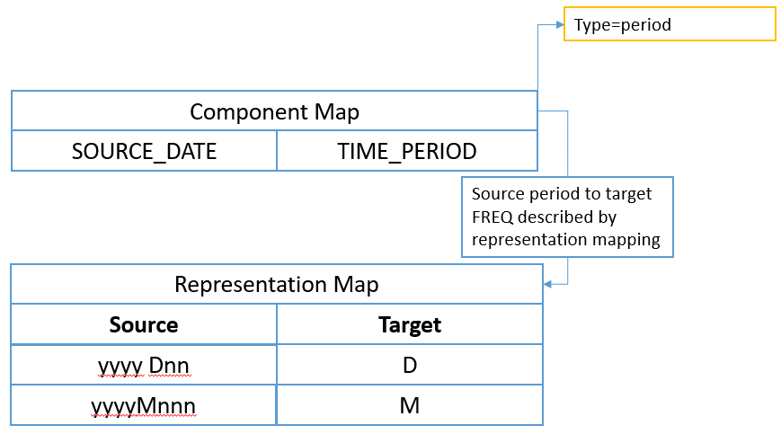
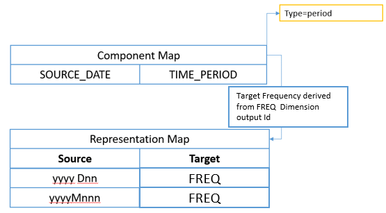
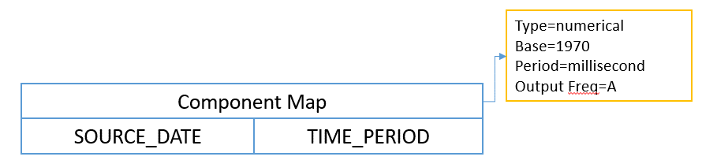

# Structure Mapping

## Introduction

The purpose of SDMX structure mapping is to transform datasets from one
dimensionality to another. In practice, this means that the input and
output datasets conform to different Data Structure Definition.

Structure mapping does not alter the observation values and is not
intended to perform any aggregations or calculations.

An input series maps to:

1. Exactly one output series; or
2. Multiple output series with different Series Keys, but the same observation values; or
3. Zero output series where no source rule matches the input Component values.

Typical use cases include:

- Transforming received data into a common internal structure;
- Transforming reported data into the data collector's preferred
      structure;
- Transforming unidimensional datasets[^1] to multi-dimensional; and
- Transforming internal datasets with a complex structure to a simpler
      structure with fewer dimensions suitable for dissemination.

[^1]:
    Unidimensional datasets are those with a single 'indicator' or
    'series code' dimension.

## 1-1 structure maps

1-1 (pronounced 'one to one') mappings support the simple use case where
the value of a Component in the source structure is translated to a
different value in the target, usually where different classification
schemes are used for the same Concept.

In the example below, ISO 2-character country codes are mapped to their
ISO 3-character equivalent.

| Country | Alpha-2 code | Alpha-3 code |
| :--- | :--- | :--- |
| Afghanistan | AF | AFG |
| Albania | AL | ALB |
| Algeria | DZ | DZA |
| American Samoa | AS | ASM |
| Andorra | AD | AND |
| etc… |  |  |

Different source values can also map to the same target value, for
example when deriving regions from country codes.

| Source Component: REF_AREA | Target Component: REGION |
| :--- | :--- |
| FR | EUR |
| DE | EUR |
| IT | EUR |
| ES | EUR |
| BE | EUR |

## N-n structure maps

N-n (pronounced 'N to N') mappings describe rules where a specified
combination of values in multiple source Components map to specified
values in one or more target Components. For example, when mapping a
partial Series Key from a highly multidimensional cube (like Balance of
Payments) to a single 'Indicator' Dimension in a target Data Structure.

Example:

| Rule | Source | Target |
| :--- | :--- | :--- |
| 1 | If FREQUENCY=A and ADJUSTMENT=N and MATURITY=L | Set INDICATOR=A_N_L |
| 2 | If FREQUENCY=M and ADJUSTMENT=S_A1 and MATURITY=TY12 | Set INDICATOR=MON_SAX_12 |

N-n rules can also set values for multiple source Components.

| Rule | Source | Target |
| :--- | :--- | :--- |
| 1 | If FREQUENCY=A and ADJUSTMENT=N and MATURITY=L | Set INDICATOR=A_N_L, STATUS=QXR15, NOTE="Unadjusted" |
| 2 | If FREQUENCY=M and ADJUSTMENT=S_A1 and MATURITY=TY12 | Set INDICATOR=MON_SAX_12, STATUS=MPM12, NOTE="Seasonally Adjusted" |

## Ambiguous mapping rules

A structure map is ambiguous if the rules result in a dataset containing
multiple series with the same Series Key.

A simple example mapping a source dataset with a single dimension to one
with multiple dimensions is shown below:

| Source | Target | Output Series Key |
| :--- | :--- | :--- |
| SERIES_CODE=XMAN_Z_21 | INDICATOR=XM, FREQ=A, ADJUSTMENT=N, UNIT_MEASURE=_Z, COMP_ORG=21 | XM:A:N |
| SERIES_CODE=XMAN_Z_34 | INDICATOR=XM, FREQ=A, ADJUSTMENT=N, UNIT_MEASURE=_Z, COMP_ORG=34 | XM:A:N |

The above behaviour can be okay if the series XMAN\_Z\_21 contains
observations for different periods of time then the series XMAN\_Z\_34.
If however both series contain observations for the same point in time,
the output for this mapping will be two observations with the same
series key, for the same period in time.

## Representation maps

Representation Maps replace the SDMX 2.1 Codelist Maps and are used
describe explicit mappings between source and target Component values.

The source and target of a Representation Map can reference any of the
following:

1. Codelist
2. Free Text (restricted by type, e.g String, Integer, Boolean)
3. Valuelist

A Representation Map mapping ISO 2-character to ISO 3-character
Codelists would take the following form:

| CL_ISO_ALPHA2 | CL_ISO_ALPHA3 |
| :--- | :--- |
| AF | AFG |
| AL | ALB |
| DZ | DZA |
| AS | ASM |
| AD | AND |
| etc… |  |

A Representation Map mapping free text country names to an ISO
2-character Codelist could be similarly described:

| Text | CL_ISO_ALPHA2 |
| :--- | :--- |
| "Germany" | DE |
| "France" | FR |
| "United Kingdom" | GB |
| "Great Britain" | GB |
| "Ireland" | IE |
| "Eire" | IE |
| etc… |  |

Valuelists, introduced in SDMX 3.0, are equivalent to Codelists but
allow the maintenance of non-SDMX identifiers. Importantly, their IDs do
not need to conform to IDType, but as a consequence are not
Identifiable.

When used in Representation Maps, Valuelists allow Non-SDMX identifiers
containing characters like £, $, % to be mapped to Code IDs, or Codes
mapped to non-SDMX identifiers.

In common with Codelists, each item in a Valuelist has a multilingual
name giving it a human-readable label and an optional description. For
example:

| Value | Locale | Name |
| :--- | :--- | :--- |
| $ | en | United States Dollar |
| % | En | Percentage |
|  | fr | Pourcentage |

Other characteristics of Representation Maps:

- Support the mapping of multiple source Component values to multiple
    Target Component values as described in section 13.3 on n-to-n
    mappings; this covers also the case of mapping an Attribute with
    an array representation to map combinations of values to a single
    target value;

- Allow source or target mappings for an Item to be optional allowing
    rules such as 'A maps to nothing' or 'nothing maps to A'; and

- Support for mapping rules where regular expressions or substrings
    are used to match source Component values. Refer to section 13.6
    for more on this topic.

## Regular expression and substring rules

It is common for classifications to contain meanings within the
identifier, for example the code Id 'XULADS' may refer to a particular
seasonality because it starts with the letters XU.

With SDMX 2.1 each code that starts with XU had to be individually
mapped to the same seasonality, and additional mappings added when new
Codes were added to the Codelists. This led to many hundreds or
thousands of mappings which can be more efficiently summarised in a
single conceptual rule:

*If starts with 'XU' map to 'Y'*

These rules are described using either regular expressions, or
substrings for simpler use cases.

### Regular expressions

Regular expression mapping rules are defined in the Representation Map.

Below is an example set of regular expression rules for a particular
component.

| Regex | Description | Output |
| :--- | :--- | :--- |
| `A` | Rule match if input = 'A' | OUT_A |
| `^[A-G]` | Rule match if the input starts with letters A to G | OUT_B |
| `A \| B` | Rule match if input is either 'A' or 'B' | OUT_C |

Like all mapping rules, the output is either a Code, a Value or free
text depending on the representation of the Component in the target Data
Structure Definition.

If the regular expression contains capture groups, these can be used in
the definition of the output value, by specifying `\n` as an output
value where `n` is the number of the capture group starting from 1.
For example

| Regex | Target output | Example Input | Example Output |
| :--- | :--- | :--- | :--- |
| `([0-9]{4})[0-9]([0-9]{1})` | `\1-Q\2` | 200933 | 2009-Q3 |

As regular expression rules can be used as a general catch-all if
nothing else matches, the ordering of the rules is important. Rules
should be tested starting with the highest priority, moving down the
list until a match is found.

The following example shows this:

| Priority | Regex | Description | Output |
| :--- | :--- | :--- | :--- |
| 1 | `A` | Rule match if input = 'A' | OUT_A |
| 2 | `B` | Rule match if input = 'B' | OUT_B |
| 3 | `[A-Z]` | Any character A-Z | OUT_C |

The input 'A' matches both the first and the last rule, but the first
takes precedence having the higher priority. The output is OUT\_A.

The input 'G' matches on the last rule which is used as a catch-all or
default in this example.

### Substrings

Substrings provide an alternative to regular expressions where the
required section of an input value can be described using the number of
the starting character, and the length of the substring in characters.
The first character is at position 1.

For instance:

| Input String | Start | Length | Output |
| :--- | :--- | :--- | :--- |
| ABC_DEF_XYZ | 5 | 3 | DEF |
| XULADS | 1 | 2 | XU |

Sub-strings can therefore be used for the conceptual rule *If starts
with 'XU' map to Y* as shown in the following example:

| Start | Length | Source | Target |
| :--- | :--- | :--- | :--- |
| 1 | 2 | XU | Y |

## Mapping non-SDMX time formats to SDMX formats

Structure mapping allows non-SDMX compliant time values in source
datasets to be mapped to an SDMX compliant time format.

Two types of time input are defined:

1. **Pattern based dates** – a string which can be described using a
    notation like `dd/mm/yyyy` or is represented as the number of
    periods since a point in time, for example: `2010M001` (first month
    in 2010), or `2014D123` (123rd day in 2014); and
2. **Numerical based datetime** – a number specifying the elapsed
    periods since a fixed point in time, for example Unix Time is
    measured by the number of milliseconds since 1970.

The output of a time-based mapping is derived from the output Frequency,
which is either explicitly stated in the mapping or defined as the value
output by a specific Dimension or Attribute in the output mapping. If
the output frequency is unknown or if the SDMX format is not desired,
then additional rules can be provided to specify the output date format
for the given frequency Id. The default rules are:

| Frequency | Format | Example |
| :--- | :--- | :--- |
| A | YYYY | 2010 |
| D | YYYY-MM-DD | 2010-01-01 |
| I | YYYY-MM-DD-Thh:mm:ss | 2010-01T20:22:00 |
| M | YYYY-MM | 2010-01 |
| Q | YYYY-Qn | 2010-Q1 |
| S | YYYY-Sn | 2010-S1 |
| T | YYYY-Tn | 2010-T1 |
| W | YYYY-Wn | YYYY-W53 |

In the case where the input frequency is lower than the output
frequency, the mapping defaults to end of period, but can be explicitly
set to start, end or mid-period.

There are two important points to note:

1. The output frequency determines the output date format, but the
    default output can be redefined using a Frequency Format mapping
    to force explicit rules on how the output time period is
    formatted.
2. To support the use case of changing frequency the structure map can
    optionally provide a start of year attribute, which defines the
    year start date in MM-DD format. For example: YearStart=04-01.

### Pattern based dates

Date and time formats are specified by date and time pattern strings
based on Java's Simple Date Format. Within date and time pattern
strings, unquoted letters from 'A' to 'Z' and from 'a' to 'z' are
interpreted as pattern letters representing the components of a date or
time string. Text can be quoted using single quotes (') to avoid
interpretation. "''" represents a single quote. All other characters are
not interpreted; they're simply copied into the output string during
formatting or matched against the input string during parsing.

Due to the fact that dates may differ per locale, an optional property,
defining the locale of the pattern, is provided. This would assist
processing of source dates, according to the given locale[^2]. An
indicative list of examples is presented in the following table:

[^2]:
    A list of commonly used locales can be found in the [Java supported
    locales](https://www.oracle.com/java/technologies/javase/jdk8-jre8-suported-locales.html)

| English (en) | Australia (AU) | en-AU |
| :--- | :--- | :--- |
| English (en) | Canada (CA) | en-CA |
| English (en) | United Kingdom (GB) | en-GB |
| English (en) | United States (US) | en-US |
| Estonian (et) | Estonia (EE) | et-EE |
| Finnish (fi) | Finland (FI) | fi-FI |
| French (fr) | Belgium (BE) | fr-BE |
| French (fr) | Canada (CA) | fr-CA |
| French (fr) | France (FR) | fr-FR |
| French (fr) | Luxembourg (LU) | fr-LU |
| French (fr) | Switzerland (CH) | fr-CH |
| German (de) | Austria (AT) | de-AT |
| German (de) | Germany (DE) | de-DE |
| German (de) | Luxembourg (LU) | de-LU |
| German (de) | Switzerland (CH) | de-CH |
| Greek (el) | Cyprus (CY) | [el-CY](https://www.oracle.com/java/technologies/javase/jdk8-jre8-suported-locales.html#cldrlocale)  |
| Greek (el) | Greece (GR) | el-GR |
| Hebrew (iw) | Israel (IL) | iw-IL |
| Hindi (hi) | India (IN) | hi-IN |
| Hungarian (hu) | Hungary (HU) | hu-HU |
| Icelandic (is) | Iceland (IS) | is-IS |
| Indonesian (in) | Indonesia (ID) | [in-ID](https://www.oracle.com/java/technologies/javase/jdk8-jre8-suported-locales.html#cldrlocale) |
| Irish (ga) | Ireland (IE) | [ga-IE](https://www.oracle.com/java/technologies/javase/jdk8-jre8-suported-locales.html#cldrlocale) |
| Italian (it) | Italy (IT) | it-IT |

Examples

- `22/06/1981` would be described as `dd/MM/YYYY`, with locale `en-GB`
- `2008-mars-12` would be described as `YYYY-MMM-DD`, with locale `fr-FR`
- `22 July 1981` would be described as `dd MMMM YYYY`, with locale `en-US`
- `22 Jul 1981` would be described as `dd MMM YYYY`
- `2010 D62` would be described as `YYYYDnn` (day 62 of the year 2010)

The following pattern letters are defined (all other characters from 'A'
to 'Z' and from 'a' to 'z' are reserved):

| Letter | Date or Time Component | Presentation | Examples |
| :--- | :--- | :--- | :--- |
| G | Era designator | [Text](https://docs.oracle.com/javase/7/docs/api/java/text/SimpleDateFormat.html#text) | AD |
| yy | Year short (upper case is Year of Week [^1]) | [Year](https://docs.oracle.com/javase/7/docs/api/java/text/SimpleDateFormat.html#year) | 96 |
| yyyy | Year Full (upper case is Year of Week) | Year | 1996 |
| MM | Month number in year starting with 1 | Month | 07 |
| MMM | Month name short | Month | Jul |
| MMMM | Month name full | Month | July |
| ww | Week in year | [Number](https://docs.oracle.com/javase/7/docs/api/java/text/SimpleDateFormat.html#number) | 27 |
| W | Week in month | [Number](https://docs.oracle.com/javase/7/docs/api/java/text/SimpleDateFormat.html#number) | 2 |
| DD | Day in year | [Number](https://docs.oracle.com/javase/7/docs/api/java/text/SimpleDateFormat.html#number) | 189 |
| dd | Day in month | [Number](https://docs.oracle.com/javase/7/docs/api/java/text/SimpleDateFormat.html#number) | 10 |
| F | Day of week in month | [Number](https://docs.oracle.com/javase/7/docs/api/java/text/SimpleDateFormat.html#number) | 2 |
| E | Day name in week | [Text](https://docs.oracle.com/javase/7/docs/api/java/text/SimpleDateFormat.html#text) | Tuesday; Tue |
| U | Day number of week (1 = Monday, ..., 7 = Sunday) | [Number](https://docs.oracle.com/javase/7/docs/api/java/text/SimpleDateFormat.html#number) | 1 |
| HH | Hour in day (0-23) | [Number](https://docs.oracle.com/javase/7/docs/api/java/text/SimpleDateFormat.html#number) | 0 |
| kk | Hour in day (1-24) | [Number](https://docs.oracle.com/javase/7/docs/api/java/text/SimpleDateFormat.html#number) | 24 |
| KK | Hour in am/pm (0-11) | [Number](https://docs.oracle.com/javase/7/docs/api/java/text/SimpleDateFormat.html#number) | 0 |
| hh | Hour in am/pm (1-12) | [Number](https://docs.oracle.com/javase/7/docs/api/java/text/SimpleDateFormat.html#number) | 12 |
| mm | Minute in hour | [Number](https://docs.oracle.com/javase/7/docs/api/java/text/SimpleDateFormat.html#number) | 30 |
| ss | Second in minute | [Number](https://docs.oracle.com/javase/7/docs/api/java/text/SimpleDateFormat.html#number) | 55 |
| S | Millisecond | [Number](https://docs.oracle.com/javase/7/docs/api/java/text/SimpleDateFormat.html#number) | 978 |
| n | Number of periods, used after a SDMX Frequency Identifier such as M, Q, D (month, quarter, day) | [Number](https://docs.oracle.com/javase/7/docs/api/java/text/SimpleDateFormat.html#number) | 12 |

[^1]:
    yyyy represents the calendar year while YYYY represents
    the year of the week, which is only relevant for 53 week years

The model is illustrated below:


///caption
Figure 24 showing the component map mapping the SOURCE\_DATE Dimension
to the TIME\_PERIOD dimension with the additional information on the
component map to describe the time format
///


///caption
Figure 25 showing an input date format, whose output frequency is
derived from the output value of the FREQ Dimension
///

### Numerical based datetime

Where the source datetime input is purely numerical, the mapping rules
are defined by the **Base** as a valid SDMX Time Period, and the
**Period** which must take one of the following enumerated values:

- day
- second
- millisecond
- microsecond
- nanosecond

| Numerical datetime systems | Base | Period |
| :--- | :--- | :--- |
| Epoch Time (UNIX): Milliseconds since 01 Jan 1970 | 1970 | millisecond |
| Windows System Time: Milliseconds since 01 Jan 1601 | 1601 | millisecond |

The example above illustrates numerical based datetime mapping rules for
two commonly used time standards.

The model is illustrated below:


///caption
Figure 26 showing the component map mapping the SOURCE\_DATE Dimension
to the TIME\_PERIOD Dimension with the additional information on the
component map to describe the numerical datetime system in use
///

### Mapping more complex time inputs

VTL should be used for more complex time inputs that cannot be
interpreted using the pattern based on numerical methods.

## Using TIME\_PERIOD in mapping rules

The source TIME\_PERIOD Dimension can be used in conjunction with other
input Dimensions to create discrete mapping rules where the output is
conditional on the time period value.

The main use case is setting the value of Observation Attributes in the
target dataset.

| Rule | Source | Target |
| :--- | :--- | :--- |
| Rule | Source | Target |
| :--- | :--- | :--- |
| 1 | If INDICATOR=XULADS and TIME_PERIOD=2007 | Set OBS_CONF=F |
| 2 | If INDICATOR=XULADS and TIME_PERIOD=2008 | Set OBS_CONF=F |
| 3 | If INDICATOR=XULADS and TIME_PERIOD=2009 | Set OBS_CONF=F |
| 4 | If INDICATOR=XULADS and TIME_PERIOD=2010 | Set OBS_CONF=C |

In the example above, OBS\_CONF is an Observation Attribute.

## Time span mapping rules using validity periods

Creating discrete mapping rules for each TIME\_PERIOD is impractical
where rules need to cover a specific span of time regardless of
frequency, and for high-frequency data.

Instead, an optional validity period can be set for each mapping.

By specifying validity periods, the example from Section 13.8 can be
re-written using two rules as follows:

| Rule | Source | Target |
| :--- | :--- | :--- |
| 1 | If INDICATOR=XULADS, validity period: start=2007, end=2009 | Set OBS_CONF=F |
| 2 | If INDICATOR=XULADS, validity period: start=2010 | Set OBS_CONF=F |

In Rule 1, start period resolves to the start of the 2007 period
(`2007-01-01T00:00:00`), and the end period resolves to the very end of
2009 (`2009-12-31T23:59:59`). The rule will hold true regardless of the
input data frequency. Any observations reporting data for the Indicator
XULADS that fall into that time range will have an `OBS_CONF` value of `F`.

In Rule 2, no end period is specified so remains in effect from the
start of the period (`2010-01-01T00:00:00`) until the end of time. Any
observations reporting data for the Indicator `XULADS` that fall into that
time range will have an `OBS_CONF` value of `C`.

## Mapping examples

### Many to one mapping (N-1)

| Source | Map To |
| :--- | :--- |
| FREQ="A", ADJUSTMENT="N", REF_AREA="PL", COUNTERPART_AREA="W0", REF_SECTOR="S1", COUNTERPART_SECTOR="S1", ACCOUNTING_ENTRY="B", STO="B5G" | FREQ="A", REF_AREA="PL", COUNTERPART_AREA="W0", INDICATOR="IND_ABC" |

The bold Dimensions map from source to target verbatim. The mapping
simply specifies:

```xml
FREQ => FREQ
REF_AREA=> REF_AREA
COUNTERPART_AREA=> COUNTERPART_AREA
```

No Representation Mapping is required. The source value simply copies
across unmodified.

The remaining Dimensions all map to the Indicator Dimension. This is an
example of many Dimensions mapping to one Dimension. In this case a
Representation Mapping is required, and the mapping first describes the
input 'partial key' and how this maps to the target indicator:

```xml
N:S1:S1:B:B5G => IND\_ABC
```

Where the key sequence is based on the order specified in the mapping
(i.e `ADJUSTMENT`, `REF_SECTOR`, etc will result in the first value `N` being
taken from `ADJUSTMENT` as this was the first item in the source Dimension
list.

**Note**: The key order is NOT based on the Dimension order of the DSD,
as the mapping needs to be resilient to the DSD changing.

### Mapping other data types to Code Id

In the case where the incoming data type is not a string and not a code
identifier i.e. the source Dimension is of type Integer and the target
is Codelist. This is supported by the RepresentationMap. The
RepresentationMap source can reference a Codelist, Valuelist, or be free
text, the free text can include regular expressions.

The following representation mapping can be used to explicitly map each
age to an output code.

| Source Input (Free Text) | Desired Output (Code Id) |
| :--- | :--- |
| 0 | A |
| 1 | A |
| 2 | A |
| 3 | B |
| 4 | B |

If this mapping takes advantage of regular expressions it can be
expressed in two rules:

| Regular Expression | Desired Output |
| :--- | :--- |
| `[0-2]` | A |
| `[3-4]` | B |

### Observation Attributes for Time Period

This use case is where a specific observation for a specific time period
has an attribute value.

| Input INDICATOR | Input TIME_PERIOD | Output OBS_CONF |
| :--- | :--- | :--- |
| `XULADS` | 2008 | C |
| `XULADS` | 2009 | C |
| `XULADS` | 2010 | C |

Or using a validity period on the Representation Mapping:

| Input INDICATOR | Valid From/ Valid To | Output OBS_CONF |
| :--- | :--- | :--- |
| `XULADS` | 2008/2010 | C |

### Time mapping

This use case is to create a time period from an input that does not
respect SDMX Time Formats.

The Component Mapping from `SYS_TIME` to `TIME_PERIOD` specifies itself as
a time mapping with the following details:

| Source Value | Source Mapping | Target Frequency | Output |
| :--- | :--- | :--- | :--- |
| 18/07/1981 | dd/MM/yyyy | A | 1981 |

When the target frequency is based on another target Dimension value, in
this example the value of the FREQ Dimension in the target DSD.

| Source Value | Source Mapping | Target Frequency Dimension | Output |
| :--- | :--- | :--- | :--- |
| 18/07/1981 | dd/MM/yyyy | FREQ | 1981-07-18 (when FREQ=D) |

When the source is a numerical format

| Source Value | Start Period | Interval | Target FREQ | Output |
| :--- | :--- | :--- | :--- | :--- |
| 1589808220 | 1970 | millisecond | M | 2020-05 |

When the source frequency is lower than the target frequency additional
information can be provided for resolve to start of period, end of
period, or mid period, as shown in the following example:

| Source Value | Source Mapping | Target Frequency Dimension | Output |
| :--- | :--- | :--- | :--- |
| 1981 | yyyy | D – End of Period | 1981-12-31 |

When the start of year is April 1st the Structure Map has
YearStart=04-01:

| Source Value | Source Mapping | Target Frequency Dimension | Output |
| :--- | :--- | :--- | :--- |
| 1981 | yyyy | D – End of Period | 1982-03-31 |
