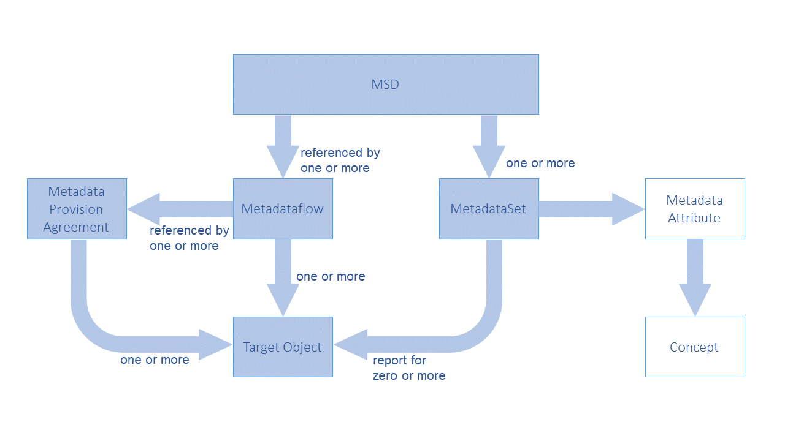

# Reference Metadata

## Scope of the Metadata Structure Definition (MSD)

The scope of the MSD is reduced in SDMX 3.0, by means of simplifying its
structure, but also in the way referenced Artefacts are targeted. In
fact, the MSD is restricted to play the role of a single container,
without targeting any specific Artefact. The possible targets of
Metadata Set are specified in the Metadataflows or Metadata Provision
Agreements relating to that MSD. To achieve that, the structure of the
Metadataflow has changed in this version of the standard. Moreover, the
Metadata Provision Agreement Artefact is introduced to include this
feature.

Two more changes, introduced in this version, are the following:

- The Metadata Set becomes a Maintainable Artefact but maintained by a
    Metadata Provider (another new Artefact in this version).
- Metadata Attributes may also be used in Data Structure Definitions,
    as long as the latter reference the Metadata Structure Definition
    that specify those Metadata Attributes.

## Identification of the Object(s) to which the Metadata is to be attached

The following example shows the structure and naming of the MSD and
related components for creating reference metadata.

The schematic structure of an MSD is shown below.


/// caption
Figure 1: Schematic of the Metadata Structure Definition
///

The MSD contains one Metadata Attribute Descriptor comprising the
Metadata Attributes that identify the Concepts for which metadata may be
reported in the Metadata Set. The Metadataflow and Metadata Provision
Agreement comprise the specification of the objects to which metadata
can be reported in a Metadata Set (Metadata Target(s)).

The high-level view of the MSD, as well as the way the Metadataflow and
Metadata Provision Agreement specify the Targets:

```xml
<str:MetadataStructure agencyID="SDMX" id="MSD" version="1.0.0-draft">
  <com:Name>MSD 3.0 sample</com:Name>
  <str:MetadataAttributeDescriptor id="MetadataAttributeDescriptor">
    ...
  </str: MetadataAttributeDescriptor>
</str:MetadataStructure>
```

Figure 2: The high-level view of the MSD containing one Metadata
Attribute Descriptor

```xml
<str:Metadataflow agencyID="OECD" id="GENERAL_METADATA" version="1.0.0-draft">
  <com:Name xml:lang="en">Metadataflow 3.0 sample</com:Name>
  <str:Structure>urn:sdmx:org.sdmx.infomodel.metadatastructure.
    MetadataStructure=OECD:MSD(1.0.0-draft)</str:Structure>
  <!-- Attach to any Dataflows maintained by the OECD -->
  <str:Targets>urn:sdmx:org.sdmx.infomodel.datastructure.
    Dataflow=OECD:*(*)</str:Targets>
</str:Metadataflow>
```

Figure 3: Wildcarded Target Objects as specified in a Metadataflow

```xml
<str:MetadataProvisionAgreement agencyID="OECD" id="ABS_INDICATORS" version="1.0.0-draft">
  <com:Name xml:lang="en">Metadata Provision Agreement 3.0 sample</com:Name>
  <str:StructureUsage>urn:sdmx:org.sdmx.infomodel.metadatastructure.
    Metadataflow=OECD:GENERAL_METADATA(1.0.0-draft)</str:StructureUsage>
  <str:MetadataProvider>urn:sdmx:org.sdmx.infomodel.base.
    MetadataProvider=OECD:METADATA_PROVIDERS(1.0).ABS</str:MetadataProvider>
  <!-- Attach to specific Dataflows maintained by the OECD -->
  <str:Target>urn:sdmx:org.sdmx.infomodel.datastructure.Dataflow=
    OECD:GDP(*)</str:Target>
  <str:Target>urn:sdmx:org.sdmx.infomodel.datastructure.Dataflow=
    OECD:EXR(*)</str:Target>
  <str:Target>urn:sdmx:org.sdmx.infomodel.datastructure.Dataflow=
    OECD:ABC(*)</str:Target>
</str:MetadataProvisionAgreement>
```

Figure 4: Specific Target Objects as specified in a Metadata Provision
Agreement

Note that the SDMX-ML schemas have specific XML elements for each
identifiable object type because identifying, for instance, a
Maintainable Object has different properties from an Identifiable Object
which must also include the agencyId, version, and id of the
Maintainable Object in which it resides.

## Metadata Structure Definition

An example is shown below.

```xml
<str:MetadataStructure agencyID="SDMX" id="MSD" version="1.0.0-draft">
  <com:Name>MSD 3.0 sample</com:Name>
  <str:MetadataAttributeDescriptor id="MetadataAttributeDescriptor">
    <str:MetadataAttribute id="CONTACT" isPresentational="true">
      <str:ConceptIdentity>urn:sdmx:org.sdmx.infomodel.conceptscheme.Concept=SDMX:CONCEPTS(1.0.0).CONTACT</str:ConceptIdentity>
      <str:MetadataAttribute id="CONTACT_NAME" minOccurs="1" maxOccurs="1">
        <str:ConceptIdentity>urn:sdmx:org.sdmx.infomodel.conceptscheme.
          Concept=SDMX:CONCEPTS(1.0.0).CONTACT_NAME</str:ConceptIdentity>
        <str:LocalRepresentation>
          <str:TextFormat textType="String"/>
        </str:LocalRepresentation>
      </str:MetadataAttribute>
      <str:MetadataAttribute id="ADDRESS" minOccurs="1" maxOccurs="3" isPresentational="true">
        <str:ConceptIdentity>urn:sdmx:org.sdmx.infomodel.conceptscheme.
          Concept=SDMX:CONCEPTS(1.0.0).ADDRESS</str:ConceptIdentity>
        <str:MetadataAttribute id="HOUSE_NUMBER" minOccurs="1" maxOccurs="1">
          <str:ConceptIdentity>urn:sdmx:org.sdmx.infomodel.conceptscheme.
            Concept=SDMX:CONCEPTS(1.0.0).HOUSE_NUMBER</str:ConceptIdentity>
          <str:LocalRepresentation>
            <str:TextFormat textType="Integer"/>
          </str:LocalRepresentation>
        </str:MetadataAttribute>
      </str:MetadataAttribute>
    </str:MetadataAttribute>
  </str:MetadataAttributeDescriptor>
</str:MetadataStructure>
```

Figure 5: Example MSD showing specification of some Metadata Attributes

This example shows the following hierarchy of Metadata Attributes:

- Contact – this is presentational; no metadata is expected to be
    reported at this level
    - Contact Name
    - Address – this is also presentational; up to 3 addresses are
        allowed
        - House Number

## Metadata Set

An example of reporting metadata according to the MSD described above,
is shown below.

```xml
<msg:MetadataSet id="ALB" metadataProviderID="OECD" version="1.0.0">
 <str:MetadataProvision>urn:sdmx:org.sdmx.infomodel.registry.MetadataProvisionAgreement=OECD:ABS_INDICATORS(1.0.0-draft)</str:MetadataProvision>
 <str:Target>urn:sdmx:org.sdmx.infomodel.datastructure.Dataflow=OECD:GDP(1.0.0)</str:Target>
 <md:AttributeSet>
  <md:ReportedAttribute id="CONTACT">
   <md:AttributeSet>
    <md:ReportedAttribute id="CONTACT_NAME">John Doe
    </md:ReportedAttribute>
    <md:ReportedAttribute id="ADDRESS">
     <md:AttributeSet>
      <md:ReportedAttribute id="STREET_NAME">
       <com:Text xml:lang="en">5th Avenue</com:Text>
      </md:ReportedAttribute>
      <md:ReportedAttribute id="HOUSE_NUMBER">12
      </md:ReportedAttribute>
     </md:AttributeSet>
    </md:ReportedAttribute>
    <md:ReportedAttribute id="HTML_ATTR">
     <com:StructuredText xml:lang="en">
      <div xmlns="http://www.w3.org/1999/xhtml">
       <p>Lorem Ipsum</p>
      </div>
     </com:StructuredText>
    </md:ReportedAttribute>
   </md:AttributeSet>
  </md:ReportedAttribute>
 </md:AttributeSet>
</msg:MetadataSet>

```

Figure 6: Example Metadata Set

This example shows:

1. The reference to the Metadata Provision Agreement and Metadata
    Target
2. The reported metadata attributes (AttributeSet)

## Reference Metadata in Data Structure Definition and Dataset

An important change of SDMX 3.0 is the ability to reference an MSD
within a DSD, in order to report any Metadata Attributes defined in the
former to Datasets of the latter. This is achieved by the following:

- In a DSD, the user may add a reference to one MSD.
- In the Attribute Descriptor of the DSD, the user may include any
    Metadata Attributes defined in the linked MSD.
    - For each link to a Metadata Attribute, an Attribute Relationship
        may be specified (similarly to that for Data Attributes).
- In any Dataset complying with this DSD, Metadata Attributes may be
    reported according to the specified Attribute Relationship.
    - The hierarchy of the Metadata Attributes defined in the MSD must
        be respected and they are reported in the same way as in a
        Metadataset, under the level they are related within the DSD,
        via their Attribute Relationship.
- In Data Constraints, the user is allowed to restrict values for
    Metadata Attributes, in the same way as Data Attributes (more on
    this in section “10 Constraints”).
