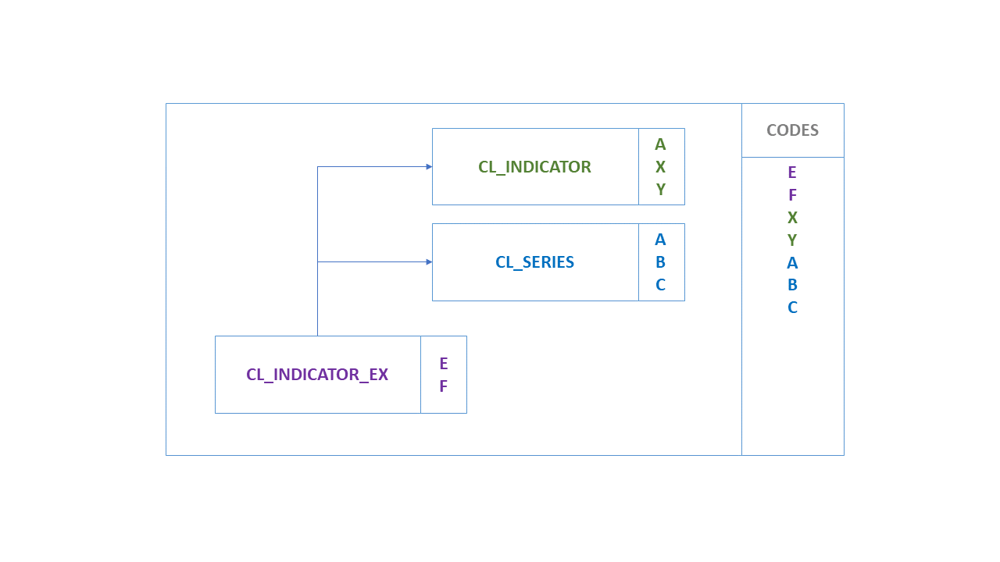
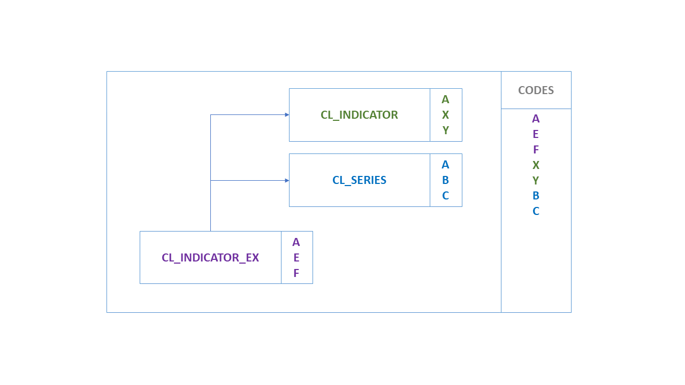
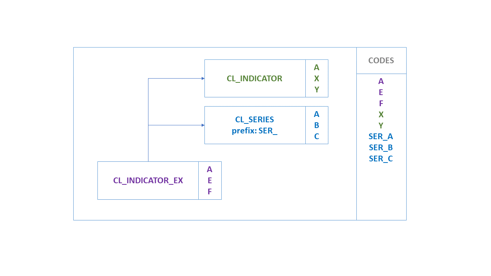
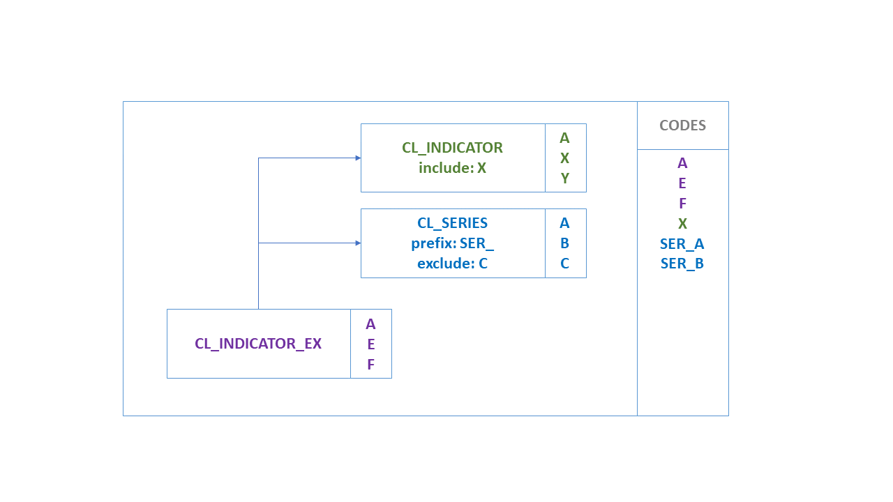
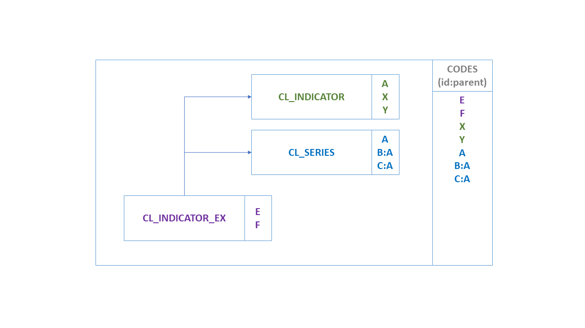
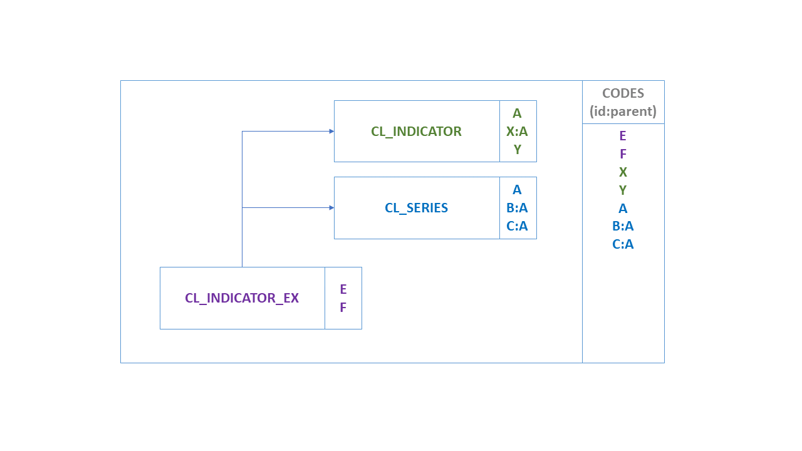
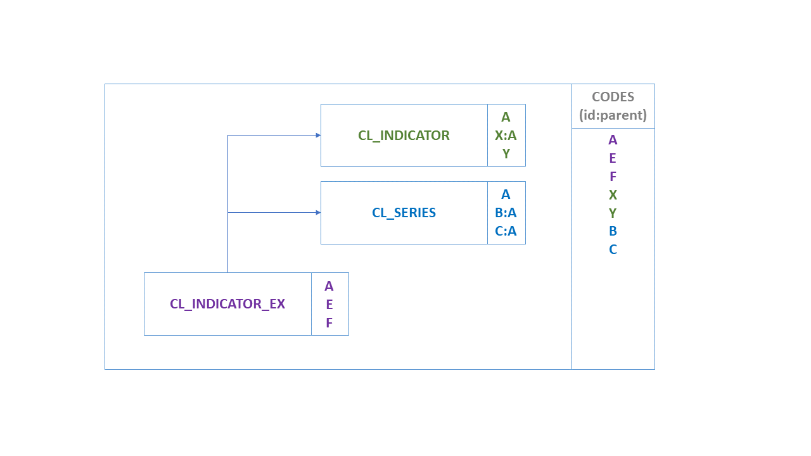
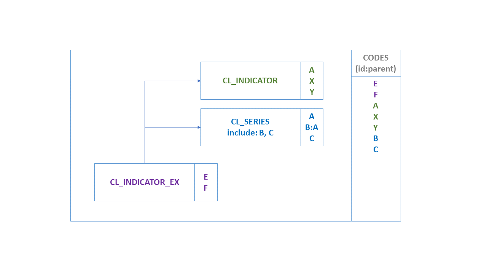
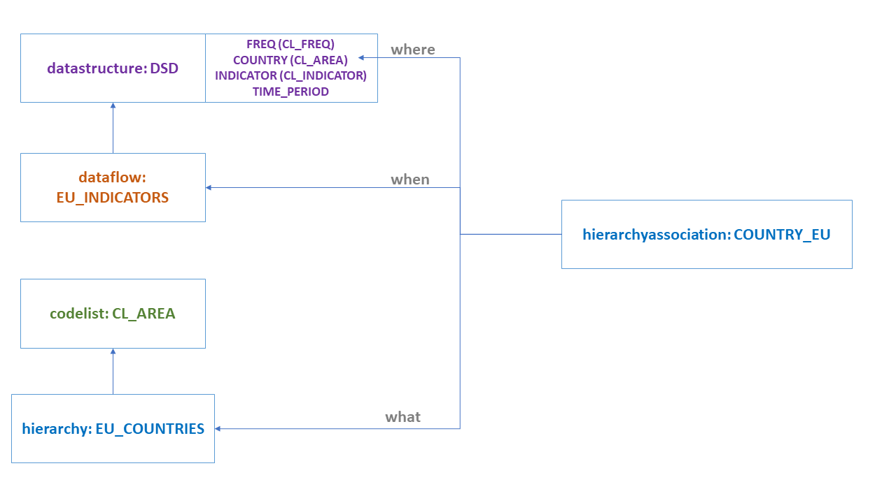

# Codelist

As of SDMX 3.0, Codelists have gained new features like geospatial
properties, inheritance and extension. Moreover, hierarchies (used to
build complex hierarchies of one or more Codelists) are now linked to
other Artefacts in order to facilitate the formers' usage in
dissemination or other scenarios. For all geospatial related features,
as well as the new Geographical Codelist, please refer to section 7.

## Codelist extension and discriminated unions

A `Codelist` can extend one or more Codelists. `Codelist` extensions are
defined as a list of references to parent Codelists. The order of the
references is important when it comes to conflict resolution on Code
Ids. When two Codelists have the same Code Id, the `Codelist` referenced
later takes priority. In the example below, the code `'A'`, exists in both
`CL_INDICATOR` and `CL_SERIES`. The `Codelist` `CL_INDICATOR_EX` will
contain the code 'A' from `CL_SERIES` as this was the second `Codelist` to
be referenced in the sequence of references.

/// figure-caption | 7
Codelist extension
///

As the extended `Codelist`, `CL_INDICATOR_EX` in this example, may also
define its own Codes, these take the ultimate priority over any
referenced Codelists. If `CL_INDICATOR_EX` defines Code `'A'`, then this
will be used instead of Code `'A'` from `CL_INDICATOR` and `CL_SERIES`, as
shown below:

/// figure-caption
Codelist extension with new Codes
///

### Prefixing Code Ids

A reference to a `Codelist` may contain a prefix. If a prefix is provided,
this prefix will be applied to all the codes in the `Codelist` before they
are imported into the extended `Codelist`. Following the above example if
the `CL_SERIES` reference includes a prefix of `'SER_'` then the resulting
`Codelist` would contain 7 codes, `A`, `E`, `F`, `X`, `Y`, `SER_A`, `SER_B`, `SER_C`.

/// figure-caption
Extended Codelist with prefix
///

### Including / Excluding Specific Codes

The default behaviour of extending another `Codelist` is to import all
Codes. However, an explicit list of Code Ids may be provided for
explicit inclusion or exclusion. This list of Ids may contain wildcards
using the same notation as `Constraints` (`%`). Cascading values is also
supported using the same syntax as the `Constraints`. The list of Ids is
either a list of excluded items, or included items, exclusion and
inclusion is not supported against a single `Codelist`.

/// figure-caption
Extended Codelist with include/exclude terms
///

### Parent Ids

Parent `Id`s are preserved in the extended `Codelist` if they can be. If a
`Code` is inherited but its parent `Code` is excluded, then the `Code`'s
parent `Id` will be removed. This rule is also true if the parent `Code` is
excluded because it is overwritten by another `Code` with the same `Id` from
another `Codelist`. This ensures the parent `Id`s do not inadvertently link
to `Code`s originating from different `Codelist`s, and also prevents
circular references from occurring.

/// figure-caption
Parent Code included
///

/// figure-caption
Parent Code from different extended Codelist
///

/// figure-caption
Parent Code overridden by local Code
///

/// figure-caption
Parent Code not included
///

### Discriminated Unions

A common use case solved in SDMX 3.0 is that of discriminated unions,
i.e., dealing with classification or breakdown "variants" which are all
valid but mutually exclusive. For example, there are many versions of
the international classification for economic activities `"ISIC"`. In
SDMX, classifications are enumerated concepts, normally modelled as
dimensions corresponding to breakdowns. Each enumerated concept is
associated to one and only one code list.

To support this use case, the following have to be considered:

- **Independent Codelists per variant**: Having each variant in a
    separate `Codelist` facilitates the maintenance and allows keeping the
    original codes, even if different versions of the classification
    have the same code for different concepts. For example, in ISIC Rev.
    4 the code `"A"` represents `"Agriculture, forestry and fishing"`, while
    in ISIC 3.1 `"A"` means `"Agriculture, hunting and forestry"`.
- **Prefixing Code Ids**: When extending Codelists, the reference to
    an extension `Codelist` may contain a prefix. If a prefix is provided,
    this prefix will be applied to all the codes in the `Codelist` before
    they are imported into the extended `Codelist`. In this case, the
    reference to `CL_ISIC4` includes a prefix of `"ISIC4_"` and the
    reference to `ISIC3` includes `"ISIC3_"`, so the resulting `Codelist`
    will have no conflict for the `"A"` items which will become `"ISIC3_A"`
    and `"ISIC4_A"`.
- **Including / Excluding Specific Codes**: As explained above, there
    will be independent DFs/PAs with specific `Constraint` attached, in
    order to keep the proper items according to the variant in use by
    each data provider.

For example, assuming:

- DSD `DSD_EXDU` contains a Dimension: `ACTIVITY` enumerated by
    `CL_ACTIVITY`.
- `CL_ACTIVITY` has no items and is extended by:
- `CL_ISIC4`, `prefix="ISIC4_"`
- `CL_ISIC3`, `prefix="ISIC3_"`
- `CL_NACE2`, `prefix="NACE2_"`
- `CL_AGGR`, `prefix="AGGR_"`
- Dataflow `DF1`, with a `DataConstraint` `CC_NACE2`, `CubeRegion` for
    `ACTIVITY` and `Value="NACE2_%"`
- Dataflow `DF2`, with a `DataConstraint` `CC_ISIC3`, `CubeRegion` for
    `ACTIVITY` and `Value="ISIC3_%"`
- Dataflow `DF3`, with a `DataConstraint` `CC_ISIC4`, `CubeRegion` for
    `ACTIVITY` and `Value="ISIC4_%", Value="AGGR_TOTAL", Value="AGGR_Z"`

The discriminated unions are achieved, by requesting any of the above
`Dataflow`s with `references="all"` and `detail="referencepartial"`: returns
`CL_ACTIVITY` with the corresponding extensions resolved and the
`DataConstraint`, referencing the `Dataflow`, applied. Thus, the
`CL_ACTIVITY` will only include Codes prefixed according to the Dataflow,
i.e.:

- Prefix `"NACE2_%"` for `DF1`;
- Prefix `"ISIC3_%"` for `DF2`;
- Prefix `"ISIC4_%"` for `DF3`; note that Codes `"AGGR_TOTAL"` and
    `"AGGR_Z"` are also included in this case.

## Linking Hierarchies

To facilitate the usage of `Hierarchy` within other SDMX Artefacts, the
`HierarchyAssociation` is defined to link any `Hierarchy` with any
`IdentifiableArtefact` within a specific context.

The `HierarchyAssociation` is a simple Artefact operating like a
Categorisation. The former specifies three references:

- The link to a `Hierarchy`;
- The link to the `IdentifiableArtefact` that the `Hierarchy` is linked
    (e.g., a Dimension);
- The link to the context that the linking is taking place (e.g., a
    DSD).

As an example, let’s assume:

- A DSD with a `COUNTRY` Dimension that uses `Codelist` `CL_AREA`
    as representation.
- A `Hierarchy` (e.g., `EU_COUNTRIES`) that builds a hierarchy for
    the `CL_AREA` `Codelist`.
- In order to use this Hierarchy for data of a Dataflow (e.g.,
    `EU_INDICATORS`), we need to build the following
    `HierarchyAssociation`:
- Links to the Hierarchy `EU_COUNTRIES` (what is associated?)
- Links to the Dimension `COUNTRY` (where is it associated?)
- Links to the context: Dataflow `EU_INDICATORS` (when is it
    associated?)
- The above are also shown in the schematic below:

/// figure-caption
Hierarchy Association
///