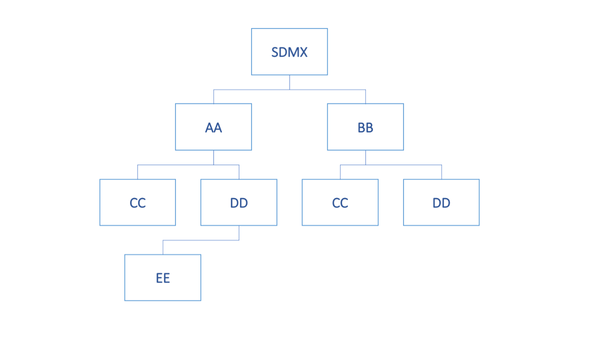

# Maintenance Agencies and Metadata Providers

All structural metadata in SDMX is owned and maintained by a maintenance
agency (Agency identified by agencyID in the schemas). Similarly, all
reference metadata (i.e., MetadataSets) is owned and maintained by a
metadata provider organisation (MetadataProvider identified by
metadataProviderID in the schemas). It is vital to the integrity of the
structural metadata that there are no conflicts in agencyID and
metadataProviderID. In order to achieve this, SDMX adopts the following
rules:

1.  Agencies are maintained in an AgencyScheme (which is a sub class of
    *OrganisationScheme*); Metadata Providers are maintained in a
    MetadataProviderScheme.

2.  The maintenance agency of the Agency/Metadata Provider Scheme must
    also be declared in a (different) AgencyScheme.

3.  The "top-level" agency is SDMX and this agency scheme is maintained
    by SDMX.

4.  Agencies registered in the top-level scheme can themselves maintain
    a single AgencyScheme and a single MetadataProviderScheme. SDMX is
    an agency in the SDMX AgencyScheme. Agencies in any AgencyScheme can
    themselves maintain a single AgencyScheme and so on.

5.  The AgencyScheme and MetadataProvideScheme cannot be versioned and
    thus have a fixed version set to ‘1.0’.

6.  There can be only one AgencyScheme maintained by any one Agency. It
    has a fixed Id of 'AGENCIES'. Similarly, only one
    MetadataProvideScheme is maintained by one Agency and has a fixed id
    of 'METADATA\_PROVIDERS'.

7.  The format of the agency identifier is agencyId.agencyID etc. The
    top-level agency in this identification mechanism is the agency
    registered in the SDMX agency scheme. In other words, SDMX is not a
    part of the hierarchical ID structure for agencies. SDMX is, itself,
    a maintenance agency.

This supports a hierarchical structure of agencyID.

An example is shown below.

Figure 16: Example of Hierarchic Structure of Agencies

Each agency is identified by its full hierarchy excluding SDMX.

The XML representing this structure is shown below.

**&lt;str:AgencySchemes&gt;  
&lt;str:AgencyScheme agencyID="SDMX" id="AGENCIES"&gt;  
&lt;com:Name xml:lang="en"&gt;Top-level Agency Scheme&lt;/com:Name&gt;  
&lt;str:Agency id="AA"&gt;  
&lt;com:Name xml:lang="en"&gt;AA Name&lt;/com:Name&gt;  
&lt;/str:Agency&gt;  
&lt;str:Agency id="BB"&gt;  
&lt;com:Name xml:lang="en"&gt;BB Name&lt;/com:Name&gt;  
&lt;/str:Agency&gt;  
&lt;/str:AgencyScheme&gt;  
  
&lt;str:AgencyScheme agencyID="AA" id="AGENCIES"&gt;  
&lt;com:Name xml:lang="en"&gt;AA Agencies&lt;/com:Name&gt;  
&lt;str:Agency id="CC"&gt;  
&lt;com:Name xml:lang="en"&gt;CC Name&lt;/com:Name&gt;  
&lt;/str:Agency&gt;  
&lt;str:Agency id="DD"&gt;  
&lt;com:Name xml:lang="en"&gt;DD Name&lt;/com:Name&gt;  
&lt;/str:Agency&gt;  
&lt;/str:AgencyScheme&gt;  
  
&lt;str:AgencyScheme agencyID="BB" id="AGENCIES"&gt;  
&lt;com:Name xml:lang="en"&gt;BB Agencies&lt;/com:Name&gt;  
&lt;str:Agency id="CC"&gt;  
&lt;com:Name xml:lang="en"&gt;CC Name&lt;/com:Name&gt;  
&lt;/str:Agency&gt;  
&lt;str:Agency id="DD"&gt;  
&lt;com:Name xml:lang="en"&gt;DD Name&lt;/com:Name&gt;  
&lt;/str:Agency&gt;  
&lt;/str:AgencyScheme&gt;  
  
&lt;str:AgencyScheme agencyID="AA.DD" id="AGENCIES"&gt;  
&lt;com:Name xml:lang="en"&gt;AA.DD Agencies&lt;/com:Name&gt;  
&lt;str:Agency id="EE"&gt;  
&lt;com:Name xml:lang="en"&gt;EE Name&lt;/com:Name&gt;  
&lt;/str:Agency&gt;  
&lt;/str:AgencyScheme&gt;  
  
&lt;/str:AgencySchemes&gt;**

Figure 17: Example Agency Schemes Showing a Hierarchy

Examples of Structure definitions that show how Agencies are used, are
presented below:

**&lt;str:Codelist agencyID="SDMX" id="CL\_FREQ" version="1.0.0"  
urn="urn:sdmx:org.sdmx.infomodel.codelist.Codelist=SDMX:CL\_FREQ(1.0.0)"&gt;  
&lt;com:Name xml:lang="en"&gt;Frequency&lt;/com:Name&gt;  
&lt;/str:Codelist&gt;  
&lt;str:Codelist agencyID="AA" id="CL\_FREQ" version="1.0.0"  
urn="urn:sdmx:org.sdmx.infomodel.codelist.Codelist=AA:CL\_FREQ(1.0.0)"&gt;  
&lt;com:Name xml:lang="en"&gt;Frequency&lt;/com:Name&gt;  
&lt;/str:Codelist&gt;  
&lt;str:Codelist agencyID="AA.CC" id="CL\_FREQ" version="1.0.0"  
urn="urn:sdmx:org.sdmx.infomodel.codelist.Codelist=AA.CC:CL\_FREQ(1.0.0)"&gt;  
&lt;com:Name xml:lang="en"&gt;Frequency&lt;/com:Name&gt;  
&lt;/str:Codelist&gt;  
&lt;str:Codelist agencyID="BB.CC" id="CL\_FREQ" version="1.0.0"  
urn="urn:sdmx:org.sdmx.infomodel.codelist.Codelist=BB.CC:CL\_FREQ(1.0.0)"&gt;  
&lt;com:Name xml:lang="en"&gt;Frequency&lt;/com:Name&gt;  
&lt;/str:Codelist&gt;**

Figure 18: Example Showing Use of Agency Identifiers

Each of these maintenance agencies has a Codelist with an identical id
'CL\_FREQ'. However, each is uniquely identified by means of the
hierarchic agency structure.