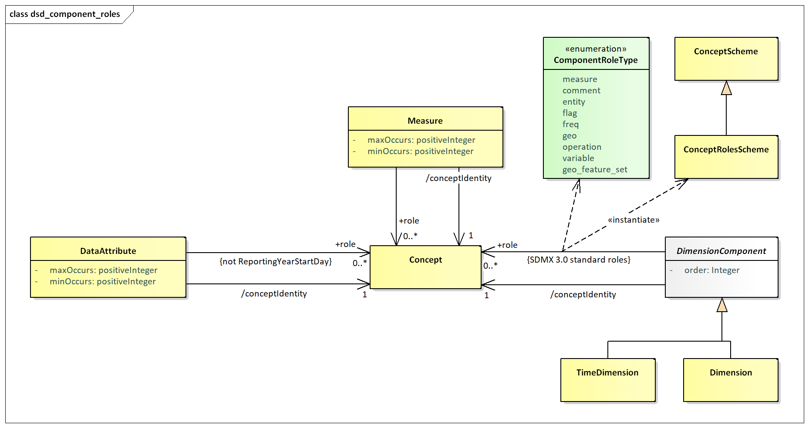

# Concept Roles

## Overview

The DSD Components of Dimension and Attribute can play a specific role
in the DSD and it is important to some applications that this role is
specified. For instance, the following roles are some examples:

- **Frequency** – in a data set the content of this Component contains
    information on the frequency of the observation values.
- **Geography** – in a data set the content of this Component contains
    information on the geographic location of the observation values.

## Information Model

The Information Model for this is shown below:


///caption
Figure 19: Information Model Extract for Concept Role
///

It is possible to specify zero or more concept roles for a Dimension,
Measure and Data Attribute. The Time Dimension has explicitly defined
roles and cannot be further specified with additional concept roles.

## Technical Mechanism

The mechanism for maintain and using concept roles is as follows:

1. A standard Concept Scheme maintained in the Global Registry, with
    the following identification: SDMX:CONCEPT\_ROLES(1.0.0), shall
    include the default roles, specified by the SDMX SWG (as detailed in
    9.5).
2. Any recognized Agency can have a concept scheme that contains
    concepts that identify concept roles. Indeed, from a technical
    perspective any agency can have more than one of these schemes,
    though this is not recommended.
3. The concept scheme that contains the "role" concepts can contain
    concepts that do not play a role.
4. There is no explicit indication on the Concept whether it is a
    'role' concept.
5. Therefore, any concept in any concept scheme is capable of being a
    'role' concept.
6. It is the responsibility of Agencies to ensure their community knows
    which concepts in which concept schemes play a 'role' and the
    significance and interpretation of this role. In other words, such
    concepts must be known by applications, there is no technical
    mechanism that can inform an application on how to process such a
    'role'.
7. If the concept referenced in the Concept Identity in a DSD component
    (Dimension, Measure Dimension, Attribute) is contained in the
    concept scheme containing concept roles then the DSD component could
    play the role implied by the concept, if this is understood by the
    processing application.
8. If the concept referenced in the Concept Identity in a DSD component
    (Dimension, Measure Dimension, Attribute) is not contained in the
    concept scheme containing concept roles, and the DSD component is
    playing a role, then the concept role is identified by the Concept
    Role in the schema.

## SDMX-ML Examples in a DSD

The standard roles Concept Scheme, is still a normal Concept Scheme,
thus it may be used also for the concept identity of a Component, e.g.,
the 'FREQ':

```xml
<str:Dimension id="FREQ">
  <str:ConceptIdentity>urn:sdmx:org.sdmx.infomodel.conceptscheme.Concept=
         SDMX:CONCEPT_ROLES(1.0.0).FREQ</str:ConceptIdentity>
</str:Dimension>
```

Given this is the standard roles Concept Scheme, any application should
interpret the above Dimension to have the role of Frequency.

Using a Concept Scheme that is not the standard roles Concept Scheme
where it is required to assign a role using the standard roles Concept
Scheme. Again, FREQ is chosen as the example.

```xml
<str:Dimension id="FREQ">
  <str:ConceptIdentity>urn:sdmx:org.sdmx.infomodel.conceptscheme.Concept=
         SDMX:CONCEPTS(1.0.0).FREQ</str:ConceptIdentity>
  <str:ConceptRole>urn:sdmx:org.sdmx.infomodel.conceptscheme.Concept=
         SDMX:CONCEPT_ROLES(1.0.0).FREQ</str:ConceptRole>
</str:Dimension>
```

This explicitly states that this Dimension is playing a role identified
by the FREQ concept in the standard roles Concept Scheme. Again, the
application must interpret this as a Frequency role.

In other cases where a role from a non-standard roles Concept Scheme is
used, then the application has to know how to interpret the provided
roles, e.g., like in the case below:

```xml
<str:Dimension id="FREQ">
  <str:ConceptIdentity>urn:sdmx:org.sdmx.infomodel.conceptscheme.Concept=
         SDMX:CONCEPTS(1.0.0).FREQ</str:ConceptIdentity>
  <str:ConceptRole>urn:sdmx:org.sdmx.infomodel.conceptscheme.Concept=
         SDMX:MY_CONCEPT_ROLES(1.0.0).FREQ</str:ConceptRole>
</str:Dimension>
```

This is all that is required for interoperability within a community.
Having a standard roles Concept Scheme, maintained by the SDMX SWG,
allows the SDMX community to have a common understanding of the roles,
while also being able to extend the roles in bilateral (or multilateral)
agreements, by maintaining their own roles Concept Scheme. This will
then ensure there is interoperability between systems that understand
the use of these concepts.

Note that each of the Components (Data Attribute, Measure, Dimension,
Time Dimension) has a mandatory identity association (Concept Identity)
and if this Concept also identifies the role then it must be interpreted
accordingly.

In order for these roles to be extensible and also to enable user
communities to maintain community-specific roles, the roles are
maintained in a controlled vocabulary which is implemented in SDMX as
Concepts in a Concept Scheme. The Component optionally references this
Concept if it is required to declare the role explicitly. Note that a
Component can play more than one role and therefore multiple "role"
concepts can be referenced.

## SDMX standard roles Concept Scheme

As of SDMX 3.0, there is a predefined Concept Scheme, with a set of
Concepts that are considered the standard roles for SDMX. Beyond that, a
user is free to add other roles, using custom Concept Schemes. This
predefined Concept Scheme is the result of the SWG guidelines for
Concept Roles, plus that for Measure, and includes the following
Concepts:

| COMMENT | Comment | Descriptive text which can be attached to data or metadata. |
| :--- | :--- | :--- |
| ENTITY | Entity | Describes the subject of the data set (e.g., a country). |
| FLAG | Flag | Coded attribute in a data set that represents qualitative information for the cell or partial key (e.g. series) value. |
| FREQ | Frequency | Time interval at which the source data are collected. |
| GEO | Geographical | Geographic area to which the measured statistical phenomenon relates. |
| OPERATION | Statistical operation | Signifies statistical operations have been done on the observations. |
| VARIABLE | Variable | Characteristic of a unit being observed that may assume more than one of a set of values to which a numerical measure or a category from a classification can be assigned. |
| MEASURE | Measure | Used for emulating the functionality of the deprecated MeasureDimension. |
| GEO_FEATURE_SET | Geographical Feature Set | Georeferencing information to describe the location or the shape of a statistical unit, recognizable object or geographical area. |
| PRIMARY | Primary Measure | Used for backwards compatibility with SDMX 2.1 and back, or when the “Primary Measure” concept is needed. |
