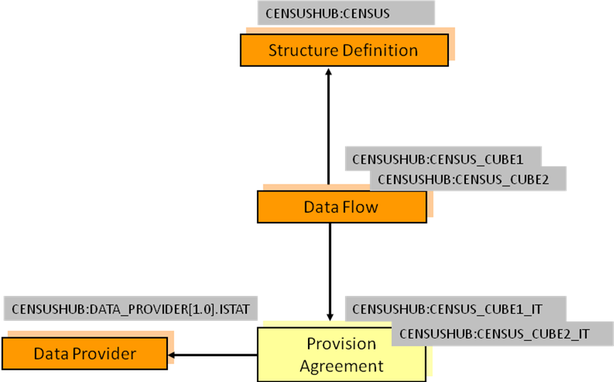
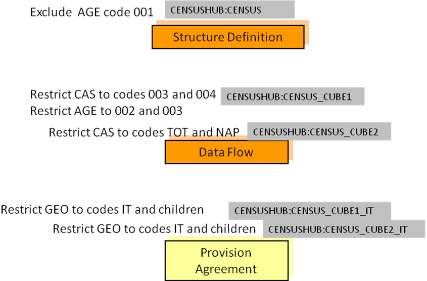

# Constraints

## Introduction

A Constraint is a Maintainable Artefact that can be associated to one or
more of:

- Data Structure Definition
- Metadata Structure Definition
- Dataflow
- Metadataflow
- Provision Agreement
- Metadata Provision Agreement
- Data Provider or Metadata Provider (this is restricted to a Release
    Calendar Constraint)
- Simple or Queryable Data Sources
- Dataset
- Metadataset

Note that regardless of the Artefact to which the Constraint is
associated, it is constraining the contents of code lists in the DSD to
which the constrained object is related. This does not apply, of course,
to a Metadata/Data Provider as the latter can be associated, via the
(Metadata) Provision Agreement, to many MSDs/DSDs. Hence the reason for
the restriction on the type of Constraint that can be attached to a
Metadata/Data Provider.

## Types of Constraint

The Constraint can be of one of two types:

- Data constraint
- Metadata constraint

The Data Constraint may serve two different perspectives, depending on
the way the latter is retrieved. These are:

- Allowed constraint
- Actual constraint

The former (allowed – also valid for Metadata Constraint) is specified
by a data or metadata provider or consumer for sharing the allowed data
and metadata in the context of their DSD or MSD exchanges, e.g., only
Monthly data for a specific Dataflow. The latter (actual) is a dynamic
Constraint in response to an availability request (only possible for
data).

For Actual Data Constraints, there a few characteristics that are worth
noting:

- They can only be retrieved by the availability requests (as
    specified in the REST API).
- They depend on the data available in an SDMX Web Service and thus
    they can only be dynamically generated according to that data.
- Although they are Maintainable Artefacts, they cannot change
    independently of data; thus, they cannot be versioned (they are
    non-versioned, as explained in section 14).
- Their identifier may also be dynamically generated and thus there is
    no REST resource based on their identification.

## Rules for a Constraint

### Scope of a Constraint

A Constraint is used specify the content of a data or metadata source in
terms of the component values or the keys.

In terms of data the components are:

- Dimension
- Time Dimension
- Data Attribute
- Measure
- Metadata Attribute
- DataKeySets: the keys are the content of the KeyDescriptor – i.e.,
    the series keys composed, for each key, by a value for each
    Dimension.

In terms of reference metadata the components are:

- Metadata Attribute

For a Constraint based on a DSD the Constraint can reference one or more
of:

- Data Structure Definition
- Dataflow
- Provision Agreement
- Data Provider

For a Constraint based on an MSD the Constraint can reference one or
more of:

- Metadata Structure Definition
- Metadataflow
- Metadata Provision Agreement
- Metadata Provider
- Metadata Set

Furthermore, there can be more than one Constraint specified for a
specific object e.g., more than one Constraint for a specific DSD.

In view of the flexibility of constraints attachment, clear rules on
their usage are required. These are elaborated below.

### Multiple Constraints

There can be many Constraints for any Constrainable Artefact (e.g.,
DSD), subject to the following restrictions:

#### Cube Region

A Constraint can contain multiple Member Selections (e.g., Dimensions).

- A specific Member Selection (e.g., Dimension FREQ) can only be
    contained in one Cube Region for any one attached object (e.g., a
    specific DSD or specific Dataflow).
- Component values within a Member Selection may define a validity
    period. Otherwise, the value is valid for the whole validity of the
    Cube Region.
- For partial reference resolution purposes (as per the SDMX REST
    API), the latest non-draft Constraint must be considered.
- A Member Selection may include wildcarding of values (using
    character ‘%’ to represent zero or more occurrences of any
    character), as well as cascading through hierarchic structures
    (e.g., parents in Codelist), or localised values (e.g., text for
    English only). Lack of locale means any language may match.
    Cascading values are mutual exclusive to localised values, as the
    former refer to coded values, while the latter refer to uncoded
    values.
- Any values included in a Member Selection for Components with an
    array data type (i.e., Measures, Attributes or Metadata Attributes),
    will be applied as single values and will not be assessed combined
    with other values to match all possible array values. For example,
    including the Code ‘A’ for an Attribute will allow any instance of
    the Attribute that includes ‘A’, like \[‘A’, ‘B’\] or \[‘A’, ‘C’,
    ‘D’\]. Similarly, if Code ‘A’ was excluded, all those arrays of
    values would also be excluded.

#### Key Set

Key Sets will be processed in the order they appear in the Constraint
and wildcards can be used (e.g., any key position not reference
explicitly is deemed to be "all values").

As the Key Sets can be "included" or "excluded" it is recommended that
Key Sets with wildcards are declared before KeySets with specific series
keys. This will minimize the risk that keys are inadvertently included
or excluded.

In addition, Attribute, Measure and Metadata Attribute constraints may
accompany KeySets, in order to specify the allowed values per Key. Those
are expressed following the rules for Cube Regions, as explained above.

Finally, a validity period may be specified per Key.

### Inheritance of a Constraint

#### Attachment levels of a Constraint

There are three levels of constraint attachment for which these
inheritance rules apply:

- DSD/MSD – top level
    - Dataflow/Metadataflow – second level
        - Provision Agreement – third level

Note that these rules do not apply to the Simple Datasource or Queryable
Datasource; the Constraint(s) attached to these artefacts are resolved
for this artefact only and do not take into account Constraints attached
to other artefacts (e.g., Provision Agreement, Dataflow, DSD).

It is not necessary for a Constraint to be attached to a higher level
artefact. e.g., it is valid to have a Constraint for a Provision
Agreement where there are no constraints attached the relevant dataflow
or DSD.

#### Cascade rules for processing Constraints

The processing of the constraints on either Dataflow/Metadataflow or
Provision Agreement must take into account the constraints declared at
higher levels. The rules for the lower-level constraints (attached to
Dataflow/ Metadataflow and Provision Agreement) are detailed below.

Note that there can be a situation where a constraint is specified at a
lower level before a constraint is specified at a higher level.
Therefore, it is possible that a higher-level constraint makes a
lower-level constraint invalid. SDMX makes no rules on how such a
conflict should be handled when processing the constraint for
attachment. However, the cascade rules on evaluating constraints for
usage are clear – the higher-level constraint takes precedence in any
conflicts that result in a less restrictive specification at the lower
level.

#### Cube Region

It is not necessary to have a Constraint on the higher-level artefact
(e.g., DSD referenced by the Dataflow), but if there is such a
Constraint at the higher level(s) then:

- The lower-level Constraint cannot be less restrictive than the
    Constraint specified for the same Member Selection (e.g. Dimension)
    at the next higher level, which constrains that Member Selection.
    For example, if the Dimension FREQ is constrained to A, Q in a DSD,
    then the Constraint at the Dataflow or Provision Agreement cannot be
    A, Q, M or even just M – it can only further constrain A, Q.
- The Constraint at the lower level for any one Member Selection
    further constrains the content for the same Member Selection at the
    higher level(s).
- Any Member Selection, which is not referenced in a Constraint, is
    deemed to be constrained according to the Constraint specified at
    the next higher level which constraints that Member Selection.
- If there is a conflict when resolving the Constraint in terms of a
    lower-level Constraint being less restrictive than a higher-level
    Constraint, then the Constraint at the higher-level is used.

Note that it is possible for a Constraint at a higher level to
constrain, say, four Dimensions in a single Constraint, and a Constraint
at a lower level to constrain the same four in two, three, or four
Constraints.

#### Key Set

It is not necessary to have a Constraint on the higher-level artefact
(e.g., DSD referenced by the Dataflow), but if there is such a
Constraint at the higher level(s) then:

- The lower-level Constraint cannot be less restrictive than the
    Constraint specified at the higher level.
- The Constraint at the lower level for any one Member Selection
    further constrains the keys specified at the higher level(s).
- Any Member Selection, which is not referenced in a Constraint, is
    deemed to be constrained according to the Constraint specified at
    the next higher level which constraints that Member Selection.
- If there is a conflict when resolving the keys in the Constraint at
    two levels, in terms of a lower-level constraint being less
    restrictive than a higher-level Constraint, then the offending keys
    specified at the lower level are not deemed part of the Constraint.

Note that a Key in a Key Set can have wildcarded Components. For
instance, the Constraint may simply constrain the Dimension FREQ to "A",
and all keys where the FREQ="A" are therefore valid.

The following logic explains how the inheritance mechanism works. Note
that this is conceptual logic and actual systems may differ in the way
this is implemented.

1. Determine all possible keys that are valid at the higher level.
2. These keys are deemed to be inherited by the lower-level constrained
    object, subject to the Constraints specified at the lower level.
3. Determine all possible keys that are possible using the Constraints
    specified at the lower level.
4. At the lower level inherit all keys that match with the higher-level
    Constraint.
5. If there are keys in the lower-level Constraint that are not
    inherited then the key is invalid (i.e., it is less restrictive).

### Constraints Examples

#### Data Constraint and Cascading

The following scenario is used.

A DSD contains the following Dimensions:

- GEO – Geography
- SEX – Sex
- AGE – Age
- CAS – Current Activity Status

In the DSD, common code lists are used and the requirement is to
restrict these at various levels to specify the actual code that are
valid for the object to which the Constraint is attached.


/// figure-caption | 20
Example Scenario for Constraints
///

Constraints are declared as follows:


/// figure-caption
Example Constraints
///

Notes:

AGE is constrained for the DSD and is further restricted for the
Dataflow CENSUS\_CUBE1.

- The same Constraint applies to both Provision Agreements.

The cascade rules elaborated above result as follows:

DSD

- Constrained by eliminating code 001 from the code list for the AGE
    Dimension.

Dataflow CENSUS\_CUBE1

- Constrained by restricting the code list for the AGE Dimension to
    codes 002 and 003 (note that this is a more restrictive constraint
    than that declared for the DSD which specifies all codes except code
    001).

    - Restricts the CAS codes to 003 and 004.

Dataflow CENSUS\_CUBE2

- Restricts the code list for the CAS Dimension to codes TOT and NAP.
    - Inherits the AGE constraint applied at the level of the DSD.

Provision Agreement CENSUS\_CUBE1\_IT

- Restricts the codes for the GEO Dimension to IT and its children.
    - Inherits the constraints from Dataflow CENSUS\_CUBE1 for the AGE
        and CAS Dimensions.

Provision Agreement CENSUS\_CUBE2\_IT

- Restricts the codes for the GEO Dimension to IT and its children.
    - Inherits the constraints from Dataflow CENSUS\_CUBE2 for the CAS
        Dimension.
    - Inherits the AGE constraint applied at the level of the DSD.

The Constraints are defined as follows:

DSD Constraint

```xml
<str:DataConstraint agencyID="SDMX" id="DATA_CONSTRAINT" version="1.0.0-draft" type="Allowed">
  <com:Name xml:lang="en">SDMX 3.0 Data Constraint sample</com:Name>
  <str:ConstraintAttachment>
    <str:DataStructure>urn:sdmx:org.sdmx.infomodel.datastructure.
      DataStructure=CENSUSHUB:CENSUS(1.0.0)</str:DataStructure>
  </str:ConstraintAttachment>
  <str:CubeRegion include="true">
    <!-- the ability to exclude values is illustrated – i.e., all values valid except this one -->
    <com:KeyValue id="AGE" include="false">
      <com:Value>001</com:Value>
    </com:KeyValue>
  </str:CubeRegion>
</str:DataConstraint>
```

Dataflow Constraints

```xml
<str:DataConstraint agencyID="SDMX" id="DATA_CONSTRAINT_2" version="1.0.0-draft" type="Allowed">
  <com:Name xml:lang="en">SDMX 3.0 Data Constraint sample</com:Name>
  <str:ConstraintAttachment>
    <str:Dataflow>urn:sdmx:org.sdmx.infomodel.datastructure.Dataflow=
         CENSUSHUB:CENSUS_CUBE1(1.0.0)</str:Dataflow>
  </str:ConstraintAttachment>
  <str:CubeRegion include="true">
    <com:KeyValue id="AGE" include="true">
      <com:Value>002</com:Value>
      <com:Value>003</com:Value>
    </com:KeyValue>
    <com:KeyValue id="CAS">
      <com:Value>003</com:Value>
      <com:Value>004</com:Value>
    </com:KeyValue>
  </str:CubeRegion>
</str:DataConstraint>

<str:DataConstraint agencyID="SDMX" id="DATA_CONSTRAINT_3" version="1.0.0-draft" type="Allowed">
  <com:Name xml:lang="en">SDMX 3.0 Data Constraint sample</com:Name>
  <str:ConstraintAttachment>
    <str:Dataflow>urn:sdmx:org.sdmx.infomodel.datastructure.Dataflow=
         CENSUSHUB:CENSUS_CUBE2(1.0.0)</str:Dataflow>
  </str:ConstraintAttachment>
  <str:CubeRegion include="true">
    <com:KeyValue id="CAS" include="true">
      <com:Value>TOT</com:Value>
      <com:Value>NAP</com:Value>
    </com:KeyValue>
  </str:CubeRegion>
</str:DataConstraint>
```

Provision Agreement Constraint

```xml
<str:DataConstraint agencyID="SDMX" id="DATA_CONSTRAINT_4" version="1.0.0-draft" type="Allowed">
  <com:Name xml:lang="en">SDMX 3.0 Data Constraint sample</com:Name>
  <str:ConstraintAttachment>
    <str:ProvisionAgreement>urn:sdmx:org.sdmx.infomodel.registry.
      ProvisionAgreement=CENSUSHUB:CENSUS_CUBE1_IT(1.0.0)
    </str:ProvisionAgreement>
    <str:ProvisionAgreement>urn:sdmx:org.sdmx.infomodel.registry.
      ProvisionAgreement=CENSUSHUB:CENSUS_CUBE2_IT(1.0.0)
    </str:ProvisionAgreement>
  </str:ConstraintAttachment>
  <str:CubeRegion include="true">
    <com:KeyValue id="GEO" include="true">
      <com:Value cascadeValues="true">IT</com:Value>
    </com:KeyValue>
  </str:CubeRegion>
</str:DataConstraint
```

#### Combination of Constraints

The possible combination of constraining terms are explained in this
section, following a few examples.

Let’s assume a DSD with the following Components:

| Dimension | FREQ |
| :--- | :--- |
| Dimension | JD_TYPE |
| Dimension | JD_CATEGORY |
| Dimension | VIS_CTY |
| TimeDimension | TIME_PERIOD |
| Attribute | OBS_STATUS |
| Attribute | UNIT |
| Attribute | COMMENT |
| MetadataAttribute | CONTACT |
| Measure | MULTISELECT |
| Measure | CHOICE |

On the above, let’s assume the following use cases with their
constraining requirements:

##### Use Case 1: A Constraint on allowed values for some Dimensions

- R1: Allow monthly and quarterly data
- R2: Allow Mexico for vis-à-vis country

This is expressed with the following CubeRegion:

| FREQ | M, Q |
| :--- | :--- |
| VIS_CTY | MX |

##### Use Case 2: A Constraint on allowed combinations for some Dimensions

- R1: Allow monthly data for Germany
- R2: Allow quarterly data for Mexico

This is expressed with the following DataKeySet:

| Key1 | FREQ | M |
| :--- | :--- | :--- |
| Key2 | FREQ | Q |
| VIS_CTY | MX |

##### Use Case 3: A Constraint on allowed values for some Dimensions combined with allowed values for some Attributes

- R1: Allow monthly and quarterly data
- R2: Allow Mexico for vis-à-vis country
- R3: Allow present for status

This may be expressed with the following CubeRegion:

| FREQ | M, Q |
| :--- | :--- |
| VIS_CTY | MX |
| OBS_STATUS | A |

##### Use Case 4: A Constraint on allowed combinations for some Dimensions combined with specific Attribute values

- R1: Allow monthly data, for Germany, with unit euro
- R2: Allow quarterly data, for Mexico, with unit usd

This is may be expressed with the following DataKeySet:

| Key1 | FREQ | M |
| :--- | :--- | :--- |
| Key2 | FREQ | Q |
| VIS_CTY | MX |
| UNIT | USD |

##### Use Case 5: A Constraint on allowed values for some Dimensions together with some combination of Dimension values

- R1: For annually and quarterly data, for Mexico and Germany, only A status is allowed
- R2: For monthly data, for Mexico and Germany, only F status is allowed

Considering the above examples, the following CubeRegions would be
created:

| CubeRegion1 | FREQ | Q, A |
| :--- | :--- | :--- |
| CubeRegion2 | FREQ | M |
| VIS_CTY | MX, DE |
| OBS_STATUS | F |

The problem with this approach is that according to the business rule
for Constraints, only one should be specified per Component. Thus, if a
software would perform some conflict resolution would end up with empty
sets for FREQ and OBS\_STATUS (as they do not share any values).

Nevertheless, there is a much easier approach to that; this is the
cascading mechanism of Constraints (as shown in 10.3.4.1). Hence, these
rules would be expressed into two levels of Constraints, e.g., DSD and
Dataflows:

DSD CubeRegion:

| FREQ | M, Q, A |
| :--- | :--- |
| VIS_CTY | MX, DE |
| OBS_STATUS | A, F |

Dataflow1 CubeRegion:

| FREQ | Q, A |
| :--- | :--- |
| VIS_CTY | MX, DE |
| OBS_STATUS | F |

Dataflow2 CubeRegion:

| FREQ | M |
| :--- | :--- |
| VIS_CTY | MX, DE |
| OBS_STATUS | A |

##### Use case 6: A Constraint on allowed values for some Dimensions combined with allowed values for Measures

- R1: Allow monthly data, for Germany, with unit euro, and measure choice is 'A'
- R2: Allow quarterly data, for Mexico, with unit usd, and measure choice is 'B'

This is may be expressed with the following DataKeySet:

| Key1 | FREQ | M |
| :--- | :--- | :--- |
| Key2 | FREQ | Q |
| VIS_CTY | MX |
| UNIT | USD |
| CHOICE | B |

##### Use Case 7: A Constraint with wildcards for Codes and removePrefix property

For this example, we assume that the VIS\_CTY representation has been
prefixed with prefix ‘AREA\_’. In this Constraint, we need to remove the
prefix.

- R1: Allow monthly and quarterly data
- R2: Allow vis-à-vis countries that start with M
- R3: Remove the prefix ‘AREA\_’

This may be expressed with the following CubeRegion:

| FREQ | M, Q |
| :--- | :--- |
| VIS_CTY (removePrefix=’AREA_’) | M% |

##### Use Case 8: A Constraint with multilingual support on Attributes

- R1: Allow monthly and quarterly data
- R2: Allow Mexico for vis-à-vis country
- R3: Allow a comment, in English, which includes the term adjusted for status

This may be expressed with the following CubeRegion:

| FREQ | M, Q |
| :--- | :--- |
| VIS_CTY | MX |
| COMMENT (lang=’en’) | %adjusted% |

##### Use Case 9: A Constraint on allowed values for Dimensions combined with allowed values for Metadata Attributes

- R1: Allow monthly and quarterly data
- R2: Allow Mexico for vis-à-vis country
- R3: Allow John Doe for contact

This may be expressed with the following CubeRegion:

| FREQ | M, Q |
| :--- | :--- |
| VIS_CTY | MX |
| CONTACT | John Doe |

#### Other constraining terms

Beyond the cube regions and keysets, there is one more constraining
term, i.e., the ReleaseCalendar.

The ReleaseCalendar is the only term that does not apply on Components;
it specifies the schedule of publication or reporting of the dataset or
metadataset.

For example, the ReleaseCalendar for Provider BIS, is specified in the
three following terms:

- Periodicity: how often data should be reported, e.g., monthly
- Offset: the number of days between the 1<sup>st</sup> of January and
    the first release of data, e.g., 10 days
- Tolerance: the maximum allowed of days that data may be considered,
    without being considered as late, e.g., 5 days

With the above terms, BIS would need to report data between the
10<sup>th</sup> and 15<sup>th</sup> of every month.

NOTE: The SDMX 2.1 constraining term ReferencePeriod has been deprecated
in SDMX 3.0; thus, the TimeDimension and any Dimension with a time
Representation can be constrained within a CubeRegion or
MetadataTargetRegion, using the TimeRangeValue.
